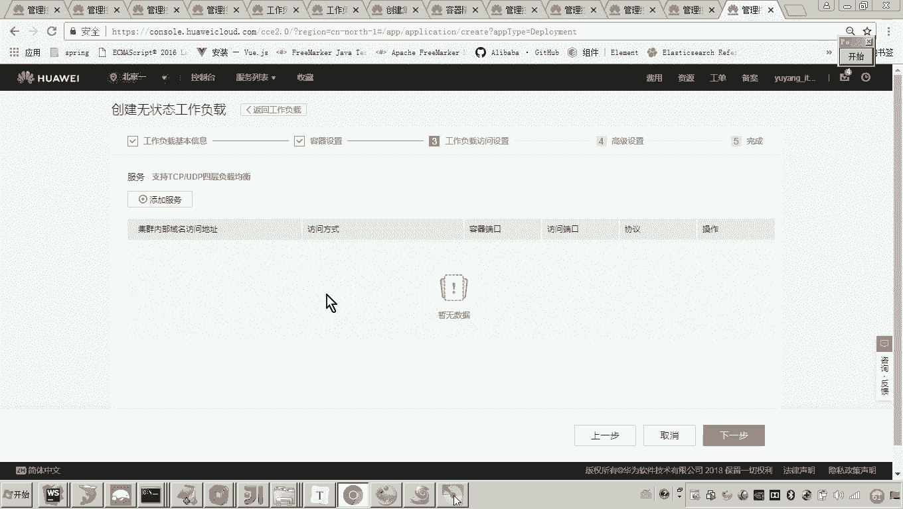
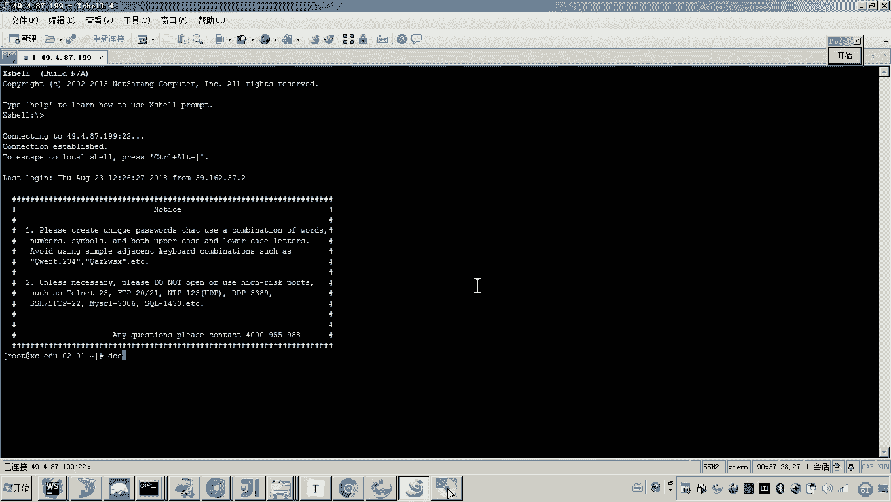
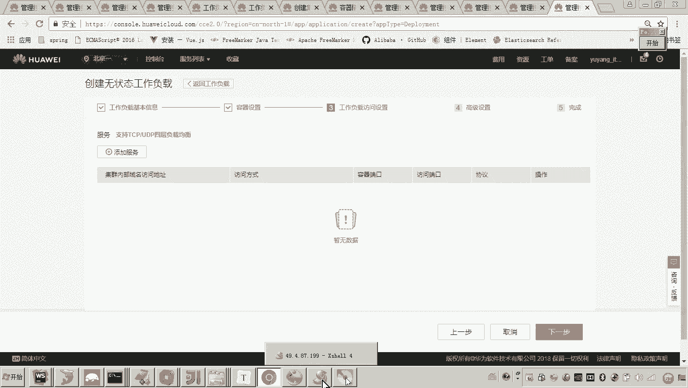
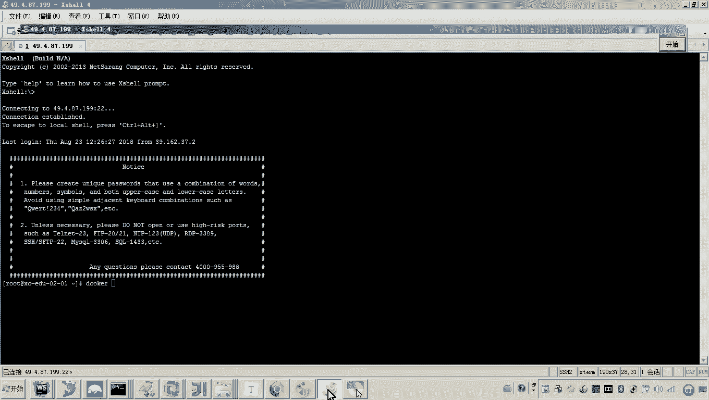
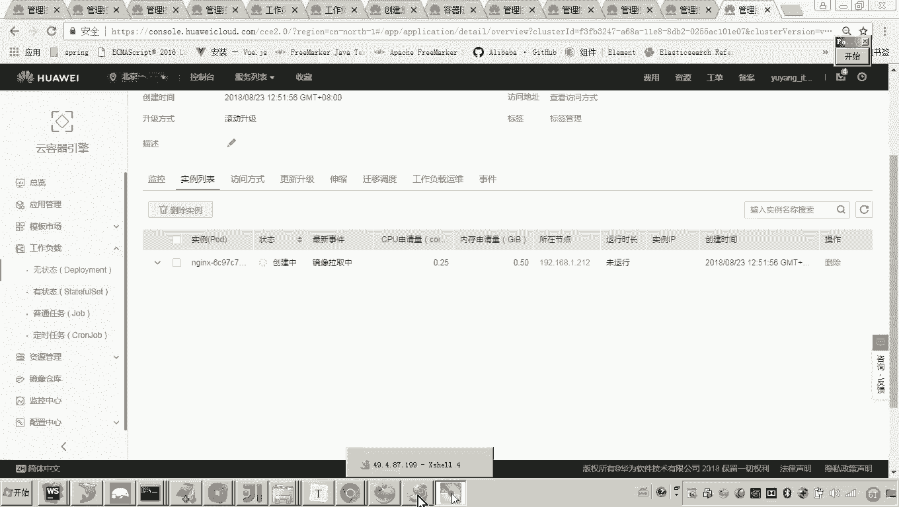
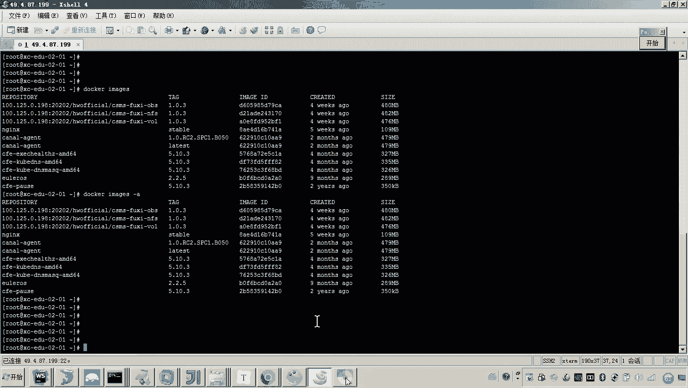
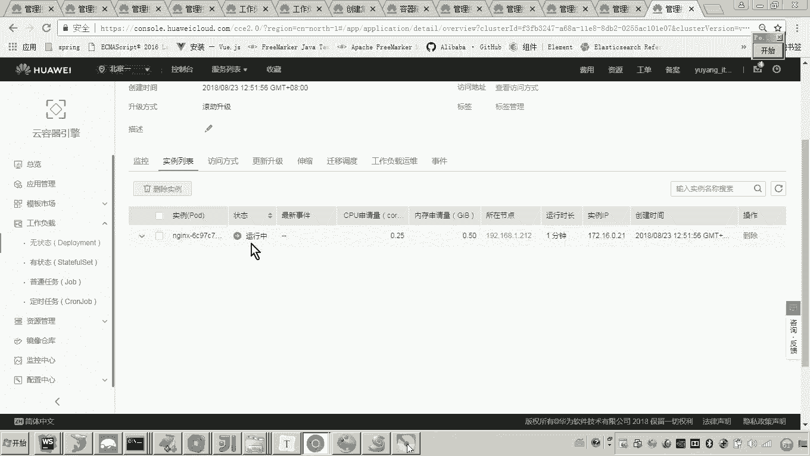
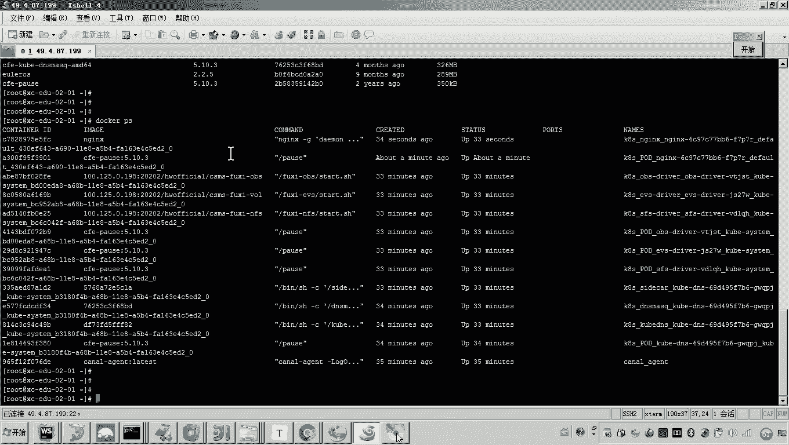
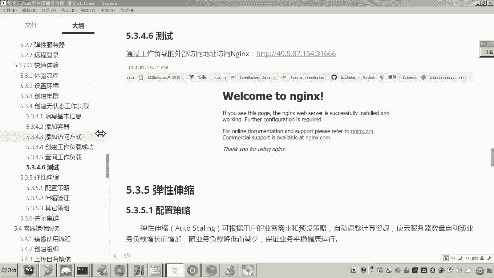

# 华为云PaaS微服务治理技术 - P102：10-云容器引擎CCE-CCE快速体验-创建无状态工作负载 🚀

在本节课程中，我们将通过一个快速体验流程，学习如何在华为云CCE平台上创建并部署一个无状态工作负载。我们将以部署一个Nginx Web服务器为例，直观地了解CCE的基本操作流程，为后续部署更复杂的应用打下基础。

## 概述

上一节我们完成了CCE集群的创建。本节中，我们将进入核心环节，学习如何创建一个“无状态工作负载”。我们将详细解释工作负载的概念，并一步步完成从选择镜像到通过公网访问应用的完整部署过程。

## 工作负载类型解析

在开始操作前，首先需要理解Kubernetes中的核心概念——工作负载。工作负载是运行在集群中的应用程序模型，主要分为两类：

*   **无状态工作负载 (Stateless Workload)**：这类应用不存储持久化数据或状态，每个运行实例（容器）都是相同且可替代的。其特点是能够快速、轻松地进行横向扩展（即增加或减少实例数量）。典型的例子是微服务或Web前端应用。
    *   **核心特点公式**：`实例数量 N` 可根据负载动态、快速地调整。
*   **有状态工作负载 (Stateful Workload)**：这类应用需要持久化存储数据，并维护其状态（例如数据库、消息队列）。扩展或迁移这类应用比无状态应用更复杂，因为需要处理数据的同步与一致性。典型的例子是MySQL、Redis等数据库。

简单来说，可以快速克隆多个相同副本的是无状态工作负载；需要小心处理数据的是有状态工作负载。我们本次部署的Nginx是一个Web服务器，属于无状态工作负载。

## 快速体验六步流程回顾

以下是本次快速体验的完整步骤概览，其中前两步（设置网络环境、创建集群）我们已经完成：

1.  设置网络环境（已完成）
2.  创建集群（已完成）
3.  **创建无状态工作负载（本节重点）**
4.  添加服务（访问方式）
5.  配置高级策略（本次体验使用默认）
6.  验证部署结果

接下来，我们聚焦于第三步及后续操作。

## 创建无状态工作负载

现在，我们进入CCE控制台，开始创建无状态工作负载。

首先，在控制台左侧导航栏找到“工作负载”，点击“无状态负载”，然后点击“创建无状态负载”。

### 1. 填写基本信息

在基本信息页面，我们需要配置工作负载的基础属性。

以下是需要填写或选择的关键信息：
*   **集群**：选择我们之前创建好的集群（例如：`XCEDU02`）。
*   **实例数量**：设置要创建的容器副本数。为了快速体验，我们先设置为 `1`。
*   **时区同步**：建议开启，确保容器内时间与主机时间同步。

填写完毕后，点击“下一步”。

### 2. 添加容器

工作负载由一个或多个容器组成。这一步我们需要为工作负载指定容器镜像及其配置。

首先，点击“添加容器”，进入容器配置页面。

**选择镜像**
在“镜像”选项中，我们可以从不同来源选择。
*   **我的镜像**：用户自己上传到华为云容器镜像服务的镜像。
*   **开源镜像**：连接Docker Hub等公共镜像仓库。

由于是初次体验，“我的镜像”列表为空，因此我们选择“开源镜像”，并在搜索框中输入 `nginx` 来选用官方Nginx镜像。选择后点击“确定”。

**配置容器规格**
选择镜像后，需要配置容器的运行规格。

以下是容器规格配置的要点：
*   **容器名称**：可自定义，例如 `nginx`。
*   **镜像版本**：选择稳定的版本标签，如 `latest`。
*   **资源配额**：这是关键配置，分为“申请”和“限制”。
    *   **CPU/内存申请值**：容器启动时**保证分配**的最小资源。应谨慎设置，避免占用过多集群资源。例如，CPU可设为 `0.25核`，内存可设为 `512MiB`。
    *   **CPU/内存限制值**：容器运行所能使用的**资源上限**。可根据应用实际需求适当调高，例如内存可设为 `1024MiB`。
*   **其他配置**：如生命周期命令、健康检查、环境变量、数据存储等，本次体验可暂不配置，后续课程会详细讲解。

配置完成后，点击“下一步”。

### 3. 添加服务（访问方式）

容器在集群内部运行，我们需要创建一种访问方式，才能从外部（例如互联网）访问到Nginx服务。

点击“添加服务”，创建一个新的Service来定义访问规则。

以下是服务配置的关键步骤：
*   **服务名称**：自定义，例如 `nginx-service`。
*   **访问类型**：选择如何暴露服务。
    *   **虚拟私有云**：仅集群内网访问。
    *   **负载均衡**：通过ELB服务对外提供高可用访问（需单独购买配置）。
    *   **弹性公网IP**：通过一个公网IP直接访问（本次体验选择此项）。
*   **端口配置**：
    *   **容器端口**：Nginx默认服务端口是 `80`。
    *   **服务端口**：这是外部访问时使用的端口。平台通常限制范围在 `30000-32767` 之间。我们可以点击“自动生成”，让平台分配一个端口，例如 `30893`。

这意味着，将来我们访问的地址将是：`http://<弹性公网IP地址>:30893`。

配置完成后，点击“下一步”。

### 4. 配置高级策略

进入“高级设置”页面，这里可以配置滚动升级策略、缩容策略等。本次快速体验，我们全部使用默认配置即可。

最后，检查所有配置信息，确认无误后，点击“创建”。

## 验证部署结果

工作负载创建成功后，系统会自动执行以下操作：
1.  从Docker Hub拉取Nginx镜像到集群节点。
2.  根据配置创建容器实例（Pod）。
3.  配置网络，将弹性公网IP的指定端口映射到容器的80端口。

我们可以在“工作负载 > 无状态负载”列表中找到刚创建的 `nginx` 工作负载。初始状态可能为“创建中”或“未就绪”。

点击工作负载名称进入详情页，在“实例列表”中可以看到容器的状态变化（如“镜像拉取中”、“运行中”）。当状态变为“运行中”时，表示部署成功。

此时，回到服务配置页面，找到分配的公网IP和端口（如 `123.123.123.123:30893`），将其复制到浏览器地址栏中访问。

如果看到Nginx的默认欢迎页面，恭喜你！这表示我们已成功通过华为云CCE平台，快速部署并发布了一个无状态应用。

## 总结

本节课中，我们一起学习了在华为云CCE平台上创建无状态工作负载的完整流程。

我们首先区分了**无状态**与**有状态**工作负载的核心概念，理解了无状态应用易于横向扩展的特性。随后，我们一步步完成了**填写基本信息**、**添加容器镜像**、**配置资源规格**以及**添加公网访问服务**等关键操作。最终，我们成功部署了一个Nginx应用，并通过弹性公网IP验证了访问结果。

这个快速体验展示了云原生平台如何将复杂的容器部署、网络配置流程图形化、自动化，极大提升了应用部署的效率。掌握这个基础流程后，我们就可以进一步探索如何部署更复杂的多容器应用（如我们的微服务项目）了。