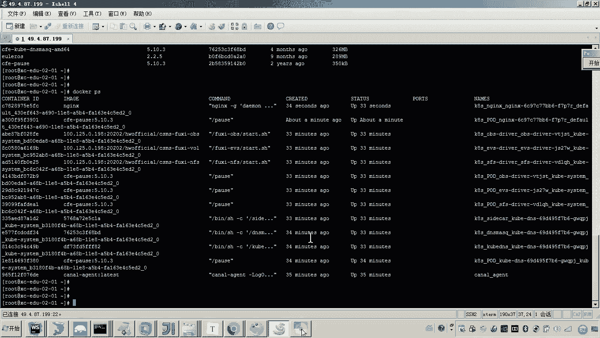

# 华为云PaaS微服务治理技术 - P103：11-云容器引擎CCE-CCE快速体验-弹性伸缩和关闭集群 - 开源之家 - BV1wm4y1M7m5

好，那么接下来呢我们再来快速体验当中呢，我们再体验一个弹性伸缩啊。因为有人说老师我大概了解了，就是这个云平台啊，是不是就是解决了你原来人工哎登录服务器来部署运维的这么一个过程。而云平台呢。

我们是不是就可以通过云平台。通过这些呃非常丰富的智能化的管理界面，我们就完成了这个运维的管理。没错？😊。

呃，那这里边呢介绍一个高级的这个功能啊，就是这个弹性伸缩。😊。

因为它不光是呃由你人工来驱动啊这个部署啊，比如说我在界面上操作一下，然后呢，这个这个这个云平台呢自动呢给我进行部署。那其实它可以设置一些什么？比如说这个弹性伸缩呀。

它就可以啊云平台就可以按照你配置的预定的这些策略来给你实现一个什么呀，实现一个管理，那实现什么管理呢？这个弹性伸缩是什么意思呢？我们来看啊，它就是可以根据用户的业务需求预设的策略来自动调整你的资源。😊。

啥意思？我给你举个例子啊，大家知道呃，在双十一或者说在并发比较高的时间，各位我们的这个工作负载。各位，你现在看到的我们这个工作负载，这个这个一个是不是就是只有一个容器，各位看到了吧？是不是只有一个实例。

对不对？而现在我的需求是什么呢？😊。

哎，由于这个双十一到了，哎，我想让我这个服务器上跑多个en尼。我我就这样一个需求。好了，那这个需求有人说老师那还不简单嘛，那你就哎那那你就手动再部署一个无状态工作状态不就行了吗？哎。

无状态的工作负载是不是？😡。

呃，关键这种太麻烦啊，我能不能啊定时的让平台自动给我去弹性的来改变我的计算资源呢？可以，我们来看它是怎么做到的呢？那各位我们首先呢先找到我们的这个工作负载。😊，哎，点无状态工作负载是不是找到了。

然后点击进去，嗯，这里边是不是有一个叫伸缩的这么一个菜单？😊，看见吗？哎，那这个伸缩这里边大家可以看到是不是有一个叫手动手动伸缩，对吧？😡，那手动伸缩啥意思？😡。

就是说你现在是不是想再让他部署一个这个安尼斯的容器啊？😡，一个容器是不是就是一个实力啊？那好，现在是不是一个好，我改成几个呀，俩我改成两个保存。😊，各位，我这个操作是不是已经操作完成了？

在这个实例列表当中，各位你来看是不是就已经正在正在干嘛呀？正在进行创建实例，看见吗？对，就这么智能。所以你刷新各位好了，就已经运行起来了。😊。

所以你再登录到你的这个语音服务器上，我们来查看，你就会发现这里边就启动了两个ux。

懂我意思吧？所以各位这就是我们说的对弹性伸缩。而现在你这个弹性伸缩，现在你这个弹性伸缩是不是走动来控制啊？哎，我想实现一个什么呀？对我想实现一个自动控制。😡。

你说那那怎么自动控制啊？😡，你注意看啊，我刚才是不是又改成一了，你再看看啊，你再看看现在是不是就变成一个了。😊。

是不是很很快呀变成一个了。好了，那有说老师，你怎么想进行定时的去控制啊，你看点添加伸缩策略。😊，对，这里边有一个叫定时策略，看见了吗？有个定时策略。那这个定时策略，有人说老师那那这这怎么定时呀？很简单。

我们只需要干嘛呀？😊，对我们只需要来配置一个时间就可以了。比如说这里边我写一个哎策略的名称，随便起一个名啊。然后呢，我们准备怎么弄啊，我们准备在这个嗯13点的什么呀呃。😊，零几分呢03分吧。哎。

确认我们准备在13点03分，然后呢让他去增加几个增加一个实力。现在你看到的呃哎这个是啥定时策略不能小于系统当前时间嗯。😊，这个定时的策略不能小于系统当前时间，那肯定是呃。当前时间的话。

我们得不能不能小于他，是不是？Yeah。好，添加啊添加定时，我们按这个时间选择好啊一个好，然后呢起个名。m。这个是我应该是没有选对啊。这这个应该是选择什么呀？在点下边这个确认叫确认，看见吧？这样。一。

这当前是这个时间我写对了吧，走吧。好，大家可以看到现在我这个定时是不是已经起来了，到这个呃。😊，13点05分的时候，咱们是不是让他给我自动的创建一个什么一个实例吧。对，然后呢对我再写一个定时。😊。

你这这这是啥定思？假如说我们这个并发呀。😊，我们的并发就一分钟。嗯，比如啊啊那现在呢我们说嗯那你就到啥呀，06分。😊，干嘛呀？你给我减少一个实力。行不行？可以。你各位。

我现在这两个策略是不是都已经启动了，那现在我们就等着看着表吧，看他会不会自动的给我干嘛呀。哎，弹性伸缩，也就是定时啊自能这个自动的来把这个实力给我创建了。😡。

来看一下。好，现在各位各位，你是不是就已经看见我现在这里头是不是已经有两个en尼了？😊。

看见了吗？那这个是不是就是他的这个我刚才写的这个定义的这个定时的策略呀？😊，这个策略是不是就是在这个13点05分的时候，是不是就准备增加一个实例？😊，然后上面这个是不是到13。06分。

它就啪给我减少一个实力了。😊，对，所以说这种就非常的好嘛。然后说我们说哎在双十一的那那几个小时啊，我们就可以定好。哎，到时候我们把这个什么呢？把这个集群呢给扩容一下，哎。

来应来应对这个我们说的这个高并发的访问。大家能理解吧。哎，这就是我们说的这个什么哎弹性伸缩啊，弹性伸缩。😊，好，它当然还有很多其他的这个策略啊，还有其他的策略。那还有其他的什么策略呢？

我们来看这里边你看点击添加啊，这里边是不是有告警策略呀？😊，构警策略啥意思呀？你看啊这里边说什么呀？说这个比如说给你举个例子啊，叫内存内存总量啊内存总量。😊，呃，内存总量不行。

我们说有个叫内存使用量是吧？哎，比如说我们说这个内存是16个G，嗯，当我们说这个内存呃呃达到了这个多少呀，达到了这个呃。😊，当大于9个G的时候，嗯，这个时候我就准备干嘛呀？哎，我就准备去减少一个实力啊。

我发现内存快不够用了，是不是？那我就杀掉一个进程。😡，呃我就就举这么一个例子。那这个例子它的这个什么呢？原理是什么呀？就这个云平台，它是不是会监控这个内存使用量？😡，啊，监控内存使用量的话。

一旦达到了这个触罚条件，他是不是会执行这个减少实力的动作？😊，好，那么来回到刚才那个那个那个那个策略啊，是不是到13。06分，是不是会减少一个实力啊？所以大家来看这时候再来看我们的这个实力。😊，嗯。

那现在各位你看到的是不是就成一个en in了？对，所以这些都是自动调度，哎，由云平台自动帮助我们完成了。😊，好了，那么呃到这儿呢我们就完成了这个弹性伸缩的这个快速体验。好。😊，呃。

那么这个以上这个快速体验呢，这个最后一步大家可以看到说什么呀，说呃清除资源啥意思？就是大家知道这个集群啊一直在开着呃，这个弹这个这个服务器一直在运行着，它是会收费的对吧？按需收费嘛啊，一小时多少钱。

那如果我们啊不做测试了。😊，啊，我们就可以怎么弄啊，把这个集群呢给它关闭。好，那关闭之后，我们再把弹性服务器关机啊，这个这个费用就不会产生了，那怎么做呢？😊，这个集群啊来到我们这个集群界面。

然后点击更多。好，这里边是不是有删除集群什么什么什么啊，你可千万不要删了集群啊，因为你刚刚创建的不容易嘛，你要点集群休眠。哎，将来我们想再用集群，那下面是不是有一个叫集群唤醒啊？对你点集群休眠。好。

确定。😊，好，现在呢这个集群就休眠中。然后呢，同时你再进入弹性云服务器，把我们的这个服务器干嘛呀，给它关机。嗯，这样它这个费用啊就保证不让它产生。好确定。😊，大家可以刷新一下，在是不是就是正在关机。

对吧？正在关机。😊。

好，那其实我们呃等一会儿它关联了之后呢，大家可以看到现在啊我这个客户端这是不是已经自动退出了，这个服务器是不是就自动关闭了？哎，好，那么以上呢就是我们讲的这个CCE的快速体验。那通过快速体验呢。

我们学习到了这个如何创建一个无状态的工作负载。哎，如何添加节点哎，不是添加节点啊，是不是如何添加我们说的这个容器，是不是啊？好，然后呢添加访问方式啊，然后呢哎弹性伸缩。好。

那么这个呢哎为我们后边要学习学成在线项目的这个呃实际项目实战哎，部署我们的这个项目呢，哎做一个简单的这个直观的入门啊，还打一个基础好。😊。

