# 华为云PaaS微服务治理技术：P103：11-云容器引擎CCE-CCE快速体验-弹性伸缩和关闭集群 🚀

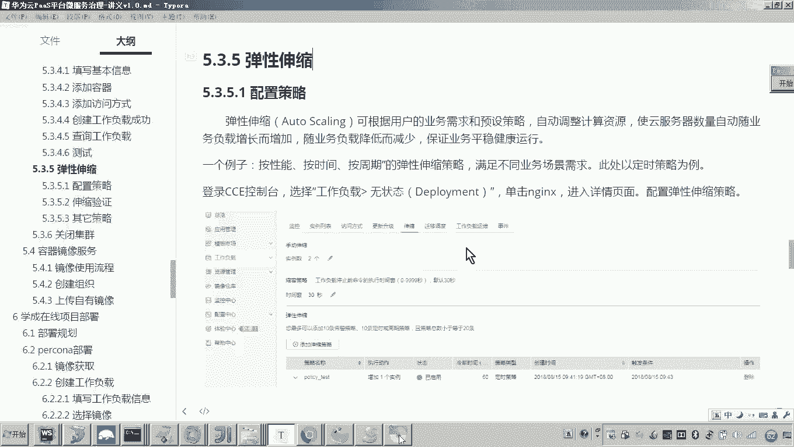

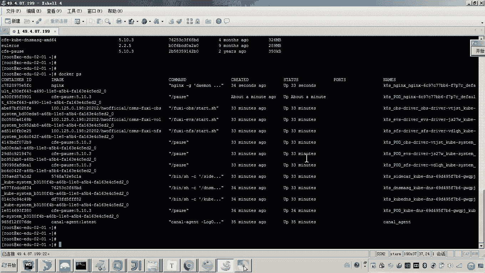

在本节课中，我们将学习华为云容器引擎CCE的两个重要功能：弹性伸缩和集群资源管理。通过体验，你将了解如何让云平台根据策略自动调整应用实例数量，以及如何在不使用时关闭集群以节省成本。

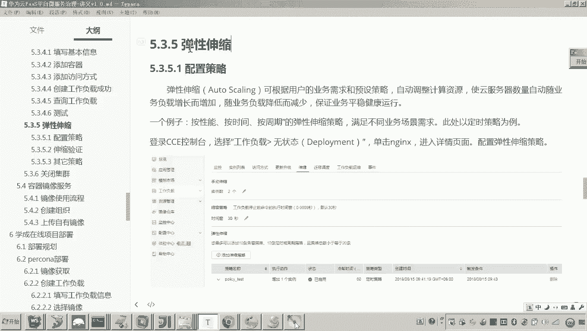

上一节我们介绍了如何创建无状态工作负载并配置访问方式，本节中我们来看看如何实现资源的自动化管理。

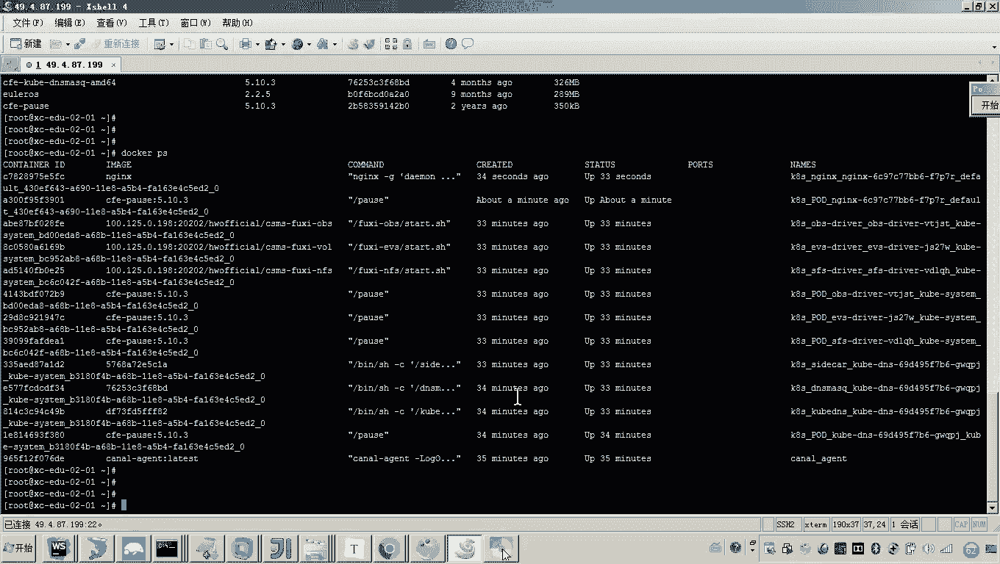

## 弹性伸缩体验

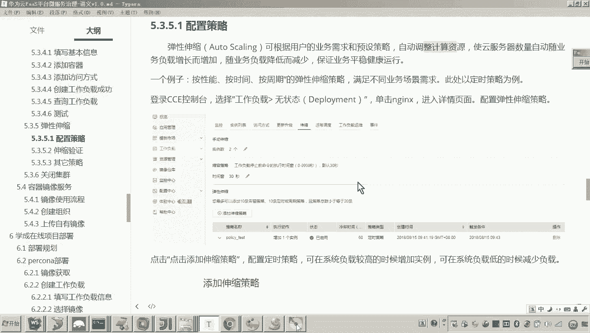

弹性伸缩功能可以根据预设的业务需求或策略，自动调整计算资源的数量。这意味着在业务高峰期（如双十一），平台可以自动增加应用实例以应对高并发；在业务低谷期，则可以自动减少实例以节约资源。

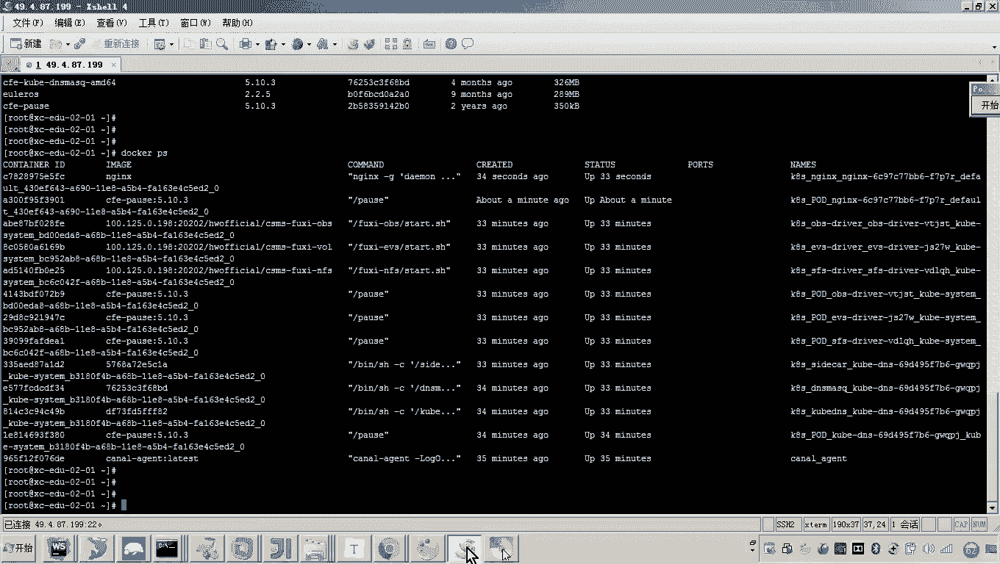

### 手动伸缩

首先，我们体验手动调整实例数量的过程。

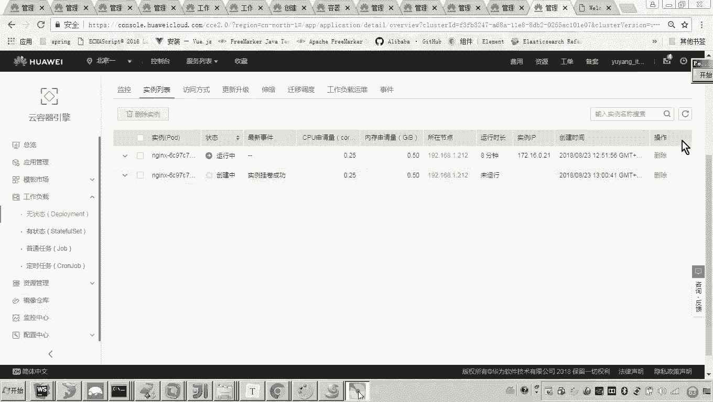

1.  登录CCE控制台，进入“工作负载”页面。
2.  点击之前创建的“无状态工作负载”。
3.  在负载详情页，找到并点击“伸缩”标签页。
4.  在“手动伸缩”区域，将实例数量从 **1** 修改为 **2**，然后点击“保存”。

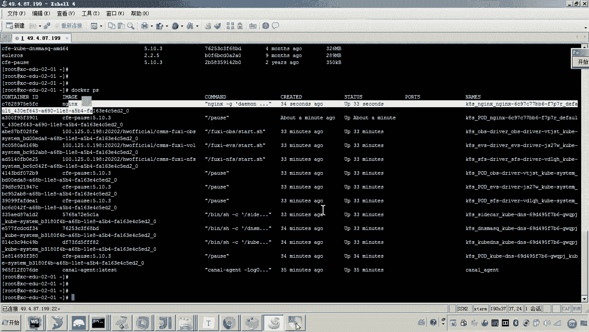

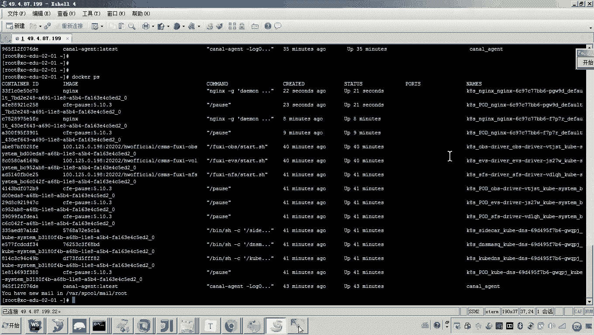

操作完成后，系统会立即开始创建新的实例。稍等片刻，在“实例列表”中即可看到两个运行中的容器实例。登录到对应的云服务器上，使用 `docker ps` 命令也能查看到两个 `nginx` 容器。

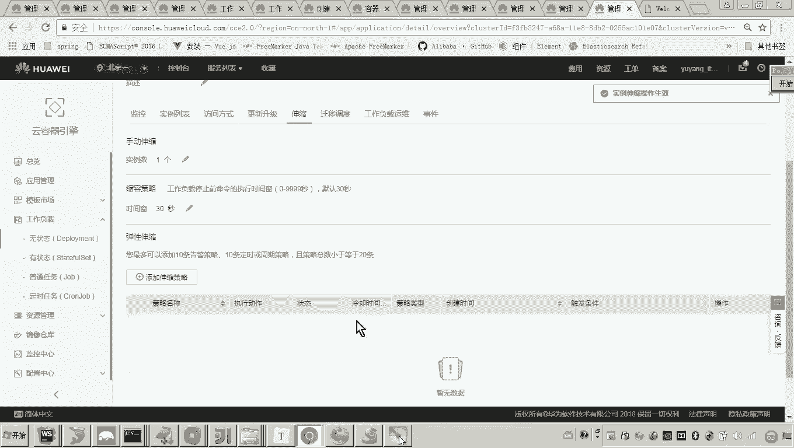

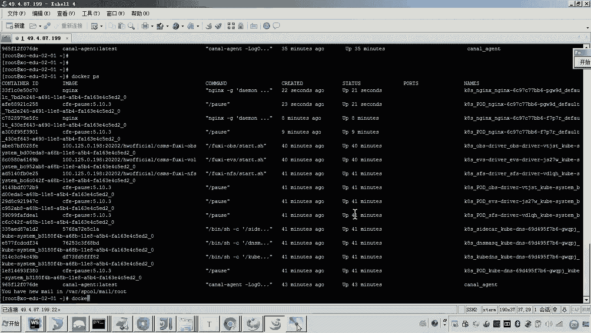

### 配置自动伸缩策略

手动伸缩虽然简单，但自动化才是云平台的优势。接下来，我们配置定时策略，让系统在特定时间自动执行伸缩操作。

以下是配置定时伸缩策略的步骤：

1.  在“伸缩”标签页，点击“添加伸缩策略”。
2.  选择“定时策略”。
3.  配置第一条策略：设定在某个时间点（例如13:05）执行“增加”操作，将实例数调整为 **2**。
4.  配置第二条策略：设定在稍后的时间点（例如13:06）执行“减少”操作，将实例数恢复为 **1**。

策略生效后，系统将在指定时间自动执行伸缩动作。你可以观察到实例数量会按时增加和减少，整个过程无需人工干预。

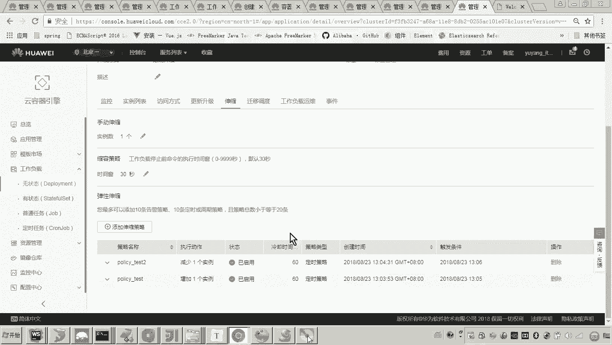

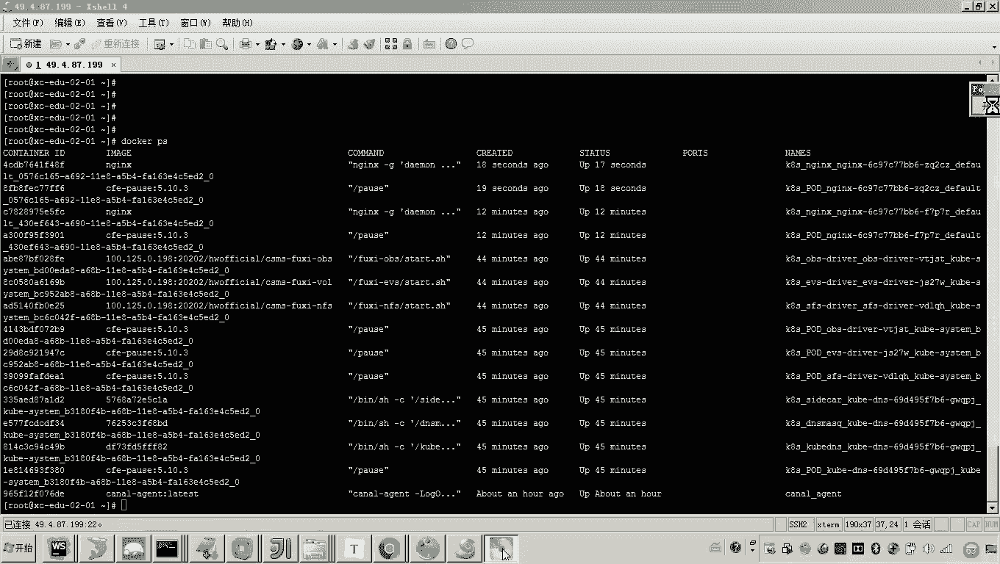

除了定时策略，CCE还支持告警策略。例如，可以配置当**内存使用率**超过某个阈值（如80%）时，自动触发扩容或缩容操作。其核心原理是云平台持续监控指标，一旦触发条件，便执行预设的动作。

## 关闭集群以节省资源 💰

体验完成后，为了停止计费，我们需要将集群休眠并关闭相关云服务器。

以下是清理资源的步骤：

1.  返回CCE的“集群管理”页面。
2.  找到你的集群，点击“更多”操作按钮。
3.  选择“集群休眠”而非“删除”。休眠后，集群配置将保留，未来可通过“集群唤醒”快速恢复使用。
4.  接着，进入“弹性云服务器ECS”控制台。
5.  找到为CCE集群提供资源的云服务器，将其“关机”。

完成以上操作后，集群和服务器将停止运行，不再产生计算资源费用。当你需要再次实验时，只需唤醒集群并启动服务器即可。

## 总结

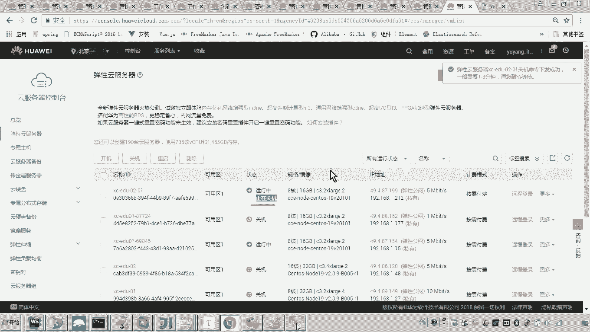

本节课中我们一起学习了CCE的弹性伸缩与资源管理功能。

我们首先体验了**手动伸缩**，直接修改工作负载的实例数量。然后，我们配置了**自动伸缩策略**，包括基于时间的定时策略和基于监控指标的告警策略，实现了资源的智能化管理。最后，我们学习了如何通过**休眠集群**和**关闭云服务器**来清理资源，避免不必要的费用。

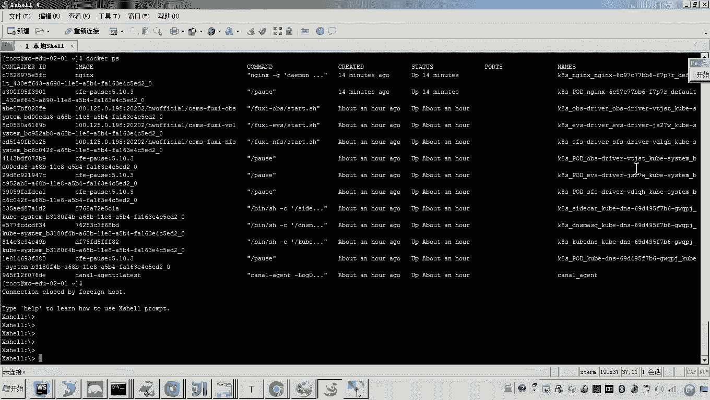

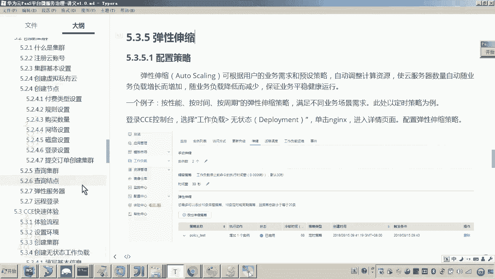

这些操作为后续在实际项目中部署和运维应用打下了坚实的基础，展示了云平台在自动化运维方面的强大能力。