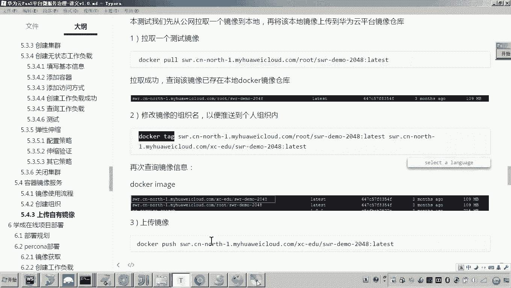
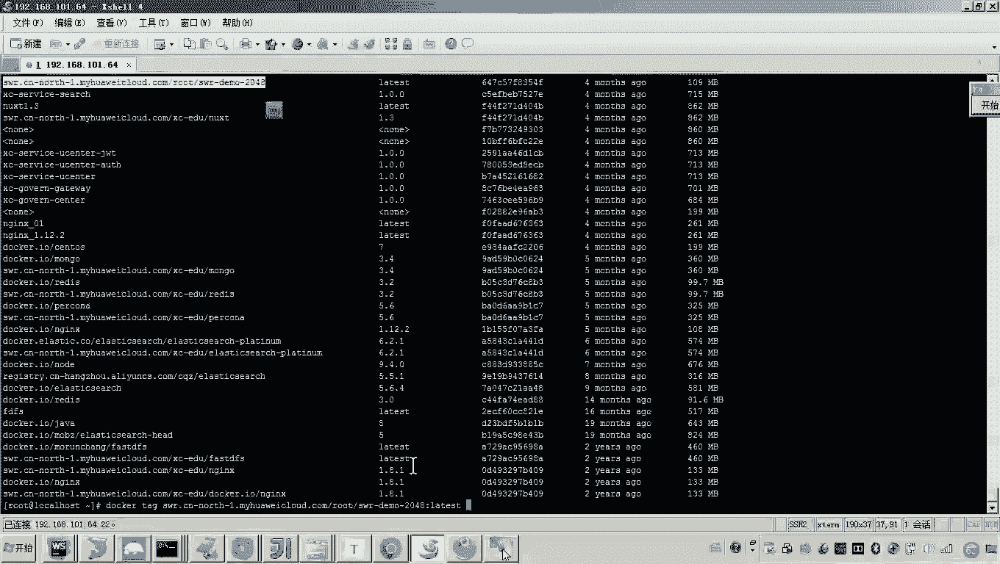

# 华为云PaaS微服务治理技术 - P104：12-云容器引擎CCE-容器镜像服务 - 开源之家 - BV1wm4y1M7m5

好，那下边呢我们来看一下啊容器镜像服务。什么是容器镜像服务呢？那么我们在呃CCE快速体验的时候呢，我大家还有印象没有呃，老师在创建这个Nin容器的时候，咱们是不是从这个docker的官方。

我们去选择了N尽镜像，对吧？😊，那但是大家可以想一下啊，如果说官方没有我们要找的镜像怎么办？啊，有人说呢怎么会没有呢？当然没有了。比如说举个例子，我们现在要开发自己的微服务，哎。

我们要把自己的微服务呢构建一个镜像。😊，那你说这个时候官方是不可能有你自己开发的这个微服务的镜像了，对吧？所以。所以呀我们说这个镜像呀会存在自己的私有镜像，也就是我的镜像在在在这里头呢。

会存在一些私有镜像。没错吧啊，那么我们在学习这个学成在线部署之前呀，那最后一块的内容就是我们现在要把这个容器镜像服务是如何管理镜像的啊这一块的知识呢，我们学习一下。😊，好了。

那现在我们来看一下这个镜像的使用流程是怎么说的。首先呢哎我有好多的镜像，对吧？那么这些镜像呢我们需要分类。嗯，那这里边就需要创建一个组织，这个组织就是对镜像的分类管理。😊，啊，那就说老师这个怎么创建呢？

嗯，咱们进入云平台。好，然后进到云平台里头呢，我们点服务列表云容器引擎CCE。😊，然后再点击啊左侧的菜单有一个镜像仓库，然后点镜像仓库。各位我们就进到了这个镜像哎管理的这个界面，哎，就是容器的镜像服务。

好了，那现在呢各位可以看到我这里边已经上传了好多的镜像，对吧？😊，那么这么多镜像是要有一个什么所属的组织的，这个所属的组织啊，就是这个镜像所属的分类啊，因为镜像很多嘛，我对它进行分类管理。😊。

那这个组织我想添加一个新的组织，怎么添加呢？😡，你在左侧菜单的第四个，我们点组织管理。各位，这里边我们是不是就可以添加很多的这种组织啊啊，创建组织各位看看怎么做。😊，是不是输入一个组织的名称就可以了？

哎，很简单啊，输入名称啊，点确定啊，这里边这个组织呢就创建成功，就会出现在这个列表了。😊，好了，那么这个组织我创建成功之后，接下来我要做什么呢？哎，我要做的话，就是要把自己的镜像往里边干嘛呀，上传了。

😊，那这个上传镜像哎，有几种方式呢？哎，这个好，我们来看一下，首先我们自己的镜像，我们可以是不是上传自由镜像呀？哎，将本地服务器的镜像上传到镜像仓库，对吧？还有一种就是说哎我们自己写的源代码，哎。

通过这个docker file，我这个编写这个docker file文件。哎，然后我们呢哎也可以来构建镜像。😊，最后一个就是咱们在快速体验当中使用的一种方法。

是不是就从这个docker的官方直接拉取镜像呀啊，三种方法啊。好了，那这三种方法这三种方法呃，其实在实际的应用当中呢都会用啊，但是呢呃相比相比而言的话，就是说从docker官方拉镜像。

还有上传自由镜像用的比较多。😊，所以这里边呢我准备稍后给大家讲这个如何上传我们自己的镜像。因为我刚才说了啊，毕竟啊这个毕竟这个微服是我们自己开发的，所以我们要自己来构建完镜像之后呢。

哎向云平台上传我们这个镜像。😊，你只有向云平台上传的这个镜像了。那么我们在创建容器的时候，各位我们是不是就可以去选择哎，我们这个我的镜像当中你所上传的这个镜像了？😊，懂我意思吧？哎，好。

那现在呢这个使用流程，这里边我是不是就给大家讲了这种镜像上传的这个三种方法，对吧？哎，镜像获取的三种方法，哪三种啊上传自由镜像哎，通过源代码直接构建。😊，然后呢，使用镜像资源，使用这个刀cker呃。

刀cker官方的这个镜像资源呢，咱快速体验已经讲过了，一会儿我给你讲一下，上传自由镜像。😊，好，那这个呃镜像我们上传完了之后呢，我们是不是就可以怎么弄啊，就可以去部署我们的工作负载。然后呢。

在部署工作负载的时候呢，去引用我们的镜像哎就可以了。好，那如果说这个镜像更改了怎么办？我们可以更新镜像啊，更新镜像叫版本号往后边依次的增加。然后呢哎这个工作负载会自动的进行升级。好。

这个就是我们所有的流程啊啊，那么这个流程我介绍完之之后呢，我们就按照这个流程啊来演示一遍，如何的来管理我们的这个镜像了。😊，首先那个创建组织，刚才咱们是不是已经创建过一个，对吧？好，那么打开啊。

我们准备用哪个组织啊？😊，啊，这里边呢我们用这个叫做XCEDUcloud杠0U哎，再用用这个组织。好，那我的镜像当中，我们看这个组织哎，这个这个组织是我之前上传的啊。

说之之前创建的这里边已经上传了三个镜像了啊。好，这不影响。那里边还有一些其他的这个组织啊。😊，好了，那现在呢我们准备往里边传一个镜像。啊，那有如说老师传啥镜像呀？那现在我们是学习阶段，对吧？体验阶段啊。

我们呢啊先传一个非常简单的镜像。哎，我们我们先不教大家如何呃去把这个微服务构建成镜像。哎，我们先看一下怎么做啊。首先嗯我们啊点开这个我的镜像。😊，然后在这里是不是有一个叫客户端上传和页面上传呀？好。

那这里边呢我推荐你采用客户端上传。啊，为什么呢？因为这个页面上传呢，你会发现啊他这个呃通过这个什么呀浏览器往里面传文件，那个镜像呢比较大，传的比较慢。啊，还有时候呢你会发现辛辛苦苦传到一半了。

或者说传传完了校验失败，还得重新传啊，很不方便。所以呢我就建议用这个客户端上传。😊，哎，那有时说老师客户端是啥意思呢？好，注意啊，我给你讲一下。😊，就是说呀各位现在我的电脑是不是就是一一台开发的电脑。

对吧？哎，这个就是我的开发电脑了。好，然后在这个开发电脑上边呢，哎我会跑一个虚拟机啊，这个虚拟机里边呢，我会装这个centOS7，然后并且里边会装一个什么docker，哎，装一个docker。好。

我把这个docker装好了之后啊，我在这个虚拟机里边呢，我就去构建我的镜像了，而这个就是我们说的什么呀？云平台哎，就是现在大家看到的这个界面，哎，这里边我的镜像，哎，我的镜像是不是从云平台检索的信息嘛。

😊，然后这个客户端就指的是哎刀cker的客户端。哎，我们说其实docker这个软件它提供了一种什么呀？哎，像这个云端哎，去这个什么push，哎，去推送镜像的功能。所以这个过程呢就是push。😡。

所以呢这个客户端呢其实就是我们说装有docker的一个本地服务器。懂我意思吧？就是你的开发环境装有docker的一个本地服务器，然后通过docker的ush，然后把这个镜像ush到云端。好。

那现在呃咱们说那这个客户端上传需要一个本地服务器，那我们是不是需要登录我们的本地服务器啊？对这里边呢我就把我的这个虚拟机啊给起起来，然后呢我在这里面呢就登录我的这个什么呀本地服务器。

我的本地服务器的这个局域网这IP是101。64啊，好，那现在呢我登上去之后呢，接下来要怎么做呢？接下来的话，我我的本地当然我肯定要装什么呀？肯定要装docker了，对不对？哎，要装docker。

而现在呢我这个本地呢其实是有什么呀？有docker的，并且你可以看一下我的本地docker下边是不是有很多的镜像，对吧？我本地的这些镜像都可以ush到云平台。嗯但是现在我这么多镜像。

有说老师你ush哪一个呢？我哪一个也不ush，我准备怎么弄啊。😊。

哎，我准备来一个简单的看好啊看好啊，呃看好我的流程。嗯，首先各位打开这一点儿，然后你的这个本地服务器的docker一定要安装1。11。2以上的版本啊，我的是1。13啊，肯定比这个版本大啊。好。

然后再看呃以root用户登录你docker所在的虚拟机，就是这个机器我已经登上去了。然后其次获取docker访问权限，并复制节点上执行执行什么呢？

就是我们这里边呀要哎使用docker的一个什么log in指令，要干嘛呀？登录哎要登录我们云平台的这个哎docker哎，要登录我们云平台，什么意思？

因为这里边我们是不是要通过我们这个本地服务器的这个docker命令push到云平台的这个镜像仓库啊所以这里边呢我们要通过这个dockerlog in啊，先登录一下云平台。😊。

哎嗯，那怎么做呢？很简单，然后把那段指令粘到这儿，然后回撤。这个时候呢，它就提示了一个消息叫什么呢？😊，各位可以稍等一下，可以看看啊。😊，它是不是提示叫做log in success。

是不是就是登录成功啊？好，那现在我们说登录成功了之后呢，接下来怎么做呢？你看它的第三步说什么呀？😊。

说哎你需要哎你需要干嘛呀？你需要给你本地的这个镜像打一个tag，哎，也就是重新命名一下组织名称。但是你重新命名下组织名称，你没发现吗？前面的这个网址是不是就变了？😡，哎。

这个组织名称就是刚刚老师给大家讲的这个组织管理里边，你自己添加的组织。😡，呃，那么你把这个重新定义一个tag了之后，我们就可以执行这个docker pushush。😡。

而后边这一堆和上边你重新命名的这一堆，它是相等的。这样的话意思也就是说要把你本地的这个镜像把它推送到云平台。就这样一个意思。好了，那现在我们按照这个思路呢，我们就准备来尝试一下推那你说那怎么推呢？

这么多镜像，你推哪一个呢？我这么做啊，呃，因为这些镜像呢，你没发现它都它都好大啊，都是我开发的一些微服务。所以这里边呢我准备嗯看好我的讲义是怎么说的啊，注意注意听好，非常关键。😊。

我准备先从公网拉取一个镜像。😡，哎，我从公网拉取一个镜像，这个镜像特别小，就是个demo。有说老师这公网谁提供的？😡，这是什么呀？这是华为云哎，给你的一个测试，就是让你测测这个你的本地客户端。

本地服务器的这个docker能不能把这个镜像推到这个华为云平台。所以现在注意看啊，我先执行这个命令。😊，哎，因为现在我的这个什么呀，我的这个本地的很多镜像都比较大啊。我现在测试阶段呢。

我不想把这些大的镜像推到我这个云平台，我就先怎么弄啊？我先从这个华为的这个关这个这个这个云平台上面，我把某一个这个demo的这个样一个镜像，我把它破拉到我的本地服务器。看好，我就执行了一个破。😊。

那么这个过程呢，它是哎非常快的，为什么？因为这个镜像应该是非常小的啊。好了，那现在有人说老师，那你拉取到本地，你的作用干啥？因为你永远记着我的我的想法就是想将我的这个本地服务器的这个镜像推到云平台。

是吧？而现在我的本地没有这么一个镜像，对吧？所以我要先从这个这个什么的这个这个这个公网呢拉一个镜像下来，拉完了之后呢，我就准备把这个镜像把它推到云平台。好。

那现在我们其实学的并不是学我现在怎么去铺拉取镜像。我你们大家要学的就是哎看一下怎么样把我拉取到本地的这个镜像推到云平台，是这意思吧？好，那现在看第一步啊，我就把这个镜像拉拉取到本地。

大家可以看到现在是不是还正在下载，对吧？好，那第二步呢。😊。

第二步，各位，刚才咱们说的很清楚，你是不是首先需要更改镜像的组织名啊，对不对？那有如说老师镜像的组织名，你这个组织是啥意思？各位，我刚才是不是说的很清楚。

我是不是准备用这个组织叫做XC杠EDU杠cloud杠01，是不是它？对，那一会儿呢我只要把啊我拉取到本地的镜像更改组织名为这个组织名称，只要我一推，那么这个镜像就能推到我这个组织下边了。

也就是说在这个界面稍后我刷新，你就能看到我刚刚哎推的这个镜像。😊，懂我的意思吧？所以到这步为止，这个镜像应该是已经退到云平台了。嗯，好，那现在呢我们来看一下这个镜像拉取成功，我们来搜索一下啊。好。

大家来看这个镜像叫XWR杠什么呀？杠demo。嗯，好，大家来看这个镜像，各位是不是现成的对吧？好，那现在呢我就想做一件事儿。😊。

谁能告诉我我现在想做啥事儿？😡，也就是说我现在我本地呀有有有有这个镜像了，我准备把这个镜像干嘛呀？哎，我把这个镜像推到我的这个哎云平台。😊，哎，那有人说老师那那咋弄啊？😊，咋弄？

我是不是刚才说我需先把这个镜像的组织名更更改了一呀，是这意思吧？那所以说你现在就要准备更改了呀，怎么更改呀，你看我怎么更改的，用docker哎，docker tag。

然后哎将你原来的这个镜像的名称注意看啊，注意看非常关键，看好。😡。

这个doert的后边的这个镜像名称是你原始的镜像名称。有说老师原始的镜像名称是啥？你看我说本地查到的镜像是不是他，那你就把这个镜像呢贴过来。😡。

但是一定记得后面跟版本号，这个版本号是不是就是lateest，对吧？好。😊。

好，然后呢准备把这个镜像干嘛呢？把这个镜像，我要把它哎更改一下组织名称，你更改成啥呢？更改成前边的这个地址是就是云平台的地址，看看好啊，非常关键啊，然后呢粘进去，然后杠杠什么。

后边就是你云平台的组织名称，是不是叫XC杠EDU杠cloud的杠01，对吧？XC杠EDU杠cloud杠01杠哎，杠后边是什么呢？哎，后边的话就是就是这个呃你你刚刚的这个什么呀？就是后边这一堆。

你把这些堆是全复制了。😊。

好了，那现在呢我就更改好了，那来回车，这个时候你再来看，你再查。这个时候其实呀我的本地呢就已经哎你会发现有有几个镜像呀，有俩哎有俩哎一个前上面这个是不是我的原始镜像。

下边这个是不是就我更改了这个呃组织名称的镜像，对吧？现在我把这个镜像搞定之后呢，接下来怎么做呢？我就可以推了。😊。

我就可以推送了，那推送咋推送啊，那你就需要用docker pushush。😡。

对，那到时push怎么做？后边复制你这个更改了这个组织名称的这个镜像的地址加版本。

哎，好，然后呢回撤。这个过程呢大家来看他就要进行什么推送了。😡，注意一定注意啊，按照我这个讲义上的步骤来，你在推之前一定要用这个logdocker这个login来执行一下这一堆指令。哎。

就是相当于一个什么呀？这个docker这个客户端的一个认证哎，啊，要登一下云平台，然后呢，你再执行这个推哎，懂我的意思吧？好，那现在呢他就开始正在干嘛呀？正在推送，你看现在是不是就推送推送成功了。

推送成功之后进到你的云平台，然后刷新我的镜像各位来看这个镜像是不是就推送成功了。没错吧，所以以上呢就是我们讲解的这个什么呀啊，容器镜像服务的啊，如何啊将你本地的服务器上面的镜像上传到你的云平台。

那这个流程是怎么做的呢？首先第一步回顾一下啊，第一步首先登录你的这个服务器，以root用户哎来登。😊。

啊，登上去之后呢，对你要执行一个哎log in docker log in指令来登一下云平台认证一下。第三步，将你本地的镜像打一个tag。而这个tag的这个最终这个地址呢，前边这个网址不要变。

后边就是你要把镜像传到哪个组织名称，然后后边是镜像的名称加版本号。好，然后呢，最终执行docker push，这样就把这个你本地的镜像上传到了云平台。好。

