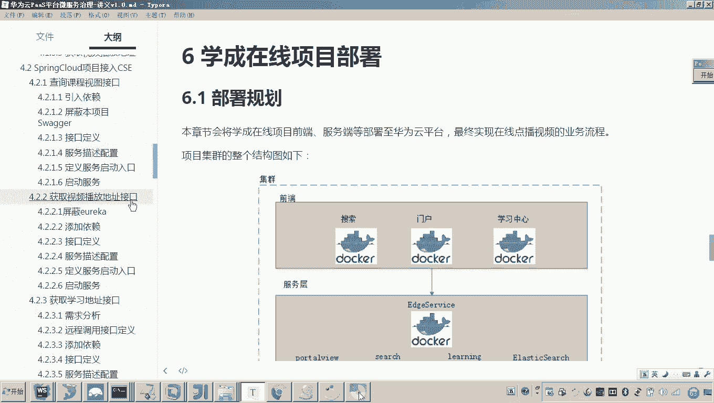
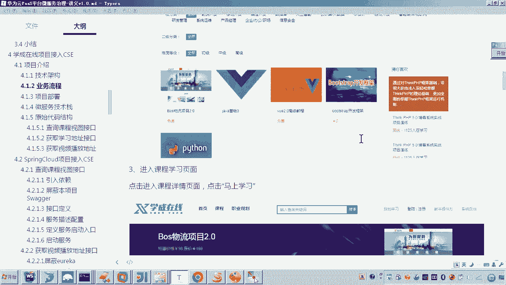
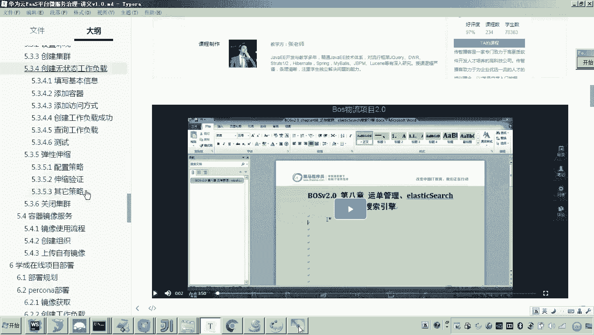
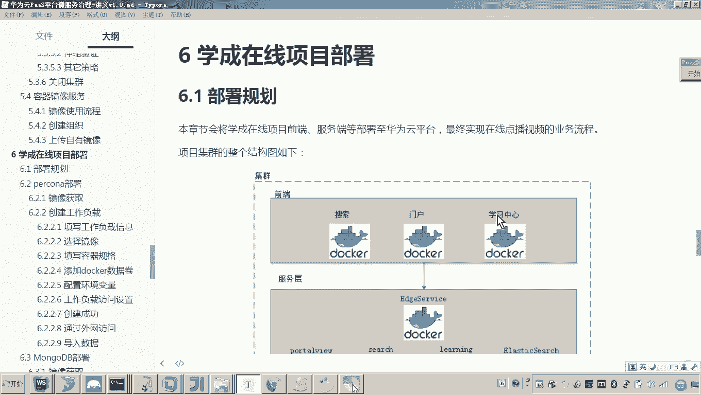
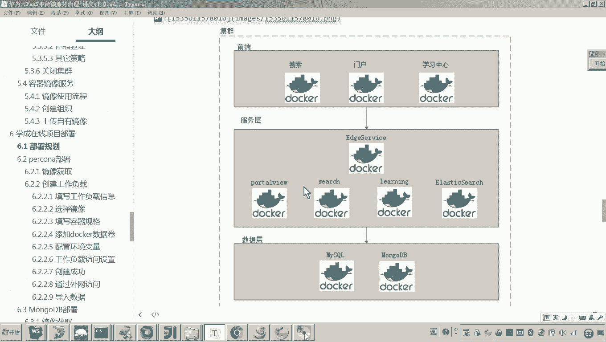

# 华为云PaaS微服务治理技术 - P105：13-学成在线项目部署-部署规划 - 开源之家 - BV1wm4y1M7m5

好，那么下边呢我们就开始将学程在线项目部署到云平台。好，那么这个学程在线项目我们准备部署哪些东西呢？呃，其实在之前的课程呃，我们在讲这个学程在线如何接入呃CSE我们当初是不是讲了一个业务流程。

还有印象吗？那这个业务流程呢就是呃实现了一个在线播放视频的业务流程，最终我们是不是实现了这么一个画面，对吧？好，那么我们这一次呢也是准备把该这个业务流程所涉及到的应用服务呢，全部部署到云平台。好了。

那现在呢我们回到我们这一次呃课当中来。首先呢我们看一下这个部署的规划。😊。

好，那下边这张图呢应该是我们这次要部署学生在线啊，在线点播视频业务流程所涉及到的呃各个应用服务。那么呃大家可以看到最上边的话是前端哎，前端这一块我们有三个啊有三个服务，一个是门户。啊。

门户就是我们的入口，对吧？还有一个就是学习中心啊，就是大家可以刚才看到那个画面，就是点播视频啊，观看视频的那个画面呢，应该是通过这个学习中心啊来进行请求。

另外还有就是搜索搜索话是通过门户是不是到搜索页面，对吧？嗯，好了，那么。😊，这是前端工程啊，那前端工程啊要请求服务层来拿数据啊来进行业务逻辑的操作。这个服务层呢大家可以看到啊。

最上边是我们之前啊开发的这个网关，对吧？好，那这个网关下边呢是不是有4个服务。其中前三个服务是我们自己写的微服务。啊，呃第一个是数据视图服务，第二个是搜索，第三个是学习中心服务。

最后一个呢是我们使用的这个ellectastic search，一个全文检索的服务。😊，好，那么最后一层呢就是数据层。那这个数据层呢我们用到两个数据库啊，一个是mysq，一个是哎mongodb。好。

那这个是我们本次学程在线要进行项目部署的啊这个在线点播视频业务所涉及到的所有应用服务。好，那么这个集群呢啊也会包括这么多的呃这个服务。😊，OK那么这个部署呢我大概就介绍完了。好。

那么这个部署介绍完了之后呢，呃稍后呢我们会按照哎一定的顺序来进行部署。哎，我们会把这上边所有的应用服务呢都部署到云平台。好。😊。

