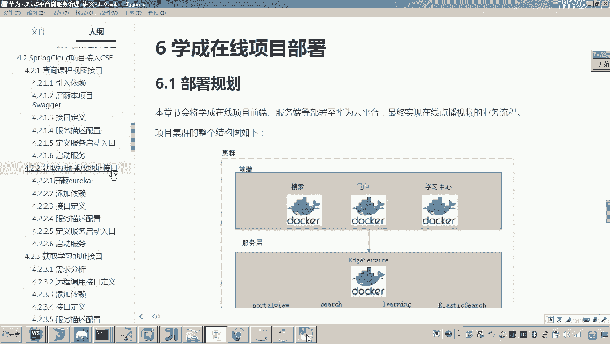
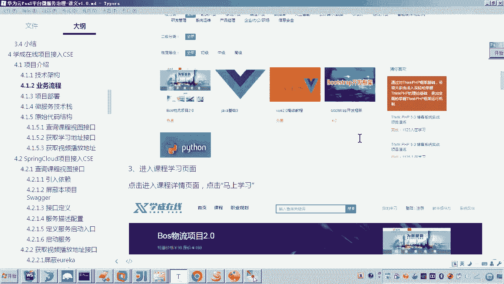
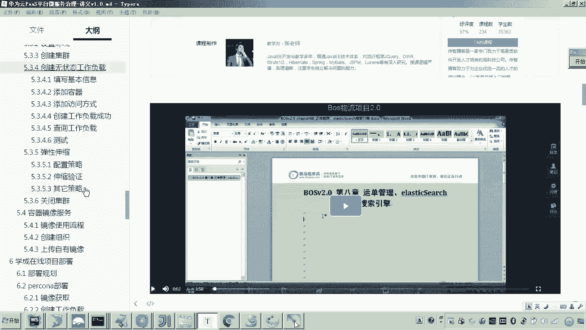
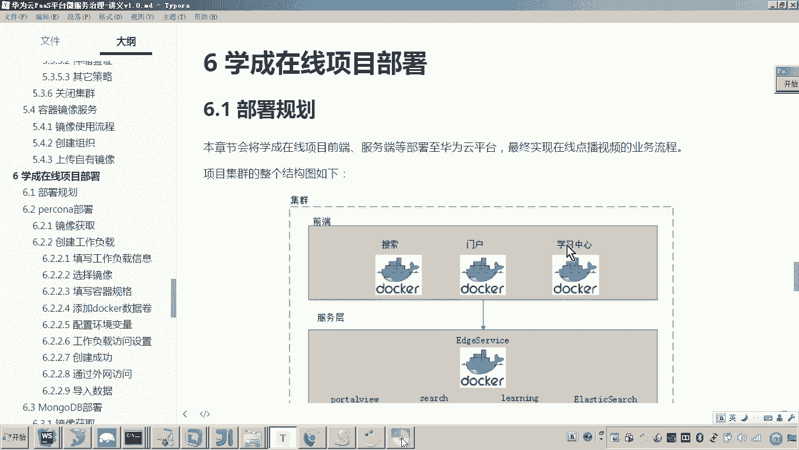
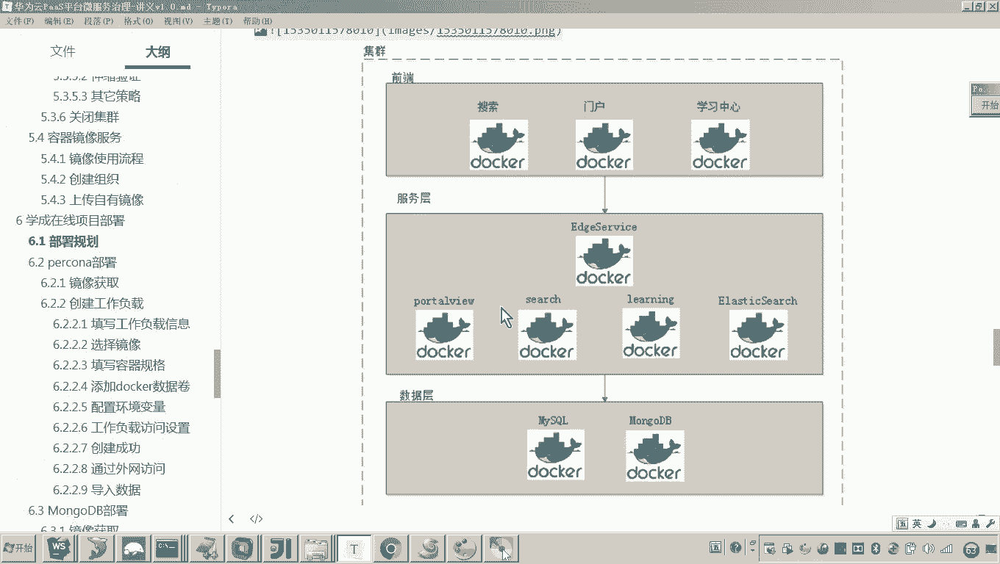

# 华为云PaaS微服务治理技术：P105：13-学成在线项目部署-部署规划 🗺️

在本节课中，我们将学习如何将“学成在线”项目部署到云平台。我们将首先明确本次部署的目标和范围，并对整个部署架构进行规划。

## 概述

本次部署的核心目标，是将“学成在线”项目中实现“在线播放视频”业务流程所涉及的所有应用服务，全部部署到云平台上。这个业务流程在之前的课程中已经实现，并最终呈现为一个可以播放视频的界面。

## 部署架构规划

上一节我们明确了部署目标，本节中我们来看看具体的部署架构。下图展示了“学成在线”在线点播视频业务流程所涉及的所有应用服务组件。

整个架构可以分为三层：前端层、服务层和数据层。

### 前端层

前端工程负责用户交互界面的展示。以下是本次部署涉及的三个前端服务：

*   **门户**：这是用户访问系统的主要入口。
*   **学习中心**：用户点播和观看视频的界面将通过此服务进行请求和展示。
*   **搜索**：用户通过门户访问搜索页面时，将使用此服务。

### 服务层

服务层负责处理业务逻辑，前端工程通过请求服务层来获取数据和执行业务操作。以下是服务层的核心组件：

*   **网关**：位于最上层，是我们之前开发的微服务网关，负责请求的路由和聚合。
*   **数据视图服务**：这是我们自己编写的微服务之一。
*   **搜索服务**：这是我们自己编写的微服务之一。
*   **学习中心服务**：这是我们自己编写的微服务之一。
*   **Elasticsearch**：这是一个我们使用的第三方全文检索服务。

### 数据层

数据层负责数据的持久化存储。以下是本次部署使用的两个数据库：

*   **MySQL**：关系型数据库。
*   **MongoDB**：文档型数据库。

## 部署顺序说明

以上便是本次“学成在线”项目部署所涉及的全部应用服务，它们将共同构成一个完整的集群。部署介绍完毕后，稍后我们将按照一定的顺序，将上述所有应用服务逐一部署到云平台。

## 总结

本节课中，我们一起学习了“学成在线”项目的部署规划。我们明确了本次部署的目标是上线“在线播放视频”业务流程，并详细分析了该流程所涉及的前端、服务层和数据层所有组件。这为后续的实际部署操作奠定了清晰的架构基础。