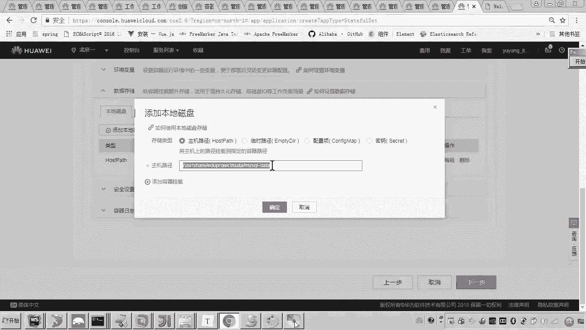
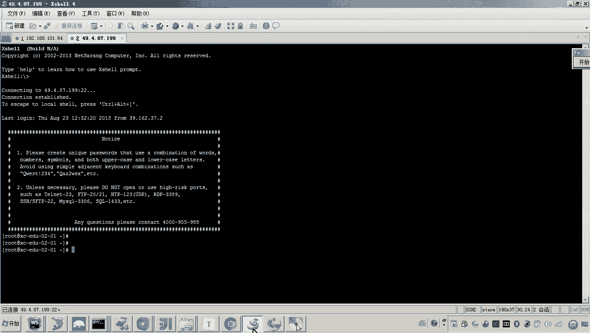
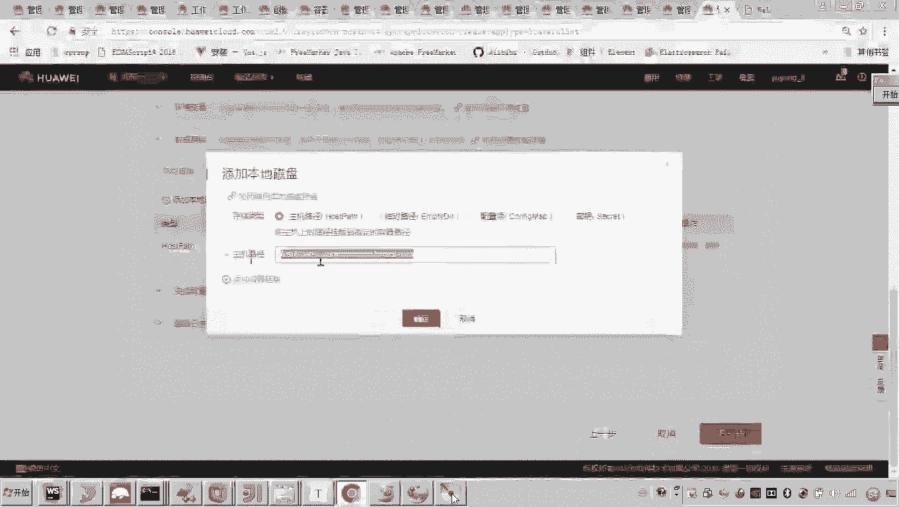
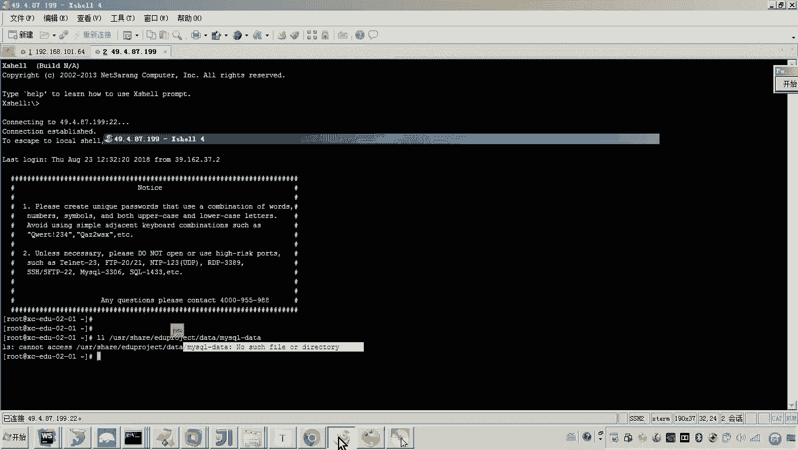
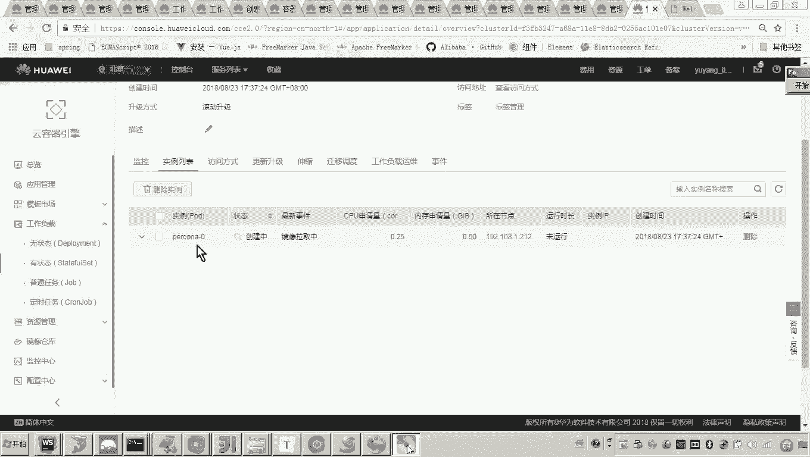
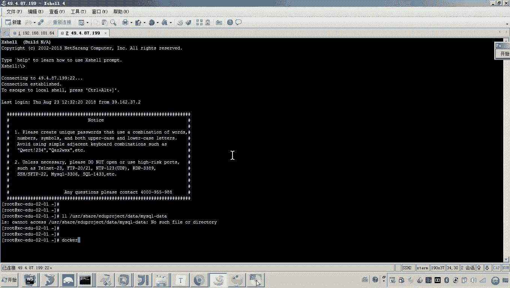
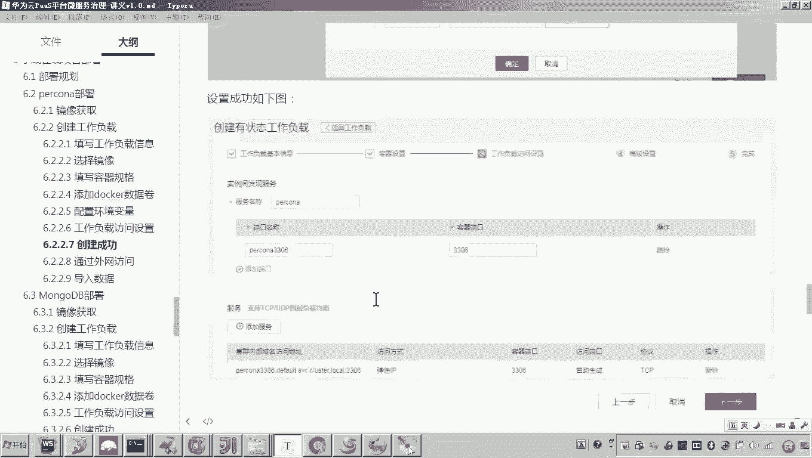
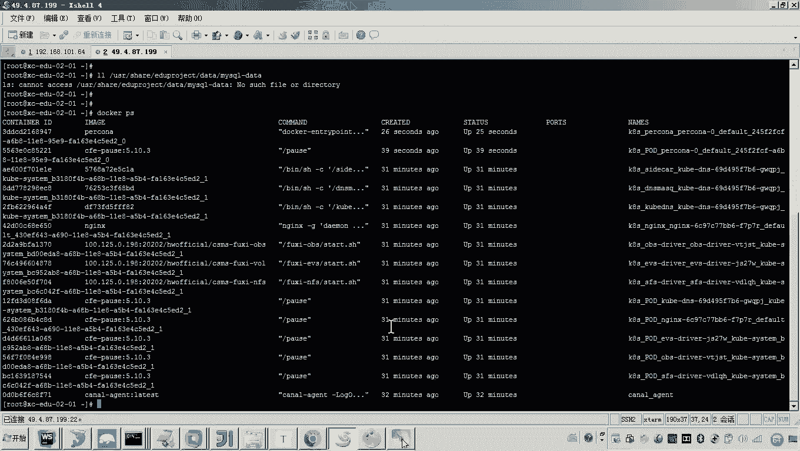
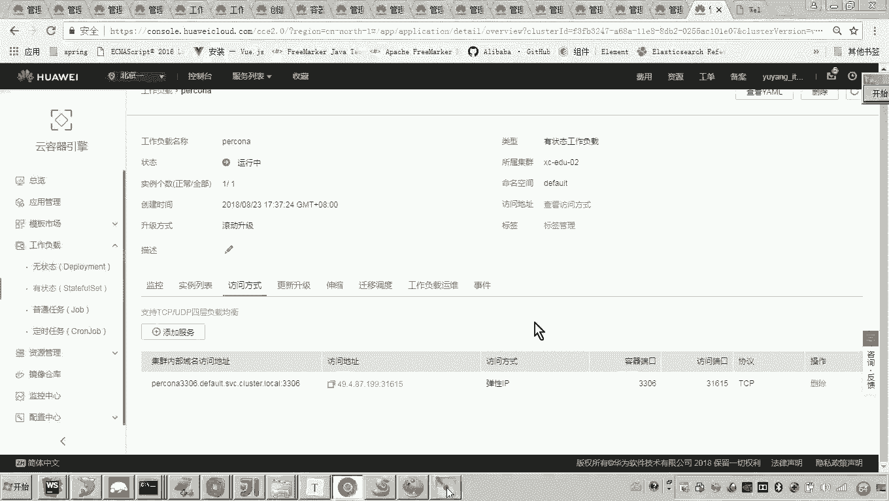

# 华为云PaaS微服务治理技术 - P106：14-学成在线项目部署-percona-创建工作负载 - 开源之家 - BV1wm4y1M7m5

好，那么下边呢我们就开始部署。那呃首先呢我们从哪一层开始呢？呃，我觉得呢应该是从这个数据层开始啊，数据层啊，因为如果我们是从服务层开始的话，这个因为服务层要访问数据层，对吧？数据层没有部署的话。

我也没有办法去测试。好，所以我们从数据层开始。然后呢部署服务层，最后呢部署前段。嗯，好，那首先呢数据层这一块呢，我们先部署这个mysql吧。好了，那么看6。按二章节啊，这里边呢我们准备部署myql。好。

那这个呃pro大家听说过没有啊？它是这个mysqcle数据库的一个什么呀一个版本啊，那这个版本呢叫这个myscle的性能呢啊有一些提升啊，所以说呢我们采用这个pro这个版本啊，好。

那首先呢我们来看一下这个mys这个数据库啊。呃，它我们应该创建一个呃无状态的这个工作负载啊，还是有状态的。大家思考一下。😊，好，我们登到这个云平台啊，云平台。然后在云平台这里边呢有一个这个工作负载。

对吧？那现在这里边呢，我们是点这个有状无状态的还是有状态的各位。😊，就是说老师这个这个这个这个有状态的表示啥意思？哎，只要说你需要呃这个应用服务啊啊像这个呃运行的过程当中会有这个数据的变化。

需要对数据进行持久化，那么我们就需要创建什么呀？有状态的工作负载，对吧？好，那这里边呢我们准备怎么创建呢？啊，因为我们最终会把什么呀？我们会把这个呃。😊，这个这个负载呢上传到集群下边啊，创建到集群下边。

对吧？而我们的这个集群呢有几个呢？哎，我们是不是创建了一个哎，叫做XCEDU02，对吧？好了，那现在呢注意啊，我们把这个集群啊如果没有唤醒的话，您这里面点击集群唤醒。哎，大家可以看到这个状态啊是正常啊。

我们说才能使用。好，那现在呢呃把集群唤醒了之后呢，还需要做一件事，就是弹性服务器弹性服务器的这个开机呀，现在开大家可以看到这个服务器是不是已经运行的了。好，这些过程做完了之后呢。

我们现在就准备到有状态的这个呃这个这个这个下边呢，我们点击创建有状态工作负载。嗯，开始来创建了。😊，那首先这里边有一个工作负载的什么呀？名称，对吧？这个名称呢我们准备创建什么名称呀啊。

因为我们说刚才不是说嘛要创建mysql啊，我们使用这个pro这个版本，对吧？所以这里边呢我们这个名称是不是就可以直接叫做pro，可以吧？好。😊，好，那这样的话，我们是不是就可以怎么弄呀？呃。

说属机群选择一下命名空间的默认就可以了。然后这个实例呢，我们默认先一个实例，时间同步呢也还开启。然后接下来我们就点击什么呀？下一步。😊，好，那么这里边呢我们是不是就要添加容器了？😊。

那这个po这个这个这个版本的这个mysq啊，它是呃需要我们自己传这个私有的这个镜像呀，还是从docker官方来呀。好，那注意啊，像这一种镜像的话，哎。

它这个比如说en呀、mys呀、po呀这些东西呃应该说docker官方都是有的。嗯，所以呢呃我们在这里边呢搜索一下。😊，啊，大家可以看到是不是有这个镜像呀，然后点击确定。好。

那这样的话我们是不是就准备哎用这个啊镜像用这个docker官方的镜像。好，然后这里边我们改一个容器的名称啊，好改一下。比说老师不改可以吗？哎，可以，它就是一个容器的名称啊，没关系。好。

那这里边呢我们是不是就选填写了镜像的名称版本之后，接下来要怎么做呀？是不是就是要把这个呃这个配置的这个CPU和内存的规格啊，我们来填写一下，对吧？好，那这个规格当初老师说过啊。

说这个最小的这个限制的这个规格应该是尽量的小啊，这个一定要是尽量的小啊，然后也就是说呀这个你你只要程序启动能起起来就行。😊，好，那这里边呢我们就选择什么呀啊，0。25这个盒，然后呢，这个是一好。

这个是1024。😊，好，就可以了。然后呢，我们呃把这个把这个呃镜像的这个规格选好之后，下边呢，我们还需要填写什么东西嘛？注意就是这个pro啊它的这个安装的方法呢。

大家可以呢去参考一下网上的这个呃它的这个官方所提供的这个docker安装的一些说明。那么在参考这个说明的时候呢，我们就会了解到呃，它的这个容器当中，它会把这个数据呀。

写在这个容器的这个杠万杠 lab杠 my circle的目录下。😊，啊，也就是说这个pro这个镜像呃，这个回头呢在容器启动容器之后呢，它就会把这个呃数据存储的这个路径啊哎统一定在呃杠VAR杠杠 my下。

所以各位通常说哎我们在进行docker容器化部署的时候呀？我们是一般在数主机当中，我们定一个目录来映射到容器的这个路径下。这样的话目的只有一个是不是就是为了方便我们对这个数据通过数主机就可以进行管理了。

就不用登到容器里边了，懂我的意思了吧？哎，所以说这里边呢我们一定要哎注意好，那这样的话，我我们怎么做呢？我们是不是就可以把这个数据卷给创建一下，对不对？好，那这样的话，我们在哪找到数据卷呢？

这里面是不是有一个叫数据存储啊？好，在这点，然后添加本地磁盘。好，那么默认第一个就可以了。主机路径指的就是云呃服务器上边的这个路径。哎，然后注意看这个路径当前肯定是没有的啊。那这个路径没有的话。

它会自动的去创建。哎，那这里边呢注意啊呃，我这里边也可以现在去登一下。😊。

我把这个云服务器登上去。哎，这个浏览一下。嗯，在找。然后把这个勾子。好，这个是不是就登进去了？对，这个就是我们这个呃申请的这个啊云服务器啊。😊。

好，那我我登上去之后，我的目的就是一会儿我们可以看一下嘛。当然这个路径肯定是没有的。哎，这个路径是因为现在你还没有去创建这个容器啊，所以说它这个路径呢也不会去干嘛自动创建，各位可以看一下是吧？好。

那现在呢我们说这个数主机的路径，我们呃准备定成它。然后呢，挂载的这个容器的路径挂载到哪了，挂载到这个杠呃VR杠la下。😊。

对，有人说老师，那你这个路径能不能自定义呢？注意这个路径是死的啊，也就是说你用这个po呢这个镜像呀，它这个路径呢它已经默认把这个数据写到这个路径下了。而这个是你数主机的路径，你可以去自定义。嗯。

有人说老师我不想这么长是吧？可以，你自己去定义就可以了。哎，但是这个是已经OK的，确定的死的。好了，那现在呢呃我们把这个路径镜像哎，这个映射好了之后呢，点击确定。😊，这样的话我们这个就写好了。😊。

另外还有一点，哎，就是说那你这个myscle创建完了之后呢，它是不是要应该有一个初始的密码，对吧？这个初始密码呢，其实这个procon呢它也提供了一个环境变量的方式来设置密码。😊，那这个环境变量的方式。

那个环境变量的名称是什么呢？哎，注意看啊，注意来，我们找到我们找到刚才那个点啊。😊，哦，环境变量的这个名称就是这个my circlecle下划线哎root下划线password就它。

所以这里边呢我们找到环境变量的配置。注以当前我是不是在呃填写完这个镜像规格之后，我们是不是要做这些事？哎，首先看哎它这个数据卷需不需要去定义哎挂载的路径。其次，我们要看环境变量，需不需要定义。好。

然后这里边的这个这个环境变量就表示什么呀？就表示这个呃root用户的初始密码。好，这里边我们把root用户的初始密码默认为mysql就可以了。😊，那这样的话我们就把它给创建完成。好。

那么比说老师其他的用设置吧，其他的我们暂时不用，然后我们点击下一步。😊，好，那这样的话，我们是不是就到了这个界面了？啊呃，那对于这种有状态的工作负载呢，它有一个呃这个叫做实力间发现服务。哎。

也也就是说什么意思呀？也就是说这个容器与容器之间，它要进行通信。😊，哎，那它的这个呃端口是什么呢？哎，我们说这个端口肯定是什么呀？哎，3306对不对？容器的端口就是3306。😊，好。

那么那你外边如果想访问哎，外边想访问这个mesicl怎么访问呢？好，这里边呢跟我们呃当初写的快速体验里边方式一样，我们添加一个服务，在这里边是不是有三种访问方式。前两种指的是内网，后边是不是公网啊？对。

好了，那现在呢我们暂时先不用集群内部去访问，我们用一会儿用公网去请求一下这个什么呀？这个这个这个proner好，那这里边我们去设一下吧，这个服务的名称。哎，pro。😊，啊，然后呢叫什么呀？3306。好。

然后公网访问公网访问这里边我们选择是不是弹性IP呀？好，那这个容器的端口它肯定是3306吧。好，同样的道理啊，这个应该之前我演示过，就是说你通过公网IP来访问的话，这个这个端口访问的端口你是可以指定的。

但是它有范围，对吧？那这里边我们就不指定了，让它自动生成就行了。好，然后我们点击确定嗯，当回头我们需要这个内网访问这个pro，我们再再添一个集群内访问啊，现在我们先不添吧。好。

这样的话我们是不是就添加了这几个访问的什么访问的方式是不是就有了。好，那这样的话我们点击下一步。然后呢，这个升级的策略默认，我们不用管它啊，然后在最后边我们点击创建。😊。

这个pro呢它就开始创它就是个工作负载呢，就创建成功。然后我们返回工作负载列表。大家可以看到，此时它这个状态是不是就是未就绪，对吧？好，然后呢呃它当前应该是正在镜像拉取。哎，有说老师这是啥意思都不懂。

你现在做了这个事儿，是不是在你的这个集群上边啊，这个云服务器上准备添加一个这个pro的这个什么呀容器实例，对不对？而现在你这个云服务器，各位按照早期的方式。

我们是不是需要手动登录进去来执行一系列的这个什么呀docker命令来进行构建，对吧？而现在不用你这么做了？只要你通过云平台的管理界面，哎，通过配置添加完成之后，那么在你的这个云服务器上。

你就会发现它已经自动把这个proner哎，从这个首先第一步从这个呃拉取镜像，从你刚才是不是从docker官方拉取镜像是吧？它就会。😊。

把这个pok的镜像拉取到你的这个云服务器，然后呢给你创建容器。嗯，那你在创建容器的时候，刚才我们是不是设了一堆呀，设了什么呀？有这个呃这个什么环境变量呀，有这个数据卷的这个路径映射呀。

说这些东西你都设了之后呢，它在创建容器的时候呢，它都会给你干嘛设置好。然后这里我们来看一下刷新。😊，这个是不是就开始运行中，到这儿为止，我们说这个procon这个什么呀服务呃，这个这个工作负载啊。

我是不是就创建成功了？好了，那那有说候老师创建成功之后要怎么做的？创建成功之后，我们是不是就可以通过外网去访问它，然后怎么弄啊？😊，是不是就可以导入数据了，对吧？啊，当然哎我们说那你导入数据的话，呃。

那你是其实不通过外网是不是也行啊？我们我们登到容器，是不是也可以去啊向这个买这个这个procon当中导入数据啊？但是我们刚才是不是已经设置了一个什么哎，我们设置了一个这个访问的方式。

我们是不是可以通过这个地址。哎，我们可以通过这个地址来访问，看懂了吗？对，所以哎稍后呢我们会通过外网访问这个procon，然后呢导入数据。嗯，好。😊。

