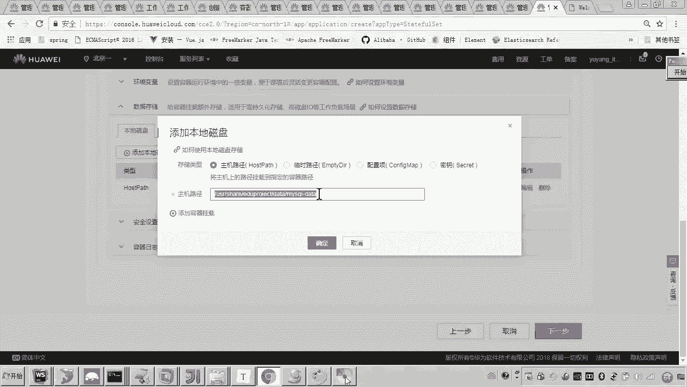
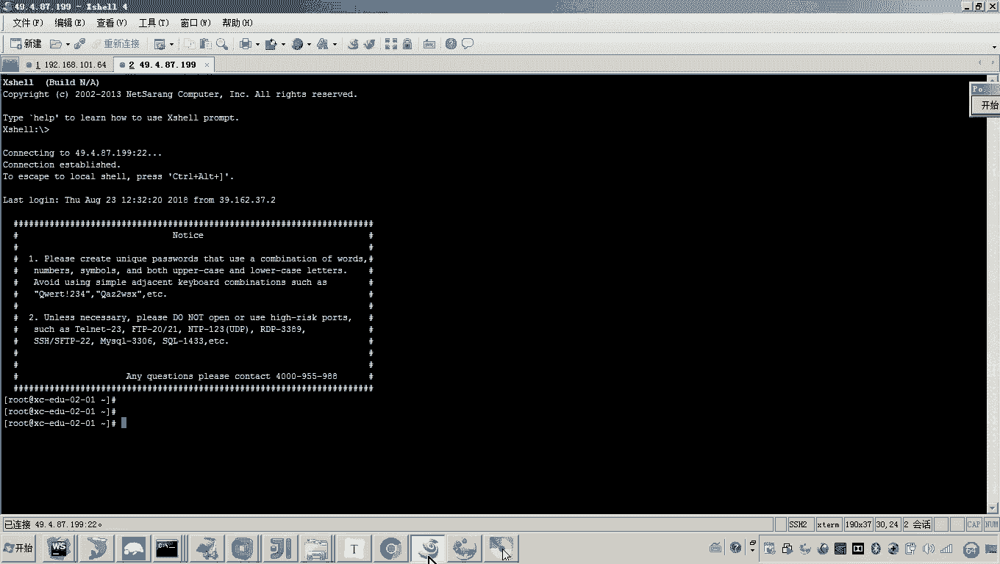
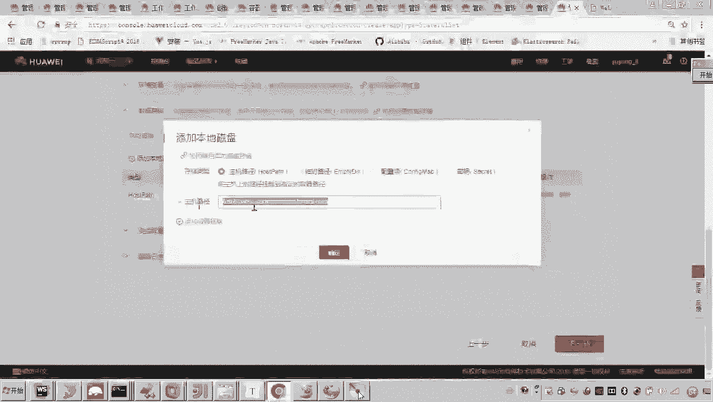
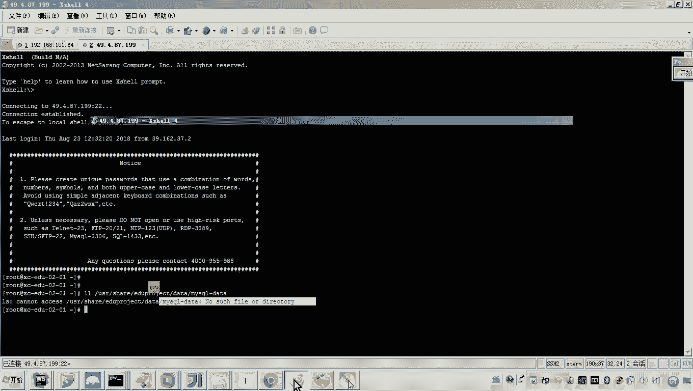
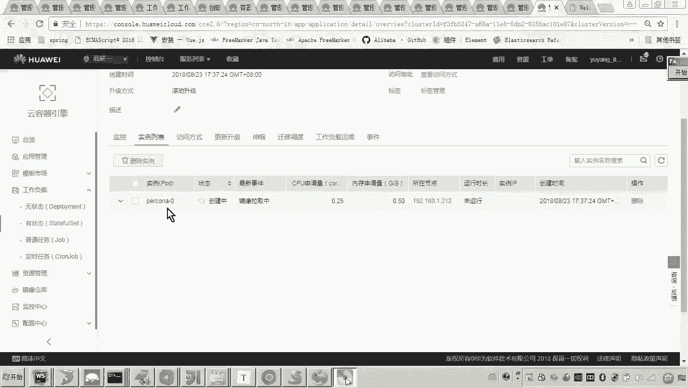
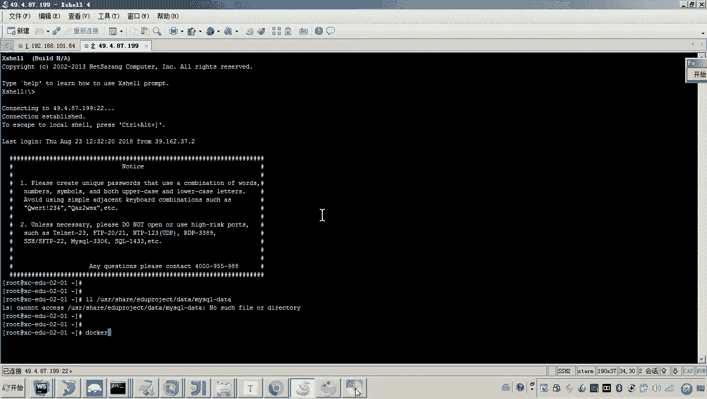
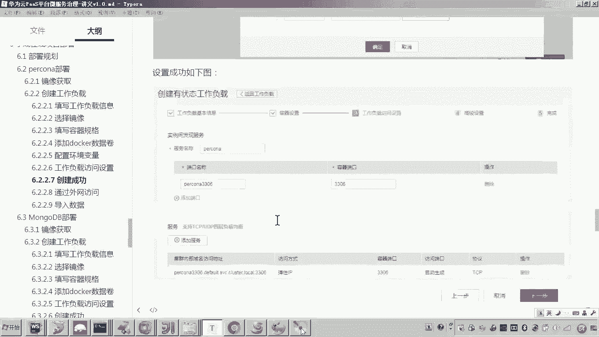
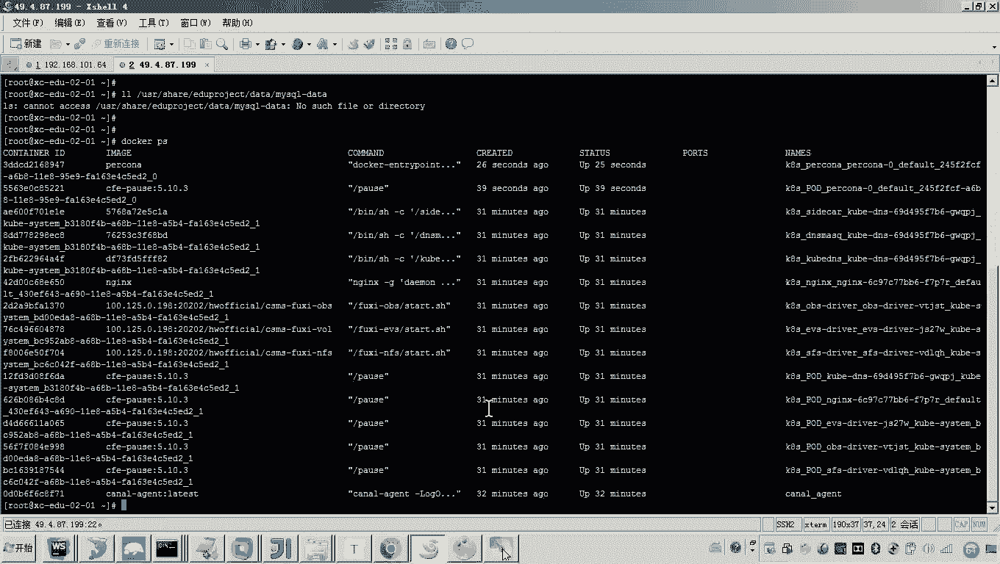
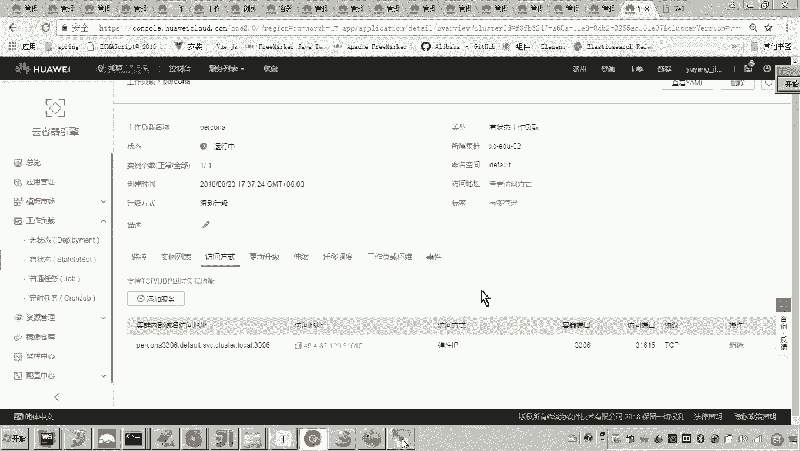

# 华为云PaaS微服务治理技术 - P106：14-学成在线项目部署-percona-创建工作负载 🚀

在本节课中，我们将学习如何在华为云PaaS平台上，为“学成在线”项目部署数据库层。具体来说，我们将创建一个有状态的Percona MySQL工作负载，并配置其持久化存储与网络访问。

## 概述 📋

项目部署通常遵循从底层到上层的顺序。我们首先部署数据层，因为服务层需要访问数据库。如果先部署服务层而数据层未就绪，将无法进行有效测试。因此，我们的部署顺序是：**数据层 -> 服务层 -> 前端**。本节我们将从数据层开始，部署Percona MySQL数据库。

## 选择工作负载类型 🤔

首先需要确定创建何种类型的工作负载。在华为云平台的工作负载管理中，有两种主要类型：
*   **无状态工作负载**：适用于无需持久化数据的应用。
*   **有状态工作负载**：适用于运行过程中会产生数据变化、需要对数据进行持久化的应用，例如数据库。

由于MySQL数据库需要持久化存储数据，因此我们选择创建**有状态工作负载**。

在开始创建前，请确保您的Kubernetes集群（例如 `XCEDU02`）状态为“正常”，并且关联的弹性云服务器已开机运行。

## 创建工作负载基础配置 ⚙️

现在，我们开始创建有状态工作负载。

1.  在云平台控制台，进入“工作负载”页面，点击“创建有状态工作负载”。
2.  填写工作负载的基本信息：
    *   **名称**：`percona`
    *   **集群**：选择您的集群（如 `XCEDU02`）
    *   **命名空间**：使用默认值
    *   **实例数**：默认为1
    *   **时间同步**：保持开启状态
3.  配置完成后，点击“下一步”。

## 配置容器规格与镜像 🐳

接下来，我们需要为工作负载添加容器。

1.  点击“添加容器”。
2.  在镜像选择页面，搜索 `percona`。Percona是MySQL的一个高性能分支版本，我们将使用Docker官方的镜像。
3.  选择 `percona` 镜像并确定。您可以自定义容器名称，但非必需。
4.  配置容器规格。为了节省资源，我们设置最小请求规格：
    *   **CPU申请**：`0.25`核
    *   **内存申请**：`1024`MiB

## 配置数据持久化 💾

数据库容器内的数据需要持久化到宿主机，以便管理和备份。根据Percona镜像的官方说明，其默认数据存储路径为容器内的 `/var/lib/mysql`。

我们需要将宿主机的一个目录映射到此容器路径：

1.  在容器配置页面，找到“数据存储”选项卡，点击“添加本地磁盘”。
2.  配置存储卷：
    *   **存储卷类型**：默认“主机路径”
    *   **主机路径**：填写宿主机上的一个目录路径，例如 `/data/percona/mysql`。如果路径不存在，系统会自动创建。
    *   **挂载路径**：填写容器内的路径 `/var/lib/mysql`。

这样，容器内 `/var/lib/mysql` 目录下的所有数据都会实际存储在宿主机的 `/data/percona/mysql` 目录下。

## 设置环境变量 🔧

Percona镜像支持通过环境变量来设置MySQL的root用户初始密码。

1.  在容器配置页面，找到“环境变量”选项卡。
2.  添加一个环境变量：
    *   **变量名**：`MYSQL_ROOT_PASSWORD`
    *   **变量值**：设置您的初始密码，例如 `mysql`

## 配置网络访问 🌐

容器部署后，需要配置网络以便访问。

1.  在“服务配置”步骤，系统会提示配置“实例间发现服务”。我们添加一个端口：
    *   **端口名称**：`mysql`
    *   **容器端口**：`3306`
2.  为了能从公网访问数据库以进行初始数据导入等操作，我们需要添加一个服务。点击“添加服务”。
3.  配置服务：
    *   **服务名称**：`percona`
    *   **访问类型**：选择“公网访问”
    *   **服务亲和**：保持默认
    *   **端口配置**：
        *   **容器端口**：`3306`
        *   **访问端口**：选择“自动生成”，系统会分配一个随机公网端口。

> **注意**：公网访问数据库存在安全风险，仅建议用于临时调试或初始数据导入。生产环境应使用集群内访问或通过VPN等安全方式。

配置完成后，点击“下一步”，在最后的“升级策略”页面保持默认设置，然后点击“创建”。

## 验证部署 ✅

工作负载创建后，系统会自动在您指定的集群节点上拉取Percona镜像并创建容器。

1.  返回工作负载列表，可以看到 `percona` 的状态从“未就绪”变为“运行中”。
2.  在“服务与路由”页面，可以找到刚创建的 `percona` 服务，并查看其分配的公网IP和端口。

至此，Percona MySQL数据库工作负载已成功部署。您可以使用数据库客户端工具，通过 `{公网IP}:{分配端口}` 进行连接，用户名为 `root`，密码为之前设置的环境变量值（如 `mysql`），后续即可进行建库、导入数据等操作。

## 总结 📝

本节课中，我们一起完成了“学成在线”项目数据层Percona MySQL的部署。我们学习了：
1.  根据应用特性（需数据持久化）选择**有状态工作负载**。
2.  通过云平台界面配置容器**镜像**、**资源规格**。
3.  通过**数据卷挂载**实现容器数据的持久化存储。
4.  利用**环境变量**配置应用的关键参数（如数据库密码）。
5.  配置**公网访问服务**，使得数据库能够从外部被访问，以便进行初始化。

下一节，我们将基于已部署的数据库，继续部署项目的服务层应用。