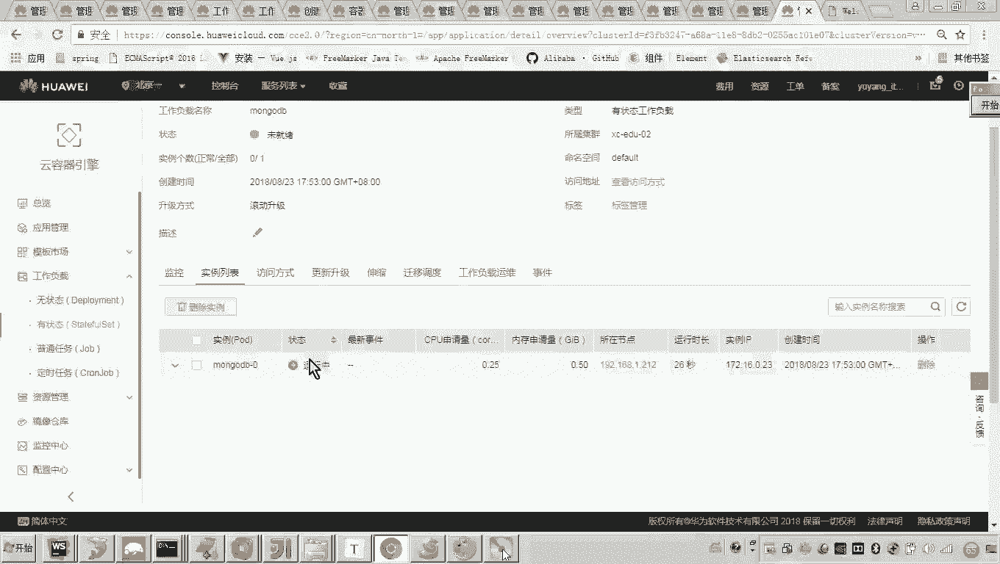
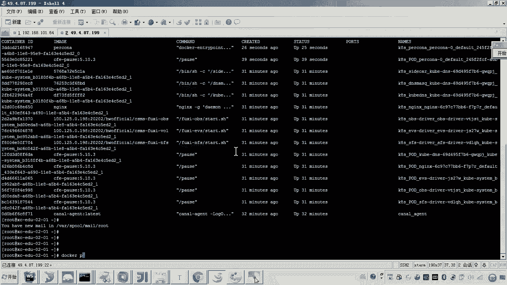
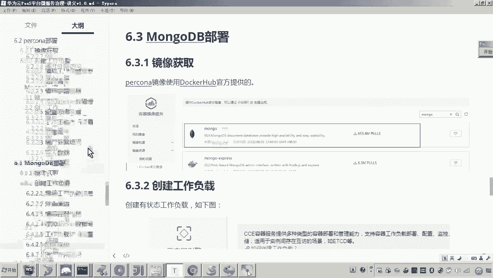

# 华为云PaaS微服务治理技术 - P107：15-学成在线项目部署-percona-导入数据 - 开源之家 - BV1wm4y1M7m5

好，那么接下来呢哎我们来完成数据层的另外一个数据库，就是mongoDB。好，mongodB数据库呢是一个非关系型数据库啊，那么在学程在线当中呢，有一些这个不是特别重要的。

并且呃还要考虑到这个数据查询性能呢，我们就采用这个mongodB来存储了。好，那首先呢刚刚才我们是不是完成了这个pro这个容器的部署啊。那现在呢我们是不是就可以呃参考这个procon的部署流程。

我们来做mongodB的部署？😊，好，首先呢我们说这个镜像来源啊来源于哪里呢？我们是自己做呀，还是说从docker来拿啊。

那这里边我们发现这个其实docker官方是有一个mango哎这个数据库的那版本呢非常全。好，我们就准备从这个docker当中来拿。😊，OK那我们怎么做呢？啊，这个是一个无状态的还是有状态的呢？大家思考。

😊，因为猫goDB也是一个数据库，对吧？它在运行过程当中，它是不是也会去需要对数据进行持久化，对吧？所以这里边我们就怎么弄啊，创建有状态的工作负载。😊，好，那这里边呢我们起个名字叫mongo DB嗯。

然后这里边呢实例选一。😊，好，这个集群不要选错了啊，这个是XCEDU02集群。😊，时钟同步呢，我们就开开启这个开启就可以了。然后下一步好，添加容器。这里面呢我们选择这个docker hub。

然后在这个里面呢，我们找到这个什么呀？mongo。好，然后呢点击确定。😊，嗯，那这个芒go的版本，我们准备用哪个版本呢？对我们这个版本呢，我们准备采用这个什么呀？3。4版本。😡，好，3。4。

那这里边它很全啊。好，那么这这个这个容器的名称呢，按照我的习惯呢，我通常都是把它改一下啊。然后这个嗯CPU最小还是0。25啊，然后这个内存是10最大1024，然后这个最小限制是512。😊，好。

那这里边又到了这个界面了。那这个界面呢，我觉得大家是不是就可以来看一下吧，怎么弄啊啊，首先数据存储肯定要写了，因为我们通常是在这个数主机上哎来定一个路径，是不是映射到这个容器里边呢？所以我们添加好。

那这个路径呢是什么呢？😊，这个路径呢我们是定到这这里头啊，其实各位有人说老师这个这个这个这个路径为什么定义那么长呢？啊，其实各位你可以看一下啊，这个路径我们在定义的时候啊，其实你会发现啊。

这个我们我们学成在线的这个部署的这些容器呢，我们都统一在这个目录下看到了吧。所以这里边呢好，我们就哎来把这个路径复制一下，然后呢贴进去。好，这里面它所对应的容器的这个路径是这个呢叫杠da杠DB好。

那后边这个容器的这个路径呢，它是死的啊。好，然后呢我们把它贴进去。好，其他的这个都不用改啊，这个权限是读写确定。😊，好，那这个写好了之后呢，那接下来我们要做什么呀？我们是不是就可以环形变量就不用定了啊？

我们现在就可以来。哎，我说那怎么访问这个容器呢？好，这里边我们说那这个mongodB的端口。哎，大家有印象吗？mongodB的端口，它默认是哪个端口呢？叫做27017端口，对吧？

所以这里边呢我们给它起一个名字哎，起个名字啊，这个端口的名称哎，叫mongo27什么呀？017。😊，好，27017是mongoDV的端口。然后呢，这里边呢我们再来添加什么服务。好，添加服务。

那添加服务的方式其实跟刚才是不是一样呀？呃，我们先不管前面的这个这个这个这个集群内部访问回目用到的时候，我们再添，现在我们先添一个公网访问，然后选弹性IP嗯，然后呢这个就是27017啊。

这个让它自动生成。😊，好，这个是不是就填完了吧？啊，然后填完了之后呢，点下一步好，然后这个都不用动，然后呢，我们点击创建。好，这个mongoB工作负载是不是就创建成功了？😊。

那这个过程呢是不是就和刚才这个po呢这个创建的过程类似，那它也在进行镜像的拉取，对吧？好，这个过程呢全是自动化进行的嗯。😊，那我们看访问方式，这个端口其实已经干嘛呀，生成了，对吧？好。😊。

那大家来看啊呃再再稍微等一会儿啊，稍微等一会儿。哎，你看已经运行起来了，那我们可以登到这个服务器上来看一下。😊。

那可以看一下这个mongo db的这个容器啊，是不是已经创建成功了。好了，那么按照刚才我们po呢哎来创建这个过程啊，那这个创建成功了之后，我们说这个服务器是不是已经默认是空的对吧？

所以我们是不是可以往里边导点数据啊，导什么数据啊？😊，啊，在我们这个学程在线的这个目录里边，是不是有一个目录叫mongo啊？然后呢。

这里边是不是有一个叫port view这个port view这个port各位还有印象吧？这里边我们当时在测试学生在线的时候，我是不是用到两个表啊，两个集合呀，一个是view course。

一个是view course下划线med，对吧？所以你需要把这四个集合都导到哎我们说的这个呃这个这个这个这个数据库下。好，那现在呢我们怎么做呢？😊，跟。这个pro呢一样，我们需要怎么弄啊。

先建一个新连接，对不对？先创建一个连接。嗯，然后这个创建这个连接呢，各位你这个连接的呃这个地址，你应该从这个工作负载点，然后在访问方式里头去找。😊，你看这里边这个这个这个地址是不是他呀？哎，好。

那么这个连接的名称啊，我姑且也用这个地址，然后注意看啊，然后这个IP地址嗯把它贴到这儿。😊，然后呢，这个31772是不是云平台自动给我们生成的？这个端口映射的是不就是容器里边的27017啊？

所以你把这个端口改成我们这个外网可以访问的这个端口，懂我意思吧？然后点击C。😊，好，然后点击connect。这样的话我们就连上去了。各位默认的话，它有一个al命的这个库嘛。你看这里边呢。😡。

各位这个数据库是不是可以正常连接了？那正常连接之后，我们要做什么事呢？😊，对，现在我们要做一件事，就是先创建一个什么数据库。我们现在要创建一个叫做什么呀，叫做呃portal view。😊。

这个pview数据库创建好了之后呢，现在我是不是要进行导数据了？😡，哎mongodB的这个数据啊，我们采用这个客户端工具，我们用的是studio3期的一个适用版本啊。然后在这里边我们又可以怎么弄啊，哎。

可以点击import connections，然后呢，选择什么呀？第一个jason哎选择第一个jason啊，然后呢怎么弄下一步。

然后呢把刚才哎我给大家说的那几个jason这个这个mongodB里面的那几个文件呀，哎，你给我选进去，然后呢哎你把它这个东西全部选定。😊，看懂了吗？然后下一步，然后下一步，然后导入。各位。

这个时候我们可以看到啊，我们可以看到这个数据库是我新建的对吧？这个数据这这这个这个地址是不是就是我们说的这个怎么呀公网的一个地址，它连接的它映射的是不是就是我们刚刚创建的这个mysql容器的地址，对吧？

然后在这个容器里边，我是不是已经把这个数据库创建成功了。然后双击各位我们可以看到这个数据已经有了。😊，看懂了吗？好，到这儿我们就完成了这个mongo dB的部署。

那这个部署的流程是不是和我们刚才部署procon类似啊？好。

