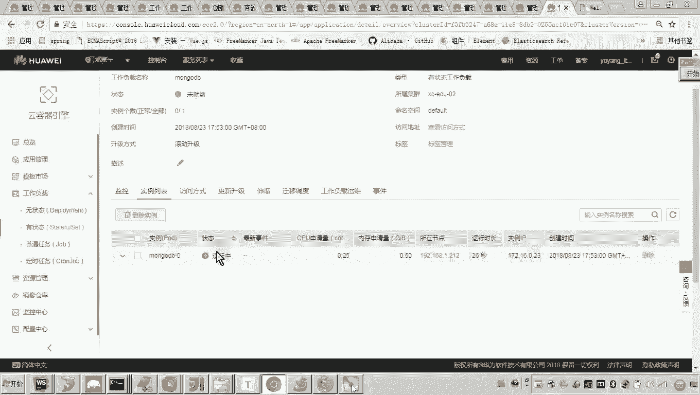
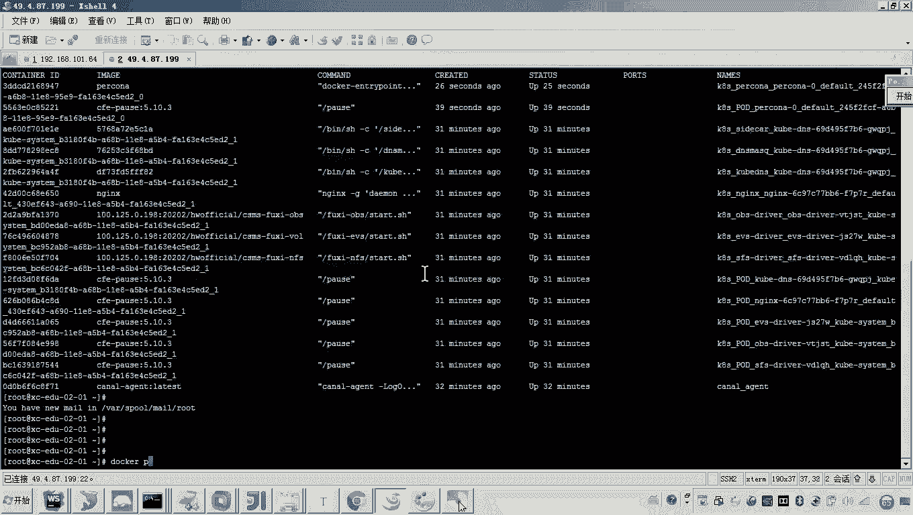
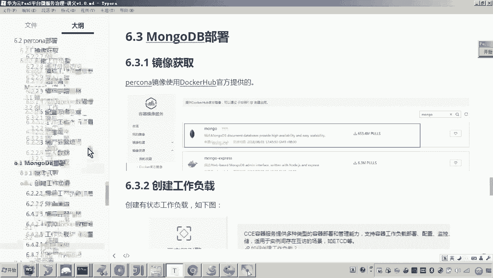

# 华为云PaaS微服务治理技术 - P107：15-学成在线项目部署-mongodb-导入数据 🗄️

在本节课中，我们将要学习如何部署学成在线项目中的非关系型数据库MongoDB，并完成数据的导入工作。MongoDB用于存储项目中一些非核心但对查询性能有要求的数据。

上一节我们完成了Percona数据库的部署，本节中我们来看看如何部署另一个重要的数据存储组件——MongoDB。

## 部署MongoDB工作负载

MongoDB是一个非关系型数据库。与Percona类似，它也需要对数据进行持久化存储，因此我们同样需要创建一个有状态的工作负载。

以下是部署MongoDB工作负载的具体步骤：

1.  **创建工作负载**：在华为云CCE控制台，进入目标集群（例如`XCEDU02`），点击“创建工作负载”。
2.  **配置基本信息**：
    *   负载类型：选择“有状态负载”。
    *   负载名称：填写`mongodb`。
    *   实例数量：设置为`1`。
    *   集群选择：确认选择正确的集群。
    *   时钟同步：选择“开启”。
3.  **添加容器**：
    *   镜像来源：选择“Docker Hub”。
    *   镜像名称：搜索并选择`mongo`。
    *   镜像版本：选择`3.4`版本。
    *   容器名称：可自定义，例如`mongodb-container`。
    *   资源配额：CPU请求设为`0.25`核，内存请求设为`512Mi`；CPU限制设为`1`核，内存限制设为`1024Mi`。
4.  **配置数据存储**：由于MongoDB需要持久化数据，必须添加存储卷。
    *   点击“添加存储卷” -> “主机路径”。
    *   主机路径：填写一个统一的持久化目录，例如`/data/xc-edu/volumes/mongodb`。
    *   容器路径：必须填写MongoDB的数据目录`/data/db`。
    *   权限：选择“读写”。
5.  **配置容器访问**：
    *   端口名称：可填写`mongo-27017`。
    *   容器端口：MongoDB默认端口为`27017`。
    *   协议：选择`TCP`。
6.  **创建服务**：
    *   点击“添加服务” -> “公网访问”。
    *   访问类型：选择“弹性IP”。
    *   服务端口：容器端口`27017`，服务端口可自动生成或手动指定（例如`31772`）。
7.  **完成创建**：检查配置无误后，点击“创建”。系统将自动拉取镜像并启动容器。

等待工作负载状态变为“运行中”，即表示MongoDB数据库部署成功。此时，可以通过生成的外网IP和端口进行连接。

## 连接MongoDB并导入数据

MongoDB容器运行成功后，其内部数据库是空的。我们需要将学成在线项目所需的初始数据导入。

以下是连接数据库并导入数据的步骤：

1.  **获取连接信息**：在工作负载的“访问方式”页面，找到服务创建时生成的**外网IP**和**服务端口**（例如`31772`）。
2.  **使用客户端连接**：打开MongoDB客户端工具（如Studio 3T）。
    *   创建新连接，填写连接名称。
    *   Server地址：填写上一步获取的**外网IP**。
    *   Port端口：填写上一步获取的**服务端口**（如`31772`）。
    *   点击“Connect”进行连接。
3.  **创建数据库**：连接成功后，在客户端中创建一个名为`portal_view`的数据库。
4.  **准备数据文件**：在学成在线项目目录中，找到MongoDB的数据文件（通常位于`mongo/`目录下），例如`view_course.json`和`view_course_media.json`。
5.  **导入数据**：
    *   在Studio 3T中，右键点击`portal_view`数据库，选择“Import Collections”。
    *   格式选择“JSON”。
    *   在文件选择步骤中，将准备好的JSON数据文件全部选中。
    *   按照向导完成导入。
6.  **验证数据**：导入完成后，在客户端中展开`portal_view`数据库，应能看到已成功创建的集合（如`view_course`），并且其中包含数据。

至此，我们就完成了MongoDB数据库的部署与数据初始化工作。

## 总结

本节课中我们一起学习了学成在线项目MongoDB数据库的部署流程。整个过程与部署Percona类似，核心在于创建**有状态工作负载**、配置**数据持久化存储**以及通过**服务（Service）** 暴露访问端口。最后，我们使用客户端工具连接数据库并成功导入了项目所需的初始数据。通过本节的学习，你应该掌握了在华为云CCE上部署有状态数据库服务的基本方法。