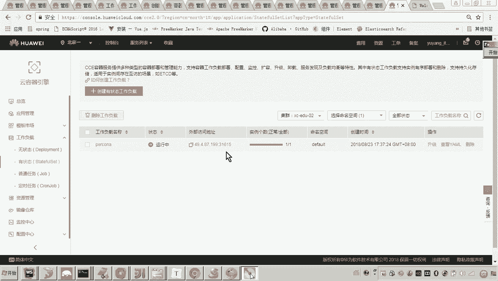
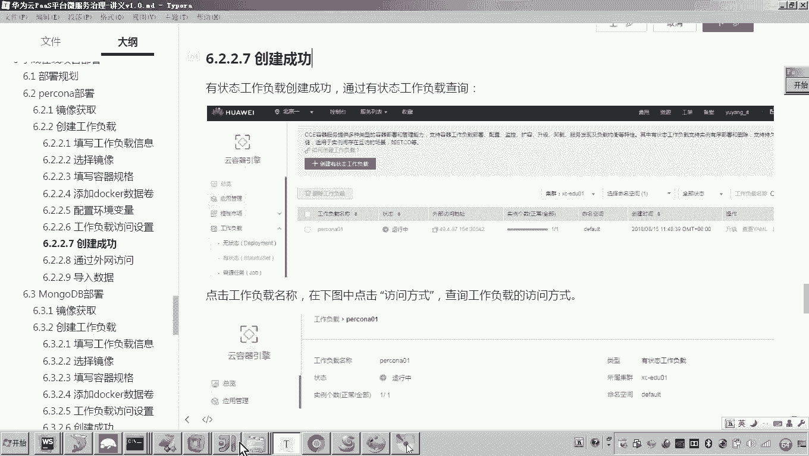

# 华为云PaaS微服务治理技术 - P108：16-学成在线项目部署-mongodb - 开源之家 - BV1wm4y1M7m5

好，那么下边呢我们就通过外网来连接刚刚我们启动好的这个pok，然后呢向里边去导入数据啊。好，那这里边呢看好哎，我们首先呃先查看一下我们这个po的这个连接地址。

啊，大家看到前面是不是就是我申请的这个公网IP后边这个端口是它自动生成的对吧？好，那这样的话，我们来看这个端口映射的是不是就是那个容器的3306了。

所以我们通过这个地址是不是就可以访问到这个数据库的3306端口，对吧？好，那这里边呢我们准准备怎么弄啊啊，这里边呢我会使用一个客户端的工具啊，就这个mysql的客户端工具，然后我建一个连接，嗯。

然后新建好，那这里边呢各位我们随便起个名字就行了。好，这里边我们准备用这个地址，对吧？好，然后呢我们就叫这个名吧？好，然后呢那你这个呃IP的地这个主机地址呢，我们通过这个外网的IP没错吧？

然后呢密码密码密码密码端口是这个31615，这个端口是不是就是是不是就是它了，对吧？对。😊。

然后呢，接下来呢，我们输入这个密码，刚才我那个环境变量设的密码是不是叫做什么呀？😊，哎，mycyclcle对吧？mycyclcle。😊，How my cycle。好，然后呢我们测试连接。

大家可以看到它是不是已经连接成功了，然后连接。嗯，好，这样的话我们大家可以看到我是不是通过这个本地的客户端就登到这个云平台的这个容器当中了。好，那这个数据库其实是正常的对吧？好。

那现在我们说已经连上去了啊，那接下来要怎么做呢？😊。

因为学生在线当初我是不是告诉大家，我给大家提供了很多的这个什么呀啊这个初始化脚本，对吧？啊，那你进到这个资源啊这个文件夹下有一个学生在线的目录啊，学生在线目录里边有一个mysql。

这个mysql里边呢就有几个cirl脚本。那我们通过这个客户端呢，我们把它导进去。😊。

好，那么执行一下就行了。来嗯我们执行srcle脚本，然后呢去找到啊找到我们啊刚才说的那个学生在线的这个目录。嗯，好。

那么找到目录之后呢，点击mysql，然后点击XC course，这个是一个课程管理的这个数据库啊。好，我们去执行。

好，执行完成之后，我们再来继续导导什么导这个running学习呃数据库。好，我们继续的去导，然后导什么最后一个数据库，叫用户管理的数据库。好。有人说老师这这三个数据库都是什么意思呢？这三个数据库注意啊。

这个数据库回头我们用到的时候，我会告诉大家里边这个表的结构啊。好，大家可以看到现在三个数据库是不是已经自动创建成功了。对。😊，好，那么这个数据库我们可以看到这个数据呢已经正常的去导进去了。嗯。

那么啊那我问大家，到这儿为止，我们的这个pro这个呃服务我们是不是已经去部署成功了？那回头呃我们现在是公网访问对吧？那回头我们需要啊在集群内部容器呃之间进行访问的话，我们只需要在哪里啊。

在这个访问方式这边，我们添加一个集群内访问的地址。这样的话我们说啊那其他的这个服务是不是就可以来这个指向这个地址了？大家懂我意思吧？好。

现在我们是通过这个这个这个外部的这个访问地址呢来访问我们容器里边的这个服务啊，好，那么到这儿呢，我们就完成了这个pro的这个部署。好，那么这个过程完成之后呢，我们简单总结一下啊。

那后边的这个部署呢和这个顺序基本上都一致，只是里边的这个镜像不一样，配置不一样啊，大概的这个工作的思路都。😊。

差不多。好，那首先呢我们来看。😊，首先我们先要创建工作负载。对，然后呃呃当然啊应该是首先我们先要做什么呀？先要确定你的镜像来源是不是啊啊，针对这种哎。

比如说mongodB呀、mysqical啊、procon呀，像这些哎，那么从这个docker官方啊，我们是不是就可以拿到很多非常丰富的版本呢，哎，找到你所需要的版本就可以。😊，啊，那么好。

那么这个镜像获取我们这个pro呢是从这个docker hub官方来拿到的啊，那么知道了这个镜像的来源，我们就可以创建工作负载了。创建工作负载。

这里边就有呃一个事需要你确定一个是你要创建有状态的还是无状态的啊，什么是有状态的，就是这个服务运行过程当中呢，会产生这个什么这个这个持久化的数据。哎，那么这个时候呢，你就需要干嘛？哎。

来部署这种有状态的工作负载。哎，好了，那么这个呃我们创建有状态的工作负载。哎pro呢，然后我们填写基本信息，选择镜像哎，容器的规格。容器规格这里来了需要注意这个最小的这个限制，一定注意。😊，啊。

能启动程序啊就可以那能多小就多小，尽量的小。好，然后呢再有就是添加docker的数据卷。😊，那这个东西呢，有人说老师这个东西嗯我怎我怎么知知道这个你挂载的路径是是他呀？所以你你那你得看这个po克呢。

你从官方搜一下啊，它的官方呢他就会说哎po克呢通过docker去部署的话，他就会给你指定好了。哎，你要挂载这个路径。哎，懂我意思吧。好，那么我们通过这个呃挂载完路径，然后呢还有环境变量设置完了之后啊。

那么我们就可以去呃这个干嘛呀啊，这个工作负载呢就创建成功了。哎，我们就可以去访问它哎，并且呢向它导入数据。好。😊。

