# 华为云PaaS微服务治理技术 - P108：16-学成在线项目部署-mysql

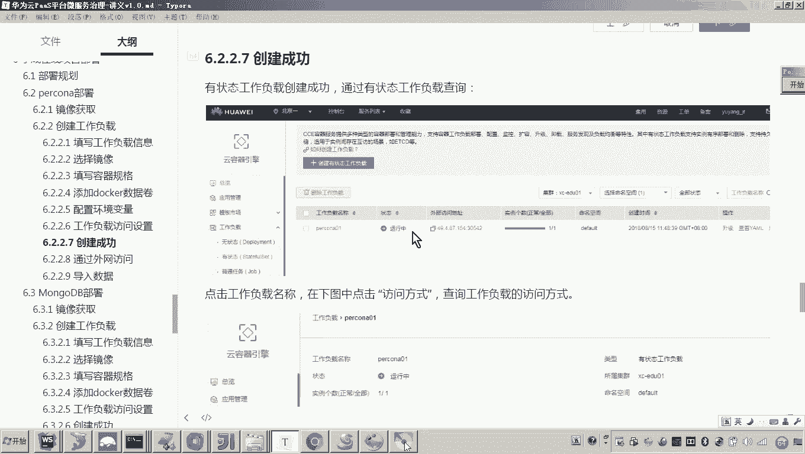

在本节课中，我们将学习如何在华为云PaaS平台上部署学成在线项目所需的MySQL数据库。我们将通过创建有状态工作负载、配置容器、挂载数据卷并最终导入初始化数据来完成整个部署过程。

## 连接外部数据库

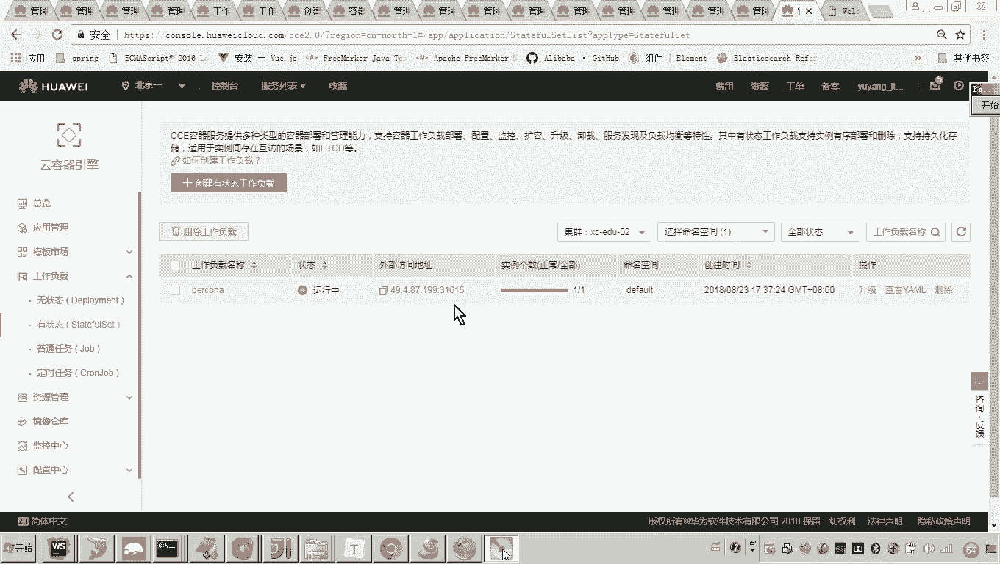

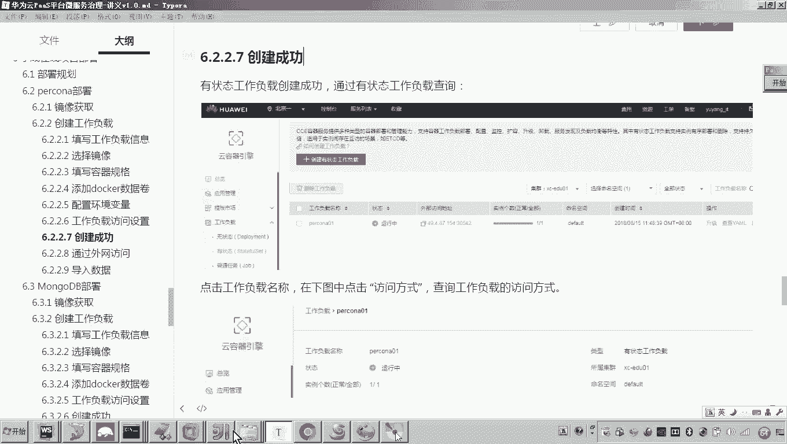

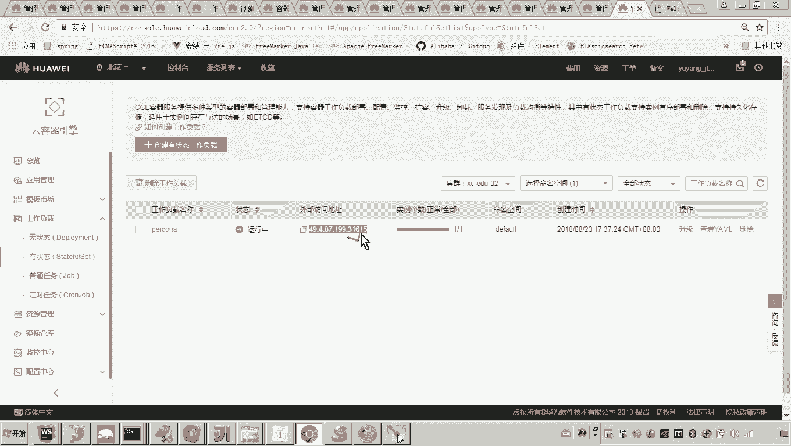

上一节我们介绍了如何创建工作负载并启动MySQL容器。本节中，我们来看看如何从外部网络连接到这个数据库，并向其中导入项目所需的数据。

首先，我们需要查看已创建Pod的公网连接地址。在华为云控制台中，可以找到自动分配的公网IP和映射的端口号。例如，地址可能显示为 `123.45.67.89:31615`。这个端口映射到了容器内部的 `3306` 端口，因此我们可以通过此地址访问数据库。

接下来，我们将使用一个MySQL客户端工具来建立连接。

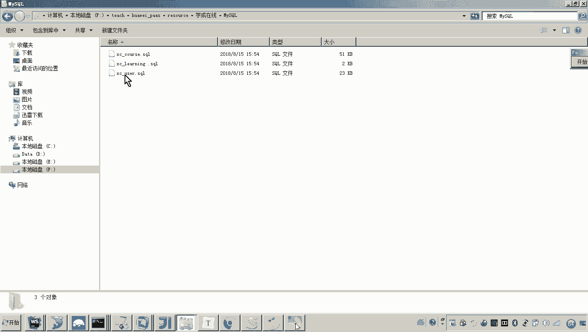

以下是连接数据库的步骤：
1.  打开MySQL客户端工具（如Navicat、MySQL Workbench等）。
2.  创建一个新的数据库连接。
3.  在连接配置中，主机地址填写申请的公网IP（例如 `123.45.67.89`）。
4.  端口填写控制台显示的映射端口（例如 `31615`）。
5.  用户名填写 `root`。
6.  密码填写创建容器时设置的环境变量值，例如 `mysql123`。
7.  点击“测试连接”，确认连接成功后保存并连接。

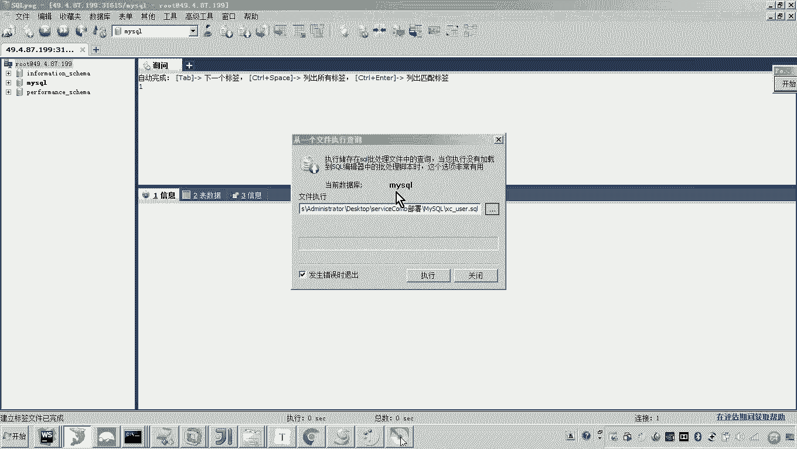

连接成功后，即可通过本地客户端工具访问并管理云平台容器中的MySQL数据库。

## 导入初始化数据

成功连接到数据库后，下一步是将学成在线项目的初始化数据导入。

项目资源文件中提供了一个名为 `mysql` 的目录，其中包含了多个SQL脚本文件，用于创建数据库和表结构。

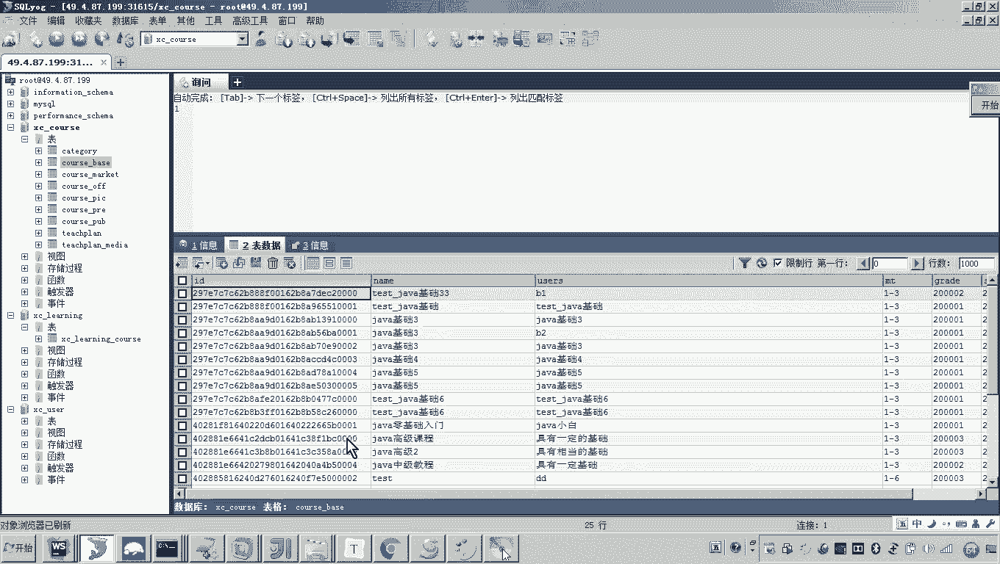

以下是导入SQL脚本的步骤：
1.  在MySQL客户端工具中，找到“执行SQL文件”或类似功能。
2.  浏览并选择项目资源目录下的 `xuecheng-plus/mysql` 文件夹。
3.  依次执行其中的SQL脚本文件，例如：
    *   `xc_course.sql`：创建课程管理相关的数据库和表。
    *   `xc_learning.sql`：创建学习中心相关的数据库和表。
    *   `xc_user.sql`：创建用户管理相关的数据库和表。
4.  每个脚本执行完成后，刷新数据库列表，确认相应的数据库已成功创建。

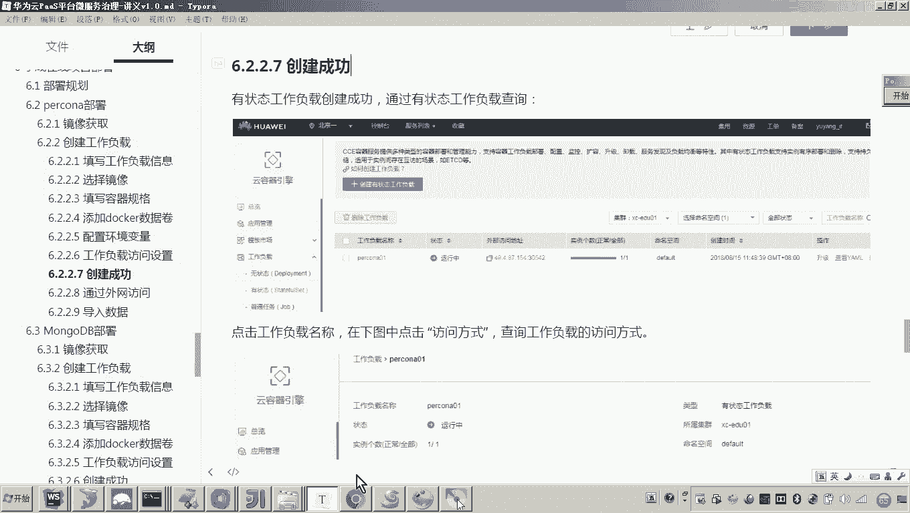

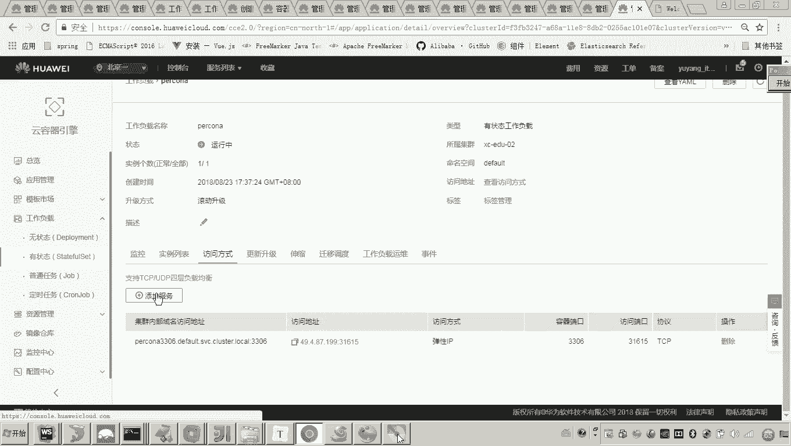

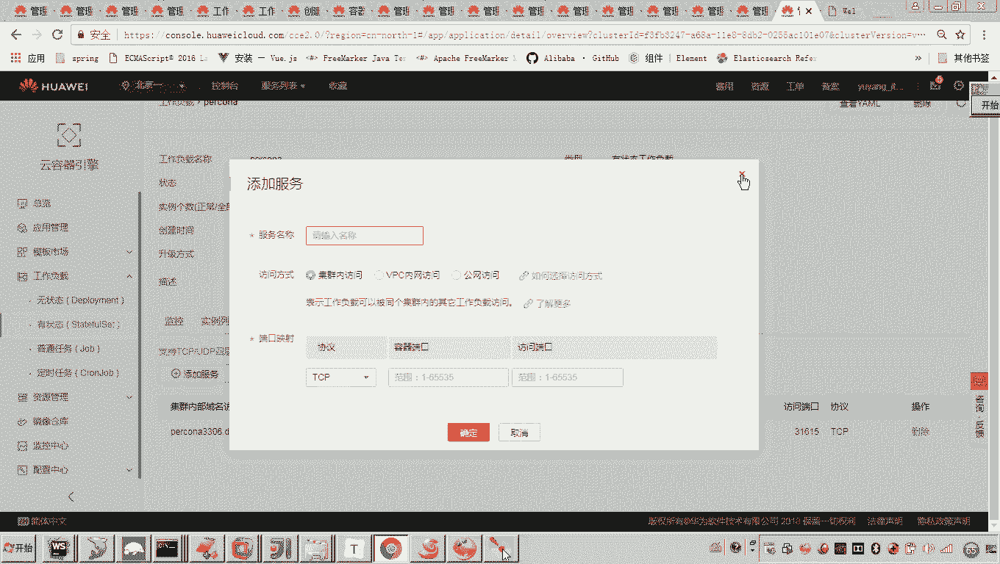

这三个数据库分别对应学成在线项目的不同业务模块，后续在讲解具体业务时会详细说明其表结构。

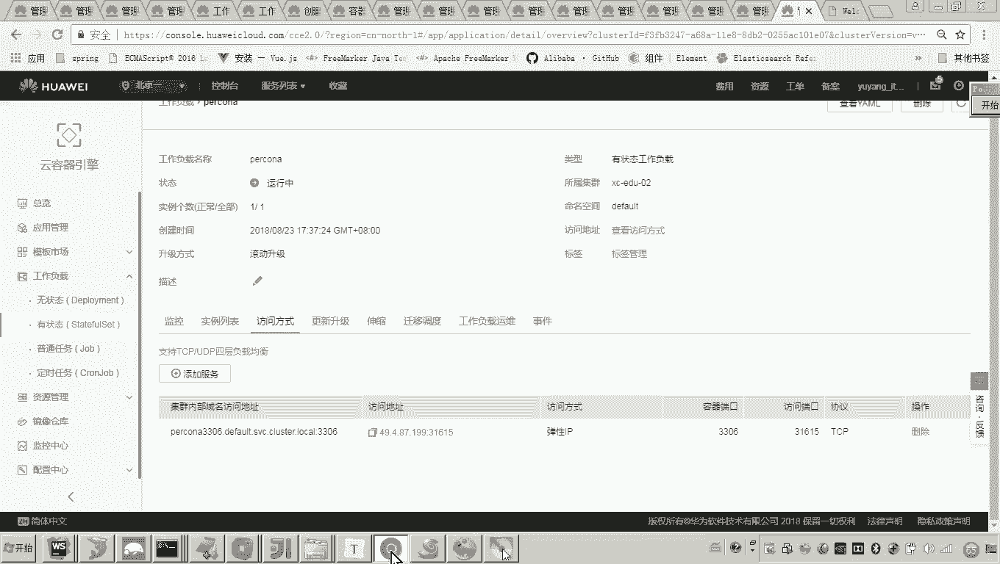

至此，我们已经通过公网地址完成了数据库的初始化和数据导入。若后续需要在集群内部让其他微服务访问此数据库，只需在华为云控制台为该工作负载添加一个“集群内访问”地址即可。其他服务便可使用这个内部地址进行连接。

## 部署流程总结

本节课中我们一起学习了MySQL数据库的完整部署流程。后续其他服务（如MongoDB、Redis等）的部署思路与此基本一致，主要区别在于所使用的镜像和具体配置参数不同。

以下是部署一个有状态服务（如MySQL）的核心步骤总结：
1.  **确定镜像来源**：从Docker Hub等官方镜像仓库获取所需服务的特定版本镜像。
2.  **创建工作负载**：在华为云PaaS平台创建“有状态工作负载”。有状态服务是指运行过程中会产生需要持久化保存的数据的服务。
3.  **配置工作负载**：
    *   填写服务的基本信息（如名称 `mysql`）。
    *   选择上一步确定的容器镜像。
    *   设置容器规格：在满足程序运行的前提下，资源配额应尽可能设置得小一些。
    *   **添加数据卷**：这是关键步骤。需要根据官方镜像的说明，将容器内的数据目录（如MySQL的 `/var/lib/mysql`）挂载到持久化存储卷上，以确保数据不会因容器重启而丢失。
    *   设置必要的环境变量（如数据库密码 `MYSQL_ROOT_PASSWORD`）。
4.  **访问与初始化**：工作负载创建并运行后，通过公网或内网地址连接服务，并执行初始化脚本或导入数据。

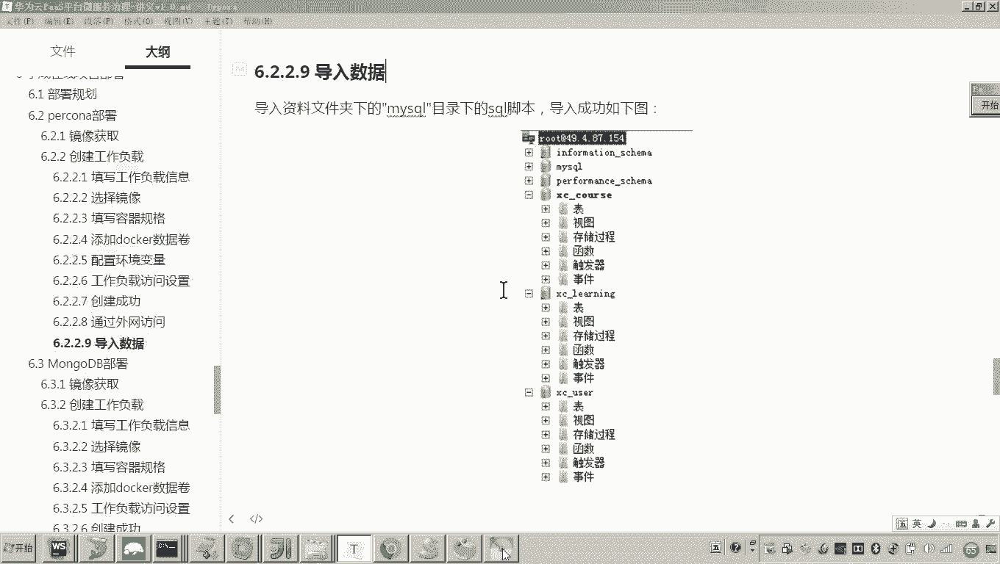

整个流程的核心在于理解有状态服务的特性，并正确配置数据持久化，从而保证服务的可靠性和数据的安全性。