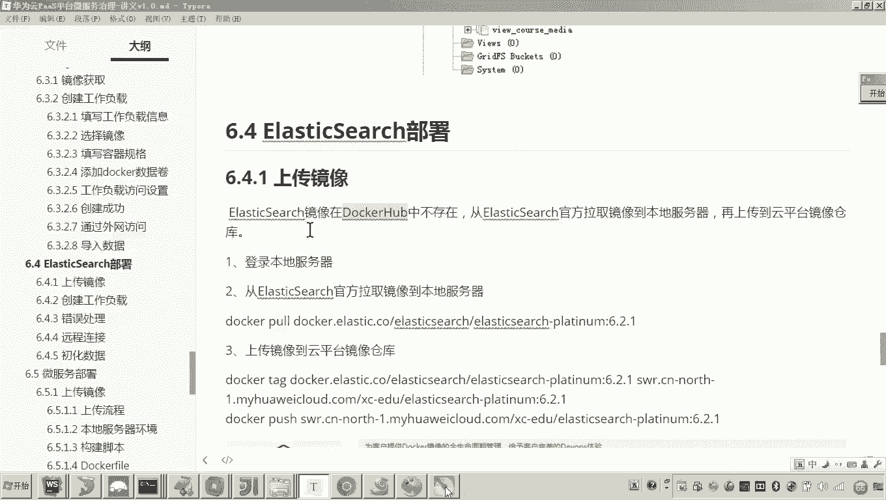
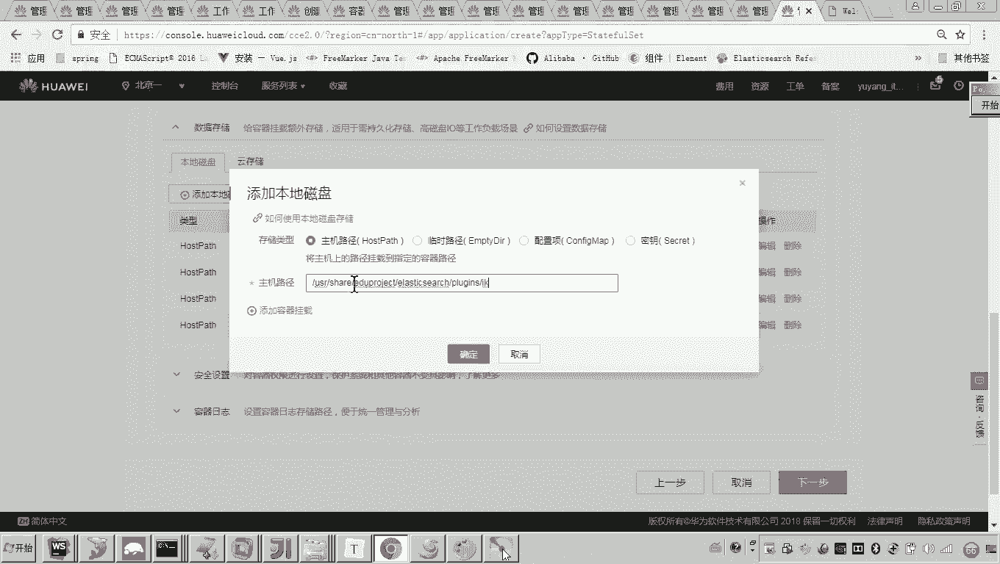

# 华为云PaaS微服务治理技术 - P109：01.学成在线项目部署-elasticsearch-创建工作负载 - 开源之家 - BV1wm4y1M7m5

好，那么接下来呢我们呃来部署。elastic search。好，那来打开我们的部署规划。这里我们来看一下啊。呃，那么到目前为止呢，我们这个my circlecle呢部署完了哎，mongo dB部署完了。

那接下来是不是就该服务层了，而在服务层当中注意呃这这几个都是这四个都是我们自己开发的微服务，对吧？而只有这个什么elastic search啊，是哎一个现成的呃全文检索的这个服务。😊。

所以我们先部署这个electtic search啊，然后我们再部署我们自己开发的这四个微服务。好。那么呃大家来看啊，那这个以来这个 search的它的这个镜像我们怎么获取呢？对。

那它在这个docker官方啊，它在docker hub当中有吗？啊，它是没有的。😊，呃，那这里边我说明一下这个学生在线所使用的electtic search呢是一个比较新的版本啊，叫啊6。2。

1啊这个版本。😊，好了，那在这个docker hub里边没有，那怎么办呢？😊，那肯定是需要我们去上传自己私有的这个镜像了。

对吧好，那怎么做呢？呃，首先呢你登录你的这个服务器啊，这是我本地的一个服务器，对吧？然后然后呢这个这个eastic search的这个镜像呢呃在刀口官方没有，其实在哪里有啊？

在这个呃elastic的这个什么呀，官网它是提供的。所以你从这个ellectastic search的它的这个官网啊，你把这个镜像呢先铺到你的什么你的本地服务器。😊。

哎，然后呃你再把这个镜像呢 pushush到云平台，就这样一个过程。所以这个过程呢这个过程呢呃我我这里边就不给大家演示了啊，你就怎么弄啊，你就按照我这里边的这个步骤啊，首先登录服务器。

然后再运行这个啊指令。嗯，然后呢再把这个你这个铺ll到本地的这个镜像呢，打一个这个什么tag，然后呢修改它的组织名，好，这个组织名这里边一定注意。

我讲一上这个组织名一定要根据你的自己的这个组织名称去改啊。好，然后呢再push啊，pushpush之前一定记得怎么弄啊。我是不是教过大家呀？😊，push之前一定是要。在你这个什么呀。

在你这个本地服务器上边去执行这个docker login的指令。

还有印象吧。哎，好了，嗯，那现在呢我我们来看这里边呢呃我们就把这个镜像呢，现在我们就呃上传到什么呀云平台了嗯。😊，按照这个过程呢，我们就把这个镜像呢上传到这个云平台了那上传到哪里呢？呃，我来看一下。

我给你找一下啊。哎，对，这个就是我把本地服务器的这个镜像上传到云平台的这个ellectastic search。好。😊，那那这个镜像我们弄好了之后，接下来做什么呢？就这个镜像来源。

我们就按照刚才我所说的啊，哎，你你把它干嘛上传到这个先先从这个elect设官网拉取到你的本地服务器，然后再上传到云平台。然后弄完了之后呢，现在我们就开始创建工作负载了。好，那现在呢我们又回到这个什么呀。

这个创建工作负载的这个界面来了。😊，那这个以来这个 search是无状态还是有状态的呢？😡，对。你说老师这个你你说啥就啥，对吧？你说是有状态就有状态，不是啊，以来这个search各位他在搜索的时候。

他在搜索之前是不是先要创建索引。也就是说他这个数据啊，它这个数据啊是要有持久化的对他在运行的过程当中，当外界给他提交索引数据，他就要把这个数据持久化到他的什么本地。

所以嗯我们要创建一个有状态的工作负载点击哎，然后呢，这里边我们输入什么？ search嗯。😊，好，那这样的话我们就。来准备创建嗯，这里边实例选择一个开启可以吧。然后呢，下一步。😊，那这个容器呢。

刚才咱们是不是已经说过了，准备从我的这个镜像当中来拿，对吧？😊，啊，eastic啊就选择它。😊，好，然后这个这个这个这个名称我们也改一下吧，叫Listic search。😊，好。

那这个CPU这个这个配置呢这个配置呢？😮，好，那这个配置呢各位我们来参考一下这个配置的话，我们呃建议你的这个CPU啊还是这个0。25核，然后和这个一。然后呢，这个内存呢。

我就建议你刚开始呢就给它1024。嗯，然后呢最大内存是2048。😊，因为这个lect search啊，它在做搜索的时候啊，它会呃缓存一些数据啊，所以说它还是对对这个内存的要求有有一点高的。

所以我们把这个呃最小的这个申请的这个内存呢就标记成1024啊。好，然后接下来要做什么事呢？接下来就是要看看有没有数据存储啊，有没有环境变量对吧？啊，好了，那这个数据存储这一块嗯，怎么弄啊？

这个数据存储这块是不是就是要去找我们的这个这个挂载的这个呃目录的路径了，对吧？好，这个路径呢注意啊，学习过ES的这个同学哎，就是lect search呢，我简称为ES了啊，学习过ES的同学，大家知道嗯。

其实在我的这个什么我的本地啊，其实就有一个呃ES嗯，就有一个ES大家可以看到我这里这个本地这个windows的版本啊，但是呃这个目录结构和这个linux的版本差不多。然后这里边大家可以看到这个。😊。

是不是就存放的我们说的这个呃这个索引数据啊，节点里面的这些索引数据，对吧？这些都是索引数据。好，然后这个confire呢，其实这里边是不是就是配置文件呀？哎啊然后还有它还有一个插件目录，哎。

插件目录里面我们用的是IK分词器啊。嗯，好，那现在呢各位。😊，注意我我插一句嘴啊，就是说学过ES的同学，刚才呀我说这些东西，你大概都能回忆到没学过的同学感觉听着时候啊，这个没学过ES算了。

我是不是要赶紧回过头来学ES了，你你先不要着急，就是你你听的懂过程当中啊，我针对你没有学过的，我在我为什么解释解释这个目录结构，我就是针对你没有学过的同学来解释的。所以你要仔细听我讲啊。

对你不要一听到某一个点，我没讲过啊，你没听过啊，你说那是不是要回我要不学了，回过头再学这个点了啊，不是这种学习思路，所以你一定要听我把课讲完，然后呢，你再有目标去学习补充其他知识。好了好。

那么我们来看继续啊继续。😊，那么我先介绍一下这个目录结构啊，在这个里头，这是配置文件啊，这是配置文件。在这个这是数据，这是数据，这就是它持久化的这个数据的目录。还有就是他这个这是它的插件啊。

还有就是它的这个这是什么呀？这是日志，对吧？日志好，那现在呢我们来看啊呃，我准备怎么做呢？😊，对我准备啊我为了将来我改配置文件方法方方便啊，我不想登到这个容器当中去改它的配置文件。

我肯定要把配置文件呢也映射到我的数主机，就是我的这个云服务器上面，所以唉我准备把这个配置文件也做一个映射，什么意思呢？就是后边这个路径，我之前都强调了。

这是ES嗯所这个特定好的哎固定好的一个这个配置文件的路径，就是这个容器里边的这个固定的路径，而这个容器里边这个这个这个呃文件的这个路径啊，是不是和我现在这个外边的这个数主机上面这个路径对应的？没错吧。

所以将来我需要我只要登到我的云服务器是不是很方便就能修的修改这个文件了。那我那我修改完这个文件是不是就相当于修改的容器里边的这个配置文件了。所以说这是不是就我改起来就相当简单，对吧？对。

所以哎我现在要把它映射一下。那。😊，其实也一样，后边也是个配置文件，所以我要把这个也映射一下。那这个就不用说了，这是什么，这是不是就是持久化的这个数据的这个索引目录啊。我将来为了备份数据方面。

我也对它进行映射，对吧？包括这个插件，这个IK分值器也有很多配置文件。所以我我把整个IK分值器，这个目录也映射一下。好了，现在我就解释完了。那现在我就按照这个过程呢，我就开始干嘛复制粘贴了啊，看好复制。

😊，嗯，然后找到这个呃数据存储这一块添加磁盘。对，然后点击添加容器挂载挂载到哪儿呢？哎，挂载到这个哎，复制的慢一点啊来。😊，好，然后复制千万不要扫一个点儿，扫一个字母啊，你这个路径就错了。嗯，好。

点击干嘛呀，确定。😊，好，然后继续。哎，继续，然后把它复制一下。

好，挂在容器。负子账。其实是什么呢？其实就是说呃，你的这个云服务器这个数主机啊，这个目录如果不存在，它是会自动创建的啊，就什么呀？就就这些目录嘛，这是不是数主机上的目录，对吧哎？😊，好。

然后再来复制添加。然后再继续。嗯。然后我们把这几个哎这个路径呢，我们都一个一个的哎全添加上去。

复制进去。

啊，有人有人如果你你在看视频，我现在又提醒一句，有人说老师，我在我觉得这个复制我是不是可以快进了，对吧？哎，我建议你听完，我在你我建议你仔细听，为啥呢？哈，因为一会儿你就知道了。

我们我还要做一些其他的工作。嗯，注意听。好，现在呢我我是不是就把这个四个映射的这个数据，我就添加完了吧。好，那现在各位我们添加完成之后呢，那接下来我就可以怎么弄啊？😊，啊，我我是不是就可以下一步了？😡。

啊，有时说老师，那你这个环境变量不创建了吗？哎，这个这个这个这个环境变量我暂时先不创建，因为也不需要。哎，你说这个讲义里边这一堆写的是啥？一会儿我就告诉你了啊，现在我先把这个什么。

我先把这个哎这个这个这个工作负载创建成功。嗯，然后这个服务间发发现啊这个定义这还是有状态的，需要定一个端口嘛。哎elastic search名字就叫它，然后呢哎这个它的端口是9200。嗯，好，9200。

😊，然后添加服务。啊，我添加一个什么服务呀？我添加一个外网可以访问的。😊，这叫9。200。弹讯完毕。9200。后边这个外网的这个端口还让它自动生成。到这儿，我是不是就下一步，然后创建各位。😊。

这个是不是就开始干嘛呀，是不是就开始开始来启动了，对不对？好，注意啊，我现在给你提个醒哎，这个以来这个侧选，它的部署可不像我们说的这个哎prork和这个mgod部署那么简单。

啊后这里边呢我们说它就会存在一些问题了。😊，哎，其实仔细的同学哎，学过这个用过这个刀cker的同学，其实这儿都应该发现有问题了。为什么呢？因为我问你个问题，我的数主机上有这个目录吗？😡，有人说没有。

你不是说会自动创建吗？但是我问你有这个什么，有这个配置文件吗？😡，这他总不能给我造一个配置文件了。😡，对不对？所以所以你现在要做一件事儿，什么事儿呢？你登到我们的这个云服务器上，你来看一看这个目录下。

现在有内容没有。因为我告诉你了嘛，只要这个容器启动，它就会自动的来创建这个目录。😡。

对不对？那你现在就进去看看。😡，各位看到了吗？他是不是自是自动创建了，但是它自动创建完成之后，它却有问题。你知道为啥吗？各位这个它是个文件吗？它不是个文件的，什么意思？他给我默认当成一个目录创建了。

对你现在要做一件事儿是什么呢？你要把这个配置文件给它配上。😡。

懂我的意思了吗？就这个配置文件你需要配。😡，啊，这个平台他不会帮你配，他也不会帮你自动生成。他目录没有会帮你自动创建，但配置文件你得你得搞到手，懂吗？😡，那有时老师配置文件咋配呢？😡。

这配置文件其实在这里头是不是都有这个配置文件，对吧？所以各位在我给你提供的什么呀？提供的学生在线的那个目录当中，其实都有了这些配置文件了。哎，我们找到嗯找到里边是不是有一个叫ES啊。

里面是不是有你看看配置文件有吧？哎，那现在我们是不是要做一件事儿，就是把这个配置文件给它配上。😊，没错吧，把这个配置文件配上，并且我们还要做一件事是什么呢？对我们启动看有错没错。如果有错了。

各位我是不是要解决错误了，对吧？对，好，所以我这个课讲到这儿呢就是这个工作负载，该创建的过程呢，我都创建完成了。后边我要做的事儿就是要对这个配置文件进行配置啊，还有排错。嗯，好。

我们现在这一块呢这一段呢我们先到这里。OK。😊。

