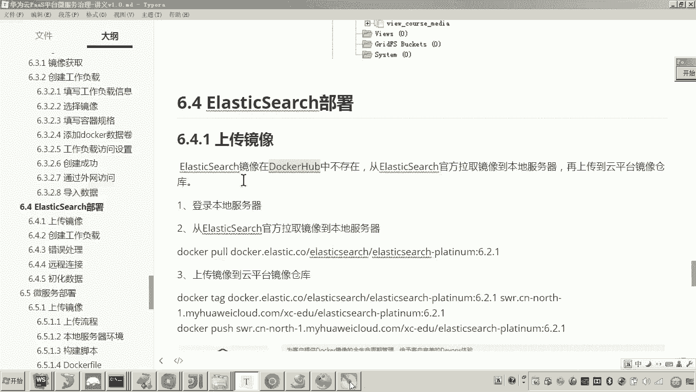
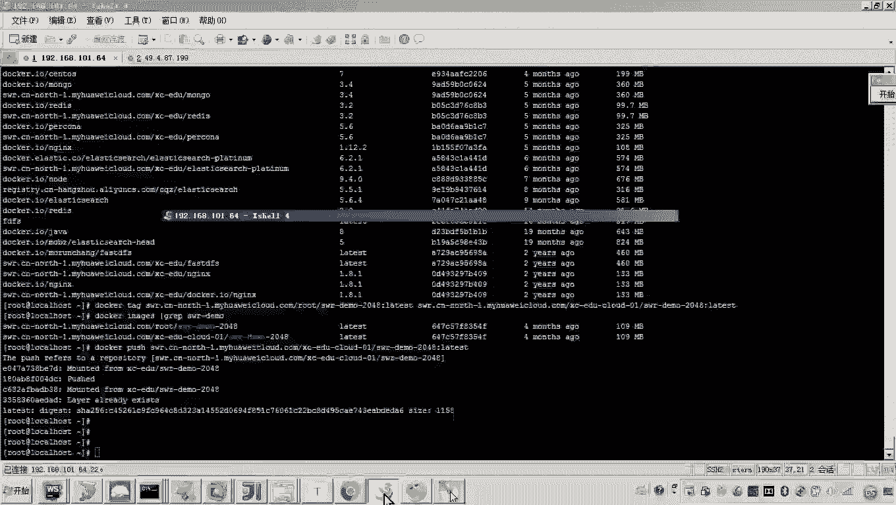
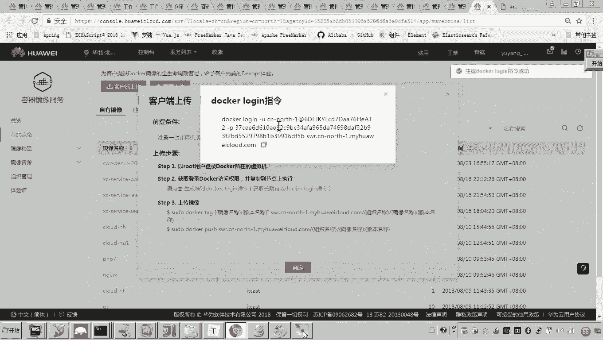
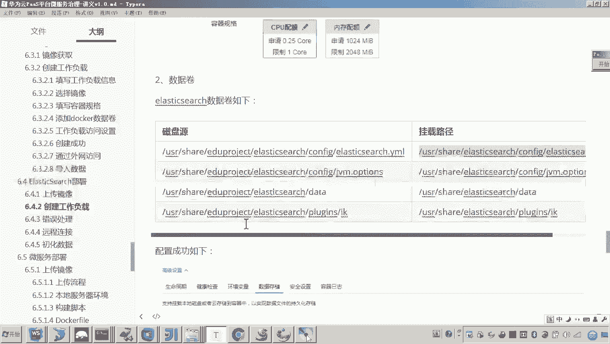
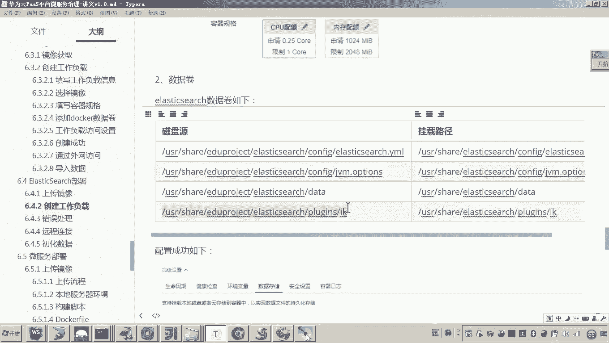
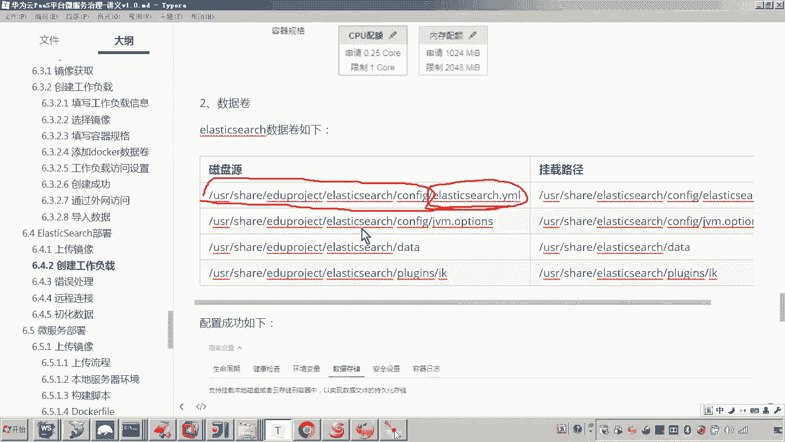
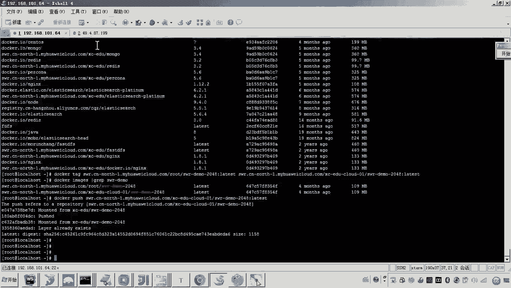
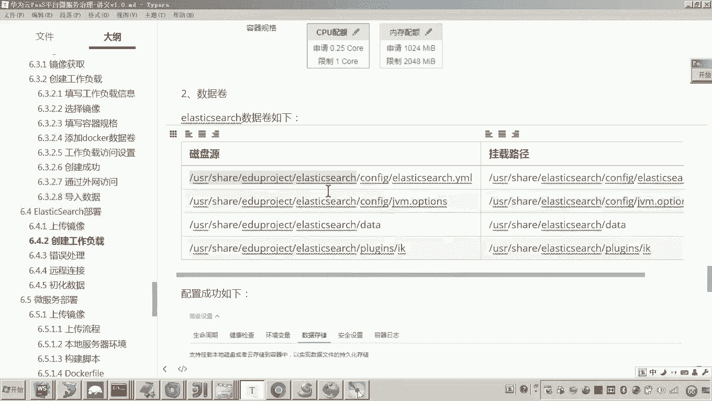
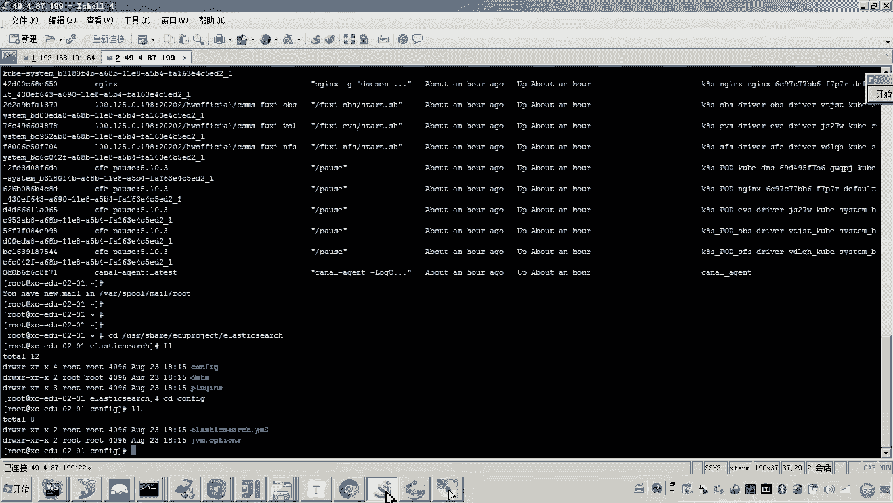
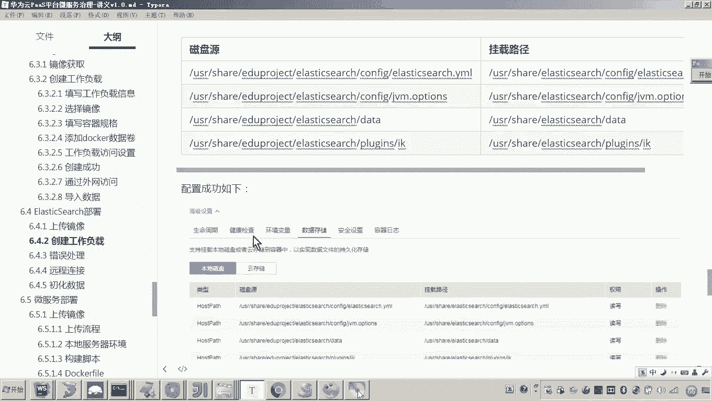

# 华为云PaaS微服务治理技术 - P109：01.学成在线项目部署-elasticsearch-创建工作负载

在本节课中，我们将学习如何在华为云PaaS平台上为“学成在线”项目部署Elasticsearch服务。我们将从镜像准备开始，逐步完成一个有状态工作负载的创建，并配置必要的数据存储映射。

## 概述

在之前的课程中，我们已经完成了MySQL和MongoDB的部署。接下来，我们将进入服务层的部署。服务层包含我们自己开发的微服务和一个现成的全文检索服务——Elasticsearch。本节课，我们将首先部署Elasticsearch。

## 获取Elasticsearch镜像

Elasticsearch的镜像需要从官方渠道获取并上传至私有镜像仓库。

以下是获取和上传镜像的步骤：

1.  **登录本地服务器**：首先，登录到你用于操作的本地服务器。
2.  **拉取官方镜像**：从Elasticsearch官网拉取指定版本（例如6.2.1）的镜像到本地服务器。
3.  **标记镜像**：为拉取到本地的镜像打上标签，并修改其组织名称为你自己的私有仓库组织名。
4.  **登录云平台镜像仓库**：在本地服务器上执行 `docker login` 指令，登录到华为云平台的镜像仓库。
5.  **推送镜像**：将标记好的镜像推送到云平台的私有镜像仓库中。

完成以上步骤后，我们便拥有了可用于部署的Elasticsearch私有镜像。

## 创建工作负载

Elasticsearch在运行过程中需要持久化索引数据，因此我们应创建一个**有状态的工作负载**。

### 1. 基础配置

在创建工作负载界面，选择创建“有状态”负载。
*   **名称**：输入 `elasticsearch`。
*   **实例数**：设置为1。
*   **容器镜像**：选择我们刚刚上传到私有仓库的Elasticsearch镜像。
*   **容器名称**：命名为 `elasticsearch`。

### 2. 资源配置

Elasticsearch在进行搜索时会缓存数据，对内存有一定要求。建议按以下配置进行资源分配：
*   **CPU**：申请0.25核。
*   **内存**：申请1024 MiB，限制2048 MiB。

### 3. 数据存储配置

为了便于管理配置文件、备份数据以及安装插件，我们需要将容器内的几个关键目录挂载到云服务器的持久化存储上。

以下是需要挂载的目录及其作用：

*   **`/usr/share/elasticsearch/config`**：Elasticsearch的配置文件目录。
*   **`/usr/share/elasticsearch/data`**：索引数据的持久化存储目录。
*   **`/usr/share/elasticsearch/plugins`**：插件安装目录（例如IK分词器）。
*   **`/usr/share/elasticsearch/logs`**：日志文件目录。

在“数据存储”部分，通过“添加磁盘”和“添加容器挂载”功能，将上述容器路径挂载到云服务器的相应路径。云平台会自动在服务器上创建这些挂载目录。

### 4. 服务配置

Elasticsearch默认使用9200端口提供HTTP服务。
*   在“服务设置”部分，添加一个服务。
*   **服务名称**：`elasticsearch`。
*   **容器端口**：`9200`。
*   **访问类型**：选择“公网访问”，端口号可由平台自动生成。

完成以上配置后，点击“创建”即可启动Elasticsearch工作负载。

## 配置文件与排错说明

工作负载创建后，容器会启动并自动在云服务器上创建挂载目录。**但是，平台不会自动生成容器内的配置文件**。

此时，你需要手动将正确的配置文件（如 `elasticsearch.yml`, `jvm.options` 等）从项目资源中复制到云服务器对应的挂载目录下（例如 `/usr/share/elasticsearch/config`）。

如果启动过程中出现错误，你需要根据日志进行排错。常见的配置问题包括内存参数、网络绑定地址等设置不正确。

## 总结

本节课中，我们一起学习了部署Elasticsearch的完整流程：
1.  从官方获取镜像并上传至私有仓库。
2.  在华为云PaaS平台创建了一个有状态的Elasticsearch工作负载。
3.  配置了CPU、内存资源。
4.  映射了配置文件、数据、插件和日志目录以实现持久化。
5.  设置了公网访问服务。
6.  强调了后续需要手动配置配置文件和进行启动排错。

下一节，我们将开始部署我们自己开发的微服务。