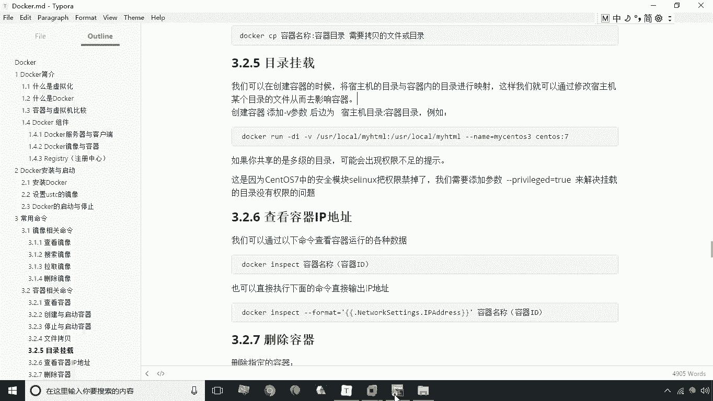
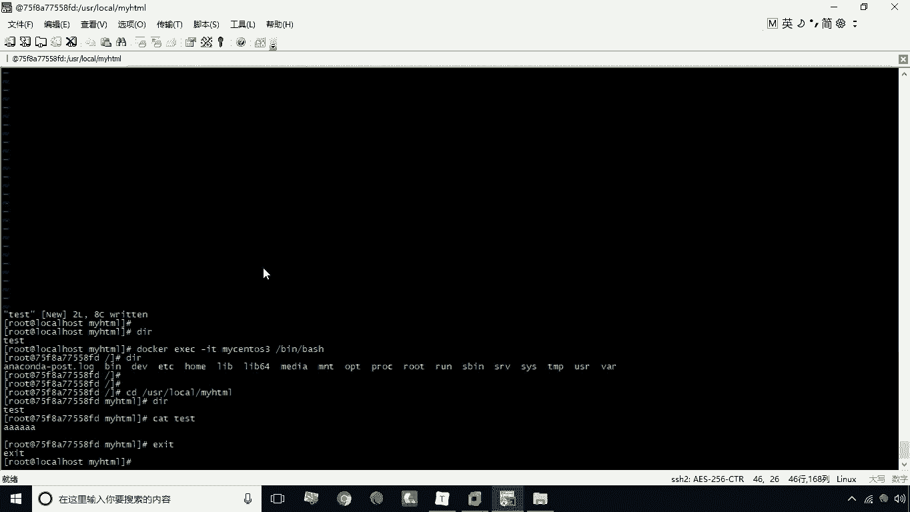
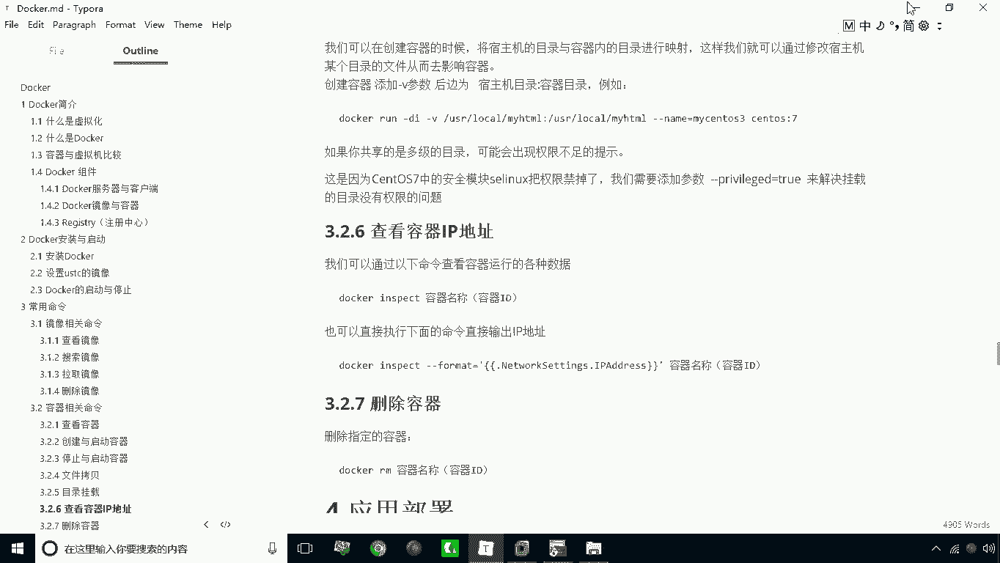
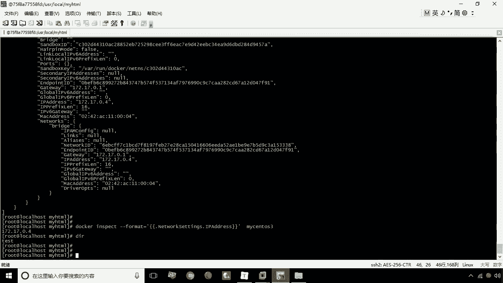
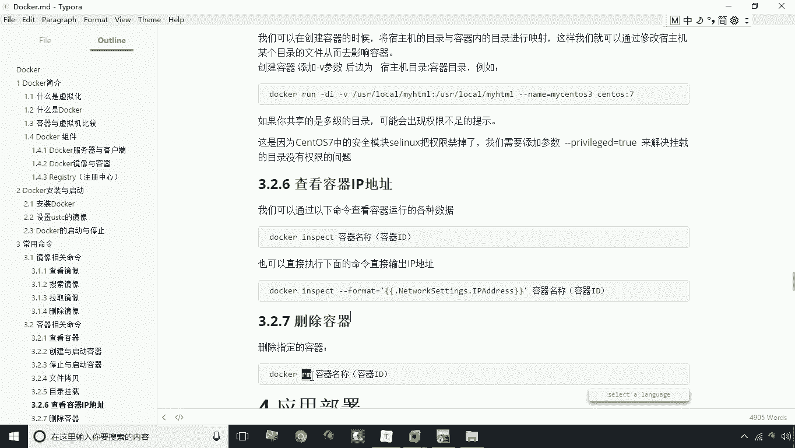
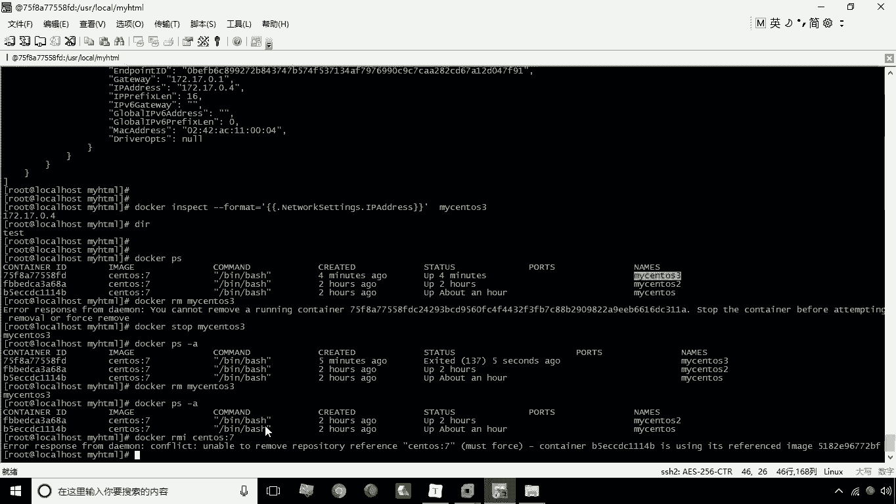
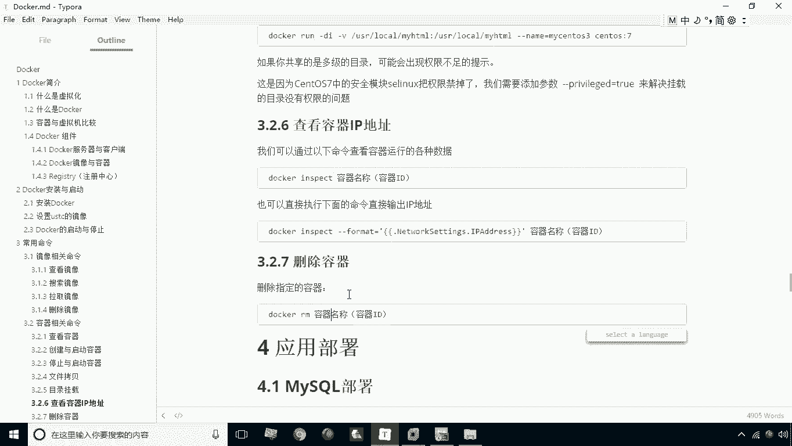

# 华为云PaaS微服务治理技术 - P10：10.目录挂载查看IP与删除容器 - 开源之家 - BV1wm4y1M7m5

好刚才我们也讲解了一个叫CP的命令啊，这个CP的命令是可以将我们速度机的某一个，文件或目录啊拷贝到容器内部，也就是在容器内部形成的一个副本呃，也可以从容器内部将某一个文件或目录，拷贝到SP机上。

那么这样一来呢，我们就可以实现这种文件的这种交换，那么当然这种方式呢，其实有的时候并不是特别方便，因为我们还得需要去执行一个拷贝命令，才能做到这两个目录的内容进行同步，对不对。

那么假如我们希望是对某一个文容器内部，更方便地进行管理，那这时候呢，我们就可以通过目录挂载的方式来进行了，那么目录挂载这个方式，也就是说在创建容器的时候加一个杠V参数，杠V参数后面呢就指定宿主机的目录。

冒号容器目录，这样一来呢，宿主机的目录和容器的目录，就可以形成一个映射关系，那么做完这个操作之后，我们可以达到什么样的效果呢，就是可以通过啊去修改宿主机的目录，就可以影响到容器目录的内容。

当然你通过去修改容器内部，那目录内容呢也可以去修改速主机的目录内容，因为他们两个目录本来就是处于同一个位置，处于同一个位置好了，我们现在呢就给大家演示一下这个目录的挂载。

目录挂载，我们这里首先给大家看一下，当前我们有两个容器，那接下来我们再创建一个杠DI杠杠杠，杠name等于买STOS3，然后呢杠V杠V，然后接下来就是usr logo下的买HTML冒号。

local下的买卖HTML，然后紧接着呢就是我们的容器渗透啊，那个镜像加上标签三个S冒号三好，我们现在回撤回来之后呢，这个容器我们看一下就创建成功了，创建成功之后，那接下来我们就可以试验一下。

到底能不能去影响到这个容器内部的目录呢，唉我们现在就可以进到这个usr local，下载满HTML目录，大家看一下当前的目录是空的是吧，当前目录是空的，那么好，我们现在呢来创建这么一个文件啊。

创建一个文件vi test啊，我们随便创建一个文件啊，那这时候呢比如说我们输入AAAOK吧，随便写，然后呢，我保存，当前呢就有这么一个test的这么一个文件了，好了，有人文件之后，我们来验证一下吧。

docker什么呢，ESECGIT杠IT，然后呢接下来就是你的容器名称，买STOS3，接下来GBGBH好，进到容器内部呢，之后呢，我们现在进到我们的这个目录下买HTML。

这时候你会发现这个里头也有一个TT，这么一个文件啊，我们现在可以查看一下这个文件内容，是不是和我们刚才所说的内容是一样的，对吧，唉好我们退出来，这就是说我们的一个目录挂载啊。

就会很方便了，就很方便了啊，通常来说呢，我们会将这个你安装的这个容器里的，某一个文件，某一个特别是配置文件啊，进行一个挂载，这样一来呢我们修改文件起来就比较方便一些，那么接下来我们来看一下。

下面我们要讲的就是查看容器的IP地址，那么学会查看容器IP是个比较常用的操作，首先我们来学习一个命令叫expect，这个inspect呢它不仅可以查看容器IP，它可以查看容器相关的所有数据。

我们来给大家演示一下这个命令docker inspect。

然后接下来买CTOS3啊，这是刚才我们创建的，大家可以看一下，这个里头会包括很多很多的信息对吧，会包括很多很多信息，包括什么他的ID呀，还有创建的时间呐啊等等这些很多信息，那么其中它的IP地址在哪呢。

在这儿有一个net work settings下有一个什么呢，有一个IP address，这个部分就是它的IP地址啊，就是它的IP地址，那么那里说啊，那假如说我就只想显示IP怎么办呢。

哎这时候我们可以通过加上一个格式化format，这么一个参数来提取，你只是只是提取你所需要的这个信息怎么办呢，这时候还是这条命令，但是这时候要注意讲参数，杠杠什么呢，From mar。

等于引号一对大括号啊，注意大括号是两层的啊，是嵌套的，那紧接着我加个点点之后呢，是什么呢，就是network settings再点，然后呢就是IP address，这样一来呢。

我们就可以通过这种方式来逐层的去筛选，我们啊所需要的信息了，那也说这里的内容呢，就是要指定你要得到这个信息的，这个路径是什么，好我们现在回车，这时候大家发现现在我显示的是不是。

就是这个只把IP就显出来了，那么同理，其他的信息呢，也可以通过这个指定这个仿冒的这个参数，来去提取你所需要的信息啊，当然说提取IP地址是一个最方，最常用的一个操作，那么接下来呢我们再看再看。

下面我们要学习的，其实就是一个删除容器的这么一个操作，删除容器我们用的是什么呢，用的是RM这个命令。

咱们现在给大家演示一下，比如说我现在啊要删除这个MYSTOS3，这个容器，那就行，My sto s3，这个时候大家会发现啊，他这个时候他会有这么一个提示啊，那么这个提示是啥意思呢。

就是说你这个容器呢现在正在运行，它是无法移除一个正在运行的一个容器的，所以说呢你这里头要你要选想去移除这个容器，你首先你要怎么办，对先把它停掉啊，docker stop买渗透S3，先把它停掉之后呢。

我们再去这个这个这个才能移除掉这个容器，好，那么把它停止之后，我们现在来看一下P杠A，这时候我会发现这个容器已经停止了对吧，停了之后呢，我们再次的来进行移除，这时候呢我们来看。

这时候就能把这个容器就移除了啊，那么我们说到这儿的时候呢，再额外说一句，咱们在啊上一个环节，不是讲过一个镜像相关操作命令，而镜像的操作命令是什么，有一个删除叫RMI，这个是删除镜像，而RM是什么呢。

是移除容器啊，一个是对容器操作，一个是对镜像操作，那么我们在这里额外说一句啊，就是如果说这个当前的镜像有运行中的容器，比如说这个渗透S啊，有运行中的容器，你是无法删除的。

你比如说我现在要删除渗透S冒号七，这个镜像的话，我们来看一下，现在呢也是要提示有一个提示是什么呢，就是当前你这个镜像是有运行中的容器的，那这种墙也是不允许删除的，那么什么样的情况下能删呢。

就是需要把当前的你的所有的容器停止或删除，然后呢你这个镜像才能进行移除啊。

这就是关于我们说的啊，关于啊这个挂目录挂载，查看容器IP以及删除容器啊。

