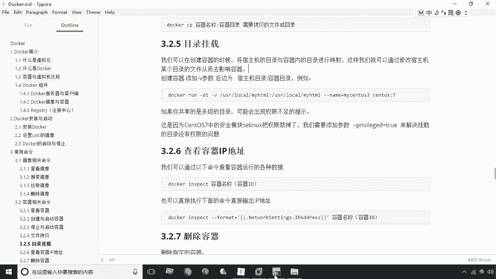
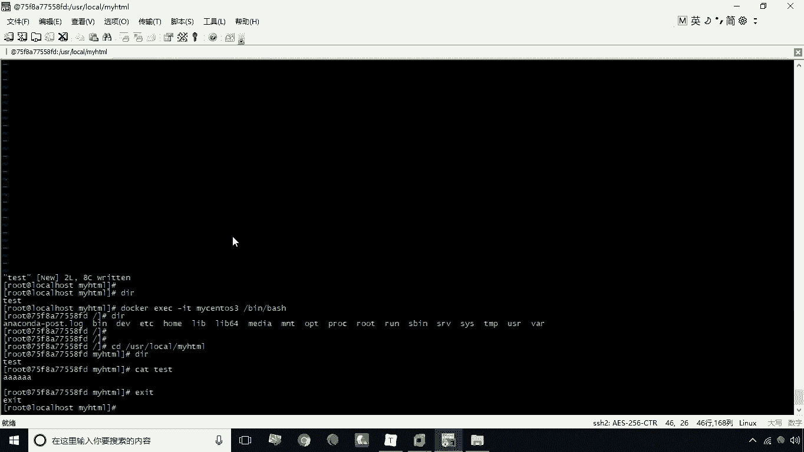
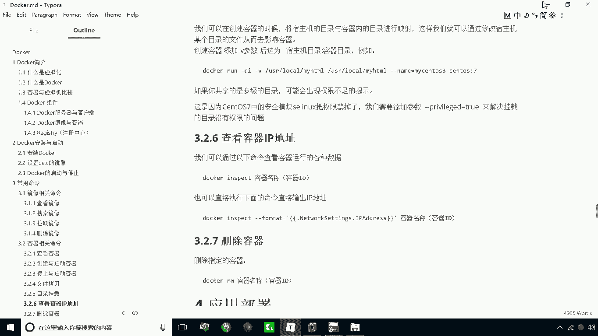
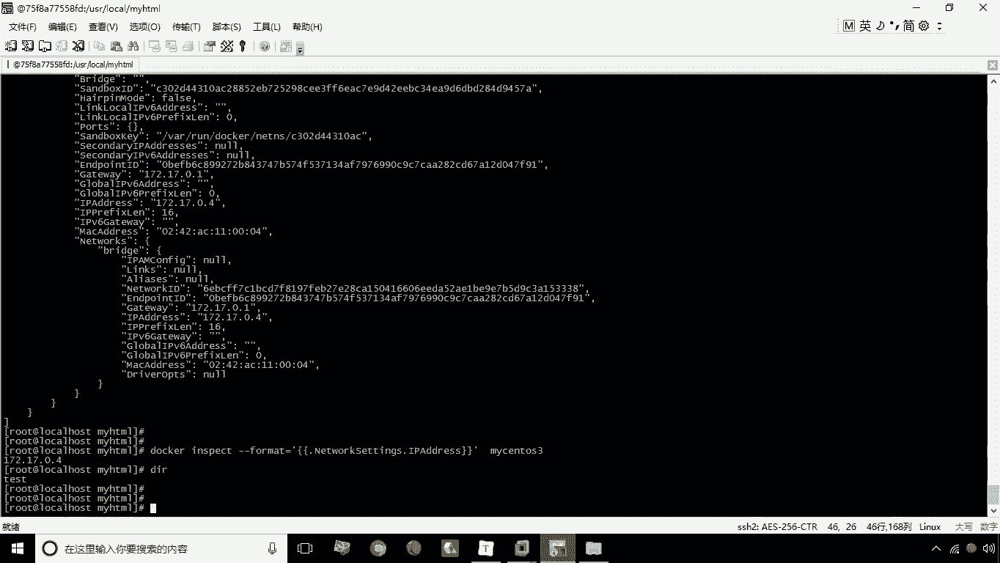
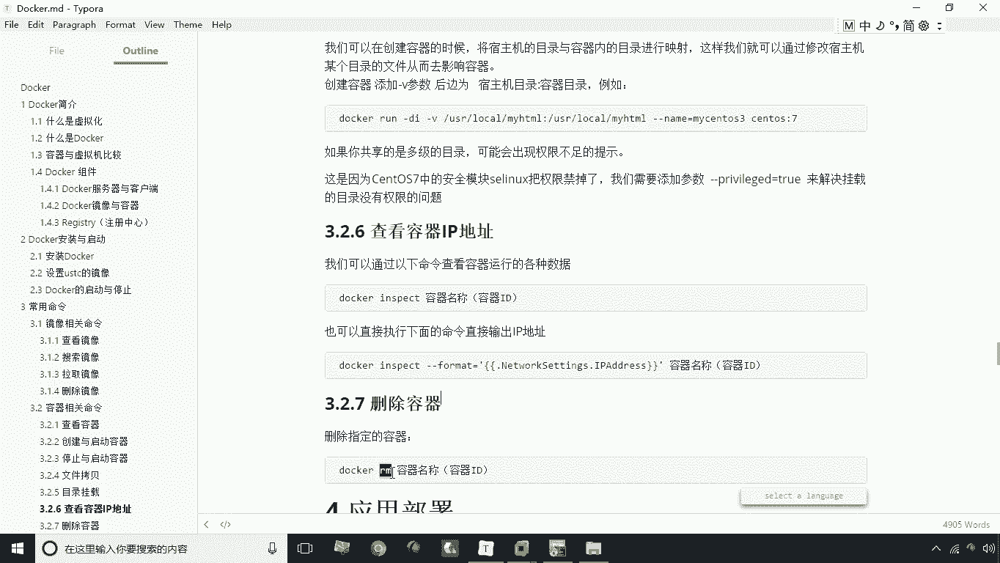
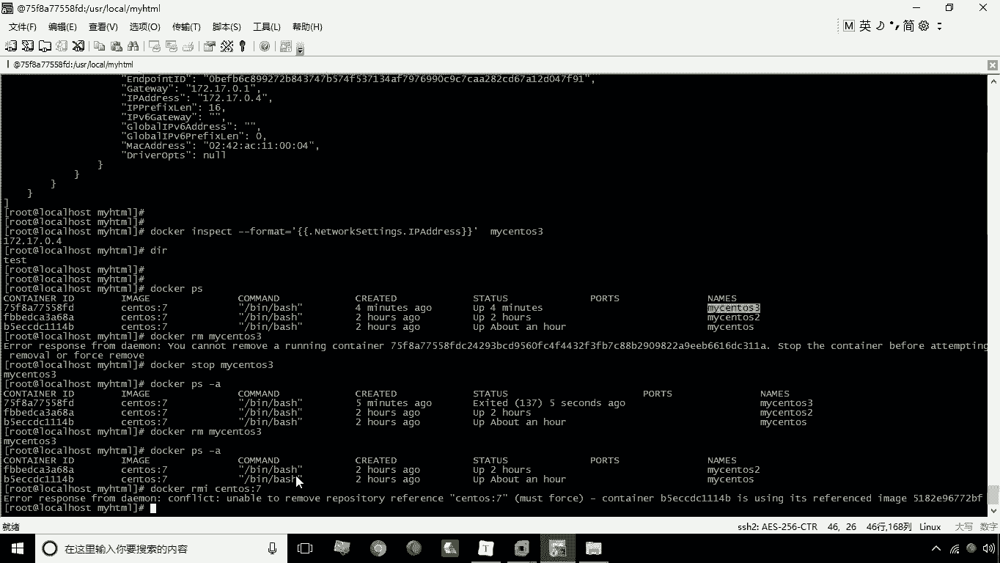
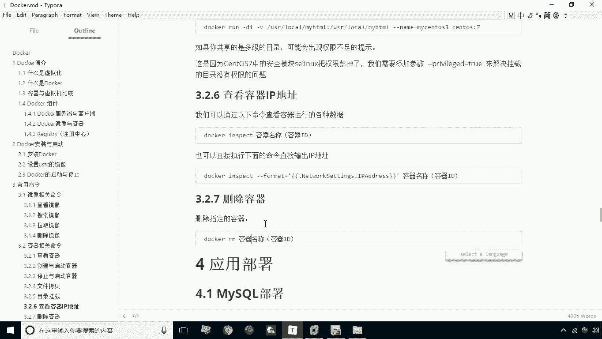

# 华为云PaaS微服务治理技术：P10：目录挂载、查看IP与删除容器 🐳

在本节课中，我们将要学习Docker容器管理的三个核心操作：如何通过目录挂载实现宿主机与容器间的文件同步、如何查看容器的IP地址，以及如何安全地删除容器。这些技能是日常使用Docker进行应用部署和调试的基础。

## 目录挂载

上一节我们介绍了使用 `cp` 命令在宿主机和容器间拷贝文件。这种方式有时并不方便，因为每次文件变更都需要手动执行拷贝命令。



本节中我们来看看一种更便捷的文件管理方式：目录挂载。通过在创建容器时使用 `-v` 参数，可以将宿主机的目录与容器内的目录进行映射。其基本语法是一个**公式**：

```
docker run -v <宿主机目录>:<容器目录> ...
```

建立映射后，修改宿主机目录的内容会直接影响容器内的对应目录，反之亦然，因为它们指向了同一个存储位置。

以下是创建并验证目录挂载的步骤：

1.  首先，我们创建一个带有目录挂载的新容器。命令如下：
    ```bash
    docker run -di --name=mycentos3 -v /usr/local/myhtml:/usr/local/myhtml centos:7
    ```
    这条命令创建了一个名为 `mycentos3` 的容器，并将宿主机的 `/usr/local/myhtml` 目录挂载到容器内的相同路径。



2.  进入宿主机的挂载目录 `/usr/local/myhtml`，创建一个测试文件。
    ```bash
    vi test.txt
    ```
    在文件中输入任意内容（例如“AAA”）并保存。

3.  进入容器内部，验证文件是否同步。
    ```bash
    docker exec -it mycentos3 /bin/bash
    cd /usr/local/myhtml
    cat test.txt
    ```
    你将能看到在宿主机创建的文件及其内容。这证明了目录挂载的有效性。

目录挂载非常实用，通常用于挂载应用程序的配置文件，这样在宿主机上修改配置后，容器内的应用能立即生效，无需重新构建或复制文件。



## 查看容器IP地址

学会查看容器的IP地址是网络调试中的常用操作。我们将学习使用 `docker inspect` 命令。

`docker inspect` 命令可以查看容器的所有详细信息。我们先查看完整信息：
```bash
docker inspect mycentos3
```
输出内容非常丰富，包括容器ID、创建时间、网络设置等。容器的IP地址位于 `NetworkSettings` -> `IPAddress` 字段中。

如果只想提取IP地址这一项信息，可以使用 `--format` 参数进行格式化过滤。命令如下：
```bash
docker inspect --format='{{.NetworkSettings.IPAddress}}' mycentos3
```
执行后，终端将只显示该容器的IP地址。通过调整 `--format` 参数内的路径，你可以提取任何你需要的信息。

## 删除容器



下面我们要学习的是删除容器的操作，使用 `docker rm` 命令。



直接尝试删除一个正在运行的容器会失败。以下是删除容器的正确步骤：

1.  首先，尝试删除容器 `mycentos3`。
    ```bash
    docker rm mycentos3
    ```
    系统会提示无法移除一个正在运行的容器。

2.  因此，需要先停止该容器。
    ```bash
    docker stop mycentos3
    ```

3.  容器停止后，再次执行删除命令即可成功。
    ```bash
    docker rm mycentos3
    ```

这里需要注意命令的区别：`docker rm` 用于删除容器，而 `docker rmi` (注意多了一个 `i`) 用于删除镜像。此外，如果一个镜像有对应的容器正在运行（即使已停止），该镜像也无法被直接删除。你必须先删除或停止所有依赖该镜像的容器，才能成功删除镜像。



## 总结



本节课中我们一起学习了Docker的三个重要管理操作。我们掌握了通过 `-v` 参数实现目录挂载，从而方便地进行文件同步；学会了使用 `docker inspect` 命令查看容器的详细信息，特别是用 `--format` 参数过滤出IP地址；最后，我们明确了删除容器必须先停止它，并区分了 `rm`（删容器）和 `rmi`（删镜像）命令的不同。这些是高效使用Docker的基础技能。