# 华为云PaaS微服务治理技术 - P110：02.学成在线项目部署-elasticsearch-配置文件与错误调试 - 开源之家 - BV1wm4y1M7m5

好，那下边呢我们就把这几个配置文件呢，我们来配置一下。嗯，好，那这几个配置文件呢，各位我们是在咱们这个资源目录当中呃，在学生在线这个elect search下边是不是有这几个这几个文件夹，对吧嗯？😊。

好，那这几个文件夹呢，大家可以看到这个呃confi的这个文件夹呢，已经我我把它已经打成了这个z包。😊，然后这个plug in呢也打成了这个ze包。嗯，那现在呢我们就需要把。😊。

我给大家提供的这个配置文件呢呃我们把它打成Z包之后呢，我们把它拷到咱们的这个云服务器上。哎，拷到云服务器上。然后拷进去之后呢，哎我们就要来这个替换云服务器里边这些自动生成的这些什么这些这个目录。

其实这不是目录啊，因为它并不知道这个云平台并不知道它是一个文件，所以它就会生成目录了。好了，那现在呢我们就在做这件事吧，那怎么去上传到云服务器上这个内容啊啊，这里边我们用什么呀。

我们用这个FTP的方式来做吧。呃，这里边我们是如果呃没有去装的这个这个RZ的这个工具的话，呃，那你就需要去安装一下啊，用这个样目呢去装一下，用样目去装一下。如果有了它就就如果没有它就会装啊。好。

那现在我们说现在已经有了话，我们是不是就可以干嘛呀，往里边传了，对吧？嗯，往里面传了那就Z传到哪了，我就选择它。😊。

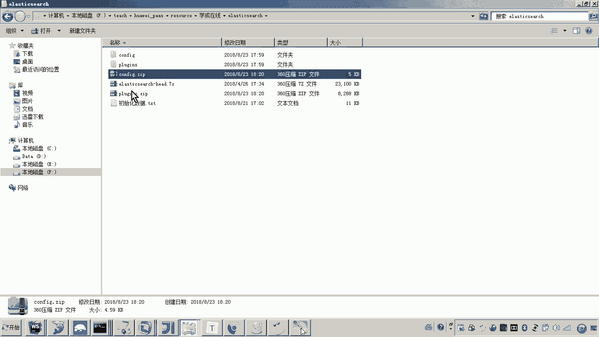

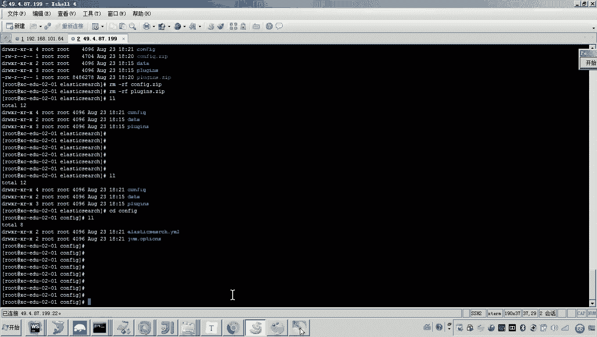

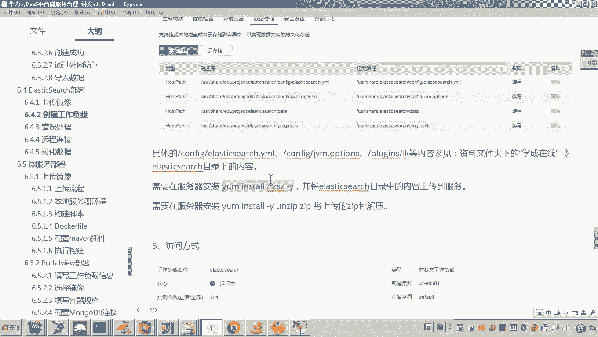

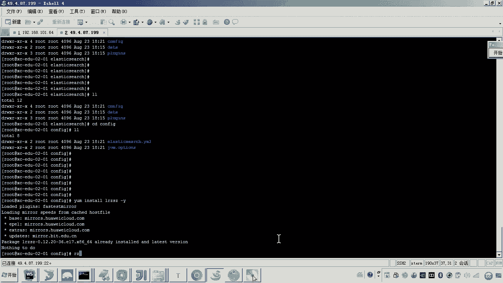

对，那现在他是不是就已经传上去了，然后我们再把这个本地的传上去这个plin好。😊。

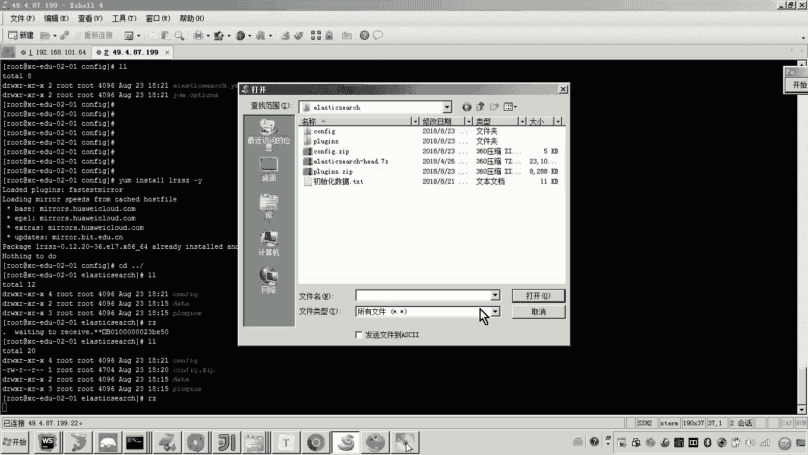

那我们来发现啊，这个我们传上去之后啊，接下来要做什么呢？你就需要把它解压，对吧？那解压完了之后要怎么说，是不是就把这里边的这个文件啊要替换替换掉这个云服务器上的这个肯fi格目录下边的这个对应的文件。😊。

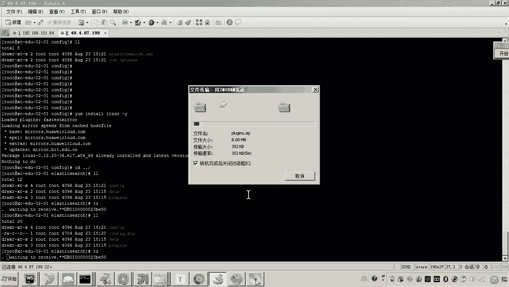

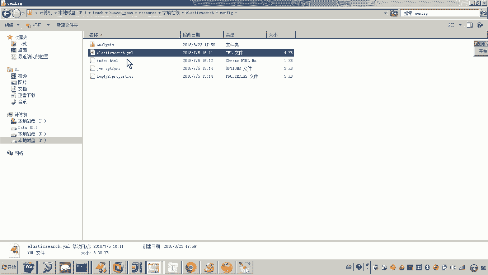

好，那现在呢他就把这个文件呢就传上了啊，传上去之后，大家可以看到现在各位这个两个zip包是不是就有了。好，那现在我们就把这两个zip包解压吧。然后解压的话，我先把原来它自动生成的这个给删掉啊。😊，好。

然后呢在呃zip解压嗯。各位现在它是不是就解压成功了？注意注意，就是说这个zip andzip的这个命令如果你没有的话，你不能执行，你就用样么呢把这个按zip哎也安装一下啊，也安装一下，执行它。好。

然后现在呢我们再来解压。😊。

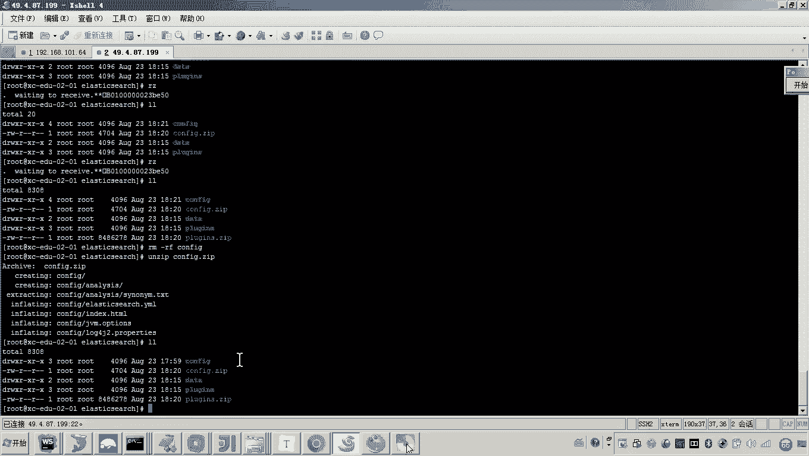

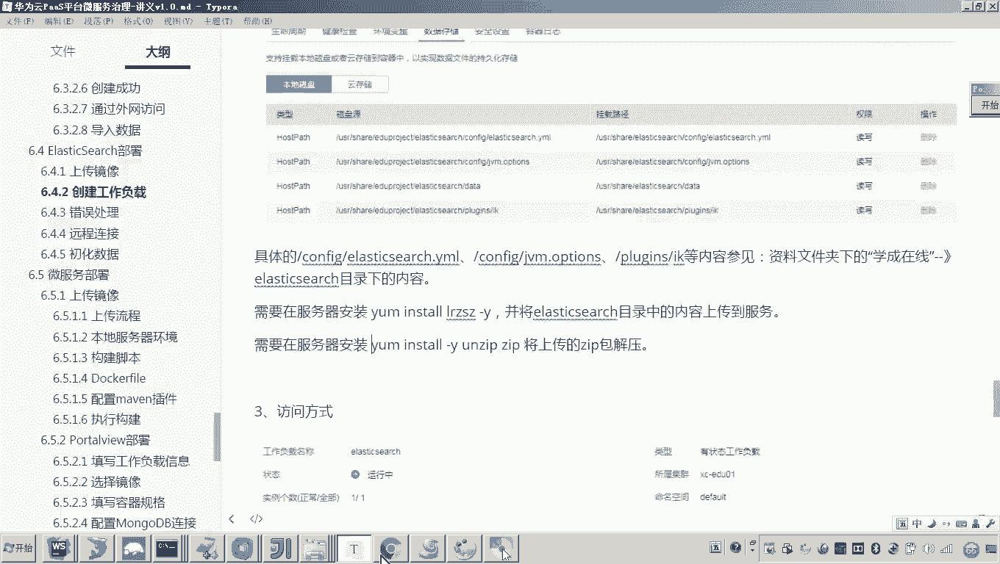

然后把这个也删掉。好，那现在呢各位你再进到这个肯fi格看一下。现在大家可以看到这这两个这个什么呀，这个文件，这个配置文件是不是都有了？对，我们可以看到它的内容啊，它的内容。😊。

然后这个内容的里面的东西呢，我们稍微改一下啊。😊，稍微改一下，这里边的这个内容呢呃大部分都不用变啊，我们来看一下都是什么内容。呃，首先呢我们这里面定义了我们这个elect search的。

它这个集群的这个名称啊，这些都不用变。哎，包括它的这个呃这个这个主机监监监听的这个地址啊，0。0。0。0啊，9200就是这个端口了。好，这些都不用变。然后呢，最后一个你把这个给它平了得了，就这个。😊。

嗯。这个是什么呢？就是这个对外发布的网络1个IP地址啊，发布的网络服务的地址。因为我们这个服务呢，我们是通过什么？通过这个呃弹性IP去访问嘛。所以这里边我们就呃不用这个发布方式啊。好，现在把这个改一下。

😊，改完了之后呢，我们再来看里面还有啥呀？还有一个叫GBMGVM是啥，是不是就是用来设置虚拟机的一些内存的一些虚拟机的信息，对吧？好。

这个信这个这个数据呢我们来看主要是这两项啊呃这两项就是我们说的这个初始的这个什么对战的内存和最大内存啊，这个我们就先不用设呃，就是1G好。😊，回头根据具体情况，我们再改。嗯。好。

那这个配置文件呢基本上就是这样了。😊，呃，那然后呢还有什么呢？还有就是这个插件里边，各位，它这里边IK是不是默认它这里边都已经有东西了是吧？所以这里边也呃我给你提供的都是已经啊弄好了啊，不用不用动了。

好，然后这个时候要怎么办呢？有说候老师他这个是不是已经已是不是已经起来了呀啊。😊。

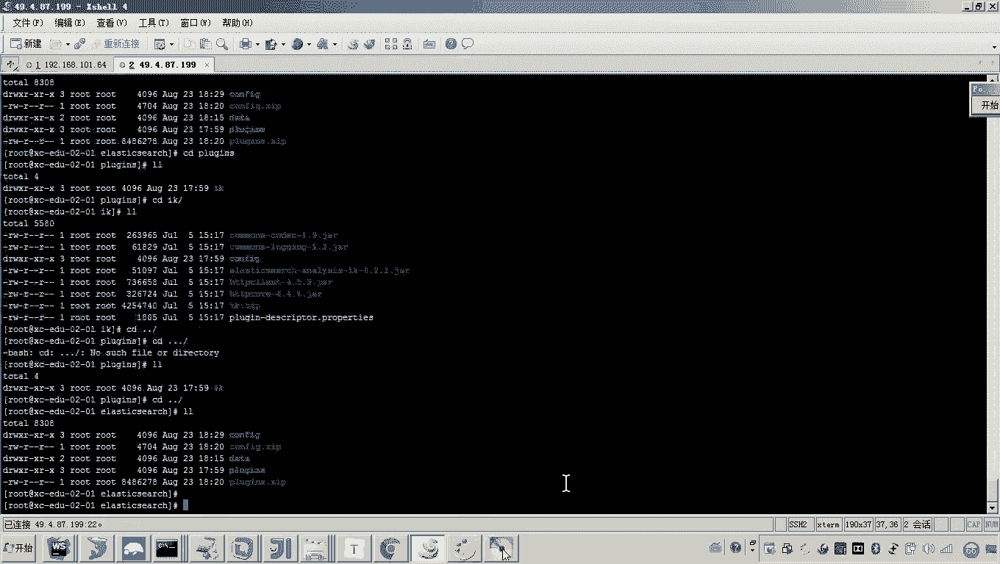

起来没起来，我跟你说啊，你不用通过这个什么在这个云服务器上，哎，通过输命令来看，除非遇到特别复杂的这个什么问题要解决啊，我们再跟踪。一般来说我们都进到什么呀？进到这个云平台里边，我们这么看就行了。来吧。

我们看看啊，这边，反正他现在还没有起来，你看是魏就绪，对吧？哎，然后我们来找找吧。😊，找啥呀？你看这个实例，它这是不是叫实力启动失败呀？我想看一下它的呃这个日志哎，就是这个云这个容器当中的运行日志。

点工作负载运维。嗯，然后在这个里边最近几分钟啊，30分钟吧，我们看一下它有日志没有啊，嗯有没有啊，不显示是吧？那我按照我的情况，我我按照我的想法，我是不是我可以把实例重新启动一下，行不行？

怎么重新启动啊，你点删除对，点删除，点删除，它就会把这个原有的这个实例啊进行结束，然后干嘛呀？对，重新启动，这个时候你再来看什么呀，看日志啊，主要看日志刷一下。😊，注意。因为如果有报错。

他就会会有什么呀？会有这个日志啊，会有这个日志出现。你看现在他是不是你看这是啥，是不是也是实力异常呀，但这个日志现在还没有报上来，对哎，现在报上来了，对吧？那大家来看这个日志的内容是什么？😊。

你点详详细信息，我们来看一下，看他的上下文日志。因为这个你看这个上下文日志怎么看呢？😊，啊，你看查看上下文，然后我要查看上下，比如说10千0行。看这里头显示的啥信息。mm。这里边是不是就报报错了，对吧？

嗯，这里边报错的这个东西，他是怎么说呀？说创建这个节点环境失败，对吧？嗯，他为什么创建啊节点失败啊，你看这里面有这么一个错误，我看见吗？😊，啊，遇到这个错误的话。

他是不是就表示是访问这个目录是不是没有权限，对吧？哎，没有权限。好，那这个没有权限。注意，其实在我的讲义上边呢呃在问题处理这一栏呢啊，我当我把这个安装ES的过程当中所遇到问题呢都给你罗列出来了。😊。

遇到这个错误呢，说明哎说明我们说创建我们在访问这个什么这个这个目录的时候，这个容器访问这个目录时没有权限。那没有权限怎么办呢？那你就进到这个目录啊，把这个呃date的目录啊给它改成改个权限就可以了。嗯。

我们现在这个时候我们再登进去。好嗯，然后呢。😊。

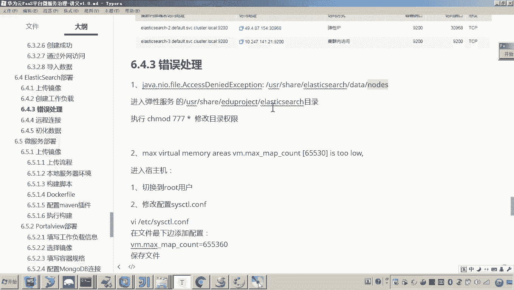

改一下，我们改成一个最大的权限吧。

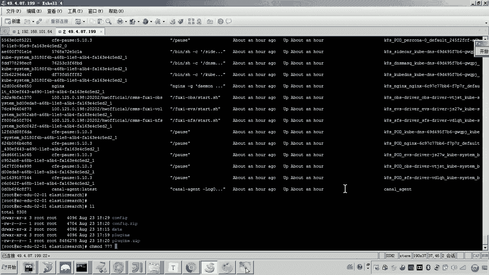

啊，都改完了是吧？好，然后现在我们把我们我们是不是就把它改改成这个777这个最大的权限。好好，然后呢注意看啊，然后注意呃，这时候我们还是改过之后呢，我们就可以去干嘛呀呃去观察了。😊，啊。

这里边呢怎么观察呀？😊，呃，我建议你啊，这里边你再回到有状态的工作负载当中哎，然后呢，怎么弄啊？呃，你在这儿呢再把它重启一下哎，删除。😊，还是重重复我刚才的动作，因为现在。

因为现在你是不是已经把刚才的这个权限改了呀，改了之后，你是不是就可以把这个实例重启一下，对吧？好，然后现在呃你马上来查日志，对你再查日志就看他还报错没有报错啊，一定注意嗯。😊，就是他这个日志他会上报啊。

他会上报嗯。😊，就就就就这么查啊。好。😊，如果他有错误的话，我我跟你说啊，他就会怎么弄啊，他会呃。他这个这他这个容器就创建就有些就失败了。有些呢它即使不失败，你也无法访问。嗯，然我们查看上下文看一下。

😊，前后1000。你看这个说这个节点已经关闭，你看见吗？还是有问题吧。对，这个问题是不是刚刚的问题啊，对吧？😊。

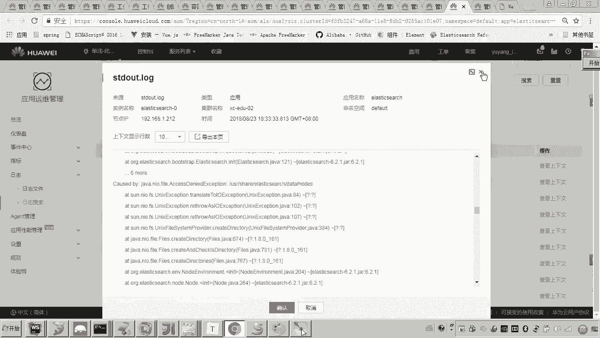

钢材的问题是吧？我再进去看一下。

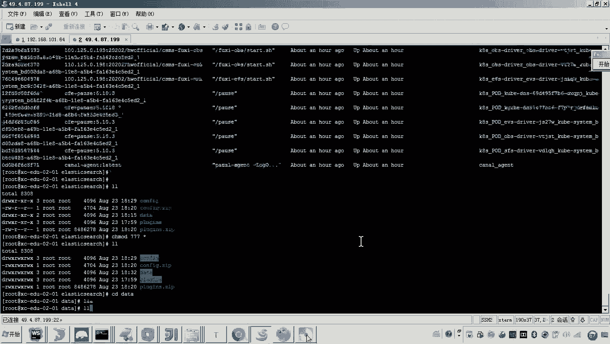

刷新一下。你看说这个什么启动失败，然后启动失败这里边说什么呀？说有这么一行提示。😊，那这行其实也是一个错误。那么在这个错误当中，大家可以看到啊，我这个错误呢就给你已经抓取过来了。他说是最大的虚拟内存。

说这个什么呀，说这个太小，对吧？那你就需要设置我们说的这个虚拟内存了。嗯，那怎么设置呢？我这边给大家的一个方法啊啊，首先你登到你的云服务器。然后呢我们去更改一个文件啊，更改一个文件。好。

那么更改这个文件呢，我们准备在这个文件的最下边添加这个虚拟内存的这个什么呀，这个这个这个大小啊，然后呢我们改一下啊，改一下这个文件的路径在ETC下边有个SYSCTL哎，好。😊。

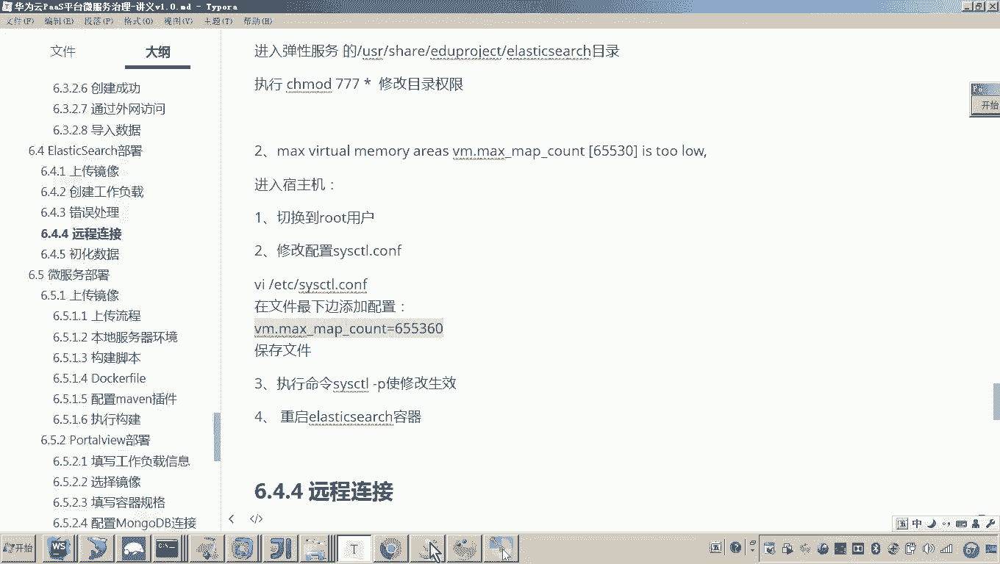

好，然后呢你把这个光标呢移到最下边啊，然后我们把刚才的这个啊内行呢复制进去。嗯，这样的话我们就更改完。那更改完了之后呢，我们说改完这个配置呢，你可以执行这个呃SOSCTL杠P，然后使这个生效干嘛呀。

使这个修改呢生效。😊。

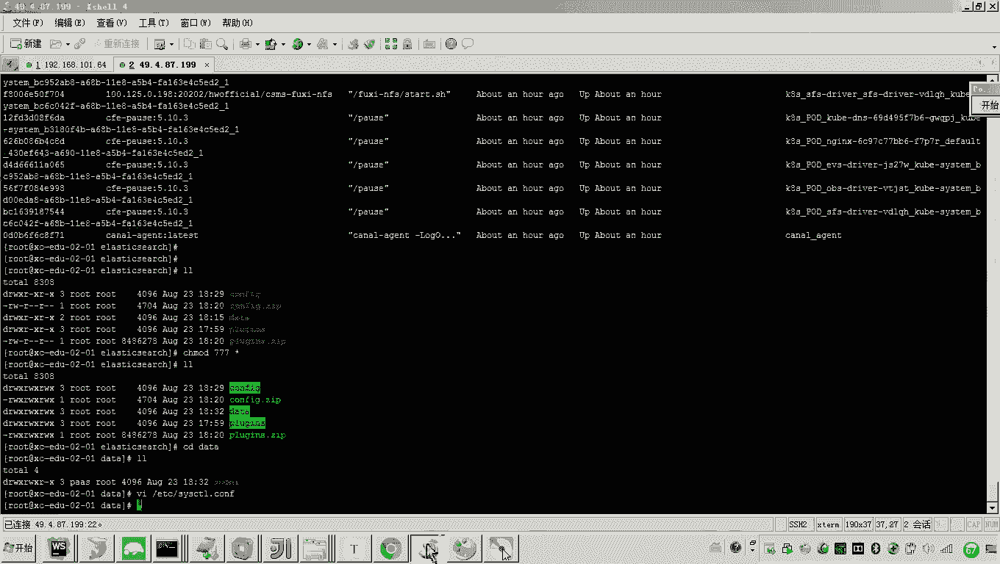

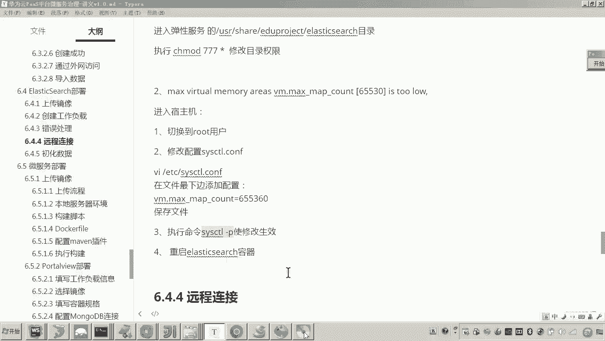

然后执行完了之后，注意注意现在我们发现它这个已经更改完了，更改完了之后，你要你是不是要重新启动一下实例啊？哎，重新启动一下实例。哎，然后呢再来观察。哎，好，然后我们再过来嗯实例。😊。

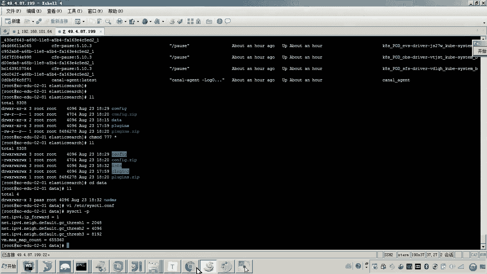

哎，这个好像都已经OK了吧，然后再确定，然后重新启动一下啊。😊，嗯，好。好，现在是不是显示已经运行中了，对吧？好。😊，啊，这个日志呢稍微慢一些好。呃，那么这个呃以上呢就是这个什么呀？

这个配置文件的这个配置的方法，以及我们在安装ES过程当中所遇到的两个问题。哎，一个问题就是说这个对这个目录没有权限，我们需要修改目录的权限。一个问题就是最大的虚拟内存，这个太小，我们把它改一下嗯。好。

那以上就是这个ES的一个错误处理呢。稍后呢我们准备连接上去呢，呃，进行什么呀，进行数据的导入。😊。

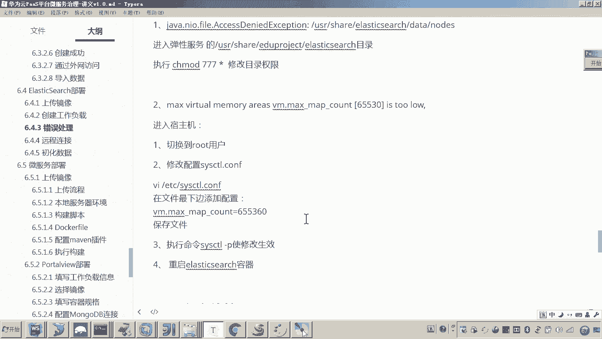