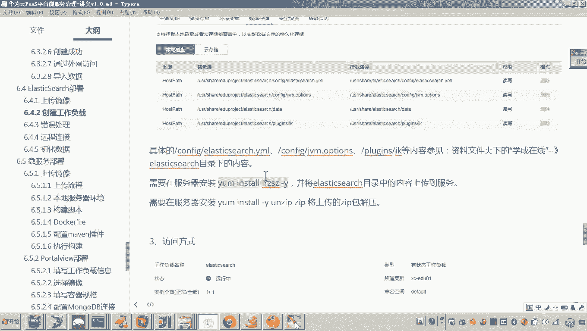
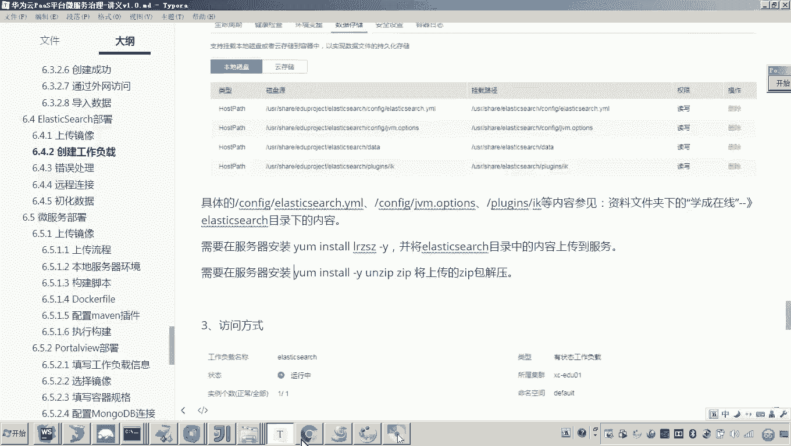
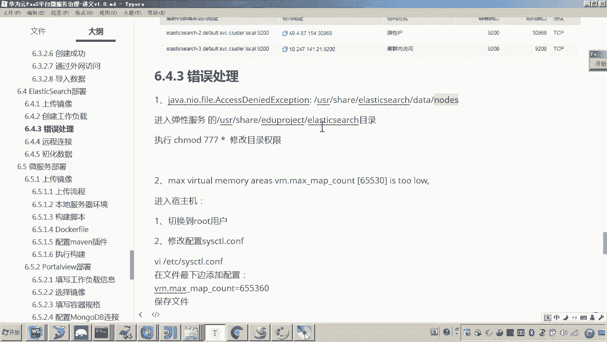
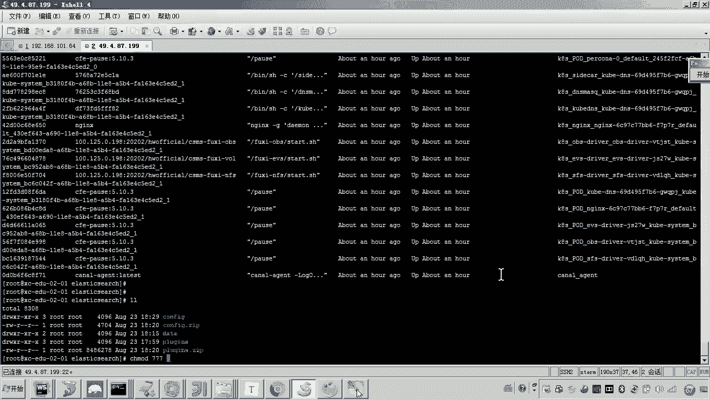
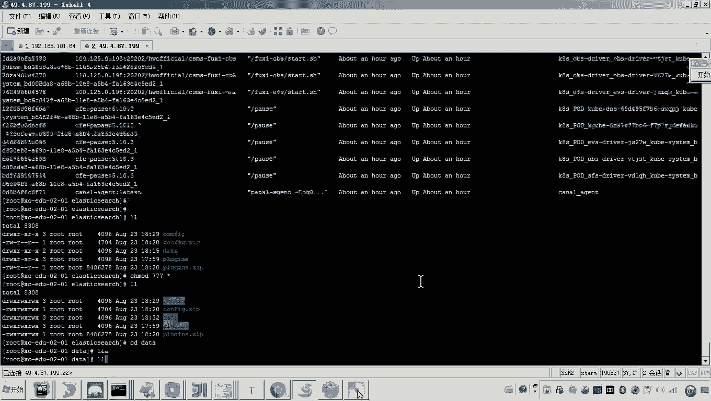
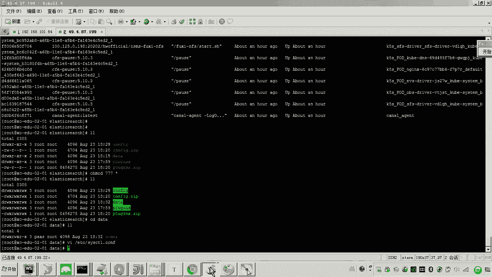
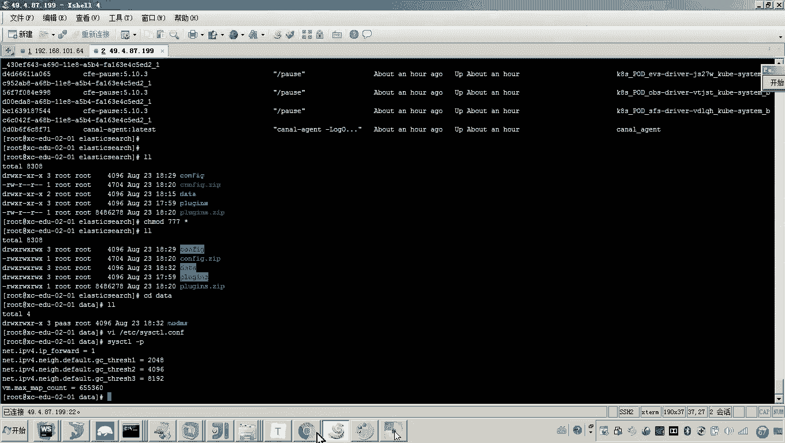

# 华为云PaaS微服务治理技术 - P110：02.学成在线项目部署-elasticsearch-配置文件与错误调试 📂

在本节课中，我们将学习如何为学成在线项目配置Elasticsearch的配置文件，并解决在部署过程中可能遇到的常见错误。我们将通过上传、解压配置文件，修改关键参数，并处理权限和系统设置问题，确保Elasticsearch服务能够成功启动。

---




上一节我们介绍了Elasticsearch的基本部署，本节中我们来看看如何配置其核心文件并调试启动错误。


## 配置文件上传与替换


首先，我们需要将本地的配置文件上传到云服务器。在学成在线项目的资源目录中，`elasticsearch`文件夹下包含`config`和`plugins`等子文件夹。这些文件夹已预先打包为ZIP文件。

以下是上传与替换配置文件的步骤：




1.  **使用FTP工具上传**：如果服务器未安装`lrzsz`工具，可使用`yum install -y lrzsz`命令安装。安装后，使用`rz`命令选择本地的`config.zip`和`plugins.zip`文件进行上传。
    
    
    
    
    
    

2.  **解压并替换文件**：上传完成后，需要解压ZIP包并替换服务器上自动生成的目录。首先删除旧的目录，然后使用`unzip`命令解压。如果未安装`unzip`，使用`yum install -y unzip`安装。
    
    ```bash
    # 删除旧目录
    rm -rf config plugins
    # 解压文件
    unzip config.zip
    unzip plugins.zip
    ```
    
    
    
    
    

## 配置文件内容解析与修改

配置文件替换后，进入`config`目录查看文件。主要配置文件是`elasticsearch.yml`和`jvm.options`。


以下是需要检查与修改的关键配置项：

*   **`elasticsearch.yml`**：此文件定义了集群名称、网络绑定地址等。
    *   `cluster.name`：集群名称，通常无需修改。
    *   `network.host`：绑定地址，设置为`0.0.0.0`以允许所有网络访问。
    *   `http.port`：HTTP服务端口，默认为`9200`。
    *   **重要修改**：注释或删除`network.publish_host`配置项，因为我们将通过弹性公网IP访问，无需指定发布地址。
        
        

*   **`jvm.options`**：此文件用于设置Java虚拟机参数，主要控制内存使用。
    *   `-Xms1g`：初始堆内存大小。
    *   `-Xmx1g`：最大堆内存大小。
    *   目前可保持默认的1G设置，后续根据实际负载调整。

`plugins`目录下的IK分词器插件已预先配置好，通常无需改动。

## 服务启动与错误调试 🐛



配置文件修改完成后，尝试启动Elasticsearch服务。最便捷的方式是登录华为云控制台，在对应的工作负载中查看实例状态和日志，而不是在服务器命令行查看。



以下是启动服务并调试错误的流程：

1.  **查看实例状态**：在云平台的工作负载页面，发现实例状态为“未就绪”或“启动失败”。
    
    


2.  **查看运行日志**：点击进入工作负载的运维页面，查看最近30分钟的容器运行日志。如果日志未显示报错，可以尝试删除当前实例（这会导致系统自动重启一个新实例），然后立即刷新并查看新上报的日志。
    
    



3.  **错误一：目录访问权限不足**：在日志中，如果看到类似“**创建节点环境失败**”或“**Permission denied**”的错误，表明Elasticsearch容器没有权限访问挂载的数据目录。
    
    **解决方法**：登录到云服务器，为Elasticsearch的数据目录（例如`/usr/share/elasticsearch/data`）赋予最大权限。
    
    ```bash
    chmod -R 777 /usr/share/elasticsearch/data
    ```
    
    

4.  **重启并再次观察**：权限修改后，返回云平台，再次删除并重启实例，然后查看日志确认错误是否解决。
    
    


5.  **错误二：虚拟内存过小**：如果权限问题解决后，日志中又出现类似“**max virtual memory areas vm.max_map_count [65530] is too low**”的错误，说明系统虚拟内存限制过低。
    
    **解决方法**：登录云服务器，修改系统配置文件。
    *   编辑文件：`vi /etc/sysctl.conf`
    *   在文件末尾添加一行：`vm.max_map_count=262144`
        
        
    *   保存退出后，执行以下命令使配置生效：
        
        ```bash
        sysctl -p
        ```
        
        
        


6.  **最终启动**：系统配置生效后，最后一次在云平台重启Elasticsearch实例。此时实例状态应变为“运行中”，表明服务已成功启动。
    
    
    


---


本节课中我们一起学习了Elasticsearch配置文件的部署与关键错误调试方法。主要内容包括：通过FTP上传并替换配置文件、解析和修改`elasticsearch.yml`与`jvm.options`的核心参数、利用云平台日志定位问题，并成功解决了**目录权限不足**和**系统虚拟内存限制过低**两个典型启动错误。完成这些步骤后，Elasticsearch服务已处于正常运行状态，为后续的数据导入做好了准备。