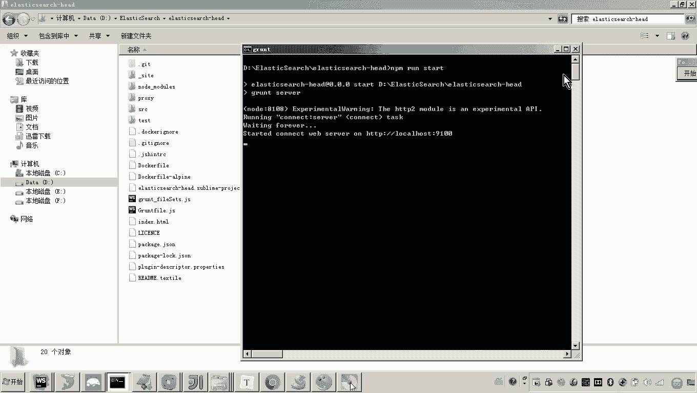

# 华为云PaaS微服务治理技术 - P111：03.学成在线项目部署-elasticsearch-初始化数据 - 开源之家 - BV1wm4y1M7m5

好，那下边呢我们就远程连接ES，然后导入数据。嗯，那好，那要远程连接ES的话，那怎么连接呢？那首先先来看一下它的地址啊，先来看一下它的地址。好，那这里边呢大家可以看到这个呃访问方式当中。

这里边是不是有一个外网的地址啊。然后我们通过这个端口呢，是不是就可以连到ES的9200端口。OK那现在呢我们怎么做呢？😊。

那我们是不是就可以来连接了，那怎么连接呢？那这个以来这个 search呢，它给我们提供了一个叫ha插件呢，通过这个插件呢，我们是可以去连接的啊。那对于这个插件呢，我给大家也提供了啊，你也可以从官网下啊。

在这个在这里。好，那这里面呢我们就准备用这个插件来进行什么来进行连接。😊。

好，呃，这里边呢我用我呃已经安装过的这个呃ES的这个插件啊，就是这个插件。嗯解下开来就是这样模样。然后呢，我们去呃打开它这个CMD的窗口啊，然后呢我们运行这个NPM什么run star。😊。

啊，因为这个这个最新的这个ES的这个插件呢，它是用这个什么noteGS嗯来进行开发的啊啊它的运营环境就是noteGS。那你的本地也要装noteGS。😊，好。

那这里边呢，大家可以看到他报了一个什么错呀，他应该是当前我是不是已经有了这个插件了？嗯。然后把这些东西都关掉啊。

好，这个插件应该是我已经启动了，已经启动了。好，我再来运行一下。

好，那这个就是插件的地址啊，然后现在呢我们去浏览器访问一下。好，然后我再开一个浏览器。

然后打开了之后呢，大家可以看到啊，它默认连的就是我本地的9200端口。而现在你要连的是不是公网的对吧？所以你找到这个地址，然后你把它复制一下。嗯，然后呢呃切到我们说的这个插件当中。

然后在这儿把这个地址复制进去，然后连接。😊，各位现在是不是已经连上去了？😊，这就是我已经把这个ES在这个云服务器上已经部署成功。我在这个外边是不是可以连接它了？好，那么连接成功之后呢。

我的目的是要往里边初始化数据，对不对？😊，那怎么做呢？首先我是不是要建一个索引呢？对，这个索引呢叫做这个索引名称叫做XC course这个名称你不要给我乱改啊，因为程序已经配好了，哎。

就是连的呃读取的这个索引里边数据。好，这里边呢我们点到索引，然后新建嗯，因为我们现在呃测试阶段我们用的是单击啊，所以这里边的这个分片数呢，我们就不用写了，就写一就行了，副本是0啊，OK好。

这个索引库我是不是已经创建好了。😊。

创建完索引库第二部分我是要进行导数据了吧，那导数据还有印象吗？啊，当初呃我在讲这个。😡，这个怎么样？我在讲这个。😊，呃，学程在线的部署的时候，我应该给大家说过啊，在这个资源目录里边学生在线嗯ES当中。

我是不是有一个叫初始化数据的这个文件呢？对这个文件就教大家怎么去导了。嗯，首先我们要哎导入索引数据。那我们首先要创建一个什么呀？创建映射哎，这个映射就相当于表的字段。哎，好。

那现在我们就准备来创建怎么创建呢？哎，我们说这里边我们可以用一个post这个HTTP的客户端工具啊，来创建。那怎么做。😊，打开pos man，嗯，这个pos man工具呢特别好用啊。

在我们进行前后端分离开发的时候呢，呃是经常使用。😊。

好，那么我们现在呢打开pos。😊。

呃，打开pos man之后呢呃这里边呢我们说准备向这个地址，像这个地址，我们是不是准备往里边提数据了？对，当然当然这里边这个这个地址是不是要改了，嗯，你告诉我改成什么，大家说一下。😊，你不知道是吧。

注意啊，这个地址是不是就是我们说外网访问呃云平台容器的这个地址。通过这个地址是不是可以访问到云平台的容器啊，你复制它，然后呢贴到这儿。😊，看懂了吗？然后在哪里啊？在这个呃在这个body里头。

body里头，然后我们把这个我的这个文件当中给大家提供的这个映射这一串东西呢，你你给我复制到这里头。😊，看懂了吧？哎，然后我们现在发送。😊，好。

注意此时是不是就创建成功映射创建哎成功之后呢啊其实我们是可以在这个hat插件当中数据浏览这里边我们来看一下的。好，其实这里边它默认创建了很多啊，但是但是应该说我们创建的映射也已经有了。呃，在哪呢？

你像这个star time啊，应该都是我们的吧，还有s model啊，这这些都是我们创建的。😊，这个创建完了之后要怎么做呢？现在我们说这个这个类型，你看这个SC course是不是已经有了。

只是说这里边没有数据啊，这里边没有数据，我们现在是不是要往里边导数据了？😡，怎么导数据呢？你再打开这个文本文件里面是不是写的很清楚，说post的像这个地址来请求。哎，你就复制。当初我给大家说过。

因为这个数据是测试数据，没有几个哎，正常情况下这个学生在线的一个课程当中讲的非常清楚，我们会通过一个叫log的方式在从把mysl里边的数据导入到采集到这个ES当中。而现在我们是测试啊。

我们就手动的把这几条数据把它添进去就可以了。哎，哪几条，你看这是一条吧，然后下边是不是还有一条啊，没有几条啊，好，我们把它添进去，注意看啊，注意看，然后呢我们把这个地址呢先复制一下。嗯。

我就在这个基础上来了啊，然后再复制一下。好，然后怎么弄啊，你把这一堆哎复制。😊，就采用这种方式呢来往里边导。好，然后呢我们再呃po send发送请求。注意现在这是不是就请求成功请求成功。

你在你的hat插件这里边注意注意看你再看一下，点一下这个数据是不是已经导进去了。😊。

这就是我们哎从这个远程连接啊，远程连接到这个云服务器上的这个ES，把这个数据已经导进去一条，就采用相同的方法，然后怎么弄啊，把后边几条哎也导进去嗯。

好，后边几条也导进去。好，那现在呢我们就来做这个事儿。然后呢，你把这个复制一下。😊，然后呢，把这个也复制。然后把它拷进去拷到哪呀？烤到这个bodyy里头，然后点s。

好，继续。

注意啊，因为这里边我们是需要导呃两个这个什么呀，两个类型的这个数据啊，哪两个类型可以看一下啊。😊，对我一会儿跟你说。是不可以了啊，注意别别弄错好，然后呢点击s。好。

那现在的各位现在我们是不是把这三条是不是已经导进去了？注意看这一点，你看这个叫X course media和上边的X course是不一样，这是一个类型，下边是一个类型。

这个就相当于我们mycyclql当中的表，你懂我意思吧？这个也是相当于表，这是另外一张表。所以来我们把从这儿开始复制。😊，先来导这张表里边数据。然后呢，哎也把这个复制一下。好，然后呢去胜的。好。

然后就有这种就用这种方式呢，然后我们把其他的这个数据呢也导进去。其实这个数据是什么呢？就是我们说的这个呃课程的这个什么呀，梅资信息，什么梅资信息啊，就是那个播放课程的这个视频地址。😊，嗯。

因为这个数据正常来说，在这个学生在线的课程当中去讲的时候呢，讲呢会给大家讲啊就是数据怎么呃定时的去采集，实时的去采集，怎么样把这个数据呢呃向这个ES当中呢来添加这个什么呀这个呃所引。😊。

所以所以这一块的部分呢，我现在主要是为了部署这个ES啊，所以这块的部分呢我就不再详细去说啊，有些的同学呢可以去参考呃学生在线的一些课程的内容。😊，好，那到这儿来说，我是不是就把这个数据呢全部就导入成功。

而此时呢我们是不是就可以来进入headt插件啊，怎么弄？我们现在看一下这个数据呢啊我们刷新一下啊，刷新一下，总共应该是有两个类型啊，大家可以看到有一个叫XC course里边有3条记录。

有一个叫SC course media，这里边啊是不是有有这是4条记录。😊，看懂我啥意思了吧。对，所以哎所以这就是ES数据的什么导入哎，ES数据的导入嗯。好了，那现在呢我们把这个我们把这个什么呀。

来再刷一下。😊，我们把这个导入数据的这个工作呢就完成了。嗯，这是大家可以看到，这是不是里边是不是有时我们说的这个视频播放地址啊，将来我们这个呃页面是不是都通过这个呃ES来搜索这个视频播放的地址好。😊。

呃，那到这儿为止呢，我们这个ES的这个部署呢就完成了。好，那这个ES的部署呢比这个前边的这个pro呢和mgob呢复杂一些。它的复杂的原因在哪呢？就是这个镜像呢。

它在这个cker当中没有需要你自己把它把在本地服务器建好然后呢再ush到这个云平台哎，然后其次它一个麻烦的地方是啥呢？就是这个这个ES去安装的过程当中呢，它有它有一些需要设置权限的东西，哎。

包括包括这个什么呢？包括刚才说的这些错误的处理啊，这个呢有人说老师这个你你你遇到这两个错误，我们会不会遇到其他的错误，只要你这个什么呀？这个镜像用我的这个用我我我说的这个。😊，哪哪个镜像呀。

是不是这个EES的官方提供的这个镜像呀？哎，然后这个版本呢应该是没有问题的啊，按照我的这个叫讲义上的这个步骤去部署，应该就是这两个错误，我们把它改好就可以了。😊，那初始化数据这一块呢。

啊你刚才也应该听到了说什么呀？呃，也是通过这个呃外网的这个呃弹性服务器的IP和端口来访问我们容器的这个ES。然后呢，只不过它访问方式啊，我们说这个当时导入这个mongodB的时候。

是不是通过一个mongodB客户端导数据啊？而这个我们是不是通过了一个ha插件来查看数据创建索引。啊，然后导数据，我们是不是通过HTTP的一个工具，然后呢远程向这个ES当中来提交数据。嗯，好。

以上就是ES的部署。😊。

