# 华为云PaaS微服务治理技术 - P112：04.学成在线项目部署-微服务部署-构建镜像配置 - 开源之家 - BV1wm4y1M7m5

好，那接下来呢我们就开始微服务的部署。呃，微服务的部署流程呢和我们前边部署的呃流程呢是一样的啊。首先我们是不是先要确定镜像，然后呢我们再创建工作负载。那对于微服务来说，我们创建无状态的工作负载就可以了。

好，那么呃我们最关键的就是在这个微服务呃确定镜像这一块呢，和前边部署的呃这些服务呢不太一样啊，为什么呢？因为我们微服务呢是自己写的加va程序啊。

我们需要自己来编写docker file文件来构建镜像啊大家下边呢先来看一下这个镜像构建的流程啊，怎么样我们最终把这个镜像呢上传到云平台。好，那首先我们在自己的开发电脑上边是不是要修改我们自己的代码。

对吧？然后代码修改完成之后啊，我们整个代码是通过get来进行控制管理。我们把这个代码呢p取到get仓库。😊，那这个get仓库呢，在这个一些企业呢，它会用get hubub啊大大多数的这个公司呢。

他可能会在自己的这个局域网呢部署这个getla。哎，也就是一个局域网的啊一个自己私有的一个get仓库。好了，那现在呢这个咱们这个例子呢。

咱们用这个getla啊啊当然啊你用getla会用了get hubub也一样。啊，就是这个仓库的地址不一样而已。😊，好，我们把这个代码呢先push到gatet lab当中，然后呢哎我们就在本地的服务器。

嗯，昨天哎我教大家说怎么把这个镜像上传到云平台，我们是不是提到了一个概念叫本地服务器啊，在这个服务器上边哎我们是不是装了这个什么呀？这个这个docker，然后呢，首先大家还有印象吗？

首先第一步我们是不是要执行一个docker的这个login，然后登录云平台，也就相当于一个认证，对吧？第二步我们是不是哎打一个这个tag。

那这个这个这个这个tag打的目的是不是就是要定义这个组织的这个机构名称，然后第三步是不是就是docker pushush，哎，就是开始向这个云平台啊进行这个上传镜像了，对吧？

所以这里边呢我们要注意啊就是说。😊，我们在本地服务器先把代码呢把它啊从get lab当中把它拉到啊我们的本地服务器拉到这里。然后呢我们就采用me的一个插件，就开始来嗯构建镜像了。

那这个构线镜像的过程是什么样子呢？呃，就是它首先呢它会因为ma插件，它首先会进行什么编译打包呃，然后呢呃通过这个我们编写的这个docker file文件里边的内容。

然后呢呃就开始执行docker build来来构建镜像。😊，这个镜像创建成功之后呢，就按照我刚才说的呃，我们是不是要对这个镜像进行打一个t，哎，就是定义这个组织机构的名称，然后呢再执行刀钩push。😊。

所以这一系列的东西呢，各位都是通过哎一个脚本来自动化的来完成。最后呢我们就发现只要哎开发人员把这个代码呢啊提交到这个get仓库。然后在本地服务器执行一个呃执行一个脚本。哎。

我们这个脚本呢采用这个效脚本来写执行一个效脚本，然后呢，他就可以自动的来把这个镜像构建完成，然后呢上传到云平台啊，这样一个流程好。😊，那这个上传镜像的流程我们清楚了之后啊。

呃那么接下来我们就按照这个流程呢来啊准备把我们的微服务啊，然后把它打成镜像，然后呢把它上传到云平台。😊，好，那首先我咱们来确定一下本地服务器的环境。嗯，其实前边呢我们已经呃说过这个本地服务器了啊。

因为为什么我要再次说这个环境呢？因为这里边呢是不是有需要我们在本地服务器执行命令来构建镜像呀？而构建镜像之前，是不是需要这里边它会干嘛呀，会打包会编译，对不对？所以所以在本地服务器环境当中。

我们要把java的meve构建的那套环境啊，都准备好GDK1。8啊3。3。0以上，然后这两个就是保证了我们说的这个镜像的构建，对吧？然后镜像构建完了之后呢。

我们是不是就可以通过docker的这个命令上把镜像上传到云平台了。那这个ge呢在你的本地服务器也要装为啥？因为你在本地服务器的呃在构建镜像之前，你是不是要执行一个get，t干嘛呀？克隆对不对？

然后呢把这个。😊，代码呢从这个get lab呢把它啊拿下来啊，当然我们执行这个getge就可以了。因为嗯平常你要只要修改代码提交过去之后呢，我就把这个代码拉到我的本地啊。

这个get克隆呢是我们初次呢我们这个在本地服务器没有这个get这个目录的时候呢，我们初次把这个呃代码从这个get仓库呢把它拿下来啊，克隆下来。好，那这个呃我们本地服务器的环境呢。

这里面呢我已经就准备好了啊，就在我的这个什么呀虚拟机上面。😊。

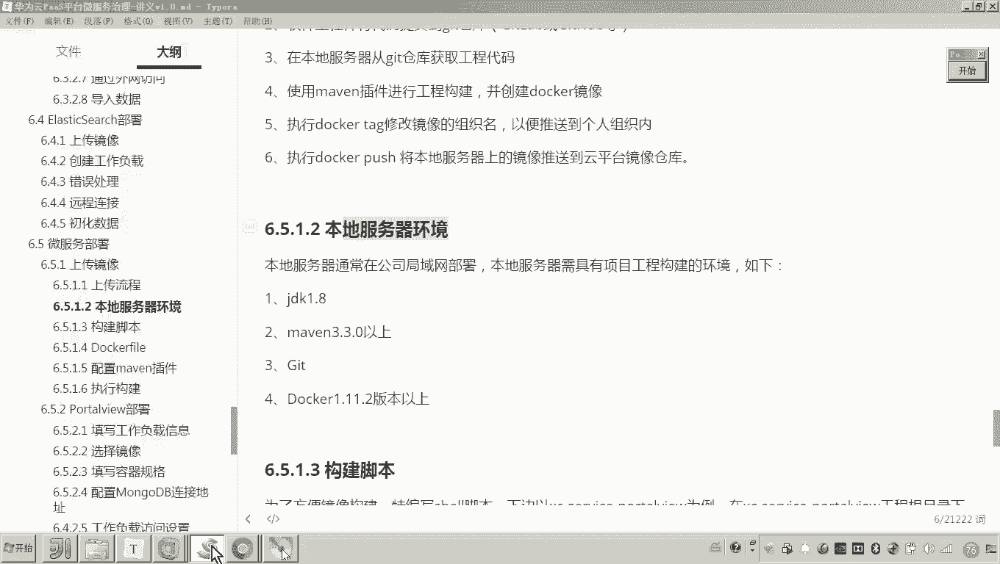

好，那么我我们把这个服务器的环境准备好了之后呢，呃注意呃注意现在我们要注意一个事儿呢，就是说呃我们呢就开始来进行构建。但是构建的时候呢，刚才老师说是不是要需要一个脚本呢？

所以我们先要把这个脚本给它编写出来。😊。

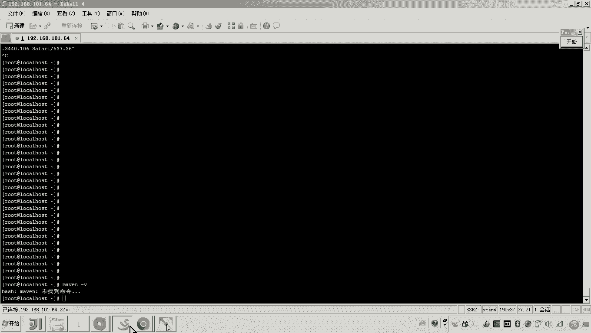

那这个脚本怎么写呢？我们以哪个服务为例子呢？😊，注意啊，我们去找到我们的这个服务吧。在这个呃这里边有几个微服务啊，我们会把这个port view和search还有running。

我们都需要把它呃构建镜像上传到云平台。那这里边我们先做这个port view。😊，好，那这个port view呢这里边我们是怎么来编写这个脚本呢？嗯大家来看到我这个讲义啊。

我们先把这个脚本的内容先看一下，那它是一个校脚本啊，然后呢这个现脚本的内容是什么呢？大家看啊。😊，首先啊在这个这个这个这个脚本上边，这个脚本上边他会去。😊，呃。

这个脚本的作用是就是来构建镜像的那它构建镜像的过程。他是怎么做的呢？他会执行一个非常关键的命令啊，就是这个mevenme的这个命令。😊，啊，这个MVN啊干嘛呀？然后这里面是不是指定了一个泡的一个文件啊。

然后先清理再打包啊，然后最后docker build其实这个这个语句啊非常关键。所以这里边我说明一下啊，就是构建脚本，这里边我们准备嗯采用什么呀？采用me的这个插件来进行构建。而这个脚本，而这个脚本呃。

就是上边各位就是上边老师刚才说的这一部分的这个代码，对吧？嗯，好，那现在呢我们先把这个脚本编写一下。😊。

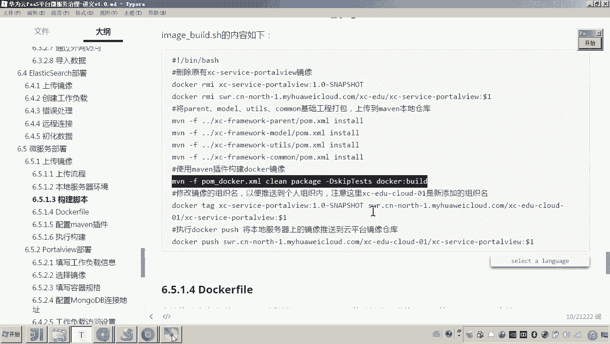

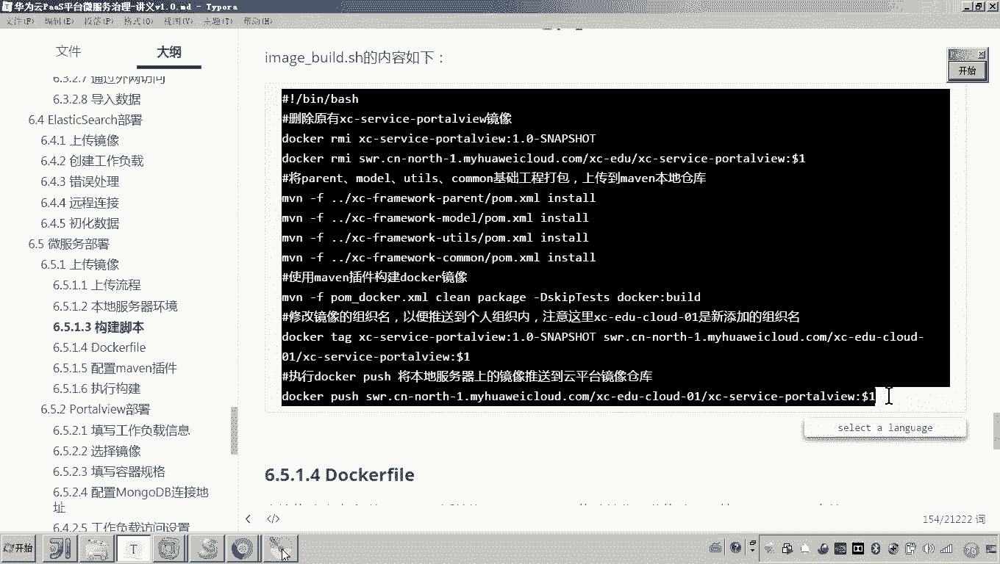

然后呢，这个脚本写在哪呢？我们就把它写在这个根目录吧。😊，Hao。

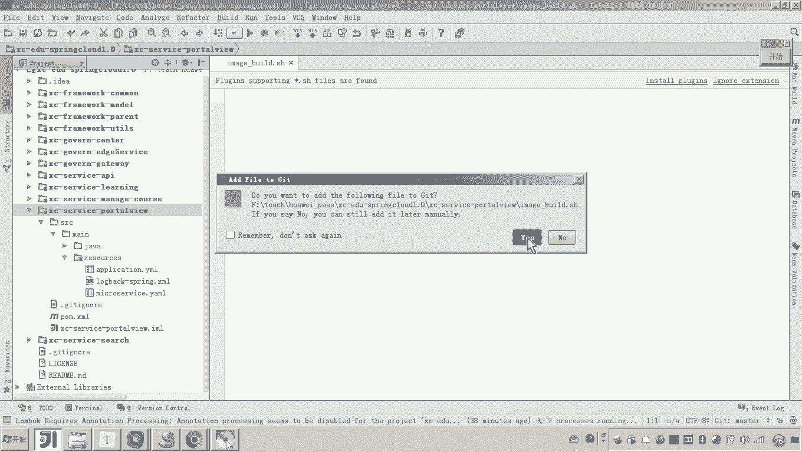

然后然后这个脚本的话，各位注意看啊，这个是没找到命令啊，这个应该是看大家可以看一下。签面这个me是3。3。9是吧？嗯，好，那么再回过来大家来看啊这个脚本的内容啊，我刚才解释到了这个关键的一句啊呃。

这边我们把它拷过去啊，拷过去之后呢，我给大家说一下。😊。

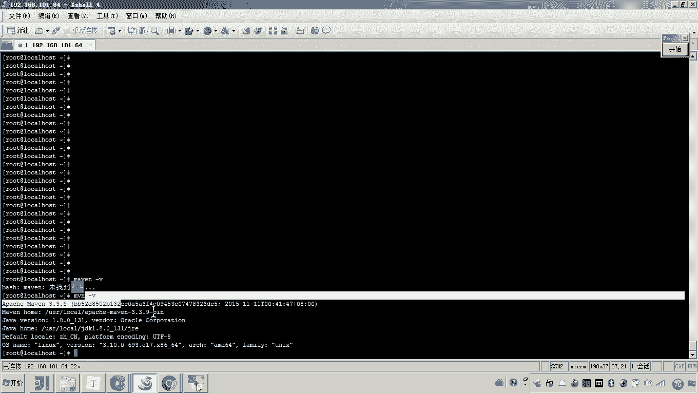

好，那大家来看这个脚本。呃，首先呢呃我们在构建这个镜像的时候呀，呃这个就是我们当前这个port头 view微服务的这个镜像。呃，那你在构建之前，我们是不是先把它先把它删掉，对吧？啊，先把它删掉。

所以这一部剧呢就是把这个删掉。然后这这一句是干啥的。😊，证一句。这是不是也是三镜像，但这个三镜像的话，你看大家来看这个删除的话，就直接是云平台的这个呃带有云平台的这个组织机构的这个镜像了。

因为大家知道最终我们是不是要打一个tag，然后呢打一个这个组织机构，然后把这个原有的这个镜像呢，打一个tag，是不是就变成这样一个镜像了？对，好，注意这个这个组织机构啊，这个这个要改一下。

这个根据你的这个呃自己的这个云平台的这个情况。呃，我们这个准备把这个镜像上传到哪里呢？呃，我们把它上传到这个有一个叫做。😊，什么呀？XCEDUcloud01啊这里面已经有了是吧？

那这样我再新建一个组织机构。😊，看好啊。啊，我这里头叫XCEDU。cloud。02。我准备弄到这里头。M。😊，哦，组织机构的数量是不是已经超了？已经糙了是吧？那来我们我们看一下啊。

那这里边你看这个这个组织机构里头是不是还没有这个镜像呀？所以我准备把这个放到这里头可以了。那放到这里头了，这是我的镜像吧。这个这个是我的这个组织机构的名称，对吧？那这个组织这个名称的话。

我们是不是就可以怎么弄啊，你看这个名称是不是叫SC杠1DU杠01啊。那你这里边呢我们就需要把这个改一下，看好啊，看下啊，啊01。😊，所有的涉及到组织组织的这个组织的这个名称的地方。

我们就把它写成这个名称。回头我们这个镜像就上传到这里了。好，我们先把这个只要有这个镜像的，我们把它删掉。后边这个刀一是啥意思？😊，就是将来我执行这个脚本呢，后边呀哎我会传一个版本号。😡。

有说老师不是默认都是这个1。0snap shot吗？那注意啊，因为我们一会儿呢我们就会去呃上传这个镜像啊。假如说这个镜像有改动，你再次上传的话，我们这个版本号要不是要在后边呢要要要自增。哎。

也就是说我初次上传的可能是1。0杠snapshot。那后边我要自增的话，那可能就变成1。0。1哎，为啥这么做呢？因为呃如果你想实现这个镜像一旦更新，我们这个容器自动升级，那你必须把这个版本号向后边自增。

所以这个版本号是可变的啊，对这个版本号是可变的。而这个是什么意思呢？这个是我们原始的镜像，懂我意思吧？这个原始的镜像就是我们就把这个版本号定死了，就是1。0杠snshot。

而而这个每次打tag每次上传云平台的时候，那个版本我们要让它保证自增，保证自增1啊自增。😊，好，那这里边呢我们说那如果有这个打包的这个镜像呢，我们就把它删掉。嗯，如果没有，那你就不删。好。

那下这个是什么的意思呢？😊，这个的作用就是因为我们要打包这个port view嗯，那你它不是依赖于负工程嘛？你是不是要把负工程ins到一下，把它把它把它发布到这个本地的仓库是吧哎。😡，好。

这个model一样，工具类也一样，comme也一样，就是全部把它发到嗯上传到这个本地仓库。这样的话，我们port view去打包的时候。

是不是可以从本地仓库拿到最新的这个负工程model和工具类以及com啊。好，然后还有什么呢？😊，使用ma插件构建。那这这一句呢各位可可以看到这一句是不是就要执行什么呀啊，执行这个。😊。

大家看到怎么怎么做呀？当前目录下的有一个叫做泡沫下划线docker地儿哎叉描。😊，对吧那你说老师没有这个文件档文，没有这个文件，你要勾，你要你要建一个。😡，对。那一会儿我就会说这个事儿啊。

因为这个文件就是这个prom下划线docker这个文件哎，它是把这个构建镜像的那个插件呢加进去了。我们通过这里边的这个啊mave问插件来构建镜像。你要注意啊。好，然后还有什么呢？

修改组织名称推送到个人组织当中。好，这里边我们统一把这个组织名称改成这个IC杠EDU杠01。😊，可以吧，所以这里边我们都要改。😊，那这个你看这个这个版本号是不是就是从这个我当我将来去执行这个脚本的时候。

传进去一个参数，对吧？好，然后后边你把这个改好了之后，我们是不是要推送了？嗯，那这个推送的话，是不是就推到云平台了？哎，这就是我们说的这个脚本。😊，好，这个脚本我说完了之后呢，可能有些同学听了有点迷糊。

他说这个这个怎么样一个过程呢？哎，一会儿呢我去执行的过程当中，一边执行，我再给你讲一遍，你就知道了这个过程了。好，然后呢，我们再来看下边我们要还要做一件事啊，一为要构建镜像。

我们是不是要编写这个docker文件。对，然后呢我们在哪编写呢？我们在这个resource下边resource下边我们来编写这个docker文件。😊。

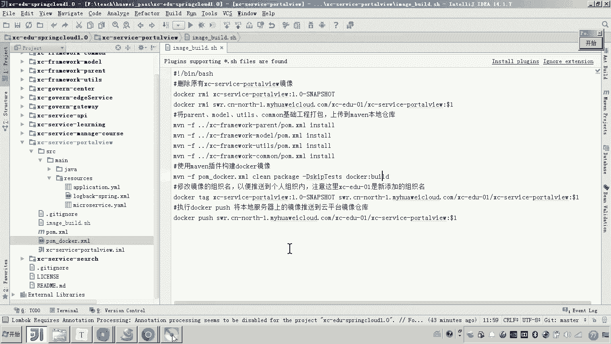

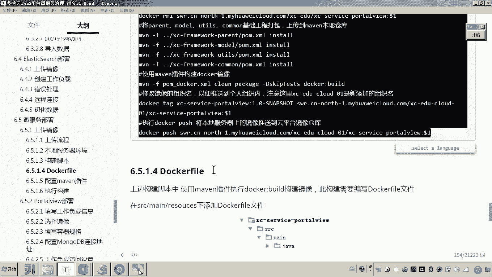

这个docker file文件就是docker在进行构建的时候呢，呃打呃这个构建镜像的所要所要呃参考的一个文件。那这个文件呢呃非常重要。因为这个文件里边你会发现啊，我们来看一下from java冒号8。

那这个本身构建的这个po呃这个port view这个镜像是不是基于这个java8的这个镜像啊，这个学过docker应该都知道这句意思那后边是不是我设了一些环境变量，对吧？这是我们镜像的名称。

这是我的版本号啊，对，然后这个是什么呢？这个是。😊，啊，将来这个镜像呃生成之后，他的这个工作目录啊，杠ho。😊，然后然后这这些都不用动了，因为这些你看到我是不是都引用了前面的这个黄金变量了，是吧？😊。

Docker file。啊，这是一个非常简单的几个文件啊。好，这里边呢最后最后在镜像当中它就会执行java杠架。然后因为我们是sring boot工程，它是不是就会执行这个架包就可以了。嗯，好。

那么接下来我们呃配置最关键的一个叫做man插件啊，就是在这个pom下划线docker当中，我们来配这个meve插件。那这个过程呢也是非常简单的，我们把它复制过去呢？给大家讲一下。

然后下划线啊这个docker这个文件当中，我们把这一部分把它代替。😊。

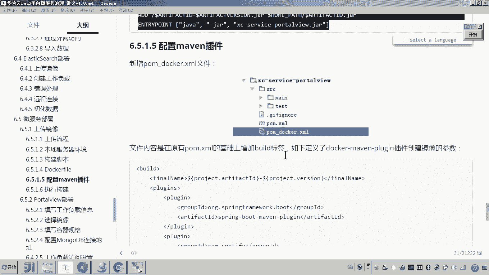

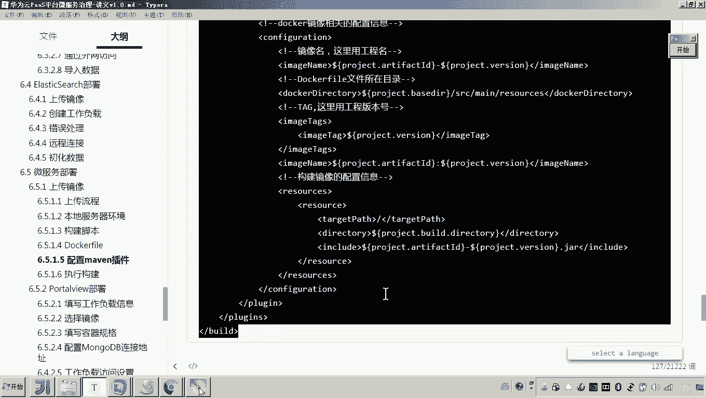

好，那么我们来看一下。😊，这里边用到一个没问插件啊，就是用了什么呀？啊，一个打包插件哎，这个是打成架包的，一个就是镜像构建docker镜像的这个插件。那么关键呢就是这个插件了，下边这个插件了。

这个这个这个这个镜像呃构建镜像的这个插件呢呃它呢呃是负责呃把这个干嘛呀，把这个架包呢，按照哎docker这个fi这个文件的这个这个指示，然后呢构建成一个docker的镜像啊，它构建的方法呢，大家来看啊。

呃基本上这些内容都不用改啊，首先指定镜像的名称嗯，然后呢呃指定你这个docker file文件的目录啊，因为我这刚才是不是编写一个docker file文件啊，对吧？然后呢它在构建的时候。

它就会找到这个resource下边这个docker file文件。😊，啊，然后呢这个镜像的版本啊镜像的版本镜像的名称。好，这些呢呃基本上呢我们呃不用去更改。因为我这里面都已经是引用前边的这些名称了。

你比如说什么意思呀？你比如说这个叫做project artifact ID那这个ar ID我是不是就是引用上边我配置里呀，你往上翻翻翻翻翻到这儿，这里边是不是有一个ar的 ID各位可以看到是吧？

这这是不是就是我的这个项目名了？哎，那这个ID呢将来就作为我们镜像的这个名称了？😊，好，那么这个就是我们说的这个呃用啊me的插件来进行。构建镜像啊，它这样的一个配置哎，我就说完了。好了。

那现在我们把这些呃搞定了之后呢，接下来要做一件事是什么呢？就是我们流程图当中的你要把刚才的这些东西呢把它提交到gi labb上。然后呢哎在你的本地服务器哎。

要把它这个拿下来哎拿下来之后哎我们呢呃再去这个呃执行刚才我们说的这个脚本是吧？好，那么刚才我们介绍的内容啊，就是呃编写了我们构建镜像的脚本，编写的docker file文件啊。

然后呢我们也使用呃也编写了这个什么呢？mve的这个插件的一些配置啊，那么好，我们先啊告一段落，后边呢我们再来去执行构建镜像这整个过程。😊。

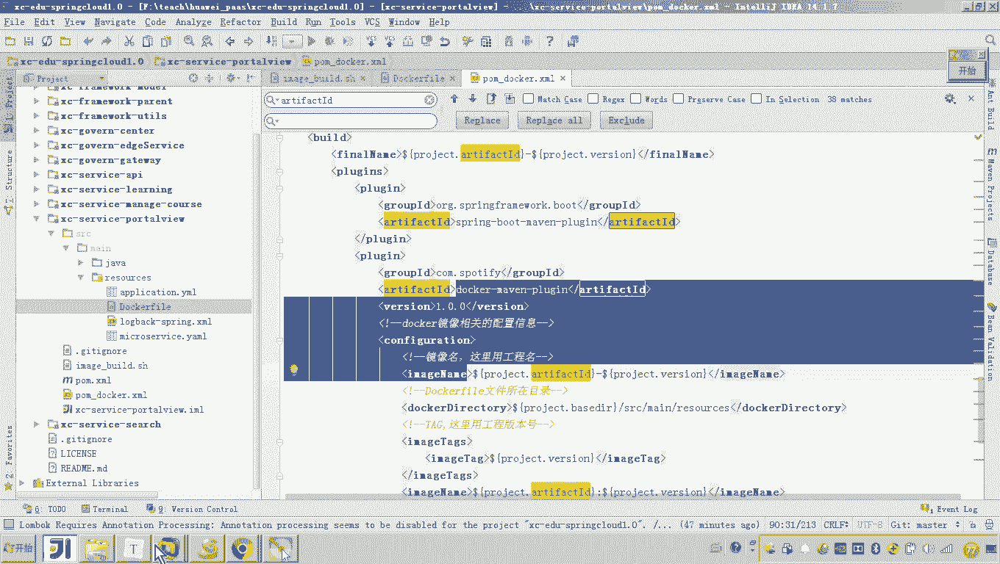

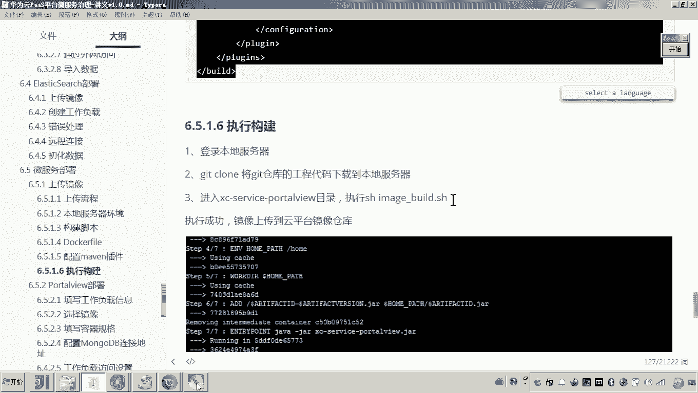

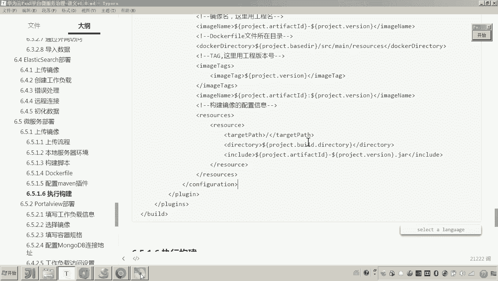