# 华为云PaaS微服务治理技术 - P112：04.学成在线项目部署-微服务部署-构建镜像配置 🐳

在本节课中，我们将学习如何为学成在线项目的微服务构建Docker镜像，并将其上传至华为云容器镜像仓库。我们将重点介绍构建镜像的完整流程、关键脚本的编写以及相关配置文件的准备。

## 微服务部署流程概述

上一节我们介绍了基础服务的部署，本节中我们来看看微服务的部署。微服务的部署流程与之前类似，首先需要确定镜像，然后创建工作负载。对于微服务，我们创建无状态工作负载即可。

最关键的区别在于镜像的构建。因为微服务是我们自己编写的Java程序，所以需要自行编写Dockerfile文件来构建镜像。

## 镜像构建与上传流程

以下是微服务镜像构建与上传到云平台的完整流程：

1.  **代码修改与提交**：开发人员在本地电脑上修改代码，并通过Git将代码提交到Git仓库（如GitLab或GitHub）。
2.  **拉取代码到构建服务器**：在一台已安装Docker、JDK、Maven和Git的“本地服务器”上，从Git仓库拉取最新代码。
3.  **构建镜像**：在服务器上，使用Maven插件执行编译、打包，并根据Dockerfile文件构建Docker镜像。
4.  **推送镜像**：为镜像打上包含华为云组织机构信息的标签，然后将其推送到华为云容器镜像仓库。

这一系列步骤可以通过一个Shell脚本实现自动化。开发人员提交代码后，在服务器上执行该脚本即可自动完成镜像构建与上传。

## 准备本地服务器环境

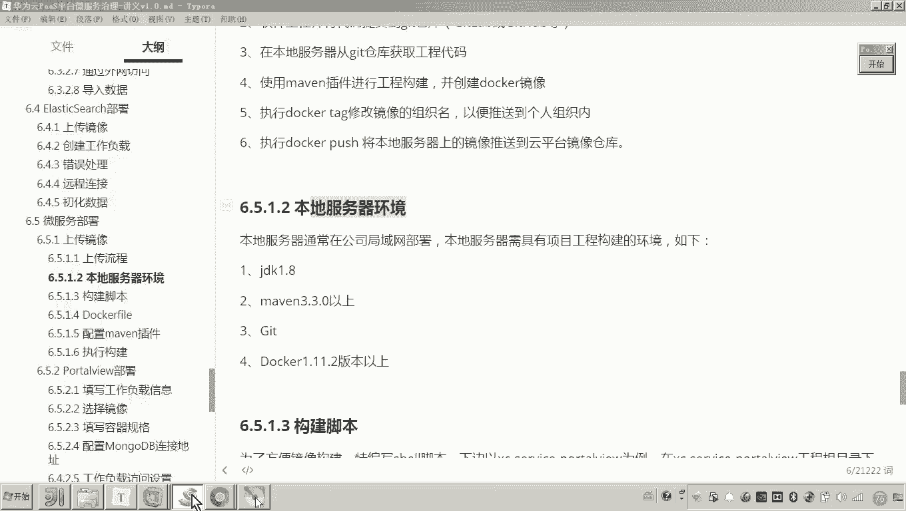

为了执行上述构建流程，我们需要确保本地服务器具备以下环境：

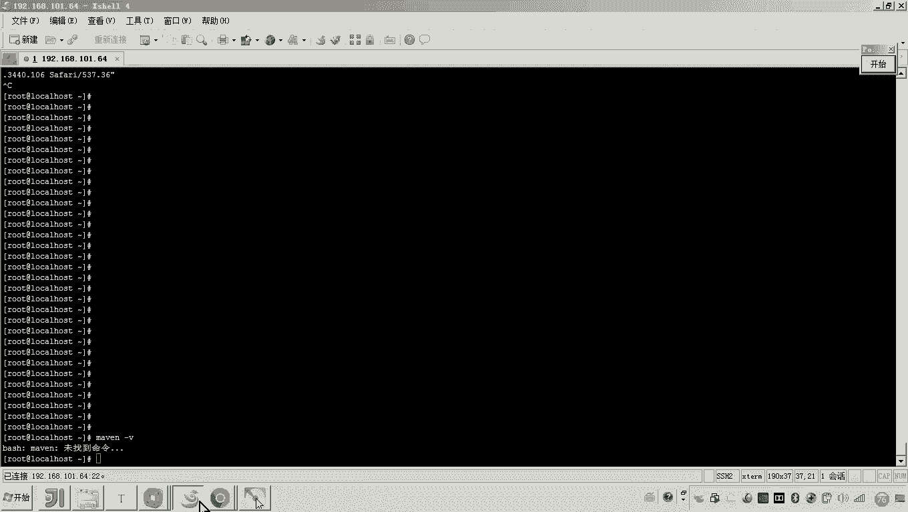

*   **Docker**：用于构建和推送镜像。
*   **JDK 1.8**：Java程序运行和编译环境。
*   **Maven 3.3.0+**：用于项目的编译、打包和依赖管理。
*   **Git**：用于从Git仓库拉取代码。

## 编写镜像构建脚本

接下来，我们以 `portview` 微服务为例，编写自动化构建脚本。该脚本的核心是使用Maven插件来构建镜像。

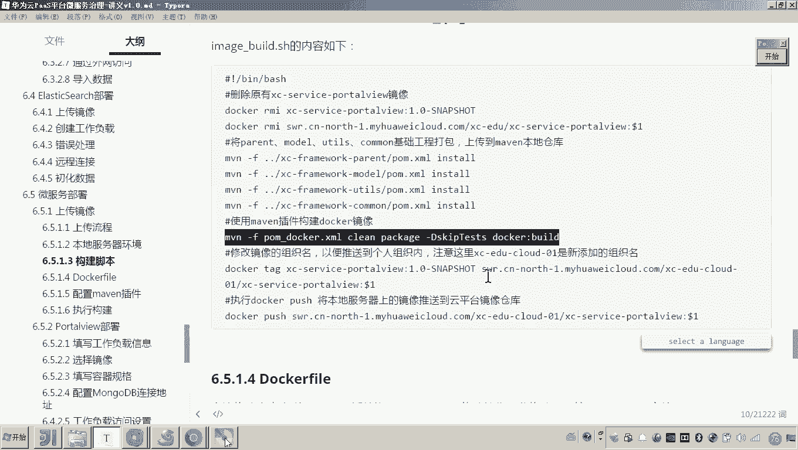

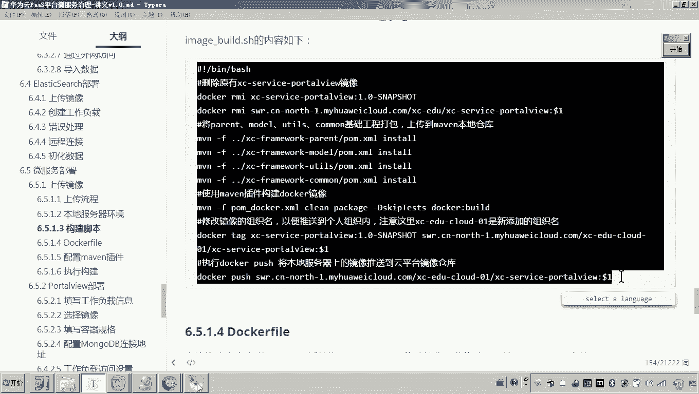

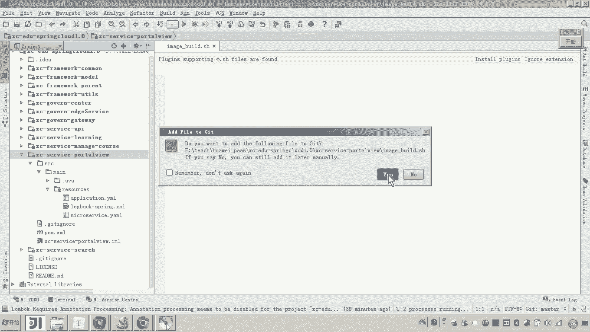

脚本的主要功能如下：
*   清理旧的本地和云端镜像。
*   将项目依赖的父工程、工具类等模块安装到本地Maven仓库。
*   使用Maven插件（配置在 `pom_docker.xml` 中）执行Docker镜像构建。
*   为构建好的镜像打上华为云组织机构的标签。
*   将打好标签的镜像推送到华为云容器镜像仓库。

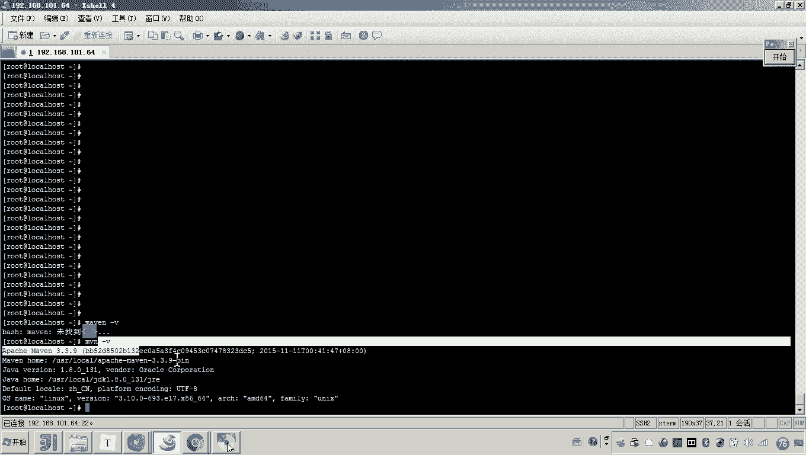

脚本内容示例如下（请根据实际的组织机构名称和版本管理策略进行调整）：

```bash
#!/bin/bash
# 定义变量
ORG_NAME="swr.cn-north-4.myhuaweicloud.com/xc-edu-01"
SERVICE_NAME="portview"
VERSION=$1 # 从命令行参数获取版本号，例如 1.0.0

# 1. 清理旧的本地镜像
docker rmi $SERVICE_NAME:1.0-SNAPSHOT 2>/dev/null || true
docker rmi $ORG_NAME/$SERVICE_NAME:$VERSION 2>/dev/null || true

# 2. 安装依赖模块到本地仓库
mvn clean install -pl ../xc-framework-parent -am
mvn clean install -pl ../xc-framework-common -am
mvn clean install -pl ../xc-framework-model -am

# 3. 使用Maven插件构建Docker镜像
mvn clean package docker:build -f pom_docker.xml

# 4. 为镜像打标签并推送到华为云
docker tag $SERVICE_NAME:1.0-SNAPSHOT $ORG_NAME/$SERVICE_NAME:$VERSION
docker push $ORG_NAME/$SERVICE_NAME:$VERSION

echo "镜像 $ORG_NAME/$SERVICE_NAME:$VERSION 构建并推送成功！"
```

## 编写Dockerfile文件

Dockerfile是构建镜像的蓝图。我们需要在微服务项目的 `src/main/resources` 目录下创建它。

一个典型的Spring Boot应用Dockerfile内容如下：

```dockerfile
# 基于Java 8官方镜像
FROM openjdk:8-jdk-alpine
# 设置环境变量
ENV ARTIFACTID portview
ENV VERSION 1.0-SNAPSHOT
# 设置工作目录
WORKDIR /app
# 将构建好的jar包复制到镜像中
COPY target/$ARTIFACTID-$VERSION.jar app.jar
# 暴露应用端口
EXPOSE 63040
# 启动命令
ENTRYPOINT ["java", "-jar", "app.jar"]
```

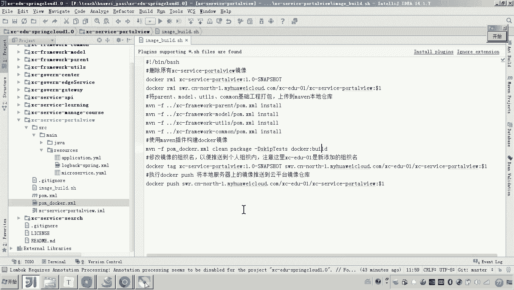

## 配置Maven插件

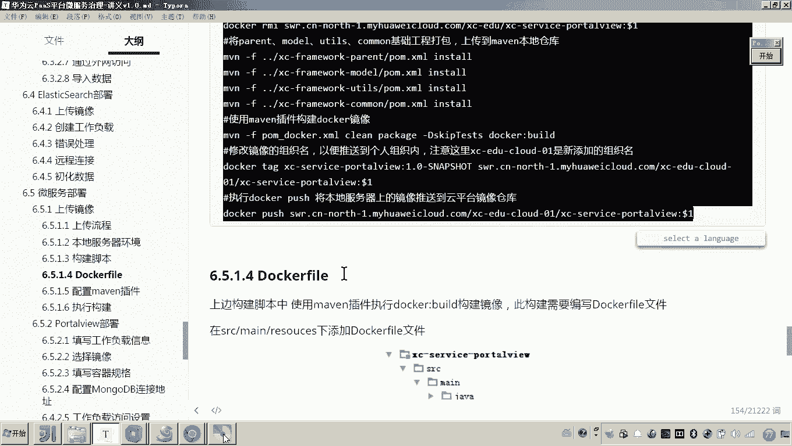

为了在Maven构建过程中集成Docker镜像构建，我们需要一个专门的 `pom_docker.xml` 配置文件。该文件的核心是配置 `docker-maven-plugin` 插件。

关键配置项包括：
*   **镜像名称**：引用项目的 `artifactId`。
*   **Dockerfile路径**：指向我们刚编写的Dockerfile。
*   **构建参数**：可以传递参数给Dockerfile。

配置片段示例如下：

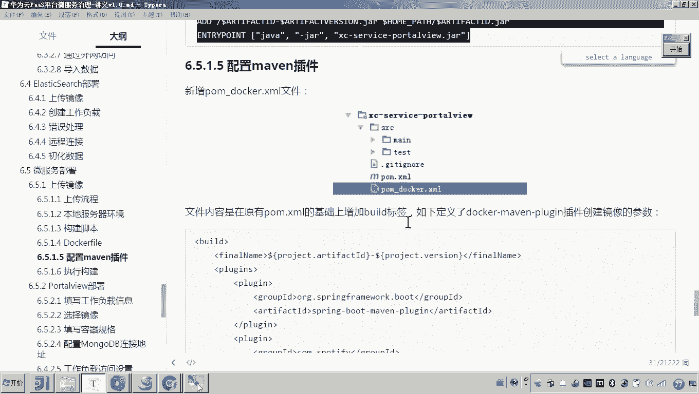

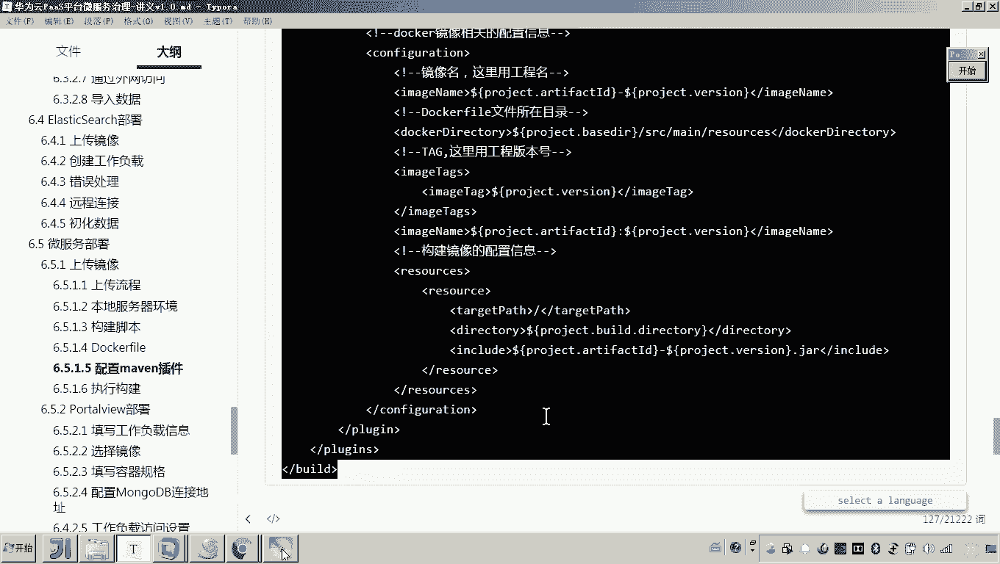

```xml
<build>
    <plugins>
        <plugin>
            <groupId>com.spotify</groupId>
            <artifactId>docker-maven-plugin</artifactId>
            <version>1.2.2</version>
            <configuration>
                <!-- 镜像名称，使用项目artifactId -->
                <imageName>${project.artifactId}</imageName>
                <!-- Dockerfile文件所在目录 -->
                <dockerDirectory>${project.basedir}/src/main/resources</dockerDirectory>
                <resources>
                    <resource>
                        <targetPath>/</targetPath>
                        <directory>${project.build.directory}</directory>
                        <include>${project.build.finalName}.jar</include>
                    </resource>
                </resources>
                <!-- 镜像标签，这里使用固定版本 -->
                <imageTags>
                    <imageTag>1.0-SNAPSHOT</imageTag>
                </imageTags>
            </configuration>
        </plugin>
    </plugins>
</build>
```

## 提交代码并准备构建

完成以上所有配置后，我们需要：
1.  将修改后的代码（包括脚本、Dockerfile、pom_docker.xml）提交到GitLab仓库。
2.  在准备好的本地服务器上，使用Git克隆或拉取该项目代码。
3.  进入项目目录，为构建脚本赋予执行权限：`chmod +x build_image.sh`。
4.  执行构建脚本并传入版本号参数，例如：`./build_image.sh 1.0.0`。

脚本将自动执行构建、打标、推送的全流程。完成后，你可以在华为云容器镜像服务的对应组织机构下查看到新上传的镜像。

## 总结

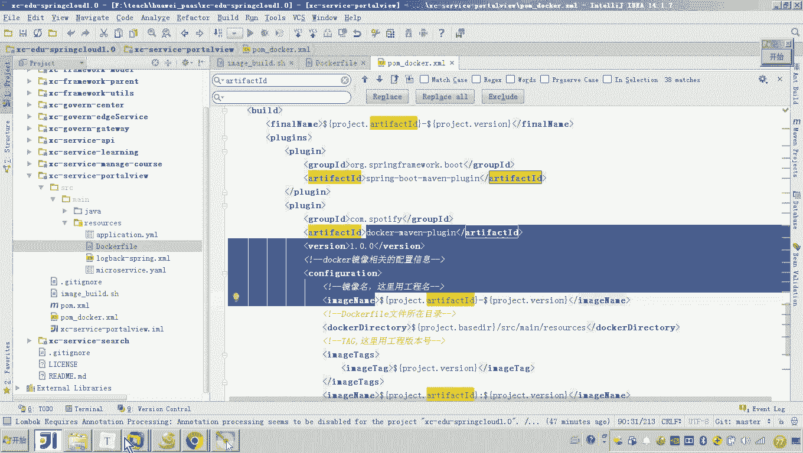

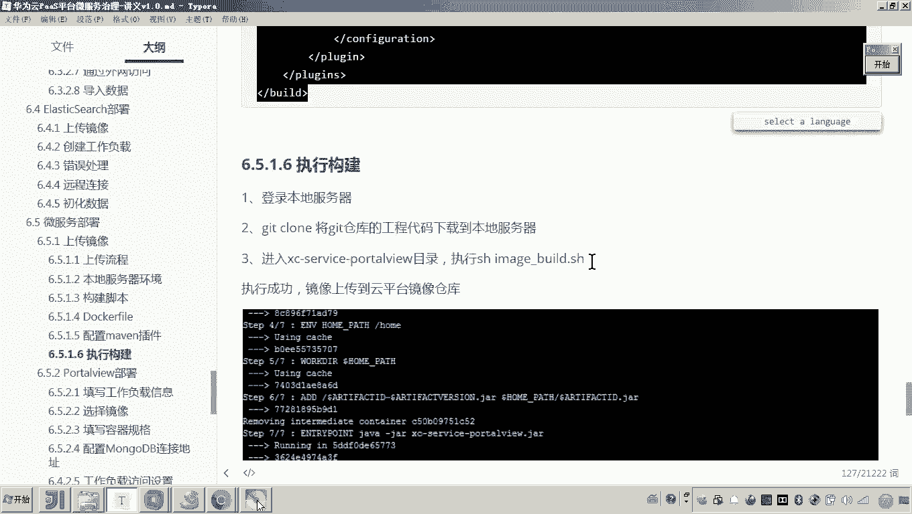

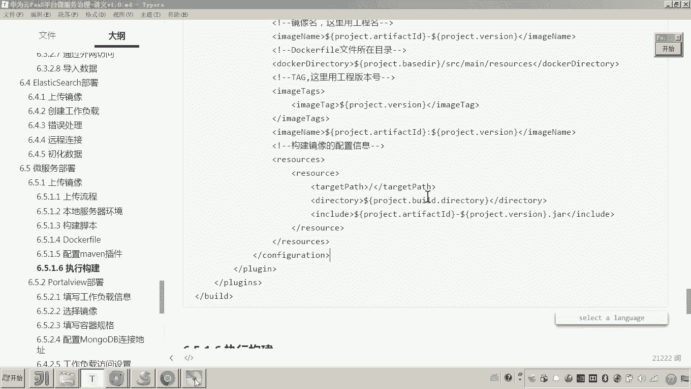

本节课中我们一起学习了微服务镜像构建与上传的完整流程。我们掌握了如何编写自动化的构建脚本、定义Dockerfile以及配置Maven的Docker插件。这些工作为后续在华为云CCE上创建微服务工作负载打下了坚实的基础。下一节，我们将利用构建好的镜像，在云上部署并运行我们的微服务。