# 华为云PaaS微服务治理技术 - P113：05.学成在线项目部署-微服务部署-构建镜像构建与上传 - 开源之家 - BV1wm4y1M7m5

好，那么刚才呢我们把这个构建镜像的这个脚本呢都已经写完了，包括这个docker file文件和ma问插件的配置呢，我们都配好了。那有说老师看的这些配置呢，好像我好迷惑是吧？

其实这些呢都是呃各位其实像这个比如我举个例子，像这个ma插件的配置这里头啊，呃基本上所有的这个功程呢都可以用相同的这个配置信息。😊，啊，为什么呢？

因为你看到我这里边引用的是不是都是上变我们配置的这个名称啊，所以我们这儿我这儿都没有写死啊，回头我们去构建其他这个微服务的镜像的话，你就把你就把这个插件呢复制到它的这个泡m文件里边就行了。

但是我要建议你干啥呀，你单独给我定义一个泡沫下划线刀口。哎，单独单独做一件事。😊，啊，这样的话我们说去构建docker呢，我们用了这个po。

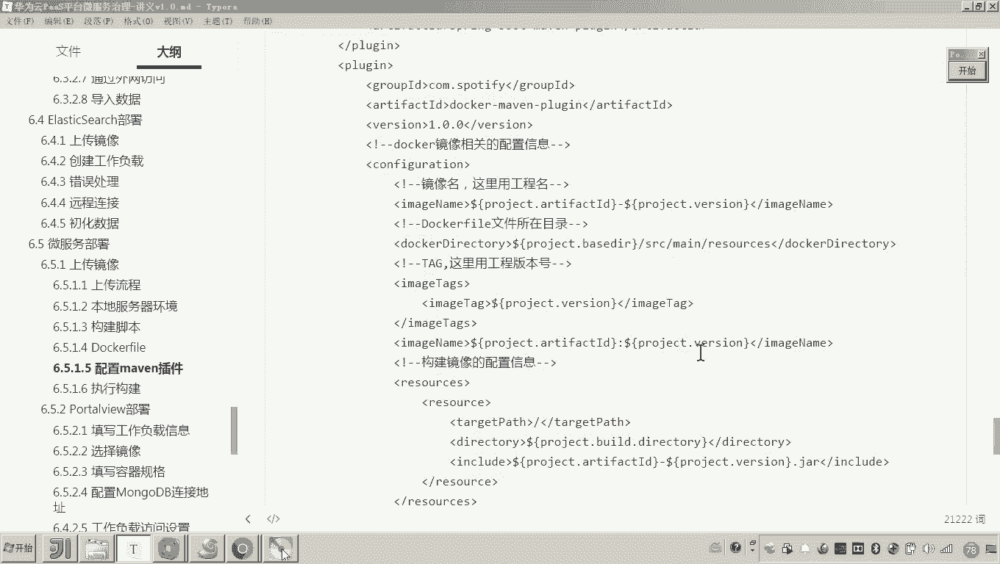

好。然后现在呢，我们就准备去执行构建。好，那么这个执行构建怎么做呢？

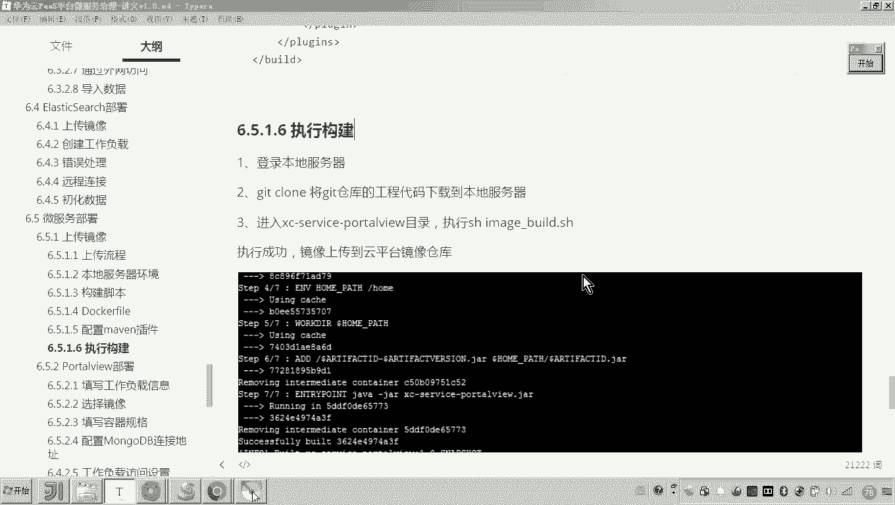

首先啊你肯定是按照这个流程图呀，你要先把这个代码哎把它部许到这个get lab上。那这个get lab呢这是一个局域网搭的一个get仓库。嗯，那这个这个这个搭建get lab的过程呢呃在这个课程当中呢。

在这个我们的pass平台微服务治理里边这个课程啊我就不讲了。然后呢想参考的话，你可以自己上网去找一下get lab的安装的流程啊，以及你也可以参考这个学生在线的相关的课程内容。

学生在线在最后阶段呢呃讲部署的时候呢，就是采用的这个get lab，然后呢来管理我们这个代码。所以你可以参考一下。😊，好，那么这样的话我们来看一下这个get呢，其实我都已经起起来了。

这是我局域网的一个什么呀一个服务器啊。那这个服务器这里边呢大家可以看到呃，在这在这这个就是我们的这个get仓库。这里头的代码呢，就是和我这个clipse上边的这些代码都已经对应了。

那大家可以看到刚才我修改了一些文件，你看这个颜色它是不是就变化了。嗯，所以这里边呢我们就把刚才你加的这些文件呢，我们把它呃提交到这个仓库当中。好。😊，首先我们把它提交到这个本地的这个get仓库中。啊。

然后最后呢我们把它。p许到远程。Hao。😔，那这样的话，我们这个就铺ush成功了。那 pushush成功了之后呢，呃，其实你可以进到我们的这个。get lab的这个仓库当中。

我们来查一下啊呃来看一下啊port view。刚才我是不是写了一个脚本，是不是叫隐魅姐bud点SH是吧？你看现在这个东西是不是已经上去了？啊，并且这里边是不是说是24秒之前，对吧？好呃。

那现在呢我们是不是就可以这么做呀？你再看我这个图，接下来怎么做？😊，这个代码是不是我已经部取到这个gitlab上了，下边我们是不是要登录本地服务器来从这个getlab上边把这个代码呢给它克隆下来，对吧？

好，那现在呢我们就登上去。😊。

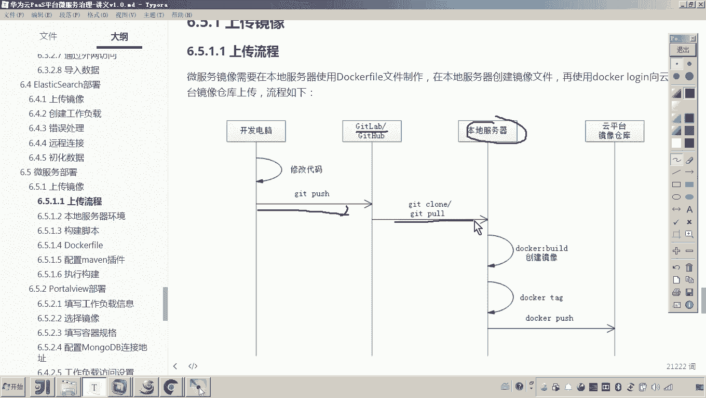

登上去呢，我们都进到root下边，然后这里边呢注意。😊，呃，这里边呢我们去建一个什么呀，建一个目录吧啊，建一个目录。好，这里边呢我们就建一个目录啊XCEDU。Cud。杠02。好，那么我建一个目录。

我的目的是什么呢？哎，其实我的目的很简单，就是在这儿呢执行什么呀，执行get克隆，对不对哎。😊，然后克隆怎么怎怎么怎么克隆呀，你就找到这个。

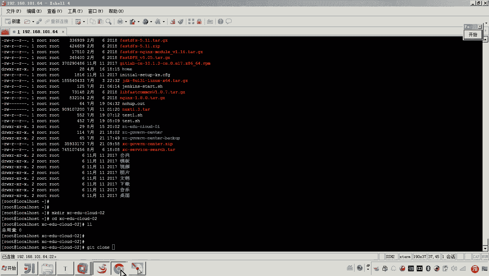

啊，这个仓库的这个。地址。然后呢，复制注意呃，这里边注意啊，我看一下我写我把它稍微改一下。😊。

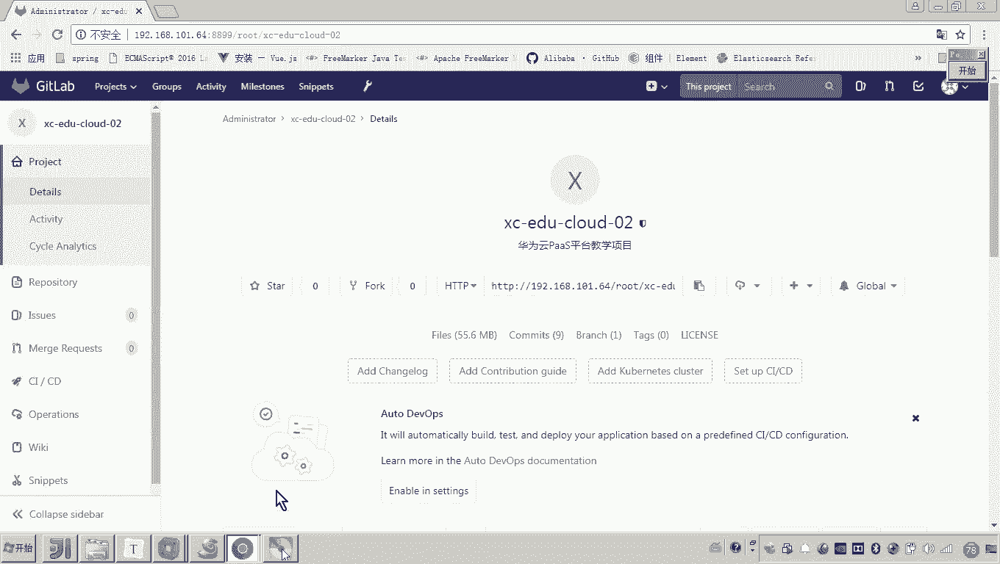

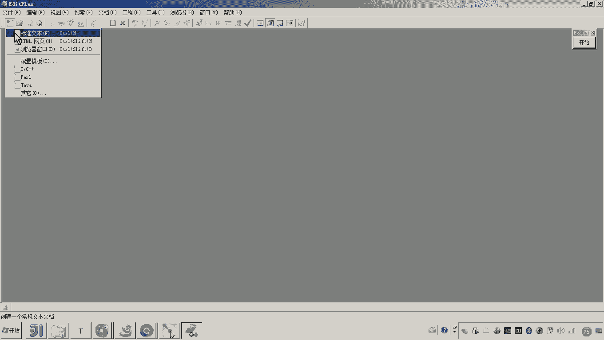

就这儿我要加一个端口，因为我这个get lab的环境大的有有一些问题。这个端口呢这里面没有给我加上去。好，那现在呢我们就把这个代码呢。😊。

啊来执行一下嗯。然后我们输入这个名。和账号密码。好，现在他就开始克隆成功了。好，那么这个克隆成功了之后呢，大家可以看到啊，这个所有的代码是不是都已经下来了，对吧？好，那这个代码下来了之后。

接下来要做什么呢？哎，那按照这个图上来说，你现在是不是已经克隆成功，你接下来要做的是不是就开始执行什么呀？脚本了，对不对？哎，执行脚本好，那这个脚本这个这个脚本怎么执行呢？执行哪个脚本呢？😊。

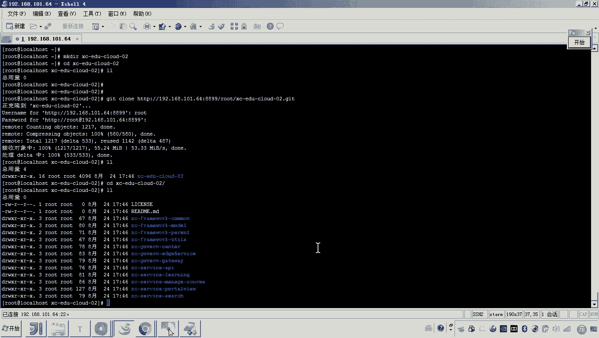

就这个脚本执行哪个脚本。对我刚才是不是在这个。在这个配置的时候，我是不是最先构建的就是这个尹魅age下划线buil的呀？😡。

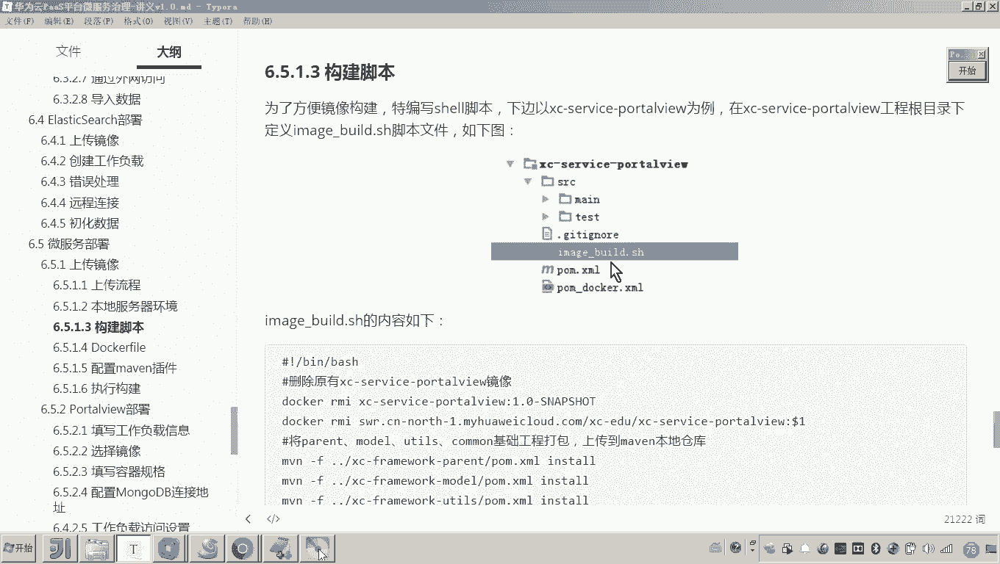

所以你进到这个port view当中，我们来看这里边是不是有一个有一个脚本啊，对吧？哎，有一个脚本。那这个脚本呢大家再来再来看一下啊，再来看一下。😊，嗯。首先呃我要删除啊执行刀cker命令。

删除原有的镜像。嗯，然后呢如果有这个啊更改了组织这个名称的这个镜像呢，我也把它删掉。😊，好，然后呢再有呃就是这个呃把这个parent的还有model的这些这个工程啊，我们把它这个inst store哎。

打包insstore到本地仓库。这个本地仓库其实就是我这个。😊，这个这个这个10164的这个服务器的一个仓库嘛。嗯因为我一会儿要编译，要打包这个port头 view的时候，他要用依赖的这些东西。😊。

然后这一步这一步是不是就找到了这个呃找到了就是当前目录。你看这个是不是我前面没有加这个路径啊，当前目录下的这个p下划线docker点菜l，然后执行clean packaging。嗯，然后呢。

docker冒 build来构建镜像构建完了之后，你是不是就把因为你构建的镜像名字是不是它呀？然后你是不是就把这个新的这个镜像呢改一个组织，哎，然后呢然后push到这个什么呀？这个这个这个。😊。

云平台对吧？但是各位我们回忆一下，你想把本地的镜像，本地服务器的镜像普及到云平台，你要做一件事儿。😊，就是如果你不登录，没有认证，没有登云平台行吗？😡。

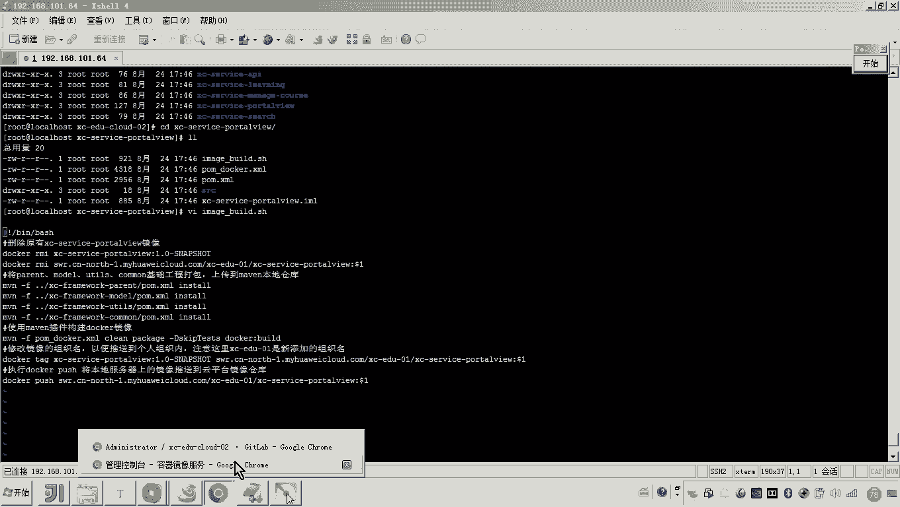

有人说这个我怎么忘了，对吧？来，各位看好看好客户端上传这。我当时是不是说过这几步啊，是不是在这个第二步里边是不是要执行一个docker login，然后你就复制这个临时的脚本。嗯。

然后在你的这个服务器上边呢干嘛呀？对你先去。😊。

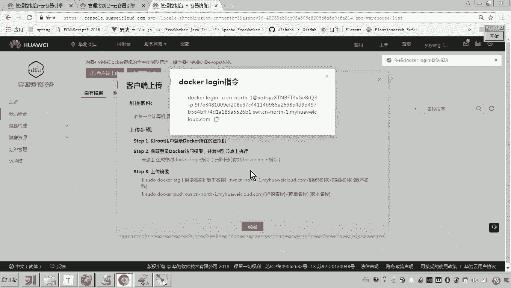

哎，你先去认证一下。啊，就认证一次就行了。然后接下来我们就执行那个脚本是不是就可以啊？对，一定要先做这一件事啊，先做这一件事。😊，好，那么这个认证通过了之后，我们是不是就可以执行这个脚本了呀？😊。

大家来看现在执行这个脚本，这个过程首先是不是就开始去哎这个什么呀？parent。😊，这这是不是就开始parent构建parent，然后上传了啊，把把它放到这个什么呀，这个本地仓库。

然后接下来就开始去打包，打包这个这个这个太快了啊，打包这个port view。😊，哎，然后接下来看好看好，这是这这是不是构建port view镜像，然后往下往下走。😊，好，这个过程这全部是脚本自动化的。

好，这个过程大家看到这个提示，这就是在构建镜像构建镜像。嗯，好了，你看这里边报错了。😊，报啥错呀，你看这。😡，说啥呀哦，说你这个嗯无效了，这个什么tag无效。哎，这是啥意思？😮，哎，我刚才是不是说过了。

在执行这个命令的时候，我们是不是要传一个参数呀？😊，对不对？传啥参数啊？😡。

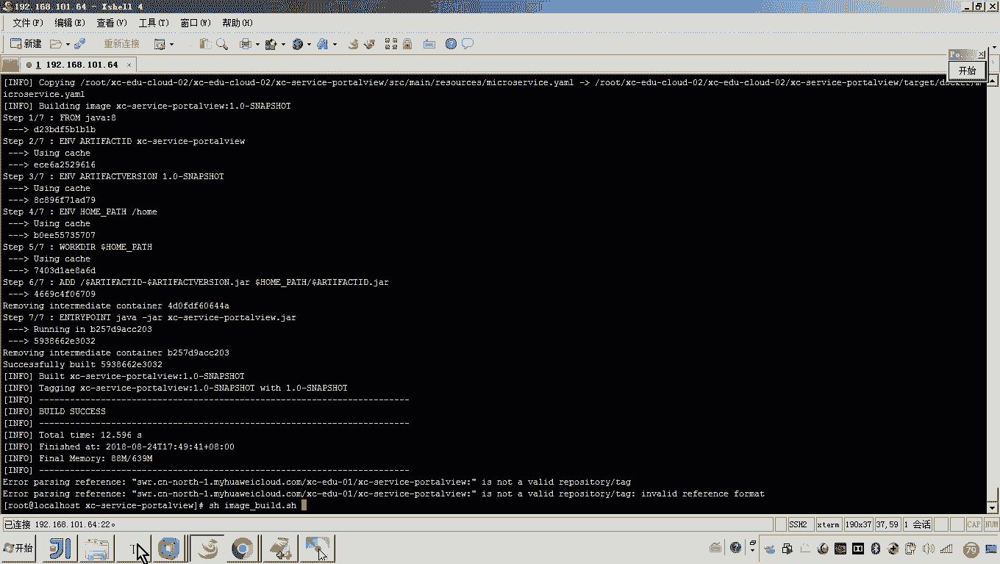

有人说老师这这这传啥参数？😡，因为我们这儿我加了是不是加了一个doer一啊，这个doer一是不是就是表示第一个参数啊，你是不是要传一个版本号，对不对？没错，所以我刚才就落了。对，这样执行这个命令才正确。

😡。

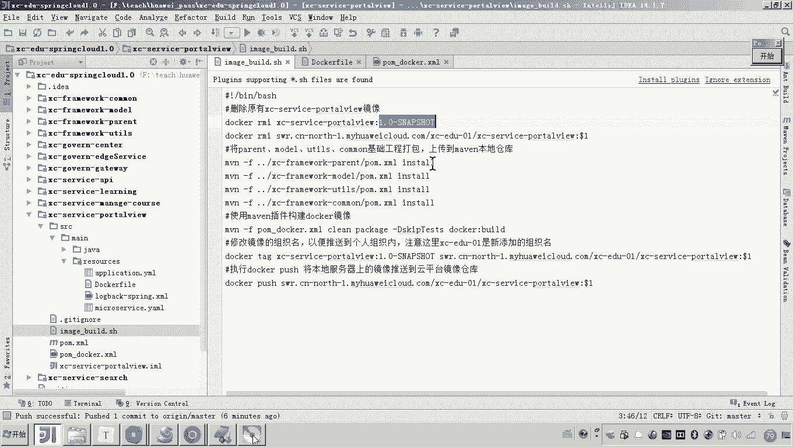

明白吧？哎，现在我们再执行一遍，他就把原来生成的这个镜像给删掉了，然后重新再来打包，再来这个编译打包，然后呢哎构建镜像，看好这个过程。😊，然后大家来看啊，现在你看这个这一句提示是不是就构建镜像，哎。

构建镜像成功了啊，构建镜像成功了。只要构建镜像成功，各位我们现在就完全可以在我们的本地的这个docker镜像当中去查到了。并且你看这一步干啥，是不是就开始向云平台来push？😊，我们的镜像了。

对大家可以看到是吧？总共这个镜像是66。15兆，对吧？你看现在就这样过，等这个 push续成功了之后，我们再回到我们的云平台上边来。那么在这里哎因为我们是不是把这个镜像放到了这个组织下边了。

所以哎我们这这刷新，你就能够看到了啊，现在还没有构建成功。嗯，大家看。😊。

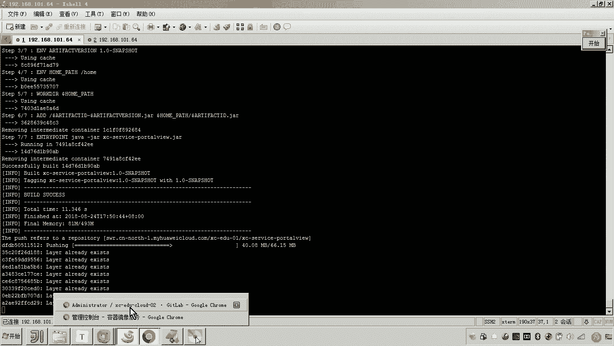

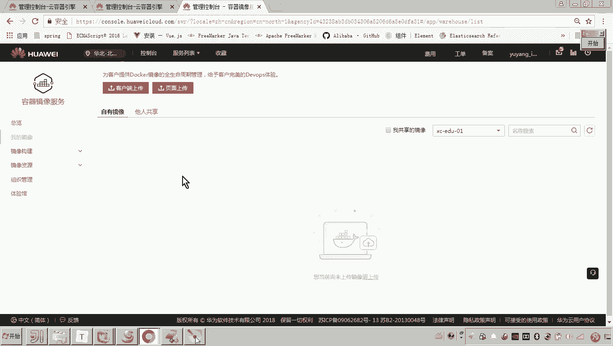

哎，你看啊，这是不是已经 pushush完成了，然后呢，稍等片刻，这个构建这个镜像的过程呢呃与网速有很大的关系啊。嗯，如果你的网速慢的话，那那你上传的也很慢。哎。

同时哎通过这个老师的这个实践哎发现呃这个一天当中呃这个每个时间段呢，比如说到到到到这个下午的时候呢，可能我可能这个由于平台这个云平台用的人数稍多一下。那这个它的这个上传的速度就稍微慢了。

然后上午呢非常快。😊，大家看。那现在呢还在还还还没有彻底的上传成功啊，还没有彻底的上传成功。那这里边呢应该是也是刷不到的啊。😊。

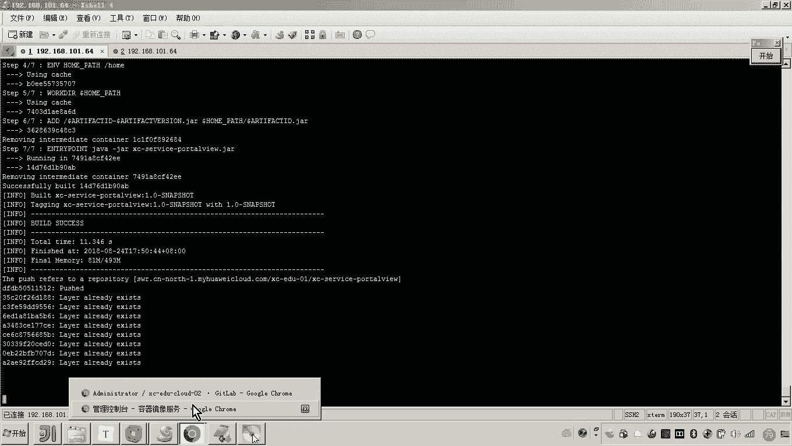

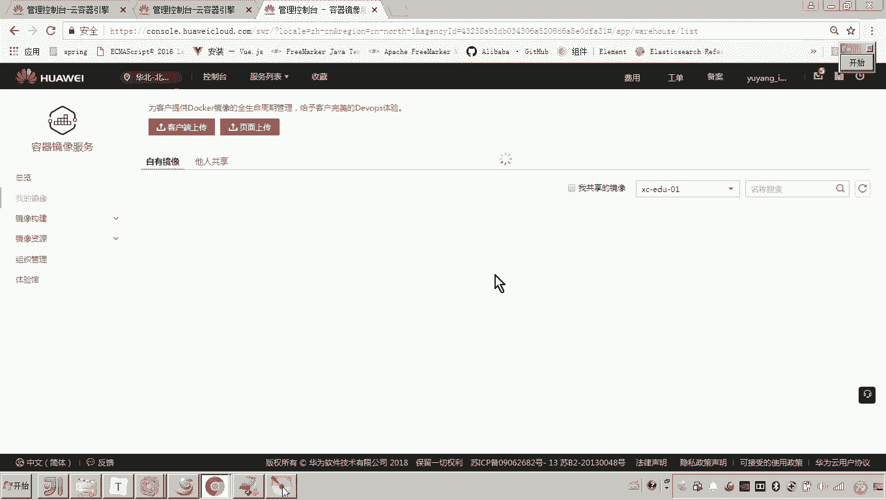

啊，必须必须等什么呀？必须等这里边报一个提示，说这个上传成功啊才行。嗯，好，你看现在的话是不是就成功了啊，那么成功了之后呢，我们现在回到这个平台上边，我们刷新。😊。

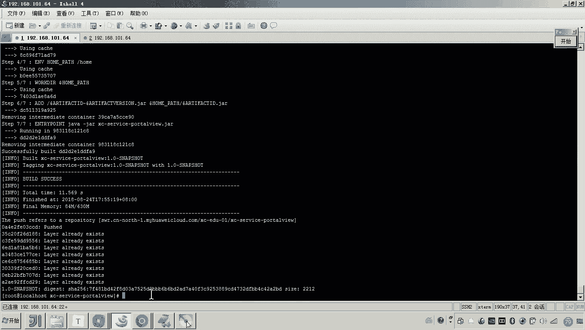

那大家可以看到哎，这个镜像是不是就成功了？好，那么这个过程呢就是我们说的把我们这个微服务呢使用这个脚本的方法啊，然后呢先把这个镜像自己构建出来，哎，然后呢再上传到这个云平台。

那以上呢就是我们呃这个上传镜像啊，执行构建的整个过程啊，然么然后呢，咱们就完成了这个port头 view镜像的创建，并且把它上传到了这个云平台。

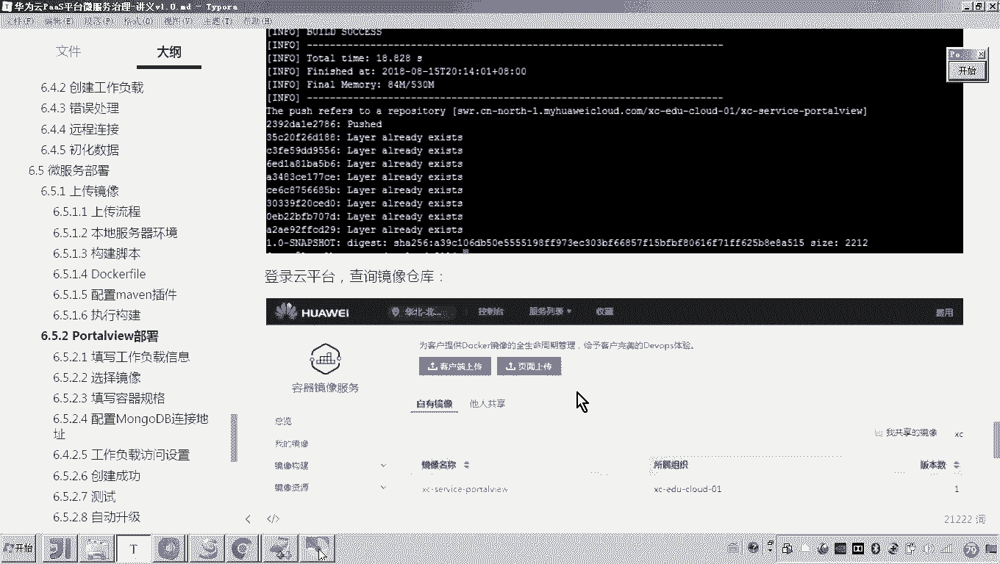