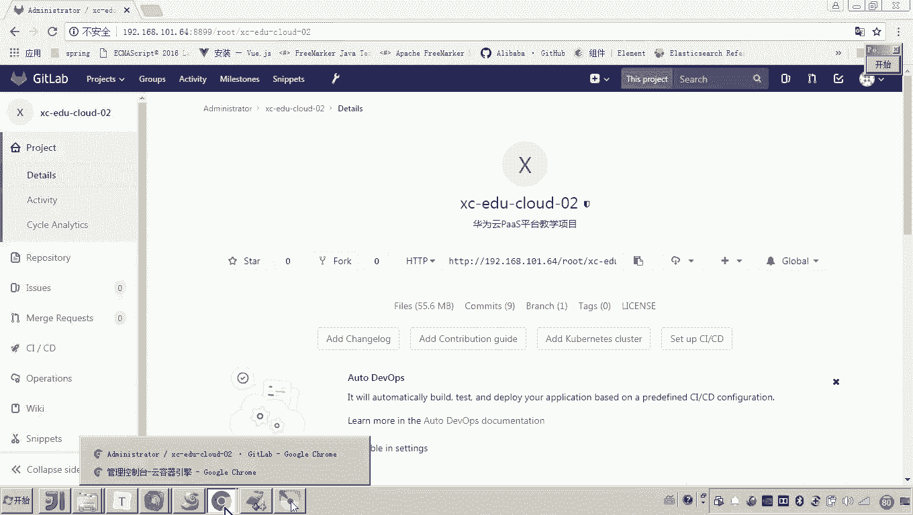
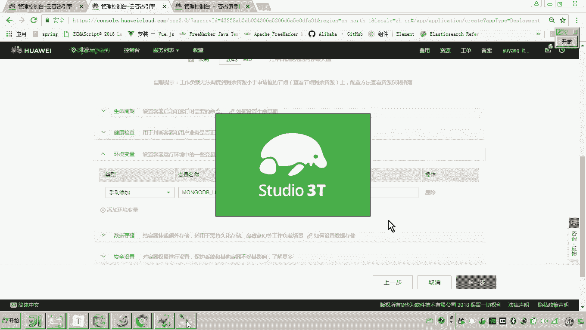

# 华为云PaaS微服务治理技术 - P114：06.学成在线项目部署-portalview-创建工作负载 - 开源之家 - BV1wm4y1M7m5

好，那么下边呢我们就来部署哎port view啊。好，刚才呢我们是不是完成了呃这个port view镜像的上传呢？那现在我们就来创建工作负载，来实现port view微服务的部署。好，那这怎么做呢？啊。

昨天呢我们是不是已经完成了这个mo的地呀啊eastic search啊它的部署啊。那这个过程的话跟昨天的方式一样，哎，创建工作负载啊，只是我们先要确定一下，我们创建的是呃是一个什么样的工作负载呀。

是一个有状态的还是无状态的呢？😊。

哎，我说了这个在运行过程当中，如果哎需要对数据进行持久化，然后呢，有一些数据的状态发生变化，哎，需要记录我们呢是不是就要创建有状态的呀？而这个微服务的话，各位它是不是就运行了一段加8程序啊？

而这段加8程序的话，你复制多份，是不是也非常的呃非常的方便，对吧？所以我们把它创建成一个无状态的工作负载，也就它不需要记录这个运行过程当中记录数据的这个状态。好，那现在呢我们点击创建啊。

然后这里面我们输入这工作负载的名称。😊。

好，然后这个集群呢就是所属我们说的这个EDU02这个集群。嗯，然后这个实例呢，我们就是一个默认默认默默认起一个这个容器就行了。然后下一步好，然后添加。

然后添加容器这里边呢，我们选择什么呀啊，刚刚我们上传上去的这个portto。那这边组织名称是不是老是把它上传到这个EDU01里头了？哎，好，那这里面我们选择哎选择选择完了之后呢，我们怎么弄啊，点击确定。

😊。

好，那现在这个容器的名称呢，我们也给他起个名。😊，好。

那这个CPU和内存的这个分配呢，大家注意我们这个怎么写呢？呃，这个呢我们来适当的把它稍微高一些啊，适当的高一些，就这个是0。5。😊。

啊，0。5这个是一，这个是1024。这个是2048。好，因为呢我们这个加va程序啊，我们加va程序这里边呢呃它。😊，我们对这个CPU的这个这个这个这个内核呢啊通过测试呢。

我们发现呢我们这个spring开发的这个加格程序对CPU的要求还是有一些要求的。所以我们把它初始的这个啊写成这个0。5。哎，好，然后呢来看下一步。那这里边呢各位。😊，那在这里边呢。

是不是这个环境变量和数据存储需要配嘛？这是需要关注的。这时候我们打开这个portview个程序，我们看一下呃，看一下这个程序有没有些配置文件，配置项的信息需要传进去，对吧？

那比如说比如说各位我们来看这些东西是不是都没有啊，对，这些都没有啊。😊。

然后关键你这个这个这个端口，这个端口是不是也不用啊，因为一个容器里边是只有我们的一个这个微服务啊，所以这个端口呢我们写死就可以了。然后关键就是这里头的它和外界有没有联系呢？好。

这里边就有一个mongoB的连接，看见吗？所以这个连接这个连接，一定要通过这个环境变量把它传进来。各位，所以所以在这里。😊。

我们要配置环境变量。而环境变量这个值呢就是什么呀？就是我们这个mongoDB的这个连接串。😊。

懂我意思吧？比如说老师下边要配备，下边就不用了。因为下边这个有瑞卡我们是不是不用了，对不对？所以这些东西都不用看了。😡。

但是这个连接这个mongoDB的这个连接串，呃，我们配配成这样个样子，各位行吗？😡。

有人说老师咋不行呢？这个是不是连接它本机的这个2701器啊，对它在这个容器当中啊，容器里边有这个2701器吗？没有，所以这里边一定注意，我们需要找到mongoDB在内网的连接IP地址。😊。

因为当初我们是不是通过外网来连这个MgoDB。

当时老师是不是还给大家测试了？😊。

哎，我们通过一个mongodb的这个客户端，哎，我们回忆一下啊，最早啊我们去部署这个服务的时候呢啊把学生在线的这个服务啊，向这个CCE部署。我们是不是对当时是不是通过外网来连接这个。😊。

这个什么呀？这个这个这个mongoDB啊哎，那大大家可以看到，因为我这太多了啊，来，我给我给你找到找到这个mongoDB。😊。

看好啊。你找找啥呀，找工作负载呀，有状态的工作负载。各位，这是不是我的漫goDB当初我们连的是不是就199这个外网IP啊，对你可以看一下嘛。😡。

各位这个是不是可以连接？😊。

但是这是个外网地址，而现在你的这个内网程序，哎，就是我这个port view呀，如何通过集群内部来访问这个芒goDB呢？😡，那你可以点一下这个MgodB，你看它的访问方式。

现在是不是只有一个外网访问方式。如果你想内网访问，我们就需要再次添加。😡。

看懂了吧？再次添加。好，那现在我们来添吧。嗯，mongoB嗯随便写个名，然后集群内部访问。😊，对吧哎，然后呢。😊，这里边我们说容器内部芒godB在容器里面的端口是不是就是27017呀？对。

那么啊访问端口27017，你看懂了吗？这个和公网不一样啊，你通过公网访问它这个端口还有印象吗？它是有限制的。😡，这这个是他自动给我们生成的是吧，它只能是3万以上的，对不对？而现在通过内网访问这个端口。

你没发现吗？你可以自己定义，也就是说看好确定。😡。

你会发现它是不是自动给你生成了一个内网的地址？你通过内网的这个地址，各位容器与容器之间，我们就可以通过这个地址来访问了。😊，那有说老师那容器不能通过这个外网地址访问，不能访问不了。

所以我们只能通过内网来访问。好，你把这个地址拷贝到这个环境变量当中。😊，各位。来，这个就是环境变量的配置就搞定了。看懂啥意思了吧？所以你再来配置这个呃部署这个微服务的时候。

你一定要看这个微服务有没有一些配置项哎，需要我们通过环境变量传进去嗯。😊。

那你说老师还有啊，你这个数据存储，这个数据卷用加不用，那不用啊，因为你没发现一个规律吗？通常来说通常来说，像这种无状态的呃，这个工作负载一般都不用加数据卷，对吧？哎，好，下一步。😡。

那么这个添加服务我们就添一下吧。这个port view将来怎么访问呢？😡，可能有些同学就晕了是吧，老师怎么又添加一个服务，这个是不是就是我们port view部署的这呀？将来你是不是要访问他呀？哎。

我们先通过公网来访问这个过程我觉得大家很清楚了吧。哎，port view的端口是多少呀？你看一下port view的端口，它的微服务的端口是不是就是40200啊，这不是port的程序嘛？好，然后拿过来。

好，这个通过外网访问我们端口还让它自动生成。好。😊。

下一步，然后创建。各别来看这个port view的程序就创建成功了。看见了吗？对。

所以哎以上呢就是我们说的这个port view啊port view这个微服务的哎创建过程。那这个微服务的工作负载怎么创建呢？创建的方式跟我们之前一样，创建一个无状态的工作负载。然后这里边选择镜像。哎。

那这里边唯一不同的点就是你一定要看微服务里边它有没有一些配置项需要你通过环境变量去配置。哎，这里边我们说芒godb的这个连接串，我们需要通过环境变量，就前面这个环境变量，我们把它传进去。嗯，好。

那刚才我们是不是就完成了这个port view的这个哎工作负载来创建呀？那完成这个创建了之后，我们是不是就可以来看现在是不是就是运行中啊，哎运行中。好，那现在哎我们说这个是不是就完成了这个创建呢？

稍后呢我们再对它进行测试。😊。

