# 华为云PaaS微服务治理技术 - P116：08.学成在线项目部署-portalview-接口变更自动升级 - 开源之家 - BV1wm4y1M7m5

好，那现在呢我们就把这个接口呢把它改正确。嗯呃把这个接口地址改一下。好了，现在我们先来查一下源代码吧，这个源代码这里边我们看有啥问题。😊，呃，这个是我们说的一个base pass啊，然后这个是什么呀？

往下往下翻。😊，呃，接口。get是不是他对，但是你没发现吗？前面是不是有一个前缀呀，哎，有一个前缀，对吧？然后我们看一下。😊，哎，好像好像没问题吧。你看这个前缀它是不是个空字符串啊，那空字符串的话。

在空字符串在这儿的话。😮，啊，放到这儿的话应该没问题嘛，他控制不出不就相当于他吗？😊，哎，那是怎么回事啊？对，好，大家思考一下。哎，我估计你是思考不出来的。为什么这么说呢？

因为对于这个没有做过学生在线的同学呢，可能这里边他可能就遗忘了我们曾经改造这个接口的时候，我所做的一个动作，还有印象吗？当初我做这个动作的时候是这么做的。看好啊，我是在这个接口当中。

他原来是这么写的对吧？哎，然后呢，我把它移出来。😊，哎，然后我把他加到这儿了。😊，对。有说老师那有啥问呢，那有啥问题啊啊，但是你至少得知道我本地这个程序起来上传到云平台。😡，哎。

我们说这个本地的程序是没有问题，可以跑吧，可以正常没问题。但为什么这个东西一旦打包，然后呢构造成镜像啊，通过镜像来构来来来创建这个这个这个云微服务的这个工作负载，为啥就有问题了？😊。

对我给你我给你解密啊，注意清，我给你解密，它的原因非常简单，就是因为原来这个接口是不是它。😊，是这意思吧？哎，哎你现在是不是把我们说的这一堆程序是不是放在了这个本地的服务器上边，然后我们执行这个打包。

然后构建镜像，对吧？😊。

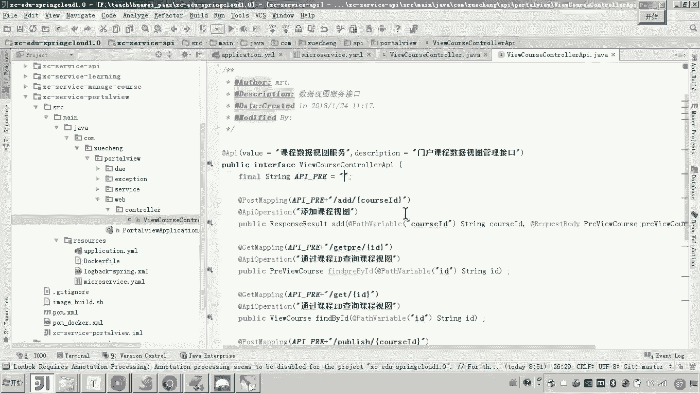

哎，但是你要注意有一点啊，看好在我这个构建镜像的这个脚本当中。😡。

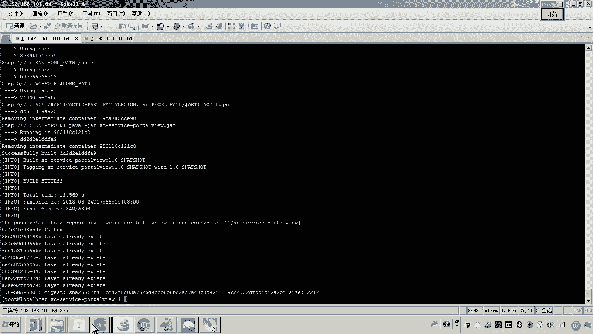

我为什么把这个副工程ins到把modelins到，为啥？😡，哎，因为我这个portto view这个工程要依赖这些工程，你要把这些东西打包了，然后把它干嘛呢？引s到到本地仓库。

也就是我们这个服务器上的这个仓库，本地仓库。😡。

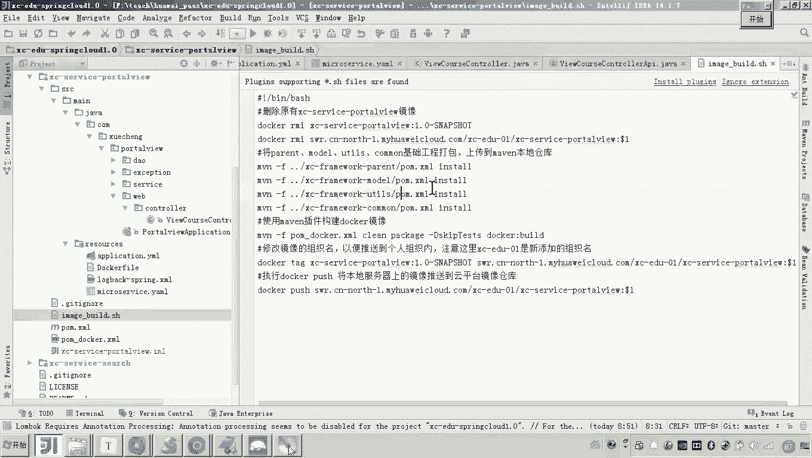

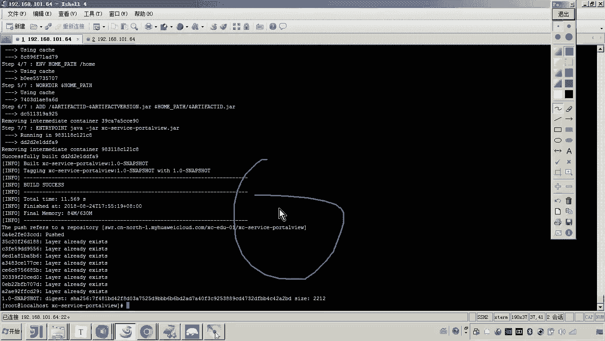

对，但是这里头我却少了一个非常重要的东西。😡，对，就是我们说的接口。叫做XCservice。API。为啥？因为我问你port头 view是不是也依赖API？😡，对，那我我就把这一句都落了。😡。

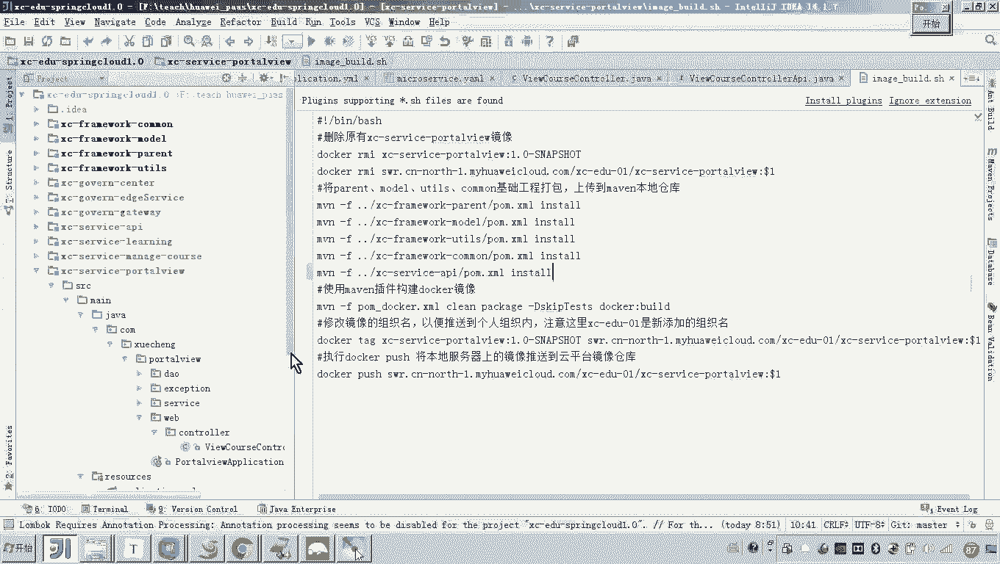

你落这一句啊不要紧啊，那要紧的是什么呢？要紧的是，在我这个服务器上这个本地仓库原来其实有1个API。而这个原来这个API是我早期的版本。所以我这构建的时候呢，他就把早期的这个版本的代码给拿过来。😡。

打爆了。明白我的意思吧？对，所以哎我需要在这里加这么一行对我原来的啊对我现在这个呃最新的这个API里边的这个代码呢，我要把它打包，然后映收到到本地仓库嗯。😡。

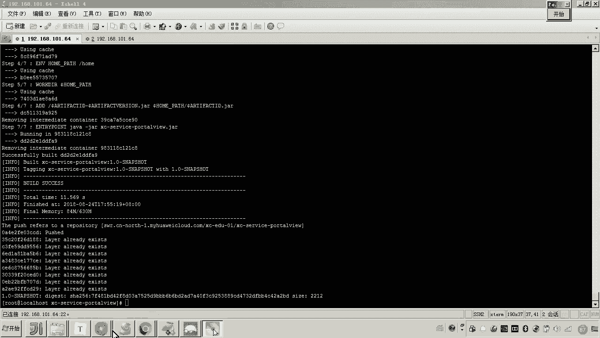

懂我意思吧？我再说一遍，因为portal view它依赖了很多东西，嗯，其中依赖了一个就是这个API工程的这个架包。而在我构建脚本的时候，我却没有实时的把这个API工程的架包给它打包。

并且因此倒到本地仓库。哎，那么在我这个服务器上边这个本地仓库里头，有一个原来老版本的API这个老版本的API代码呢，就被我去构建这个portal view的时候，把它这个代码呢拿下来了。哎。

它呢就用的老代码。而这个老代码当中有就是刚才我说的这种写法，就是说这个东西在哪呀？在这。😊。

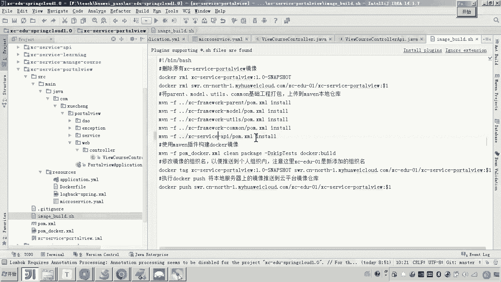

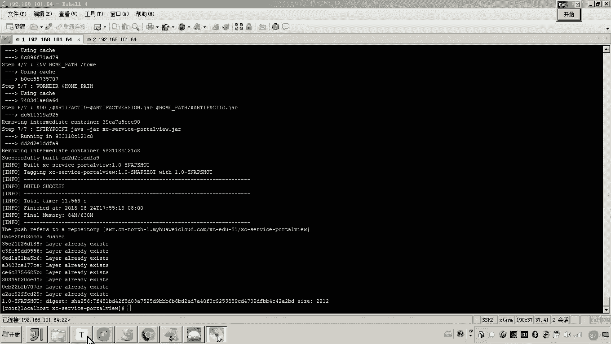

懂我的意思了吧？哎，好，所以我把这个说完了之后呢，你大概应该就知道咋啥意思了。对，应该说我这少了一句这么个东西。嗯，好，我把它我把它加盖加上去之后怎么弄啊？😡，那你就需要你是不是要把它给干嘛呀。

提上提到这个妹问，提到这个getget仓库啊。😡，对不对？😡，然后我们把它。我们把它 push许一下。这是不是就行了，看到了吗？哎。😊。

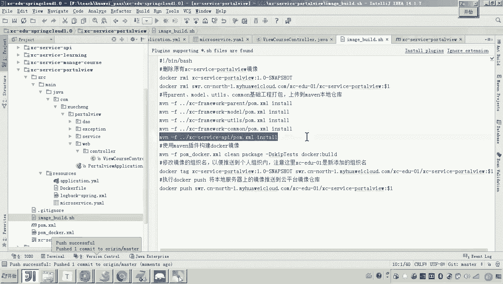

然后我们把它 pushush完了之后，各位然后在这儿各位接下来怎么弄啊？😡，就相当于我这个原来这个呃现在我这个云平台上边的我们云平台上边的这个什么呀，仓库当中的这个镜像。

应该说这里头是API的老版本的这个API的代码。懂啊，你现在需要把它给更新一下。😡。

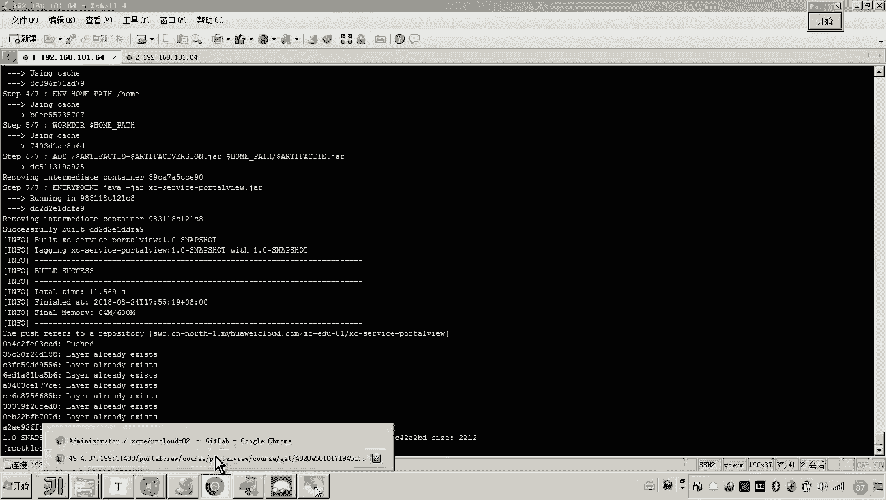

那这这怎么更新呢？😡，怎么更新呢？其实就是我们现在正要讲的这个章节，我们要升级了。对，我们要升级我们现有的这个容器了。那怎么升级？你需要升级里面的代码吗？你需要重新上传一个新版本的镜像。😊，好。

那现在我们就准备我刚才我刚才这个什么呀？我刚才这个这个这个这个脚本，我是不是已经这个发送到这个get仓库了。这个get仓库哎，我有了之后，我这儿是不是就可以怎么弄啊？😊。

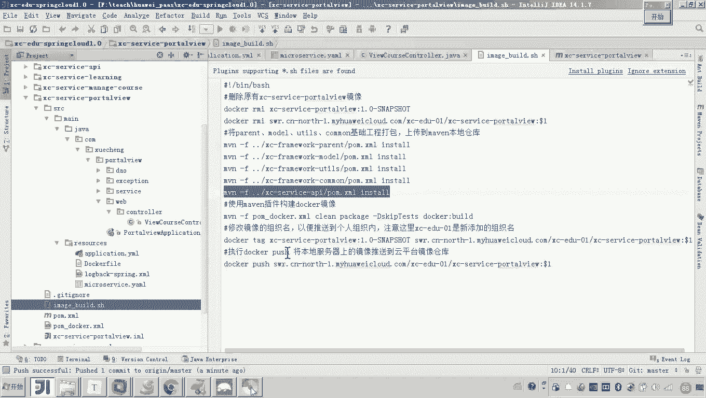

从本地服务器里面，从get的仓库里边，我把它拿下来是不是就可以呀？对。😡，看我现在是不是把这个拿下来了吧，拿下来之后注意注意看啊，我现在要重新构建镜像，重新往上上传了，注意听啊，非常关键。😡，好。

你现在进去这个serviceport view。我是不是要执行这个脚本，后边我是不是最初我是不是这么执行的，各位各位没错吧。😡，但是注意因为你现在是升级了，这个镜像升级了，你一定要在后边加版本号了。

否则。😡，否则你的已经部署的这个容器，对它会它是找不到最新的镜像的。你只能通过这个版本号来标识这个镜像是一个最新的镜像，懂我意思吗？也就是说这样的话，这样的话，我们把这个镜像构建成功，然后上传到云平台。

那么如果上传成功，在这里就会显示两个版本。😡。

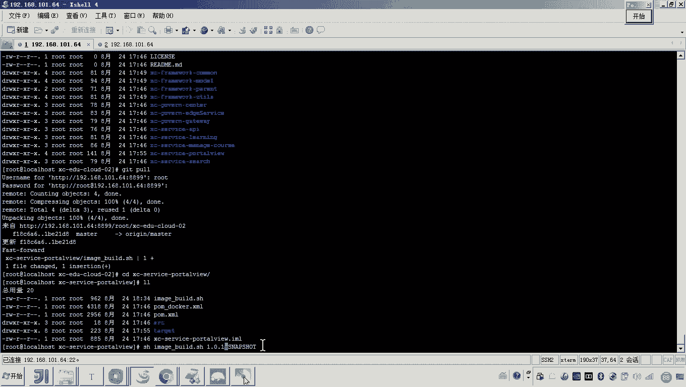

而回头我们就可以在工作负载当中针对最新版本的镜像重新升级。懂我意思吧？好，那现在我们执行这个事儿，要构建构建这个版本，你要往后加了。好，回撤。😊。

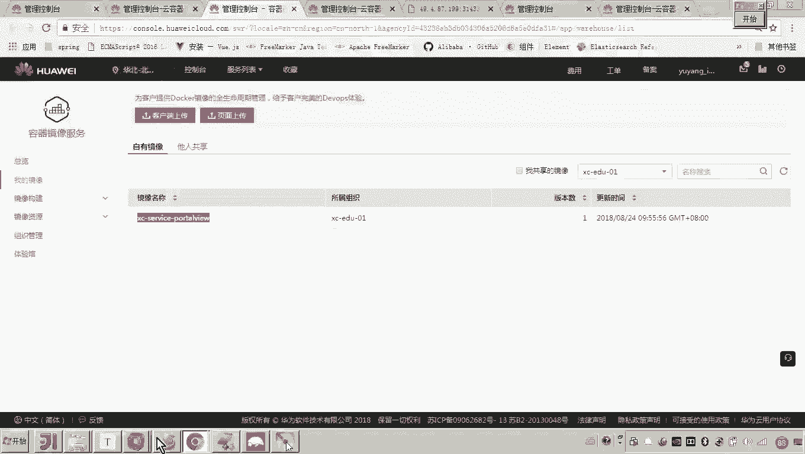

好，这个过程跟刚才的过程一样，无非不同的点就是现在呢我们构建的这个镜像版本呢又又又又增加了。😊。

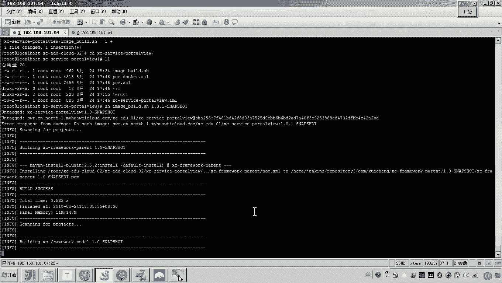

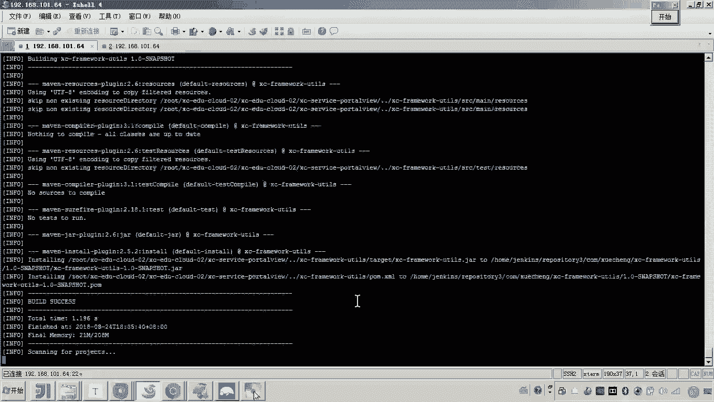

好，我们让他去构建嗯。这个过程跟刚才一样啊，还是去啊打包，然后呢构建镜像啊，然后呢去push呃向这个云平台上传镜像啊，就是这样一个过程。😊。

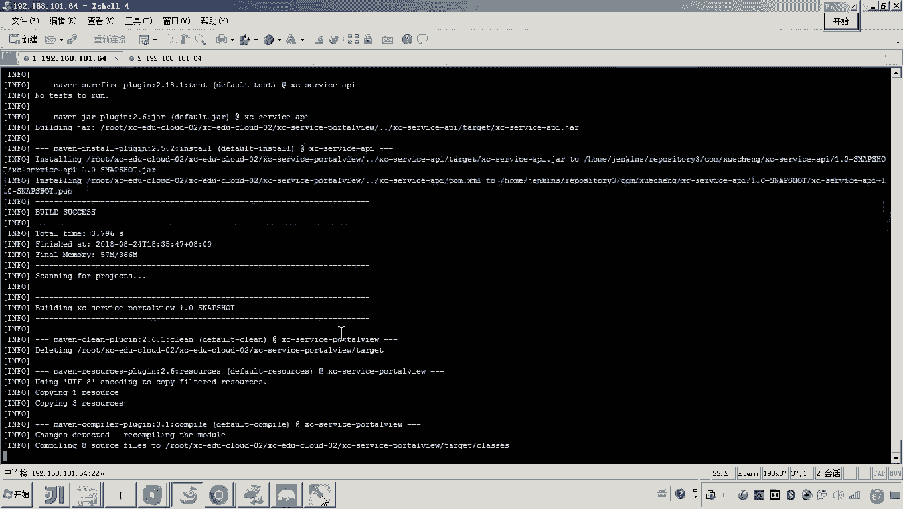

好，大家可以看一下。😊。

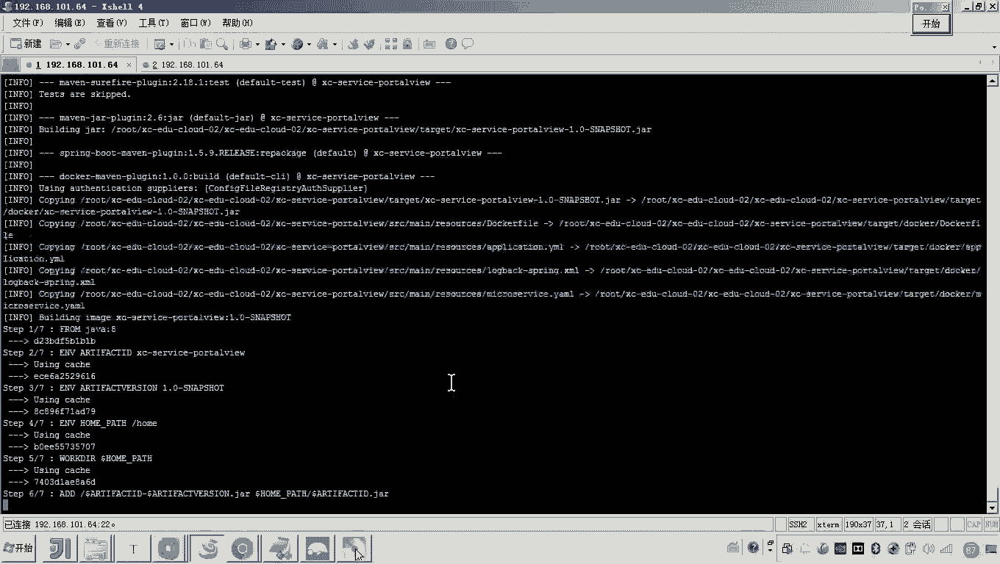

那这是不是就是构建镜像呀？😊，然后接下来是不是就开始怎么弄啊，上传了吧，你们这个镜像构建完了之后，它是不是开始打一个tag，然后开始上传，你看这是不是就开始上传了，对吧？哎，那我们就可以稍等一下啊。

看他上传的这个结果了，上传的结果。😊，好，那现在是不是就上传成功了吧？然后我们到这个云平台当中来刷新。

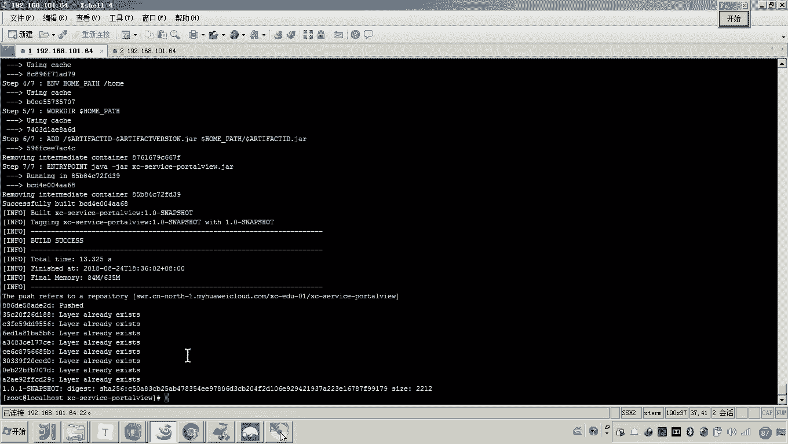

好，这个时候大家可以看到这里边是不是有两个版本呢？好，那这个时候你可以点开嗯，点开嗯，我们可以看一下这个版本啊，具体的这个这个版本呢，你会发现它是有几个呀，有两个看好最初的版本是不是1。0啊，现在是1。

0。1，对吧？嗯，好，那这个新版本的镜像上传上去了。那我怎么对这个已有的这个容器，这个工作负载升级呢？😊，那你是不是得先找到工作负载呀？然后在这儿点一下，在这个里头，你就找呀，看哪里唉更新升级看。

然后这里面是不是有一个叫更换镜像。😮，看见吗？哎，更换镜像，那我们更换哪个镜像呀，更换新版本的。😊，看见了没？哎，更换性。当然其实这里面可以直接这么弄。😊，有了吧，哎，点提交。是确认升级工作负载吗？哎。

确认确定。😡，好，大家可以看到实力列表，你看现在是不是就正在来升级了，看见吗？他会先提呃先先运行一个啊，运行成功了再结束原来的。😊，懂我意思吧？哎，就是这样一个过程。嗯，好，你看现在升级完成了吧。

升级完成之后，那么我们就需要进到这个服务目录。我们哎各位，你告诉我我进到服务目录干啥来？😊，对不对？你看看看啊，你看现在我进到服务目录，我就要看他的接口契约了。你看这里边实例数是不是零啊。

就说明他是不是运行没有成功啊，对呀。😊，哎，我要看他借口续约变过来没有？😡，嗯，那我们再来看吧，这里头。你进到这个工作负载，你看他现在是不是运行运行中啊，你得看日志了，哎，报错了，报啥错呀？😊，嗯。

那看一下。上下文查看一下。看这里头怎么写的呀。😊，像这种情况，有时候他这个他这个你看他这个说这个servicecom初始化失败，对吧？呃，这种情况这么弄啊，来，我们先大概浏览一下啊。

因为一般情况好多就是这种它起的时候，它起起错了，然后我们重启一下呢，它就OK了啊。现在呢我们可以看一下，说这个部署配置它的时候有问题，然后嗯这样弄，我们先把它这个升因为他是不是刚才自动经历过一个升级。

对吧？啊，然后呢，我们嗯点击工作负载啊，进去，然后怎么弄啊，我们人工的把它重启一下。😊，嗯。然后再观察这个日志。好，然后在工作负载来看一下。好，我们刷新这个日志，发现它这个连又报错了，对吧？

你看然后现在呢我们打开上下文看一下。😊，嗯，应该说还是这个servcom初始化失败。呃，我们思考一下这是怎么怎么回事呢？😊，注意这里边其实有一些经验，大家一定要记录一下，千万不要光看视频或者听我讲课。

呃，我在最早期去给大家讲这个servfacecom接入CSE的时候，大家我都我都说过一句话说什么呀？说一旦我们这个接口变更。对，一旦变更，你需要把服务目录里边的这个服务干嘛呀。😊，删除。😡，是不是啊？

因为你的接口变更了，你这个微服务名还是一样的，接口是不是有冲突了，所以你把它删掉，让它重新注册一下。😡，懂我意思吧？好，然我在实例列表，然后再来重启。😊，嗯，这个过程呢就是一个调试的过程。对。

刚开始呢你可能驾驭不了这个云平台啊，慢慢就好了。😊，没刷新。嗯，可以看那个服务目录来看一下。还没有啊。你说老师是不是好了，对吧？那你是不是还得等这个这个这个日志啊，稍等一会儿，然后再刷新一下啊。😊，嗯。

那大家可以看到现在这个日志是不是就是finish的了？😊，然后现在你再进到这个服务目录刷新。😊，哎，你会发现他是不是就注册成功了，然后再点开，然后在服务契约当中，我们现在来瞧各位来。

你告诉我接口正确不正确。😊，这个是不是就是基础路径啊，这儿前缀的那些重复的是不是就没有了？没错，此时我们再次进行测试。😊，好，你把这个重复的给他干掉。回撤。OK吧，看见了吗？没问题。对，哎。

那你可以更改一个课程来测一下，嗯，更改一个课程，就是呃V呃vi2。0高级教程。好，我们再更改。😊，没问题吧，是吧？好，那么以上呢就是我们讲的自动升级啊，自动升级的过程。其实这个自动升级。这里边呢。

我们来把这个刚才我们这个事啊捋一下啊，哎，最初呢我们说这个接口我需要变更了，对吧？接口变更，有一点我现在强调你给我记录一下啊，只要接口变更，在服务目录里边，把原来的这个注册进去的微服务把它删掉。嗯。

第一点，第二点，我们说这个接口变更了怎么办呢？哎，我们需要重新在构建镜像，对吧？那重新构建镜像的时候，一定要注意你这个版本要往后自增。😊。

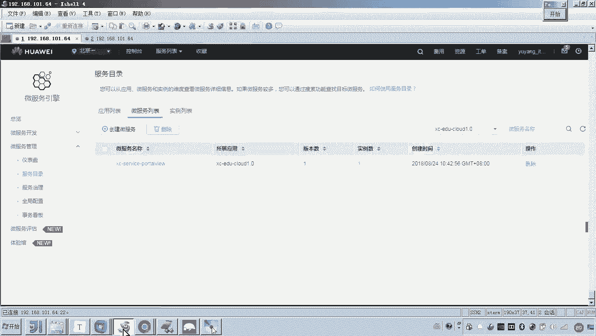

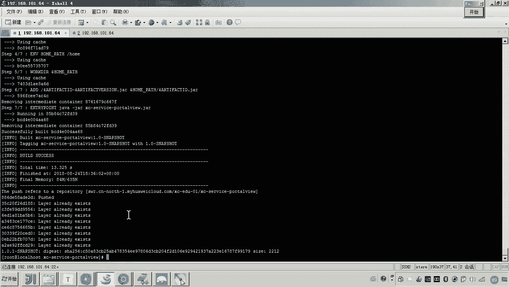

好，那么重新构建镜像，重新上传云平台。这个时候呢，云平台里边的这个镜像呀，哎你会发现它是多个版本，哎，多个版本。好，那么这个镜像上传成功之后，接下来我们要做一件什么事呢？哎。

就是到它的这个什么呀工作负载，哎，工作负载当中，然后呢再更新升级这里边选择一个新的版本提交，然后它就会自动的进行升级。😊，好，那这个就是我们说的自动升级啊，这个升级的过程啊。

但是这个字在我讲义上写的这个自动升级。我要说一下啊，这个自动升级其实是这样的一个意思啊。刚才我们说你是不是手动在这更改版本升级啊，其实各位可以在这里嗯可以在镜像这里还可以做这么一件事，很强大的啊。

这里面是不是有一个触发器啊，对这个触发器，你可以添加一个触发器啊，比如我随便说啊，这触发器说什么呀？说这个。😊，啊，这个啊触发条件全部触发，这是全部触发啥意思？只要有新的镜像上传。哎。

这样我们就准备触发触发触它干啥呀？然后触发它我们要去哎要去升级这下边的所有的应用，哪些应用，你选假如我们是这个第二个集群啊，命名空间应用是哪个呀？我要升级这个呃port头 view嗯呃全部容器。

所以这个是就会。😡，添一个触发器，只要一添上去注意这个触发器一旦添成功。那么只要你来升级了呃，这个上传了一个新的镜像，那么它就会自动触发这个触发器，这个触发器就会开始干嘛呀？

对这个啊port view进行升级。😊，懂我的意思吧？嗯，所以这个过程我就不给大家演示了，因为这个过程其实就相当于程序帮助我们完成了我们刚才做的这个手动升级的过程。😊，好。

这个就是我们说的这个portal view的部署啊，然后我们需要去呃排除问题，更改接口以及自动升级这么一个啊过程我就讲完了。好。

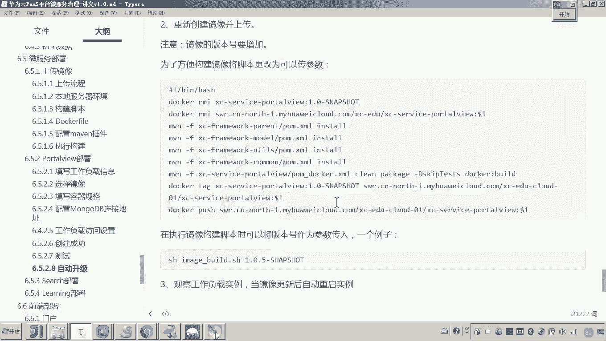