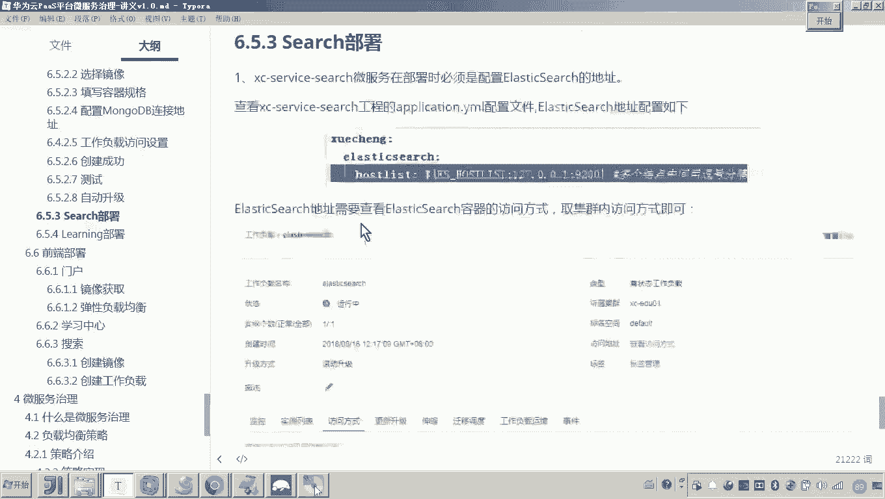

# 华为云PaaS微服务治理技术 - P117：09.学成在线项目部署-search部署 - 开源之家 - BV1wm4y1M7m5

好，那下边呢我们就来部署这个搜索的微服。好，那搜索的微服务的部署的呃这个流程呢和刚才我们部署port view呢是一样的啊。好，那首先呢各位我们再来演示一遍。

因为这个搜索刚才我们讲完这个port view呢，可能你这个步骤稍微有些生疏。现在呢我们再来讲这个搜索啊，注意看啊。😊，首先哎我们来配置这个脚本。嗯，把这个脚本呢。

你把它拷到这个什么呀 search取当中。嗯，然后然后这个脚本你拷过来之后呢，这里边我们是不是就要稍微改一下这个里面的一些东西了呀？😊，啊，因为这个search的这个微服务的名字啊，你你再确定一下。

别搞错了。这微服务的名字是不是叫做X service search啊？好，你把它都把原来的这个port view的这个名字啊，你把它都改成这个search。😊，好，就这么做。好。

然后呢然后应该还没有改完啊，然后这里边呢来这是打这个tag哎，更改这个组织的名称。这个呢也改。好，这个呢也改。好，各位，那这个脚本是不是我基本上该改的我就改完了吧。哎，好，那这个改完了之后。

各位我们接下来要怎么做呢？是不是就docker file嗯，docker filedo file配配在哪呢？配在这个resource下边。😊，然后在这个里头呢，我们可以看一下呃，他是不是也要改。对。

然后把port头 view的地方呢，我们可以看一下，他这个还少哎，这个地方把这个改了就行了。这是不是就可以了。好，那接下来还有就是要怎么做呀？😊，就是你把这个四区的这个呃pm文件呢，你再另存一份。哎。

下边加一个叫docker。嗯，然后呢哎然后你把这个什么呀，他那个嗯打包构建镜像的这个build的这个插件，嗯，你复制到最新的哎这个这个这个泡m当中来，你把它替换一下。😊，注意注意看啊注意看。好。

那这里头需要改什么呢？我刚才应该在部署这个portview说过了，因为这里边应该我都用这种变量来代替了，所以这里边应该就不用改了。嗯，好。😊，到这儿，我们是不是就完成了这个配置的过程呀？

配置过程完成了之后，接下来怎么弄啊？😡，那你就要把这个东西把它上传到get仓库了。然后上传到get仓库呢，我们就把它推送到这个什么呀，我局域网的一个get lab里边。嗯，然后我们再执行。

这里边是push。好，这样的话我这个。局域网的ge仓库里面是不是就有了？有了之后呢，我们再次进来这个目录，我们把它拉下来。😊。

好，那全全部代码是不是就到了？然后呢，我们就进去这个se取这个然后这里边我们要做了，哎这么做，后边对，后边是不是要跟版本号了，1。0默认哎nap。😊，对吧哎那 short，然后回车。😊，好。

这个过程大家可以看到是不是就是构建镜像。😊。

然后准备干嘛呀？嗯上传镜像。

好，我们就等待一下看一下啊这个过程。

好，再往下。

然后大家可以看到呃，现在的话他是不是就开始去me呃，就在打包了，对吧？然后这是构建镜像。😊，然后镜像已经构建成功，是不是现在开始干嘛呀？上传对吧？哎，上传。😊。

好，那现在大家可以看到他这个镜像是不是就已经上传成功了呀？上传成功之后呢，我们再回到这个。😊，好，这个这个这个触发器我先给它停了啊。好，刚才的触发器。好，那现在呢我们来看我的印像。嗯。

大家可以看到这个是不是就成功了。那成功了之后呢，接下来要怎么做呀，是不是就开始来呃创建这个工作负载了，对不对？好，那创建工作负载的话，来大家来看啊，怎么创建。😊，啊，点击无状态的工作负载啊。

然后呢再点创建工作负载。嗯，然后这里边输X。Service。search区。好啊，这个一个实例开启时钟同步下一步，然后选择啊选择刚刚你上传的啊，默认的跟上传的都排到前边了啊啊，然后怎样确定。好。

这里边呢我们写一个名字。就这个名字是随便定义的啊。😊，哎，我那就和我这个镜像名保持一致了。😊，这个呢也是0。5吧，这个这个加va的微服务我都改成这个0。5了啊。😊，哎，好，这是1024。这是2048。

可以吧，哎，好，然后然后怎么弄啊，看环境变量对不对？就是说这个微服务它运行过程当中需不需要配置环境变量需要你看。😊，这不就是吗？他是不是就是要连接我们说的这个elastic search的这个地址了。

这个环境变量名称我们拿过来。😊，贴到这儿，那这个值呢这个值的话，那你肯定不能配这个127了嘛，那你要配啥呀？😡，对你要找到这个ES的他这个地址。对这个ES的地址我们怎么找呢？😊，嗯，我们找到工作负载。

昨天哎我们是不是把它。ES给他配好了。对，然后呢，我们找到ES。😊，然后呢，再看访问方式，这里头，这是不是公网访问啊？现在我们要配一个集群内部访问，对不对？所以这里边我们来配一下哎elastic。😊。

啊，2吧。好，然后这里头呢我们说是9200。😊，好，确定。所以此时这个地址是不是就生成了？哎，然后你把这个地址呢拷到这里头。😊，看懂了吗？哎，好，然后呢，接下来还有什么呢？哎。

接下来其实主要就是这配这个地址了。哎，配完这个地址之后呢，我们是不是就可以。😊，下一步。那我们来呃我们这里边写一个嗯，这是叫什么呢？叫做呃XC。😊，然后呢，继续那呃公网访问吧。因为我们现在要测这个。

一会儿测搜索嘛，啊公网访问。😊，好，就是你一定注意这个访问方式，你用什么，你配什么不用了，不要配啊。好，那这里边我们说这个弹性IP能通过这个端口啊，这个搜索的这个微服务的端口是啥呀？😊。

就对外提供这个这个这个端口是不是叫40100啊对容器内部端口，外外网的端口，它是不是就自动给我们生成了？😊，啊，然后下一步，然后创建。好，那这个微服务现在大家可以看到是不是就正在创建中啊。对。

那哎你看很快的啊，你看是不是就运行运行中了，是不是啊哎，运行中了，运行中了。那现在我们就可以看到这个服务目录，看它有没有啊，你看还是没有。😊，他说运行中运行中障眼法是吧，运行中。还不对哎。

那我们来看一下。那你看一下他这个日志吧，怎么看对还是不对呀？😊，啊，无状态的工作负载点击 search区。然后点工作负载运维账嗯。然后刷新。看一下。怎么一定是。提示这个什么呀？哎，这是不是就成了。

看见吧？哎，看到这个关键字啊，finish的啊完成注册，然后我们刷新。😊，是不是就出来了，出来的时候点点开，我们看服务契约，看一下吧，这个接口应该是正确的。😊，没错吧，那现在我们测试一下吧。😊，啊。

怎么测试呀？😊，那你找到这个工作负载访问方式这里头点好，然后在这边输接口，然后叫list1-2。在现在是不是要搜索这个什么呀？搜索搜索调用这个e search来搜索数据了。大家可以看到。😊，正确吧。

没问题吧。哎，所以你看到他这个就是搜索列表嘛。😊，对。好，那么以上呢就是哎这个。😊，叫做se取微服务的部署。嗯，那这个部署的这个流程呢和port view呢啊差不多。我们啊就是快速的把它部署完成。

大家一定要注意记录啊，在听课的时候嗯，好。