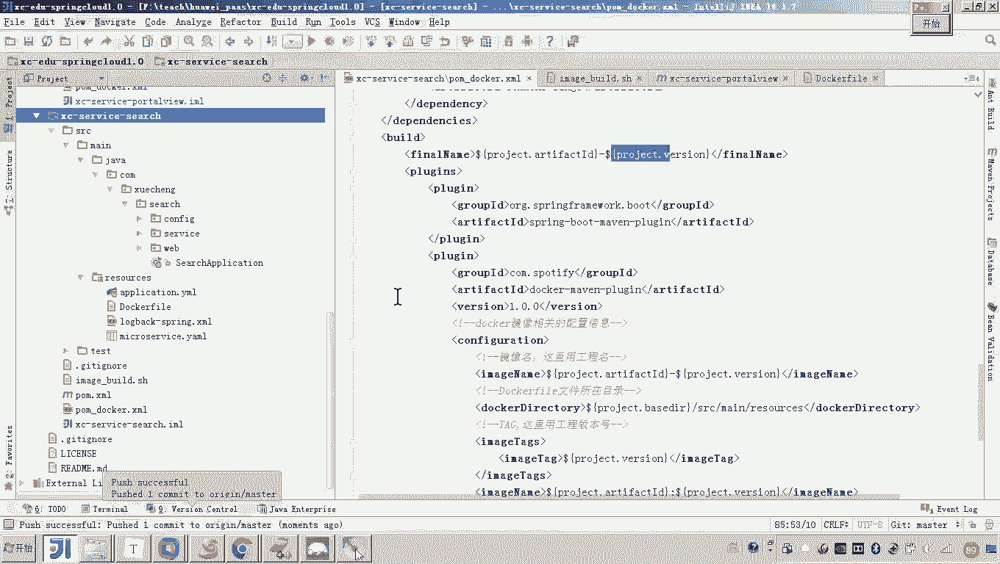
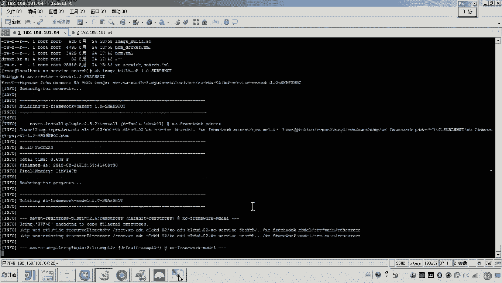
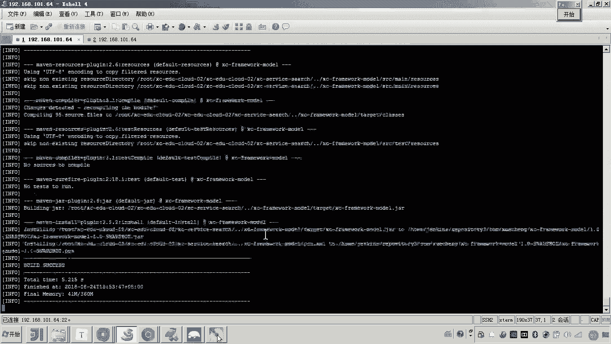
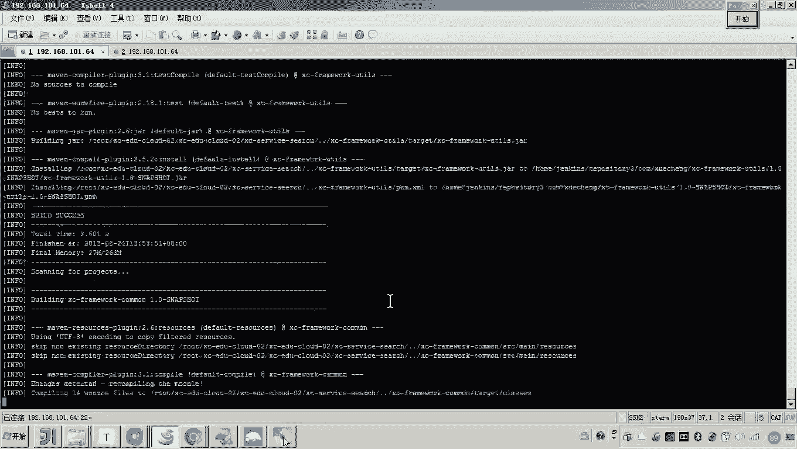
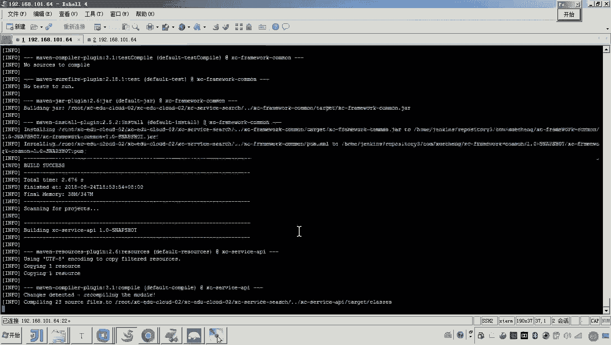
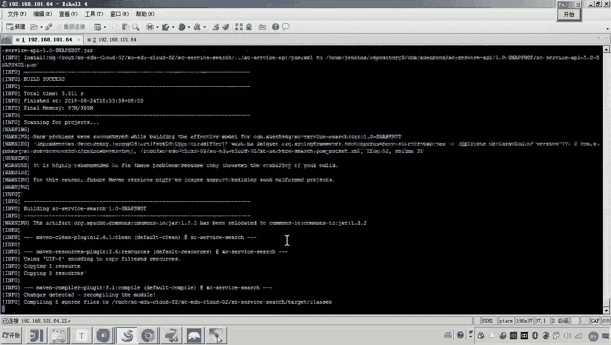
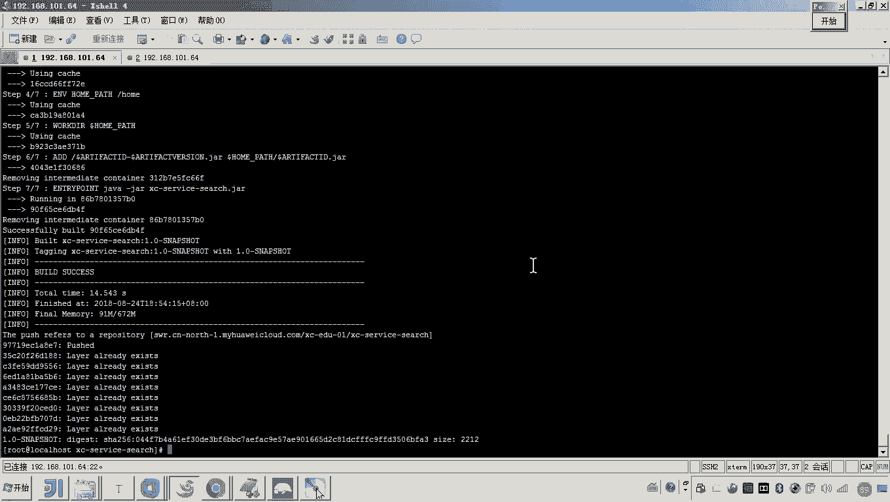
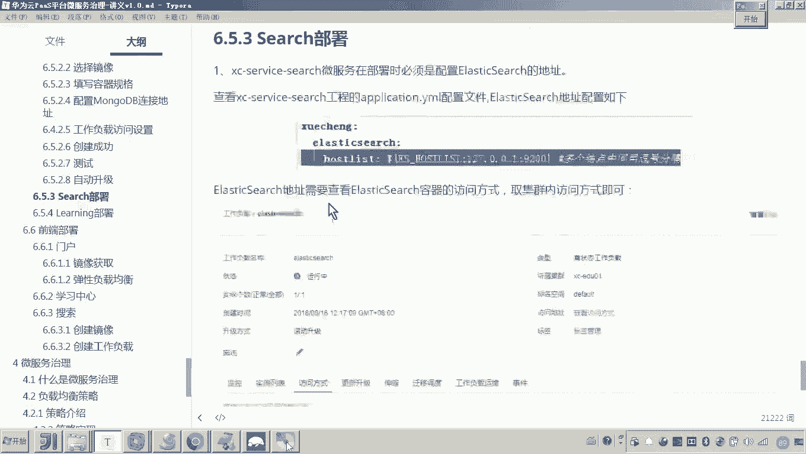

# 华为云PaaS微服务治理技术 - P117：09.学成在线项目部署-search部署

在本节课中，我们将学习如何部署“学成在线”项目中的搜索微服务。我们将遵循与之前部署门户微服务相似的流程，逐步完成从代码配置到服务上线的所有步骤。

## 配置部署脚本

上一节我们介绍了门户微服务的部署，本节中我们来看看搜索微服务的部署。首先，我们需要配置部署脚本。

以下是配置脚本的具体步骤：
1.  将部署脚本复制到 `search` 微服务项目的根目录下。
2.  修改脚本中所有涉及微服务名称的地方，将原来的 `portview` 替换为 `xuecheng-plus-search`。
3.  修改脚本中用于构建 Docker 镜像的标签（Tag）和组织名称。

## 配置 Dockerfile 与 Maven

配置完脚本后，我们需要检查并修改 Dockerfile 和 Maven 配置文件。

以下是需要检查的文件：
1.  检查 `src/main/resources` 目录下的 `Dockerfile` 文件，确保其中的微服务名称已正确修改。
2.  复制一份 `search` 服务的 `pom.xml` 文件，命名为 `pom-docker.xml`。
3.  在 `pom-docker.xml` 中，引入用于构建 Docker 镜像的 Maven 插件。由于我们使用了变量配置，此处通常无需额外修改。

## 构建与推送镜像

完成本地配置后，下一步是将代码提交到 Git 仓库，并触发自动化构建流程。

以下是构建与推送镜像的步骤：
1.  将修改后的代码提交并推送到 GitLab 仓库。
2.  在服务器上拉取最新的代码。
3.  进入 `search` 服务目录，执行构建命令。例如：`mvn clean package -DskipTests docker:build -f pom-docker.xml`。
4.  构建成功后，执行推送命令将镜像上传到镜像仓库。例如：`docker push your-registry/xuecheng-plus-search:1.0`。

## 创建工作负载

镜像准备就绪后，我们可以在华为云云容器引擎（CCE）中创建工作负载来运行我们的搜索微服务。

以下是创建工作负载的步骤：
1.  在CCE控制台，进入目标集群，点击“创建工作负载”。
2.  选择“无状态负载”，设置工作负载名称为 `xuecheng-plus-search`。
3.  在“容器配置”中，选择我们刚刚上传的 `xuecheng-plus-search` 镜像。
4.  配置容器资源，例如设置 CPU 请求为 `0.5` 核，内存请求为 `1024Mi`。
5.  添加环境变量。搜索服务需要连接 Elasticsearch，因此需要配置 `ELASTICSEARCH_HOST` 变量。其值为 Elasticsearch 服务在集群内部的访问地址，格式为 `http://<service-name>.<namespace>:9200`。

## 配置服务访问

为了让搜索服务能够被外部访问，我们需要为其配置一个公网访问入口。

以下是配置服务访问的步骤：
1.  在工作负载配置的“服务配置”步骤中，选择“公网访问”。
2.  设置容器端口为搜索服务内部端口（例如 `40100`），系统会自动分配一个外部端口。
3.  完成配置并创建工作负载。

## 验证服务部署

工作负载创建完成后，我们需要验证服务是否正常运行。

以下是验证服务的方法：
1.  在CCE控制台查看工作负载状态，当状态显示为“运行中”时，表示容器已启动。
2.  查看容器日志，确认是否出现类似“Finished registration”的关键字，表示服务已成功注册到注册中心。
3.  在“服务列表”中查看，确认 `xuecheng-plus-search` 服务已出现。
4.  通过服务契约或直接访问公网IP与端口，调用搜索接口（例如 `/search/course/list?pageNo=1&pageSize=2`）进行功能测试，确认返回正确的搜索结果。

本节课中我们一起学习了搜索微服务的完整部署流程。我们首先配置了部署脚本和Docker相关文件，然后构建并推送了Docker镜像，接着在云平台上创建了对应的工作负载并配置了网络访问，最后验证了服务的正常运行。这个过程与门户微服务的部署高度一致，熟练掌握后可以快速部署其他微服务。