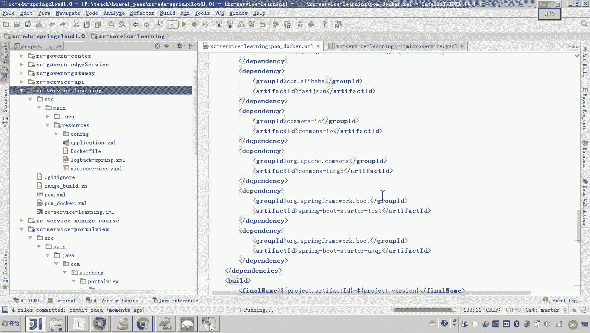
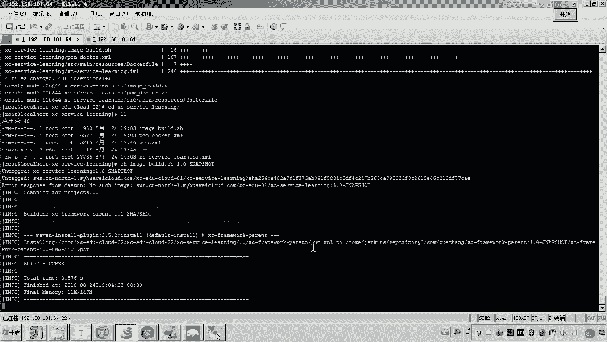
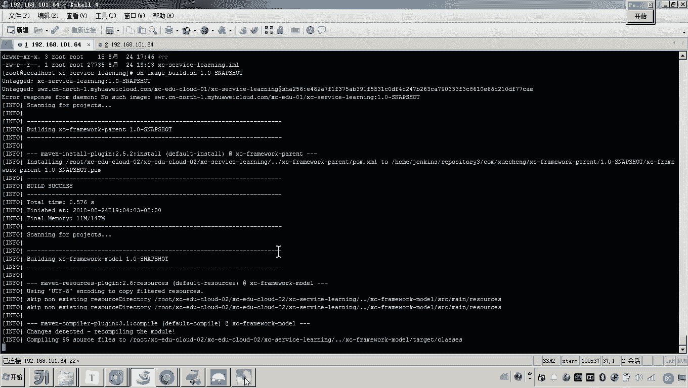
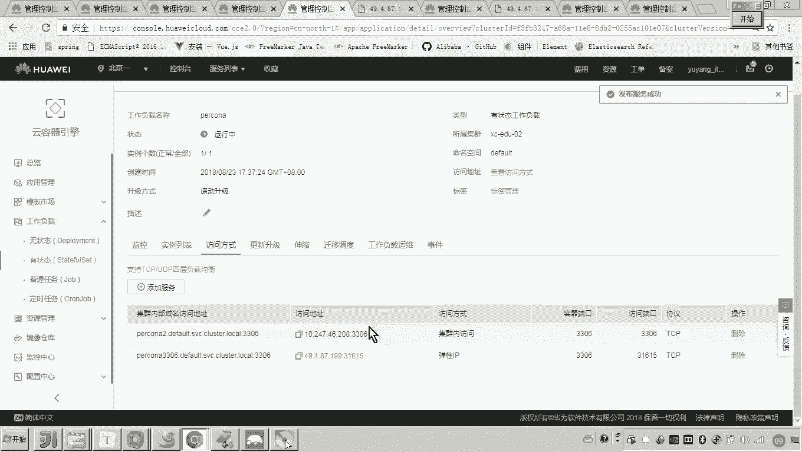
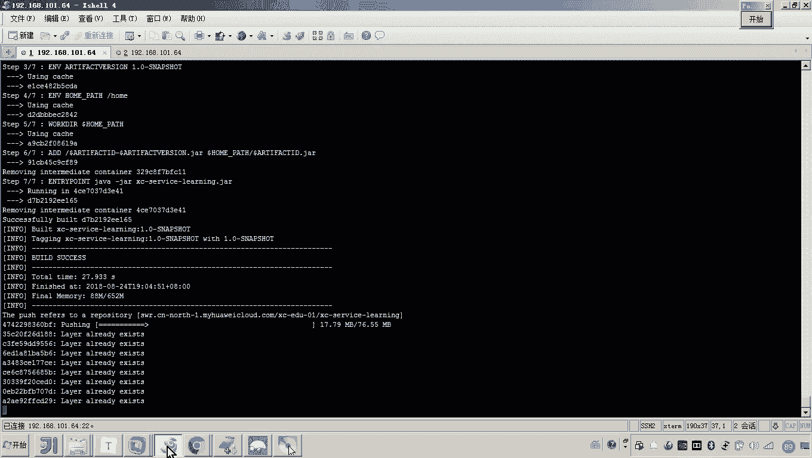
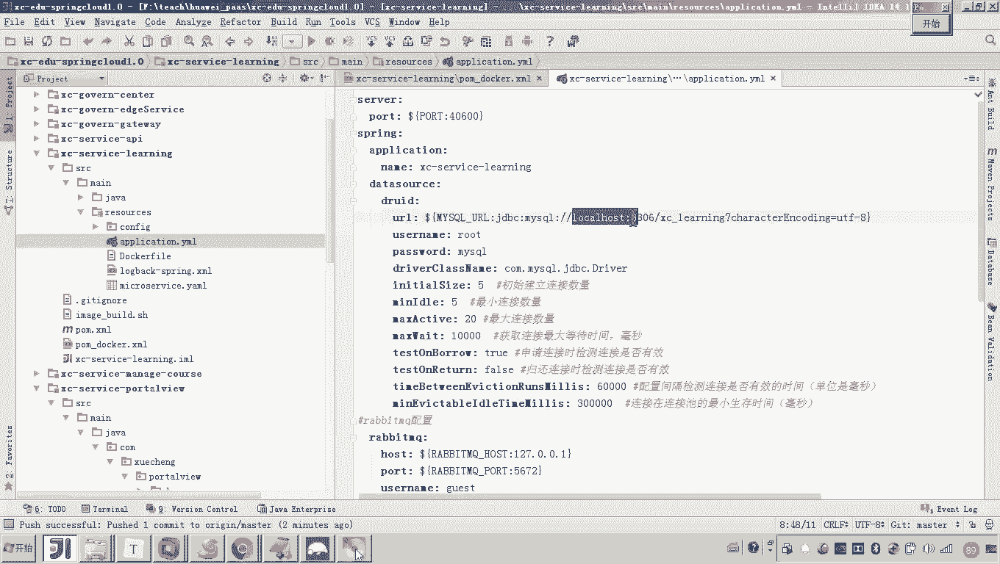
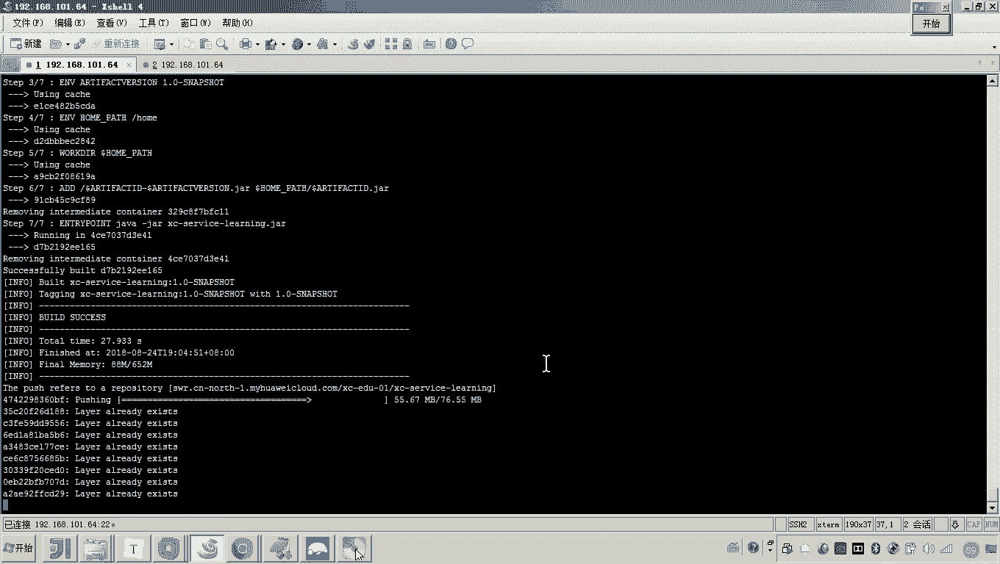
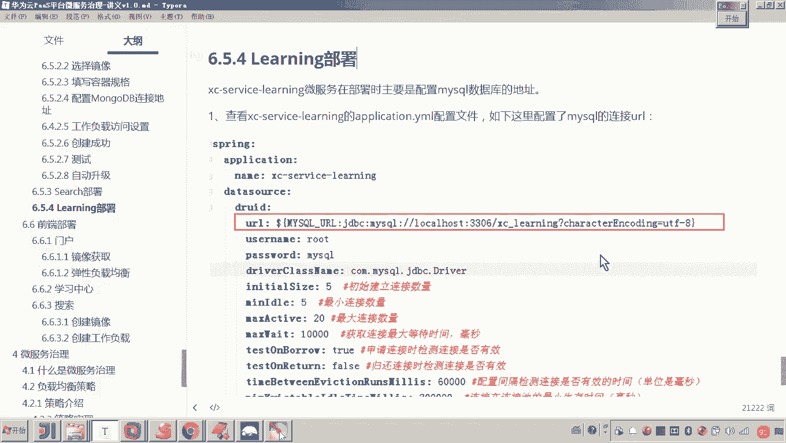

# 华为云PaaS微服务治理技术 - P118：10.学成在线项目部署-learning部署 - 开源之家 - BV1wm4y1M7m5

好，那下边呢我们来部署学习服务嗯，学习服务它怎么部署呢？来，我们来看一下啊。首先啊我们来创建它的镜像。哎，跟刚才一样啊，来我们快速进行。首先来打开学习服务。然后把这个脚本呢贴进去。然后在这个脚本当中呢。

我们看到这里边我们要把这个服务名字呢给它变一下。嗯，好，那这个服务的名称呢，我们变完来看一下啊，别着急啊，我把它千万不要就是复制的时候呢，千万不要落了。😊，好，这个是我们说的这个构建镜像的脚本就行了。

对吧？啊，那接下来是怎么样？😊，docker file文件嗯，然后把它放到ressource。同样道理，这里头呢，我们是需要改一下这个。改一下这个服务的名称的。然后把这个抛头釉给他改一下。Hao。那。

接下来还有什么呢？把这个泡沫呢给它单独再复制一份，叫刀口。好，然后呢对，然后你把这个。把这个什么呀，把这个插件这个Bil的插件复制过去。复制到这个docker这个泡文件里头。好，这是不就完成了？😊。

完成了之后，这里边怎么弄啊，把它提交上去。然后我们把这个代码呢提到这个get的仓库。啊，不许。

好，那弄完了之后呢，接下来怎么弄啊，进到本地服务器。😊，然后呢，往下拉。好，代码拉完之后呢，我们就进到这个啊学习服务。然后呢，执行后边跟版本对吧？1。0-4n shot。回撤，这样的话。

他就开始来构建镜像。

好了，它构建的同时呢我们来看啊，那你的构建完了之后，一会儿我创建负载，它需不需要设置环境变量呢？对我现在要看程序了。好，打开。😊。

那这里头我们来看一下吧，这里头需要吗？需要看这里面是不是有一个叫mycyclcle的配置啊。😊，对吧那my circle的这个配置，各位怎么弄？

这里边你应是能知道我们现在它是不是这个是一个内网的这个地址啊，所以你得找到我们说的这个my circlecle嗯，它的这个有状态的工作负载，然后找到哎这个proner。😊，而。

这个prork呢我们找到了之后呢，嗯我们找到呃访问方式啊，然后在我们添一个啊。😊，嗯，提取内部访问3306。这就是一个非常好的统筹的一个工作过程是吧？哎，然后呢我们看这是不是就搞定了。

然后再拐回头来看一下。好，他现在还正在上传。😊。

那现在呢我们发现他正在上传嘛，上传成功了之后，我们是不是就可以怎么弄啊，就可以创建工作负载。然后呢。😊。

设置环境变量的时候，把这个地址呢把它配在这个连接的字物串中。

好，这个上传的过程稍微有点慢啊。😊。

好，这个上传就成功了啊，然后呢，我们再回过来回到我们的这个。呃，进像仓库上啊，我们找到。好，大家可以看到是不是就成功了。那接下来我们要做什么呀？😊，创建我们的工作负载无状态的。嗯，点击创建。

然后这里边我们是不是要写一个我们的学习服务啊，嗯，service learning。好，然后呢这里边写一个嗯，开启时钟同步。好。然后呢，下一步添加好，那最新上传的是不是已经放在最前面了？好。

然后接下来确定。😊，好，那我们把这个容器的名字给它改一下。这个也是我们把这个配置呢给它稍微提高一些。好，这个是一。好，内存呢有1024，然后最大是2048嗯。好，然后呢，接下来这里面是不是要配环境变量？

😊，环境变量这里边呢，刚才咱们是不是说过啊，这个变量的名称叫mysl下划线URL。😊，哎，你把它贴在这儿。好，然后呢把这个把这后边这一串呢作为环境变量的值。😊，然后贴贴过来之后呢。

刚才我们是不是完成了这个买srcle的这个内网的访问方式啊？对，然后我们找到吧呃打开的太多了啊，看一下。😊，工作负担。呃，有状态的。我们刚才是不是在po里边是不是写了一个访问方式，是不是这个地址？

对你把这个地址复制一下。然后复制完这个地址呢，我们把它贴在这个环境变量字里头。看懂了吧，然后点下一步。好，那么添加一个啊，这个是我们说的这个学习服务。学习服。嗯，好，然后是公网访问。好。

测试啊就是为了测试。那公网访问学习服务的端口是什么呢？😊，学习服务的端口是不是就是40600啊？好，然后我们把它贴进去，然后点击确定。下一步创建成功。嗯。好，那现在呢我们就等着啊刷新。好，运行中好。

然后这里边呢我们就来看一下这个工作负载啊，它的这个日志。嗯，大家可以看到这个日志是不是就出来了？😊，好，那出来之后呢，我们要等。大家知道等什么吗？就等那个关键字，对吧？finish的哎，说那个注册成功。

哎，你看一下，往后往后再翻，注意看。😊，有人说吓我一跳，对吧？是不报错了，看一下啊，别着急。😊，嗯m。就是他成功了之后，他是不是会在服务目录里边去注注册呀？你看他现在是不是已经注册成功了。嗯。

注册成功了，有人说老师日志不正确，他就注册成功了，那你是没有刷出来，对吧？你说哎，报错了呀，对不对？这报的是啥错呀，看一下。😊，看上亚文。哎。说沈么啊，连接拒绝了，是不是连什么拒绝了？😊。

应该说是不是就是连我们的这个mycycll连不上呀？😡，对不对？因为这个学习服务是他是不是要连接这个。连接这个mycyclcle啊嗯。😊，那就说老师他这个连接拒绝了，他这个服务难道还行吗？😊，啊。

连接拒绝了。那因为他这个启动是启动成功了，就是连数据库应该是没连上，对吧？你看他这个契约是不是都正确，对。😊，哎，好，那现在我们再回过头来再看啊，再看它的这个什么呀。😊，啊，他这个报的错啊。

我们得把这个错给他处理处理。啊，把这些都关掉啊，没用的来。啊，这是这是这个学习服务了，对吧？啊，注意这里面是不是连接mesql异常了哎。😊，啊，那我们来看一下日志吧。😊，那我们刷新一下这个日志啊。

刷新一下，发现他是不是还有报错呀？那我们还是要看这个这个这个日志的这个上下文啊。好，那么我们拿到这个刚才咱们说这个连接拒绝，咱们说是不是连接my circle连不上呀，对吧？我们仔细看这个日志啊。

一定注意啊，仔细看看好啊，连接拒绝拒绝什么拒绝了呀。看这哎，说这个是AMQPrabbit。😊，哎，这好像是我们的这个什么呀？有一个叫rap template，也就是我们再去连接这个MQ消息队列的时候。

是不是异常了。哎，这个学习服务还连接消息队列吗？我们得看代码来看一下啊。😊，呃，连接my circlel这个。哎，往下诶，哦，这里边你看就是原来我们这个学习服务，它是不是还要连接这个MQ啊？😊，啊，对。

那这个MQ是没有连成功，你看这里边是不是就是本地的1个MQ啊？那说老师这个MQ好像咱们之前没提过。对，没错，现在我要说明一下，就是在咱现在做的这个业务流程是不是就是在线学习，对吧？对。

这个在线学习这个业务流程没有用到MQ。所以MQ这一边啊，我们暂时不去部署。嗯，那么具体的这个这个学习服务的这个完整的功能业务流程或者在哪里用这个MQ呃，那么大家可以参考这个学生在线它的相关的这个课程。

呃，应该说这个MQ我记得是在这个什么呀一个分布式处分布式事务处理的时候呢，用到一个MQ。那大家可以去参考这个分布式事务那个章节的内容。好，这里呢我们暂时不去管它。那这样的话，我们现在就可以来干嘛呀？

测试了，来测试了。呃，那测试的话怎么测试呢？😊，嗯，那打开讲义，这里边有一个地址。这个地址呢就是我们那个在线学习界面，要请求学习服务来取出来取出。大家可以看到了是不是来取出这个视频的播放地址呀？嗯，好。

那现在呢我们就怎么弄啊，把后边这一串复制一下。对，然后呢我们哎找到我们的这个什么呀，这个这个错误不管它啊，是连接MQ的错误，不要管它。然后我们找到嗯这个工作负载。😊，然后找到工作负载找啥呀。

找他那个外网的地址啊，找外网的地址。😊，啊，点开。然后点开之后呢，你把这个接口呢拷到后边。嗯，然后我们来看一下，哎，大家可以看到，其实它是正确的对吧？也就说它连接my circle是没有问题的。😊，好。

那到这里呢，我们说这个learning这个学习服务呢就部署成功。嗯，好。

