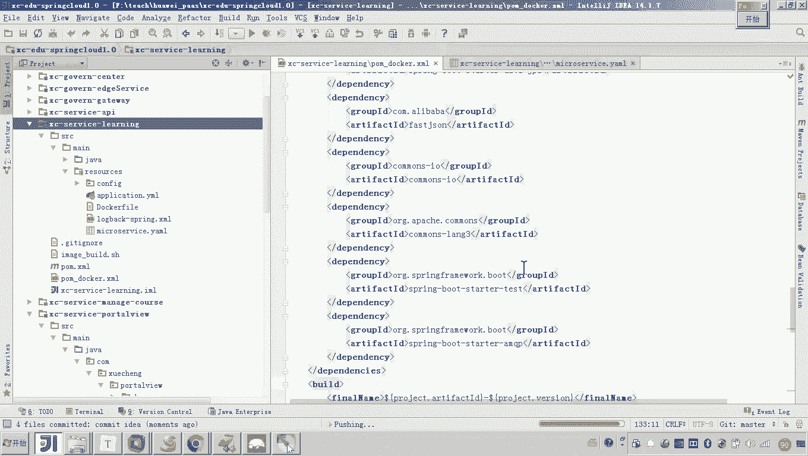
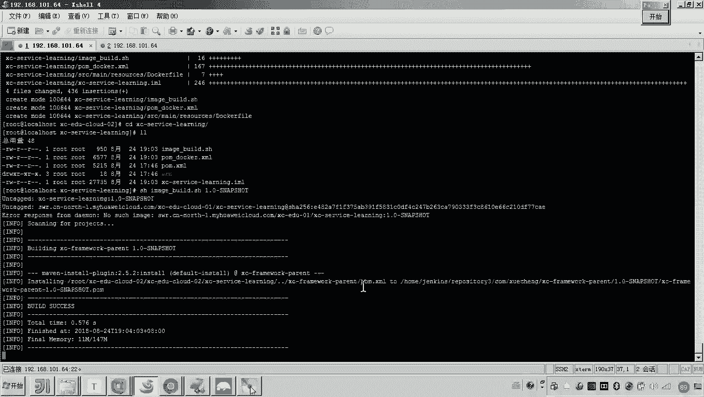
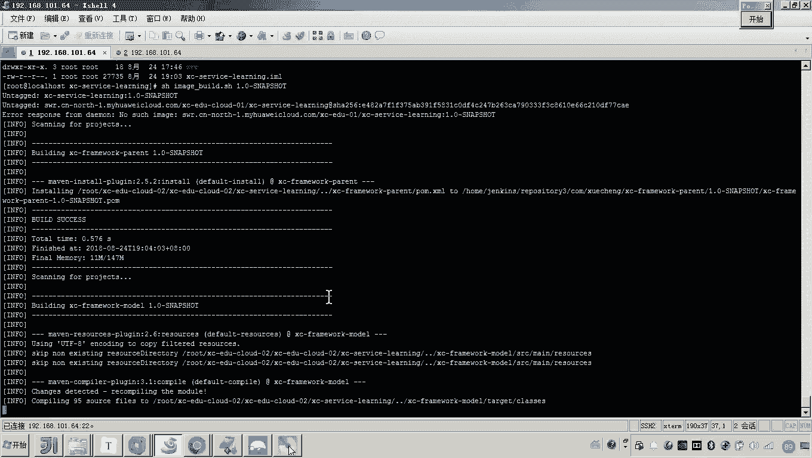
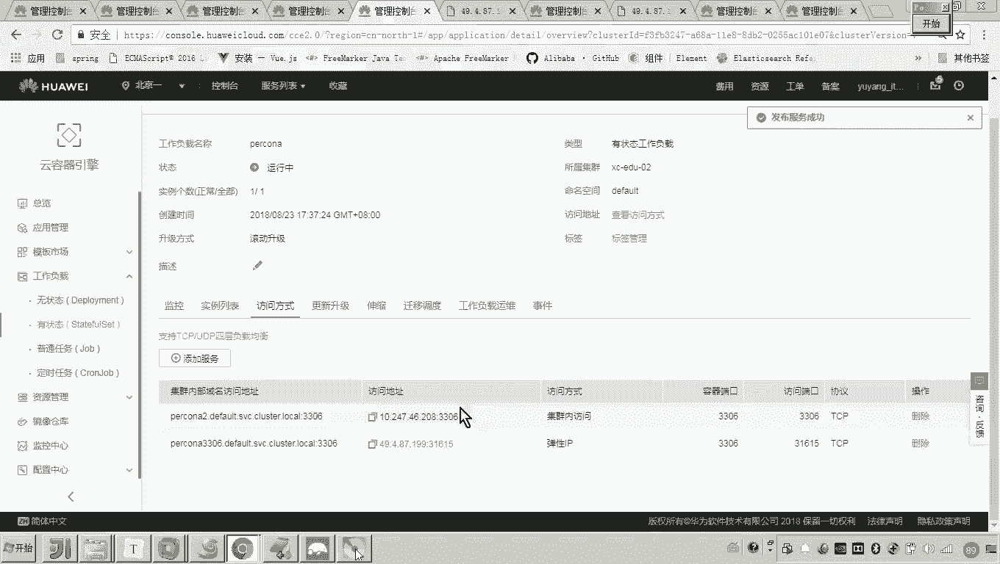
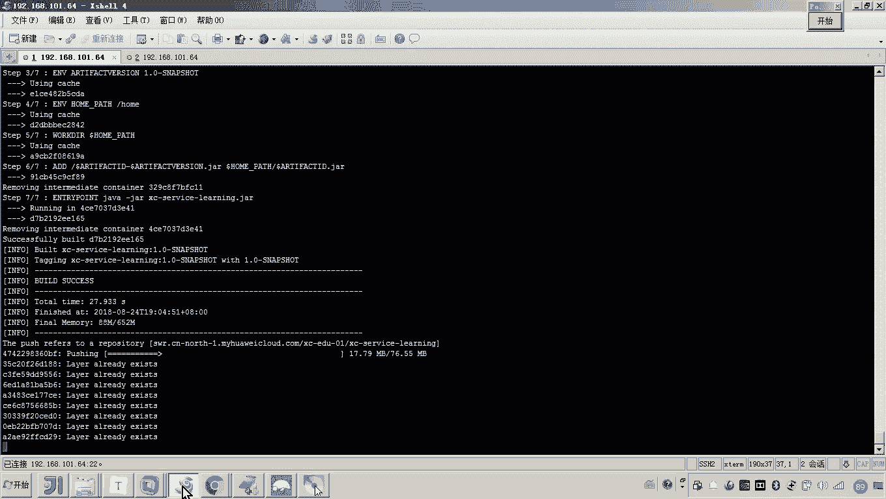
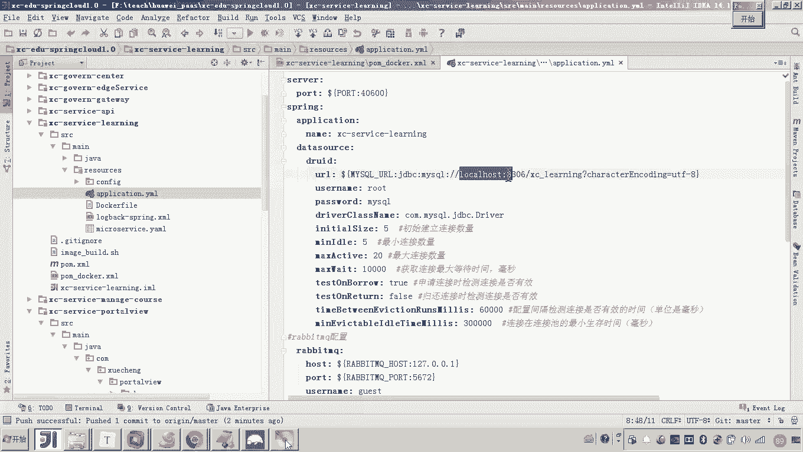
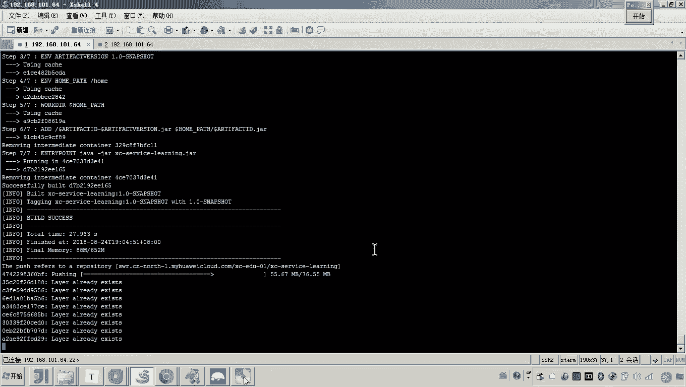
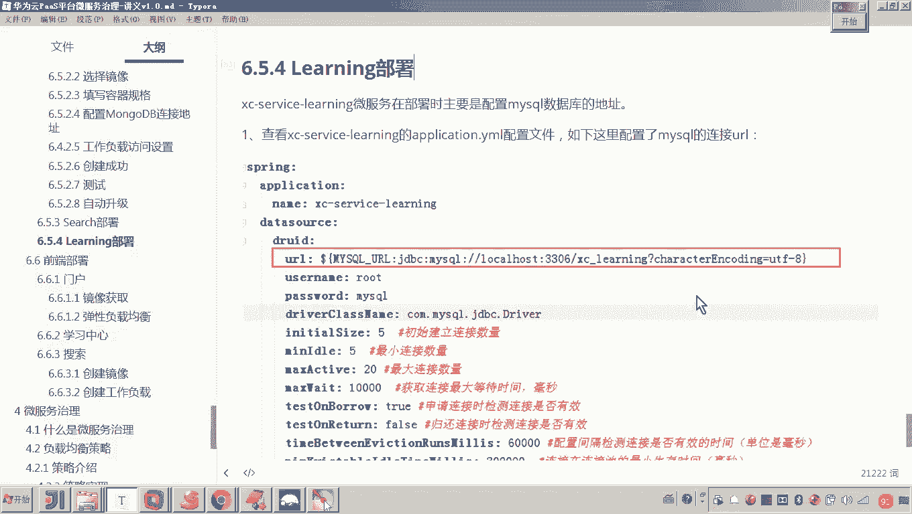

# 华为云PaaS微服务治理技术 - P118：10.学成在线项目部署-learning部署 🚀

在本节课中，我们将学习如何部署“学成在线”项目中的学习服务。我们将从创建Docker镜像开始，逐步完成在华为云上创建工作负载、配置环境变量以及进行服务测试的全过程。

---

## 创建Docker镜像

上一节我们介绍了服务部署的基本流程，本节中我们来看看如何为学习服务创建Docker镜像。



首先，打开学习服务的项目目录。我们需要准备构建镜像所需的脚本和配置文件。

以下是构建镜像的核心步骤：



1.  **准备构建脚本**：将构建脚本粘贴到项目目录中，并修改脚本中的服务名称。
2.  **配置Dockerfile**：将Dockerfile文件放入 `resource` 目录，并修改其中的服务名称和端口号。
3.  **准备Docker专用POM文件**：复制一份 `pom.xml` 文件，命名为 `docker-pom.xml`，并将Maven构建插件复制到该文件中。



完成上述文件配置后，将代码提交到Git仓库。

接着，在本地服务器上拉取最新代码，进入学习服务目录，执行构建命令：
```bash
mvn clean package docker:build -f docker-pom.xml -DimageTag=1.0-SNAPSHOT
```
此命令将开始构建Docker镜像并上传到镜像仓库。

---



## 配置环境变量

在镜像构建的同时，我们需要为即将创建的工作负载配置必要的环境变量。学习服务需要连接MySQL数据库。





我们需要找到MySQL数据库的内网访问地址。



以下是配置MySQL连接信息的具体操作：

1.  在华为云控制台，找到MySQL对应的有状态工作负载。
2.  进入其访问方式配置页面，添加一个内部访问方式，端口为 `3306`。
3.  复制生成的内网访问地址（例如 `mysql-service:3306`）。

这个地址将作为环境变量的值，用于配置学习服务的数据库连接。

---

## 创建工作负载

镜像上传成功后，我们可以在华为云上创建无状态工作负载来运行学习服务。

在华为云控制台，进入“工作负载”页面，点击“创建无状态负载”。

以下是创建工作负载的配置步骤：

1.  **基本信息**：设置工作负载名称为 `service-learning`，并开启时钟同步。
2.  **容器配置**：选择我们刚刚上传的最新镜像。将容器名称修改为 `learning`，并调整CPU和内存资源配置（例如，CPU请求1核，内存请求1024MiB）。
3.  **环境变量**：添加一个环境变量。
    *   **变量名**：`MYSQL_URL`
    *   **变量值**：将之前复制的MySQL内网地址填入JDBC连接字符串中，格式类似于 `jdbc:mysql://mysql-service:3306/learning_db?useUnicode=true&characterEncoding=UTF-8`
4.  **服务配置**：添加一个公网访问的服务，用于测试。
    *   **服务名称**：`learning-service`
    *   **访问类型**：公网访问
    *   **容器端口**：`40600`

配置完成后，点击“创建”。等待工作负载状态变为“运行中”。

---

## 检查日志与问题处理

工作负载启动后，我们需要查看其日志以确认服务是否正常运行。

在控制台找到学习服务工作负载，进入其日志页面。观察启动日志。

你可能会看到类似连接RabbitMQ失败的报错信息。这是因为学习服务的部分功能（如分布式事务处理）用到了消息队列，但在当前部署流程中我们暂未部署MQ服务。由于我们测试的核心功能（获取视频地址）不依赖MQ，因此这个错误可以暂时忽略。

关键是要确认服务是否成功注册到服务注册中心，以及是否能连接MySQL数据库。在日志中搜索“注册成功”或“finish”等关键字来确认。

---

## 服务测试

最后，我们来测试学习服务是否部署成功。

学习服务提供了一个获取视频播放地址的接口。我们通过公网访问地址来调用这个接口进行测试。

以下是测试步骤：

1.  在控制台，找到学习服务对应的公网访问IP地址和端口。
2.  构造完整的测试URL，格式为：`http://{公网IP}:{端口}/learning/course/` 后接具体的课程资源路径。
3.  在浏览器或使用`curl`命令访问该URL。

如果服务返回了正确的视频播放地址信息（如JSON格式数据），而没有出现数据库连接错误，则证明学习服务已成功部署并运行。

---



本节课中我们一起学习了如何部署“学成在线”项目的学习服务。我们完成了从代码构建Docker镜像、在华为云上配置工作负载与环境变量、到最终服务测试的完整流程。重点掌握了如何处理服务间的依赖配置（如MySQL），并学会了通过日志分析和接口测试来验证部署结果。