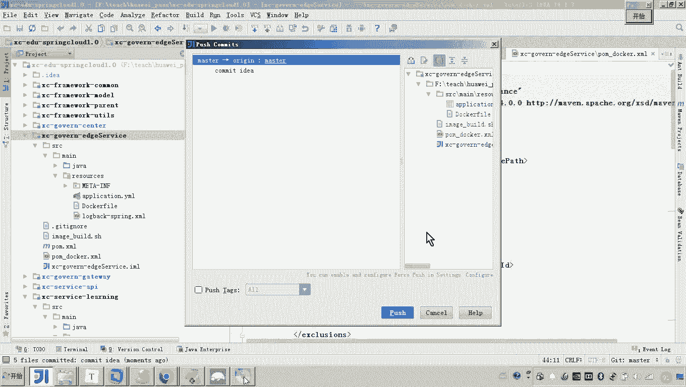
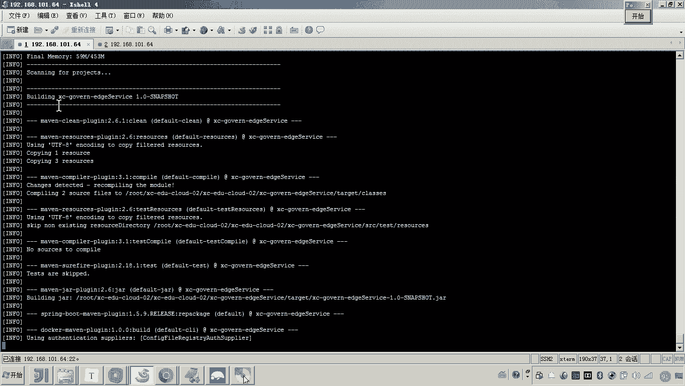
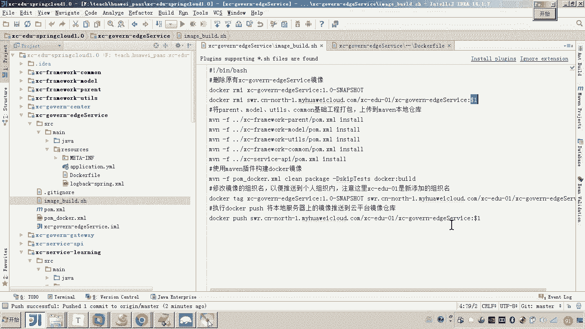
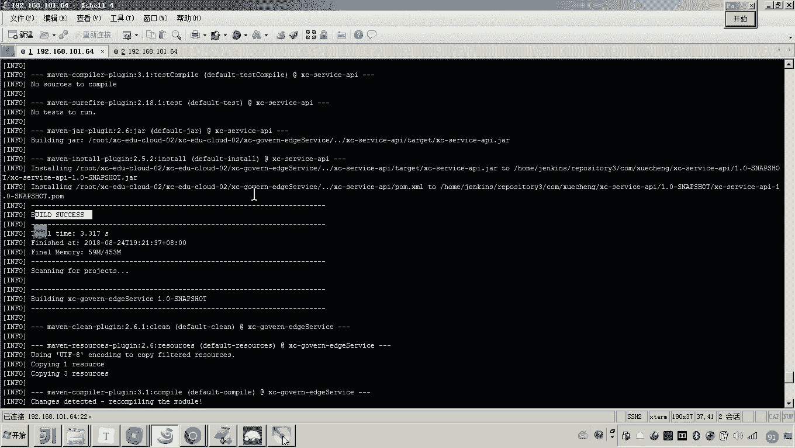
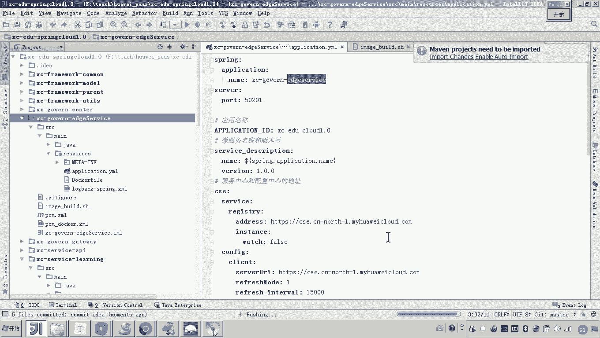
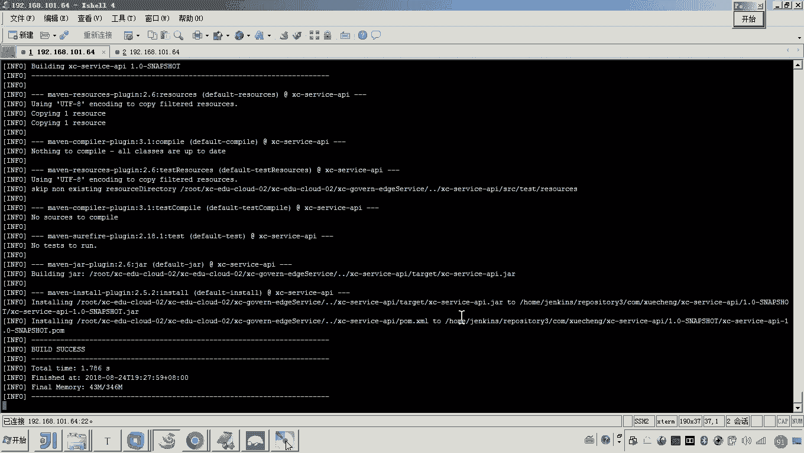
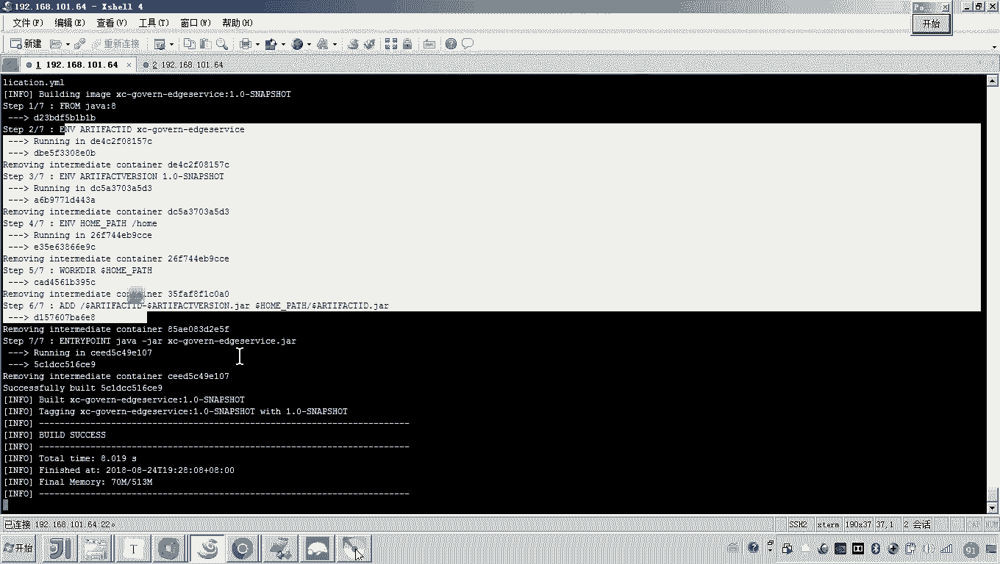
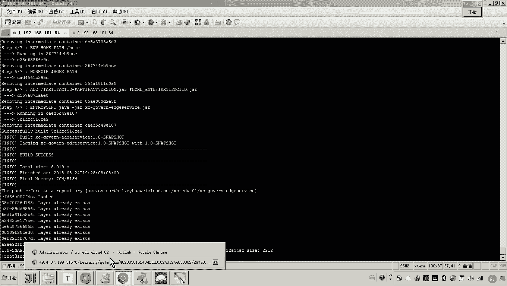
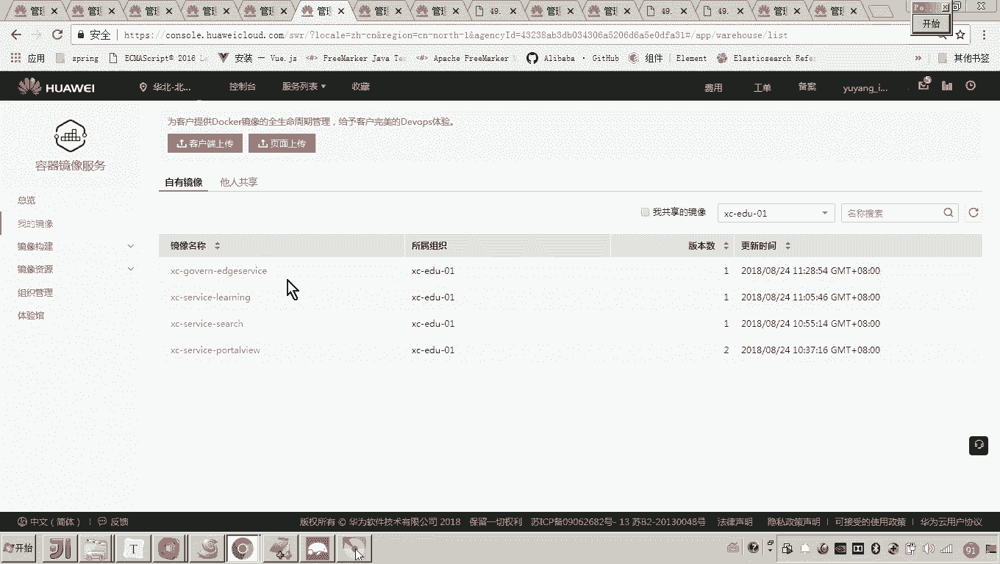

# 华为云PaaS微服务治理技术 - P119：11.学成在线项目部署-edgeservice-上传镜像 - 开源之家 - BV1wm4y1M7m5

好，那最后一个呢就是网关的部署啊，那这个网关的部署呢，这里边呢在讲义上边我没有写具体的内容啊，因为这个部署的方式跟前边这个呃其他微服务部署的方式是差不多的啊，大家呢尝试去部署一下啊。好。

那现在呢我们嗯把它快速演示一遍来看一下。然后我们把这个配置文件呢来拷到这个IG service当中。😊，好呃，然后呢，这里边呢我们来把这个名字呢给他改一下。好，这个名字呢。

我们原来起个名字叫做XCEDUIserv，看见了吗？对我们把这个名字是变便啊，变成这个跟这个工程名保持一致，叫gavin。好，这么多。好呃，那现在的话我们就把这个脚本改一下。

其实跟刚才的流程是不是也一样呀？😊，但是大家是一定要去，其实你可以先不用看我的这个视频啊，我们大概呃自己的去尝试一下，去看看能不能部署成功。对。😔，好，那现在我就。😊，这个过程是不是就改完了？😊。

那这个过程改完了之后呢，接下来嗯我们要改什么呀啊，那你把这个docker file拷到resource一下。😊，然后同时呢，你把这个微服务的这个名字呀，然后呢也把它稍微改动一下。好。

然后最后呢你要怎么弄啊，再另存一份。Docker。好，然后把这个。插件。构建镜像的插件拿过去。好，这样的话我们是不是这个准备工作就做完了？那这个准备工作我们做完之后呢呃我们这里头怎么弄啊？

把它提交到get lab中。好，然后呢，我们再去push。

好，这个过程完成了之后呢，我们现在就开始来构建镜像。😊，然后先执行破。好，然后呢就进到呃我们的这个什么呢IGservice。然后这里边呢我们就执行这个，然后后边跟版本号1。0，然后杠还nap shot。

回错。😔，好，就这样做。好，那这个过程呢它就会向这个云平台呢来把这个I service这个网关的啊这个镜像呢上传到云平台。好，大家来看一下。现在是执行到哪了？现在他是不是就在构建这个哎，这是这是打包啊。

这是打包，在在打包。嗯，哎，你看打包的过程当中是不是就错了？😊。

这里边说啥？说他这个是一个无效的。Tag。哎，那这个tag这是不是有问题啊？我看我刚才执行的是不是这个。这个好像是没有问题的对吧？嗯，来看一下啊。他要打开我这个。这个没有问题吧。这个是一。

这个也是到了一。嗯。那后再回过来看一下他这个报错啊。这个仓库名字有问题。对，我们我们再我们再尝试看一下啊，我们再尝试看一下。那我们再来尝试一下，嗯，我们还是你看上边他这个报错，应该是从这里就开始报错了。

对吧？应该是在。构建这个。打包的时候，应该这儿还是buil build success，这是啥意思呃？😊。

我想再看。所以你从说最开始处，我们来看。他说是在构建的这个。最后一个，他说这个reportory name嘛，说这个必须是小写是啥意思？哦，大家可以看到这里可以看到这里看看。哎，我们看到这个镜像的名字。

我是怎么写的，是不是叫Iserv这个S各位我是不是写成大写了？对，所以这里边就有问题了。嗯，我们打开啊，也就是说也就是说在这儿啊，你要么你改成杠，这个是小写，你要么就全小写得了。大家注意好。

这里一边呢这个这个是个小细节，然后我们把这个服务名单给它变一下。好，那这个服务名我们变完了之后呢，刚才刚才这些脚本这个服务名呢也要变一下。对，把S把S变成小写。把S变成小写。好，那大家来看啊。

现在我是不是把这个。😊，把这个S就变成小写了，对吧？好，现在是应该是全部就这个服务名相关的这个配置呢，我都是小写。因为只要一改这个所有涉及到服务名的地方，我们都要改。😊，好，然后呢我们再来看啊这个泡沫。

我干脆这样弄啊，大家可以看到啊，我把这个也改了。因为我说了，只要一改，你把这最好把这个相关的都改了。😊，嗯。好，就这么做。好，然后呢然后呢大家可以看到这个docker file里边，我是不是也要改一下？

好呃，来我们捋一下啊，这个脚本S的这个小写的地方，各位我是不是都改过了。好，然后呢这个泡m。😊，嗯，pom这个aract IDD这个小写的地方我也改过了。好，然后呢这个这个这个呃微服务的名称这个。改了。

docker file也改了。好，就说什么意思呢？就说刚才按照这个报错，他说这个他说这个repository这个这个这个仓库的这个名称啊啊必须是小写啊，这个仓库的名称我是不是取的微服务名称？😊。

所以我就建议你什么呀？哎，我就建议你把那个微服务相关的所有的配置呢，我们把它名称保持一致。😊，这样做好，现在呢我们改过了之后呢，再次提交一下。破损。

好。😔，啊，然后来到来到这儿呢，我们再铺。嗯，好，然后我们在进到。这里。好，然后呢我们其实可以。用之前的这个。继续构建。好，那大家可以看到啊，来看一下，我们看到他这个构建的时候还报不报错。

好，这刚才是不是就在这报错了，对吧？哦，现在就不报错了啊，构建镜像。😊。

好，那现在构建镜像成功了之后呢，他是不是要向云平台进行上传呢？好，我们等一下啊。好。好，那么大家可以看到现在它是不是就上传成功啊。然后我们回到嗯我们回到这个镜像这里头啊，我们来刷新。

好，大家可以看到现在这个网关的这个微服务呢就已经镜像上传成功。嗯，好，那下一步呢我们会呃来创建工作负载啊，来调试这个微服务。好，我们呢这个这段呢咱们先到这儿。

就是关于IDserv这个网关服务的这个镜像上传。哎，我们呢先到这儿。

