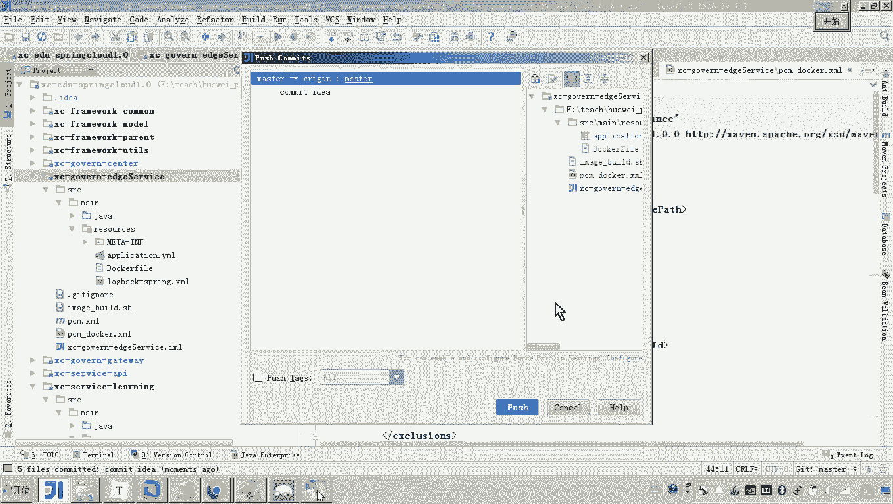
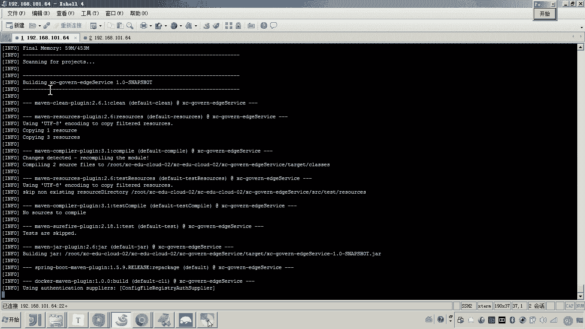
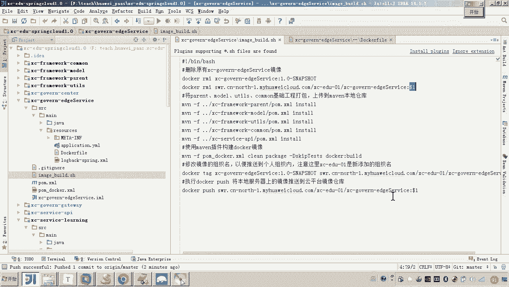
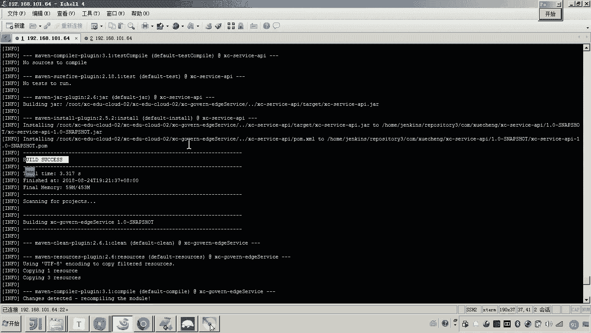
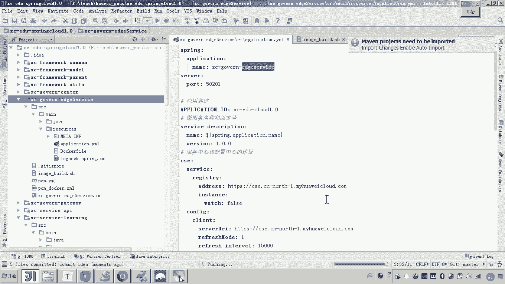
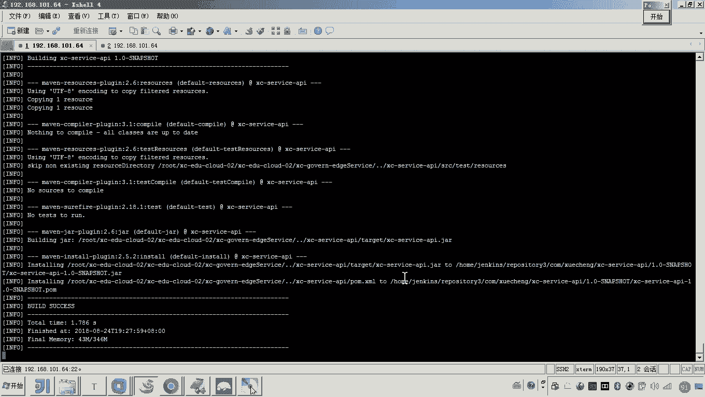
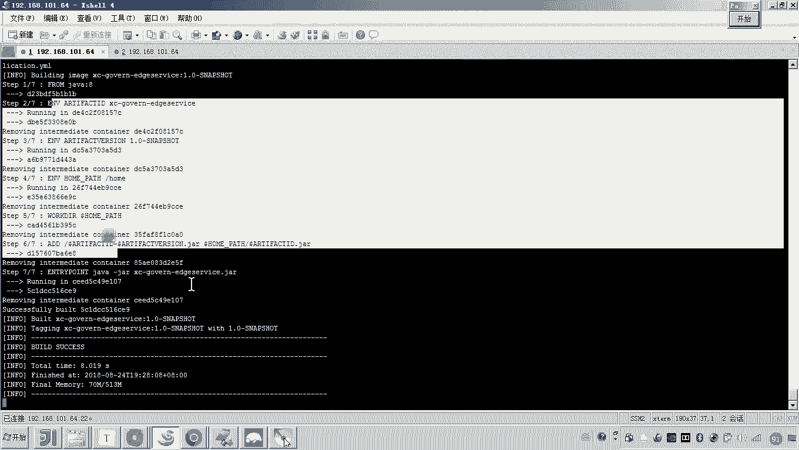
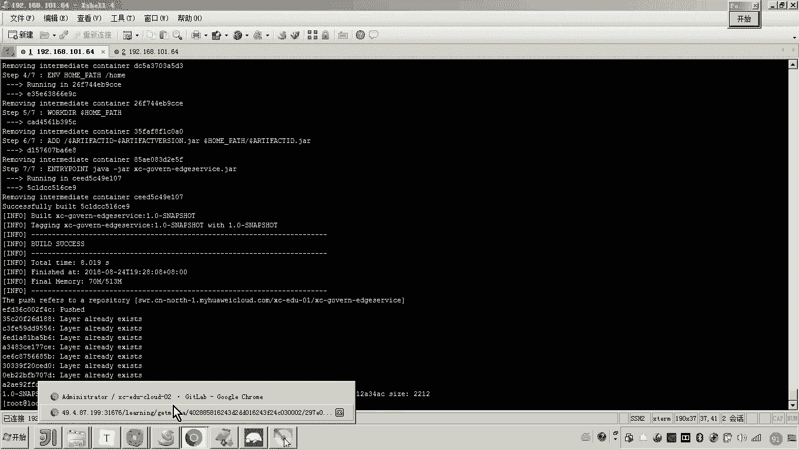
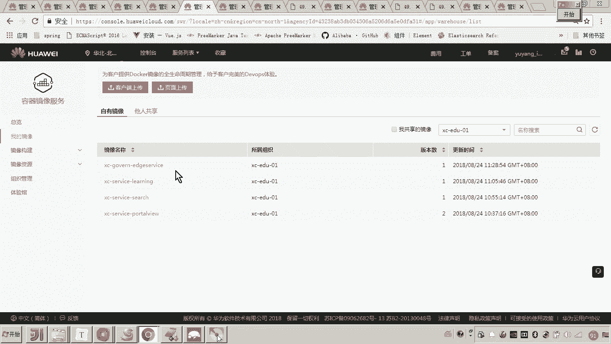

# 华为云PaaS微服务治理技术 - P119：11. 学成在线项目部署-edgeservice-上传镜像 🚀

在本节课中，我们将要学习如何将学成在线项目的网关微服务（edgeservice）的镜像上传到华为云平台。这是项目部署流程中的关键一步，其操作流程与之前部署其他微服务基本一致。

上一节我们介绍了其他微服务的部署，本节中我们来看看网关服务的镜像上传过程。

## 准备工作与配置修改



首先，我们需要将网关服务的配置文件复制到对应的项目目录中。接着，需要修改服务名称，使其与工程名保持一致，例如将 `XCEDUIserv` 改为 `edgeservice`。



以下是修改服务名称的具体步骤：
*   将项目中的服务名称变量统一修改为 `edgeservice`。
*   确保所有相关脚本和配置文件中的服务名引用都已更新。



这个过程完成后，接下来需要将 Dockerfile 文件复制到项目的资源目录下。

以下是配置 Docker 构建的步骤：
*   将 Dockerfile 文件放入项目的 `resource` 目录。
*   在项目的 `pom.xml` 文件中，添加用于构建 Docker 镜像的 Maven 插件配置。



当上述准备工作全部完成后，我们需要将代码提交到 GitLab 仓库，然后执行推送（push）操作。

## 构建与上传镜像

代码推送成功后，便可以开始构建 Docker 镜像。我们使用 Maven 命令进行构建，命令格式通常为：
```bash
mvn clean package -DskipTests
```
然后，进入网关服务（edgeservice）的目录，执行镜像构建和上传命令，例如：
```bash
docker build -t edgeservice:1.0-SNAPSHOT .
```

然而，在首次构建时可能会遇到错误。常见的错误是提示“无效的 Tag”或“仓库名称必须为小写”。这是因为 Docker 镜像的仓库名称对大小写有严格要求。

以下是解决名称大小写问题的步骤：
*   **检查错误信息**：确认报错是否源于服务名称中包含大写字母。
*   **统一修改**：将涉及服务名称的所有配置，包括 `pom.xml` 中的 `artifactId`、Dockerfile 中的镜像名、以及各类脚本中的引用，全部改为**小写**（如 `edgeservice`）。
*   **重新提交**：修改完成后，再次将代码提交并推送到 GitLab。



修正名称后，重新执行镜像构建命令。这次构建应该会成功，并自动将生成的镜像上传到华为云平台的镜像仓库中。





我们可以回到华为云平台的镜像管理页面刷新查看，确认 `edgeservice` 的镜像是否已成功上传。



## 总结



本节课中我们一起学习了网关微服务 `edgeservice` 的镜像上传流程。核心步骤包括修改配置、统一服务名为小写、使用 Maven 插件构建 Docker 镜像以及将其推送到云平台。这个过程的关键在于**保持所有配置文件中服务名称的一致性**，特别是要使用全小写，这是 Docker 镜像命名的规范要求。下一步，我们将基于这个镜像来创建工作负载，并启动和调试网关微服务。