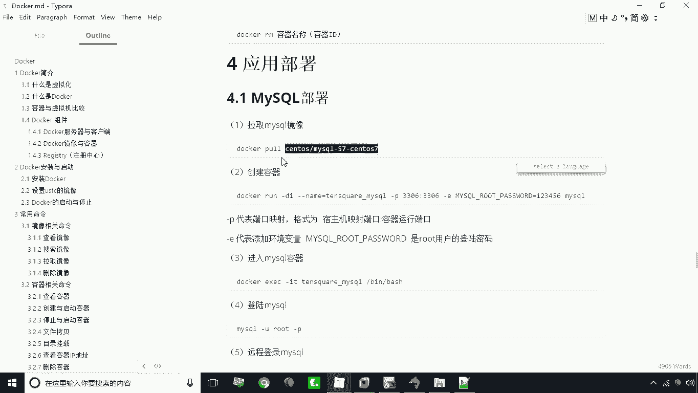
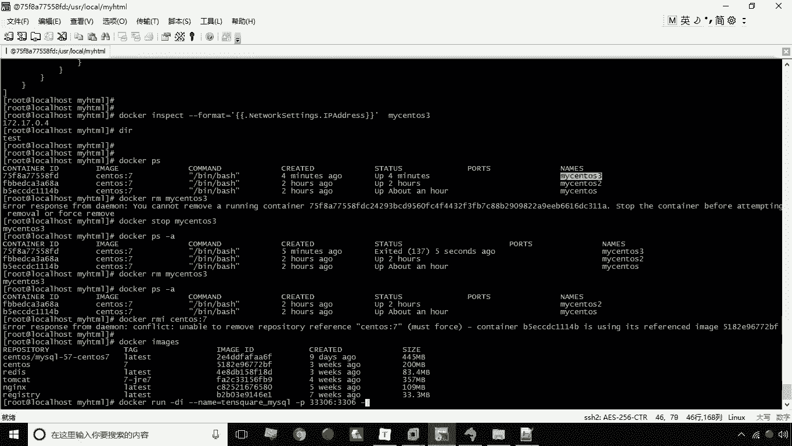
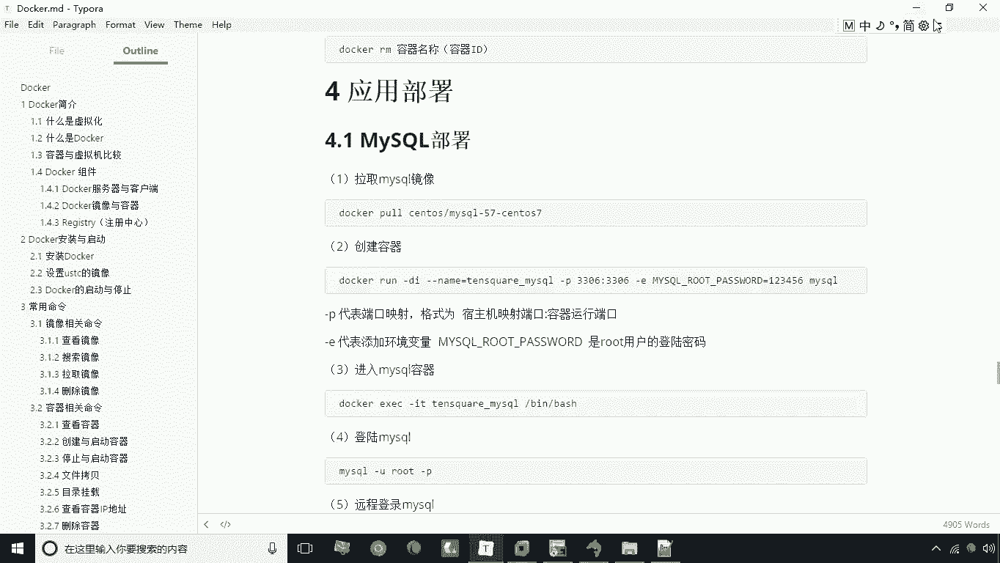
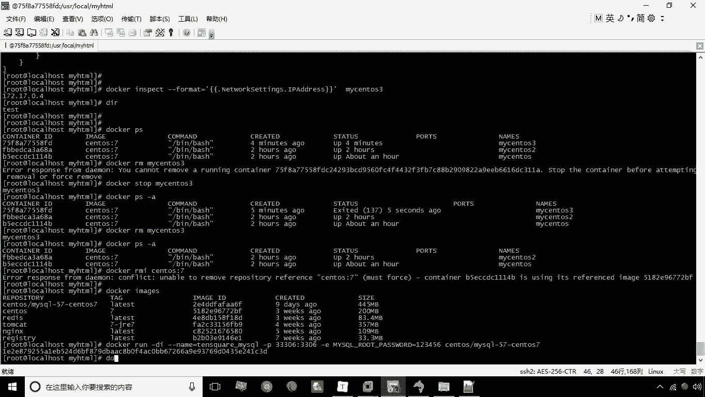
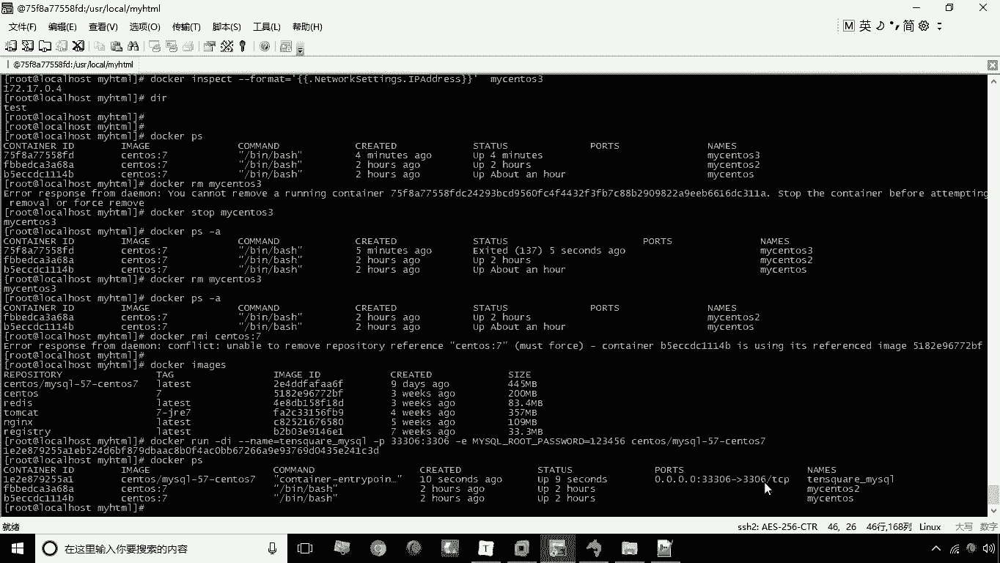
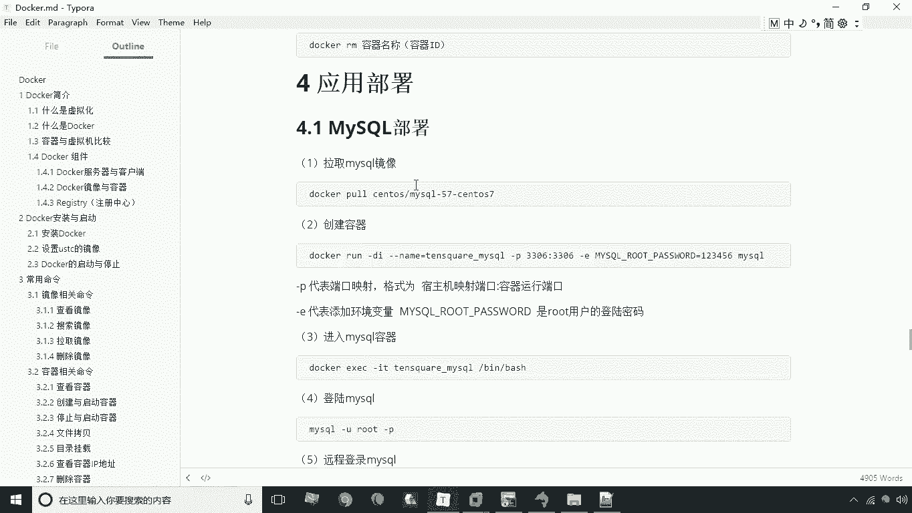

# 华为云PaaS微服务治理技术 - P11：11.mysql部署 - 开源之家 - BV1wm4y1M7m5

好接下来呢咱们来学习一下各种应用的部署，那我们在这一环节呢会学习到啊，Mysql tomcat，Nginx，REDIS这些常用的软件的一些部署，我们通过这种docker的方式。

来将这个应用程序所需要的环境给它搭建上，那首先我们来学习MYSQL的部署，MYSQL部署呢首先第一步要拉取MYSQL镜像，MYSQL镜像的话，我们这里采用版本是MYSQL5。7版本。

所以说呢这个它的镜像是MYSQL5杠五七，杠三度S7啊这么一个镜像，那好了，首先要把这个镜像给它拉取到本地。

那当然这一步操作呢我们现在可以省略了，因为什么呢，因为我们现在给大家提供的这个，这个这个镜像啊，提供这里已经提供了这个镜像了，这个镜像与我已经提前下载了，所以说这一步呢大家可以省略啊，可以省略。

那么接下来呢我们接着往下看，就是要创建容器，创建容器的话，这里是docker run杠DI啊，以守护式的方式来创建容器，杠杠name等于什么呢，Tens q u a r e。

然后呢杠MYSQL这是起了个名字啊，嗯紧接着呢再加一个杠P杠P是什么，杠P是用来做端口映射，也就是说我们通过端口映射，就可以把你容器的某一个端口，映射为宿主机的某一个端口，这样映射完成之后。

我们就可以通过去操作宿主机，访问宿主机的这个端口，来访问这个容器的软件了，那我们现在比如说起个端口叫33306，冒号3306，注意这个33306呢，是我速度机开放的一个端口。

而这个3306呢是容器的端口，那么这样一来呢，我就可以通过操作速度计的33306去，从而去操作容器的这个这个里的这个MYSQL啊，通过操作容器的3306端口，那当然了，我们这里还要指定一个参数。

就是杠一杠E什么呢，这里要指定你的root的用户的密码啊，就是这个参数名呢叫my circle groot杠password，是这么一个参数名来指定就行了。

就是my circle groot杠password等于123456，这样一来呢，我们就可以通过123456啊，来登录这个MYSQ后面的部分呢，就是我们要啊要指定这个容器的名称了啊。

我们现在可以把容器名称给它复制到这里，然后紧接着回车，这时候大家发现啊这个容器已经创建成功了，好我们先来看一下啊，docker PS现在已经创建成功了。

那么创业成功之后，大家看一下现在的这个pass，这个这一列呢就会有相应的信息了，33306映射为3306，那好了，我们创建这个容器之后。

接下来我们是不是就可以去连接了，哎就可以连接了，怎么连接呢，咱们打开我们本地的这个SQL样，然后新创建一个连接这个链接，比如说叫docker docker141，好确定。

那这个这个IP注意这个IP要指定什么，192。16，8。184。141，就是你宿主机的IP啊，速度GIP，然后呢紧接着密码是123456，注意端口是3330633306，好测试连接，现在显示连接成功。

那好我现在点连接，现在所连接上啊，就是什么呢，就是你容器的那个MYSQL，但是我们这里不是直接去连容器，而是连什么呢，通过宿主机器连接容器，因为我们这里做了一个端口映射啊。

所以说我们这里是可以通过宿主机的IP，来进行容器的，对容器的这个MYSQL进行访问的好了，咱们现在再给大家执行一个circle语句啊，我们现在直接粘过来来执行这个语句，来执行这个语句，好执行语之后呢。

我们现在F5刷新一下，这时候呢大家会发现啊，这个库已经建成，已经建成了啊，这个表库表已经建成了，这就是我们说的这个啊MYSQL啊，通过这个docker的方式来搭建一个，MYSQL的这么一个环境。

大家说一下是不是非常的方便呢，比我们以往去自己去装一个MYSQL要方便得多好，这就是关于我们通过docker方式部署MYSQL。

