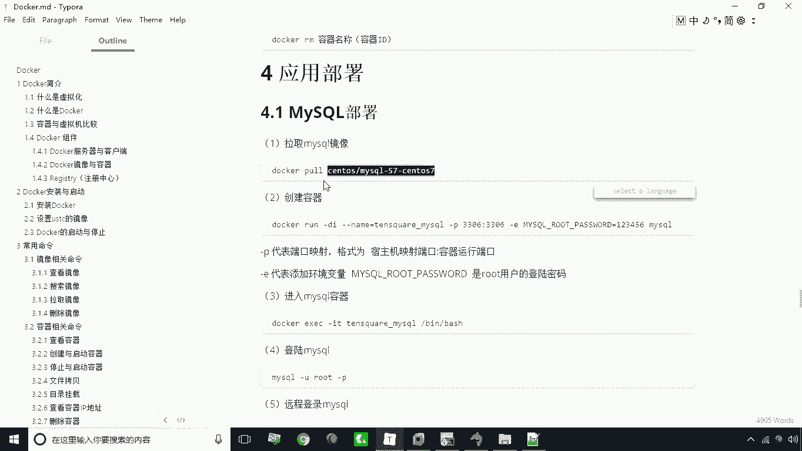
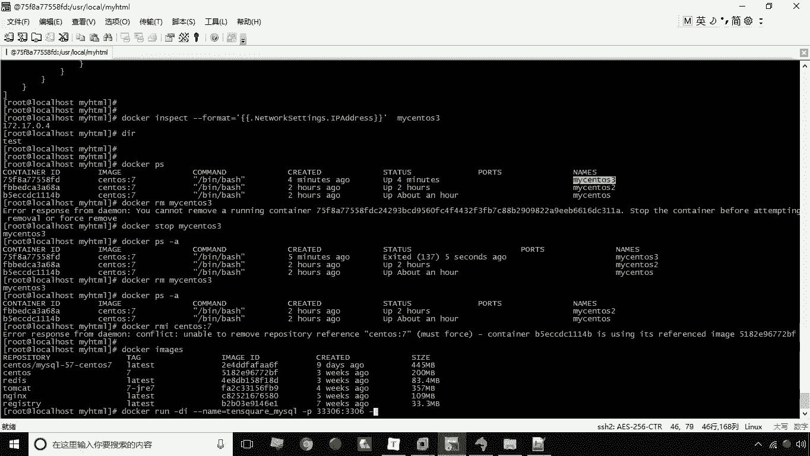
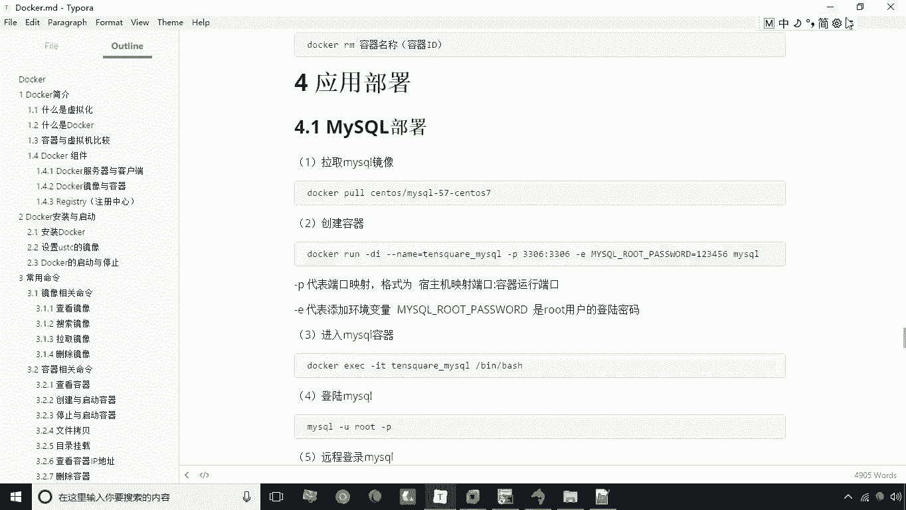
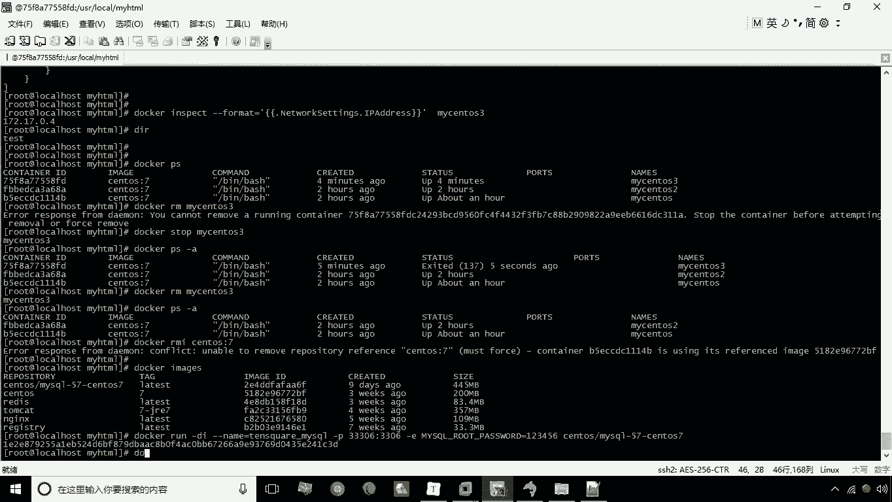
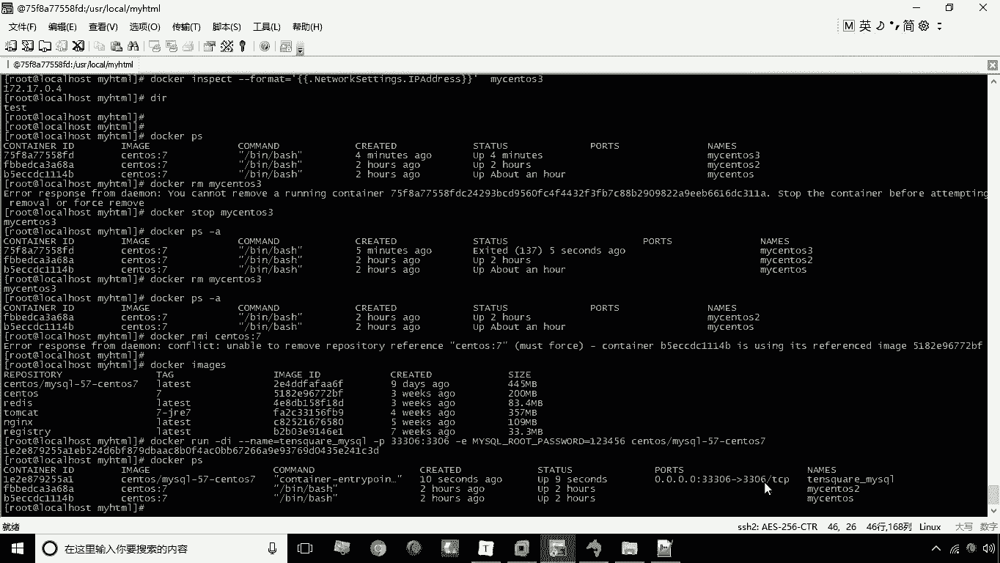
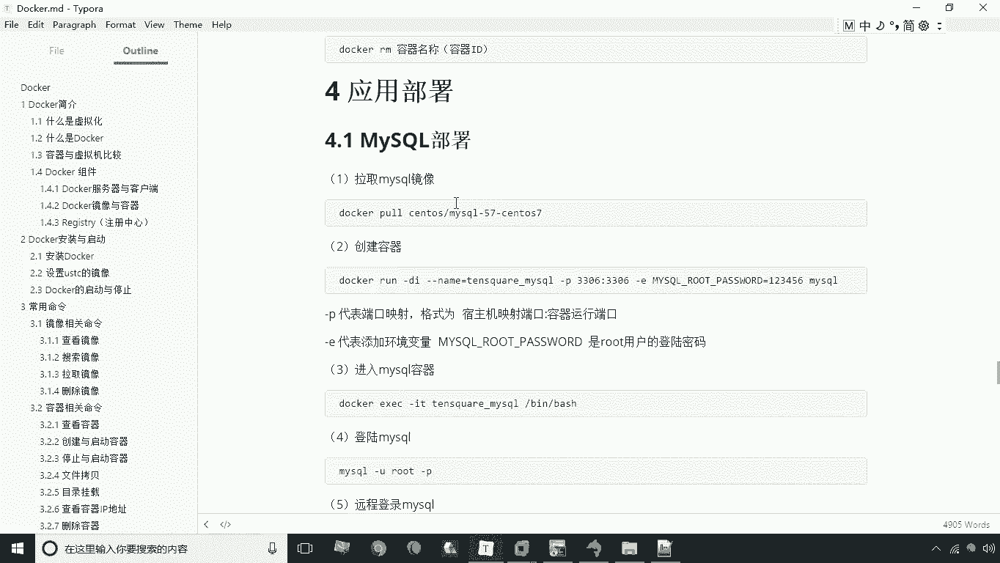

# 华为云PaaS微服务治理技术：P11：MySQL部署 🐬

在本节课中，我们将学习如何使用 Docker 来部署常用的应用程序环境。首先，我们将从 MySQL 数据库的部署开始。通过 Docker 容器化技术，我们可以快速、便捷地搭建起应用所需的基础服务。

## 概述



本节教程将指导你完成 MySQL 数据库的 Docker 化部署。我们将学习如何拉取镜像、创建并运行容器，以及如何从宿主机连接到容器内的 MySQL 服务。

---

## 拉取 MySQL 镜像

首先，我们需要获取 MySQL 的 Docker 镜像。这里我们选择使用 MySQL 5.7 版本。

**镜像名称**：`mysql:5.7`

> 注：为了节省时间，教程中使用的镜像已提前下载到本地。你可以直接使用 `docker pull mysql:5.7` 命令来拉取镜像。

---



## 创建并运行 MySQL 容器



上一节我们介绍了如何获取镜像，本节中我们来看看如何创建并运行一个 MySQL 容器。

以下是创建容器的命令及其参数解释：

```bash
docker run -d \
  --name=tensquare_mysql \
  -p 33306:3306 \
  -e MYSQL_ROOT_PASSWORD=123456 \
  mysql:5.7
```



**命令参数详解**：
*   `-d`：以守护进程（后台）模式运行容器。
*   `--name=tensquare_mysql`：为容器指定一个名称，便于管理。
*   `-p 33306:3306`：进行端口映射。将宿主机的 `33306` 端口映射到容器内部的 `3306` 端口。这样，通过访问宿主机的 `33306` 端口即可访问容器内的 MySQL 服务。
*   `-e MYSQL_ROOT_PASSWORD=123456`：设置环境变量，用于配置 MySQL `root` 用户的密码。此处密码设置为 `123456`。

执行上述命令后，容器即创建并启动成功。你可以使用 `docker ps` 命令查看运行中的容器，确认端口映射 `33306->3306` 已生效。



---

## 连接 MySQL 数据库

容器成功运行后，我们就可以从外部连接 MySQL 数据库了。

以下是连接步骤：
1.  打开你的数据库客户端（如 SQLyog、Navicat 或命令行工具）。
2.  创建新连接。
3.  连接信息配置如下：
    *   **主机/IP地址**：填写 Docker 宿主机的 IP 地址（例如 `192.168.184.141`）。
    *   **端口**：填写宿主机映射的端口 `33306`。
    *   **用户名**：`root`
    *   **密码**：`123456`（即创建容器时设置的密码）
4.  测试连接，显示成功后即可进行数据库操作。

连接成功后，你执行的任何 SQL 命令（如创建数据库、表）都将在容器内的 MySQL 服务中生效。这种方式比传统安装 MySQL 更加方便和快捷。

---

## 总结



本节课中我们一起学习了如何使用 Docker 部署 MySQL 数据库。我们掌握了三个核心步骤：拉取指定版本的 MySQL 镜像、使用 `docker run` 命令创建并运行容器（重点在于端口映射和环境变量配置），以及从宿主机连接容器内的数据库服务。通过 Docker 部署应用环境，极大地简化了安装和配置流程。