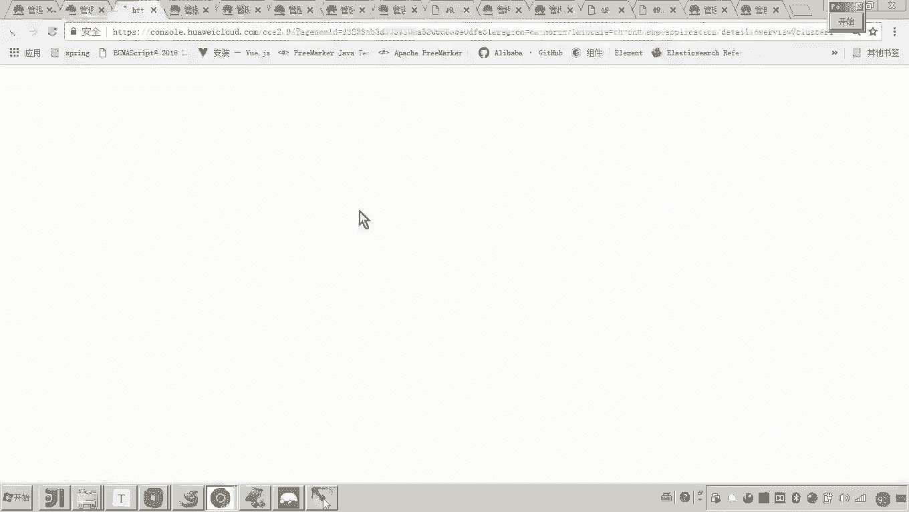
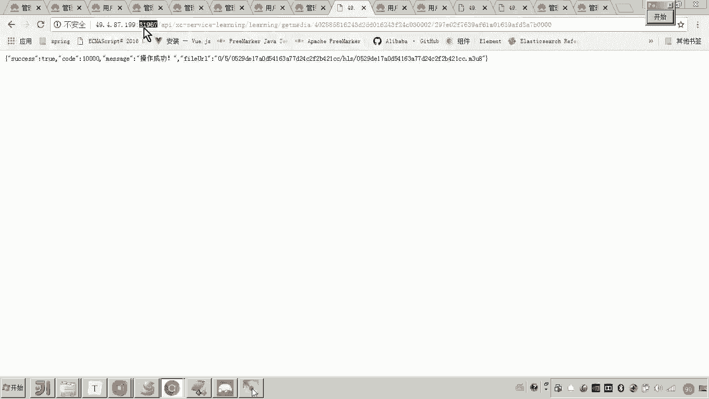
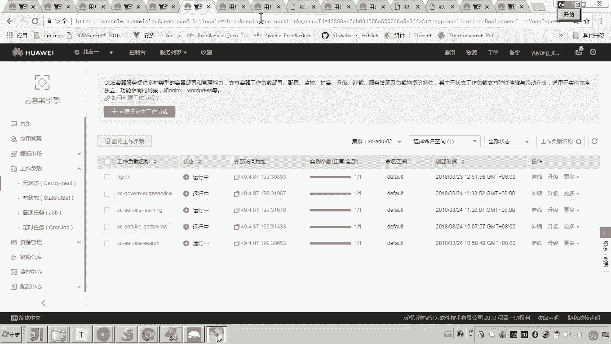
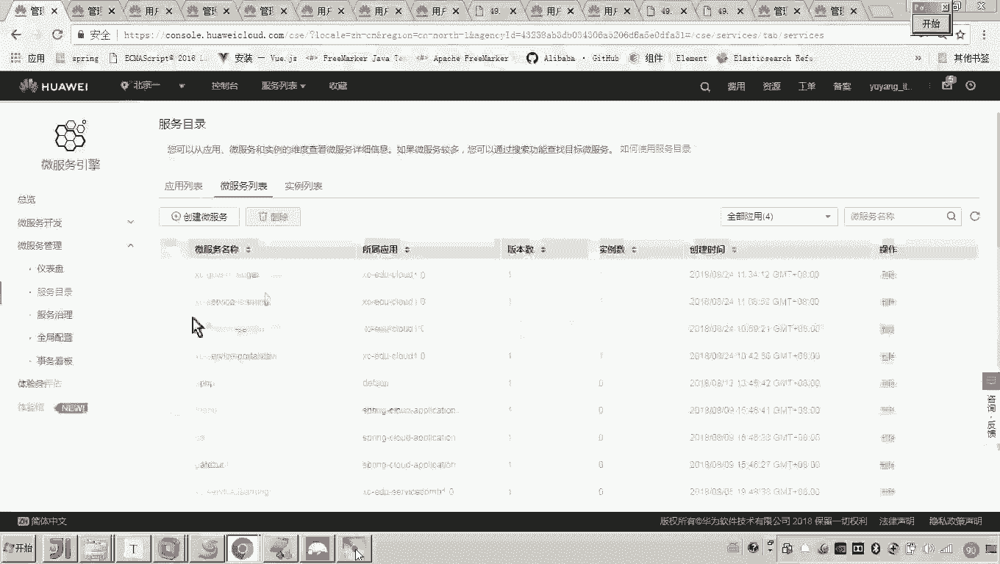

# 华为云PaaS微服务治理技术 - P120：12.学成在线项目部署-edgeservice-创建工作负载 - 开源之家 - BV1wm4y1M7m5

好，那下边呢我们就把这个I serviceice这个网关嗯，我们把这个给他创建一下工作负载来部署一下。好，那么这里面我们点击无状态工作负载，然后点击创建。好，这里面呢我们输入一下。Xc govern。

然后呢，叫爱爱姐。Service。好，然后这里边呢我们选择一个实例。好，下一步。添加容器。然后这个就选择刚才你创建这个。好，这个呢我们还是用0。5。然后用一。1024。2048。好。

然后这个配置配置完了之后呢，我们下面是不是就开始环境变量和数据卷了？这个环境变量呢，大家可以看到这里边我们来看需不需要传入一些参数呢？😊。

呃，应该这里边是都是不需要的对吧？好，那这里边呢我们就不再去写了，直接下一步。

然后这里边我们添加一个外部访问的地址吧嗯。呼呜的名字还是这个名字，然公网访问。然后我们选择这个弹性IP。

那他这个对外的这个端口，我们写哪个呀？对他这个是。是不是就是我们说的这个50201对吧？50201。好。

然后确定。下一步创建成功。好，那大家可以看到现在这个I service这个网关，然后我是不是就。创建成功了，然后我们刷新嗯运行中。好，这里边呢我们还是要去观察它的日志。

嗯，大家可以看到现在这个日志是不是就已经报上来了？😊，好，咱们看一下呃，直到他这个什么呀呃，创建它这个启动成功，对吧？好，我们等待一下啊。嗯，这个日志呢我们再来刷新一下啊，再来刷新一下。

我可以看一下他这个。具体的这个应该也没有报错，对吧？也没有报错啊那。看下他这个上下文。大家一定要学会这个去看这个日志啊。哦，这这这里面有有错嗯。我们可以看一下他这个到底注册成功没有啊，我们也来看一下。

我我我我现在就要找那个什么ish的是吧，关键字啊，他找不到，找不到的话，可能是一刷刷过去了。然后我们来看一下他的这个呃服务的目录啊，服务的目录。这里边呢我们来看哦，这个服务呢。

其实A service是已经注册成功了。对。😊，那注册成功之后呢，我们现在是不是就可以来测试一下，访问它了？😊。

好，那访问呢大家可以看到当初我们讲网关，我们是怎么说的，他有一个默认网关和我们通过URL来进默认路由。

以及通过UL进行的路由，对吧？那现在我们就可以通过两种方式来测一下吧。😊。

首先刚才我们是不是测的这个呃，这个是学习服务的对吧？那现在我们在这儿。😊，先通过默认路由吧，先通过默认路由怎么怎么怎么测呀？嗯。看好啊这个地址。然后这个是我们说这个路由的话。

各位默认路由前缀是不是API啊啊，看到我们这个程序看这儿这个前缀是不是就是API啊，然后呢，API后边我们是不是要跟这个微服务的名字？😊，微服务您对学习中心来说的话，呃。

它的微服务的名字是不是就是叫XC servicele。然后后边是不是就是我们说具体的这个服务的UIL了？然后现在呢我们把这堆儿啊，然后我们把它贴到这儿。回车。嗯，大家可以。啊，这不行。

那这个这个这个地址这个地址得变吧，这个地址肯定就不是学习服务的地址了。因为这个是要走网关了嘛，所以你要找到什么，找到网关。😊。

嗯，过期啊来再登录一下。

好，也就是说我们呢现在。😊。

啊，要去测试通过网关来转发这个微服务，那你就得啊找到网关的这个地址，你看是不是就是他呀？哎，就是他。然后现在你把这个。😊。

这个这个这个这个前面的这个地址变一下。哎，大家可以看到通过网关是不是也可以访问？然后这个是通过默认路由来访问前面这个一定要记着是网关的这个这个这个地址啊，这个端口我这个我这个东西在哪里查的呀？😊。

是不就是工作负载这？

Hm。😊，对，这儿工作服在这儿大家可以看到，这是不是就是访问这个Aserv网关的这个外部地址啊。哎，一定注意。好，那现在呢我们查到了这个地址之后呢，现在我们刚才说来你访问这个学习中心可以通过默认路由。

那我们现在通过URL的这个路由，我们看能不能访问这里面我也设置了，有一个叫open APIIserv呃search，对吧？那我们来搜索一下怎么怎么做。😊。

那你就才在前边去加这个。open API search。对吧然后怎么弄，然后把前边的这个地址，把前边的这个地址变一下。要变成什么呀？变成网关的这个地址。😡，懂我意思吧？因为你现在要通过网关来访问微服务。

对不对？所以这个网关的这个地址。😡，你把它改了端口不一样，因为外网IP一样嘛，就是端口不一样来复制这堆这就是通过网关来访问。😊，贴进去。回撤。各位看一下这个数据是不是照样可以啊？对。

这里边你看比如说数两条。😊，没问题吧。哎，所以这个哎我们已经把网关呢成功的部署到了云平台。

我在讲网关的时候，我是不是当时也教会大教了大家一招，教什么呀？我们是不是可以通过注意注意看。😡。

我们是不是可以通过一个服务的目录来看一下它的一个图形有印象吗？来点开。

哇，这图挺有意思啊，我们找到网关在这儿。😊，对不对？你注意这几个微服务，这几个微服务可都是在云平台了啊。😊，对，就现在你看到的这几个实例啊，这些都是在云平台部署的。我的本地其实现在都已经没有启动程序了。

看懂了吧？嗯，到这儿来说，各位通过网关我们部署完了之后呢，我们发现微服务层这个所有的这个啊微服务的部署已经完成了。😊。

好，那么到这儿哎，我们这个微服务的部署我们就告一段落。

