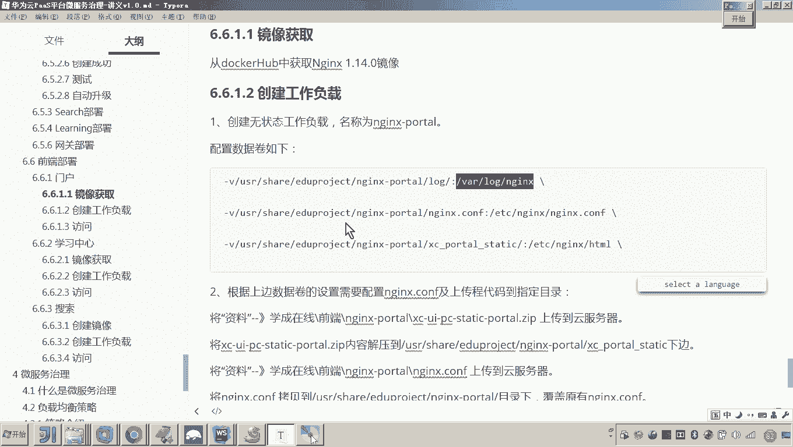
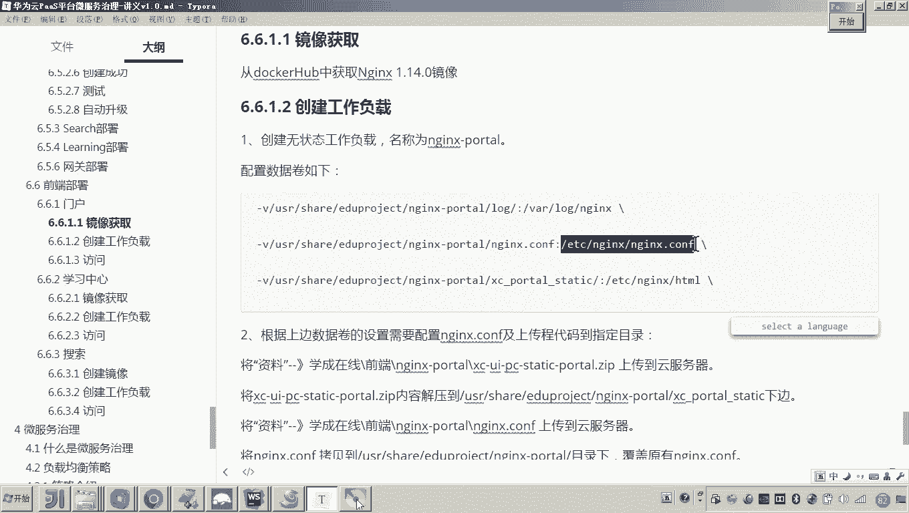
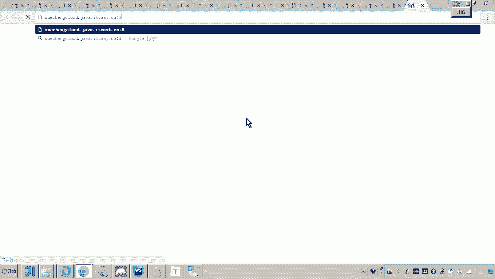

# 华为云PaaS微服务治理技术 - P121：13.学成在线项目部署-前端门户-创建工作负载 - 开源之家 - BV1wm4y1M7m5

好，那么下边呢我们就开始前端部分的部署。啊，前端这块呢总共有三部分啊，第一是门户，第二是学习中心。最后一个是搜索。好，那么我们先把门户部署起来。呃，为什么先布门户呢？因为门户是我们整个工程的入口。

另外呃这个学习中心和搜索呢，它的访问也要通过门户当中的N来进行访问。所以我们先部署门户。好，那么首先来看这个镜像的获取啊。门户的这个镜像，门户的运行呢会使用en啊。

所以这里边呢我们说docker hub当中呢其实是有en的镜像的啊，我们就直接从这个docker hub当中来获取呃en。好，这里边呢我们来。

进入我们这个云平台啊，然后呢我们在工作负载当中选无状态的工作负载。然后我们点击创建无状态的工作负载，然后起一个名字叫anexport。好，这里边呢我们开启时钟同步下一步。然后。

那在这里呢，我们是需要从在这儿搜索一下啊，就搜这个就呃用这个N就可以。

然后呢，这里边我们这个en的这个版本呢，我们选择这个呃这个稳定版就可以啊，选择这个啊稳定版。然后呢，我们给他起一个名字。好，那这个enin的这个呃CPU呢，我们可以用0。25啊呃。

这个限制呢用一一盒啊就可以了。好，这个是1024。好，这里边呢注意啊呃上面的配置就完成了之后呢，下边最主要的就是这个N进克斯的这个数据卷这一块了。呃，有人说老师，你刚才不是选了一个无状态的工作负载。

那这里边还要配数据卷吗？啊，注意啊，这个配不配数据卷和我选择这个是否有工这个状态和无状态是没有直接的联系的。呃，因为无状态，我再次强调无状态表示这个什么呀呃，无状态就表示这个应用在运行的时候呀呃。

它是不会去产生嗯这个数据状态变化的呃，也无需对数据进行持久化操作呃，无状态工作复载的一个特点，就是说我非常容易的就把原来一个实力呢，我把它扩充成多个嗯。懂我意思吧？所以这就是无状态工作负载的一个表现。

而有状态的则不同有状态的当时我是不是给大家举了一个例子呀？我说我就拿这个my的这个例子来说，原来我是单击数据库，对吧？而现在呢我要部署一个什么双呃数部署多个节点的这个数据库。那这个时候呢那怎么办呢？

哎那这个时候呢，我们说那个数据数据共享问题是不是得解决呀？所以这就不是绝对不是说呃单单纯的就是我把这个节点复制成多份的。哎，所以大家一定要注意啊，这是无状态工作负载的。

就是可以非常快速的进行横向扩展我的微服务。哎，这个是它的特点。好，那么所以呃这里边我要配置几个这个什么呀？这个数据卷呀，其实和这个有状态无状态没有关系的。😊，那个说候老师，那你这个N要配置附呃。

这个数据卷要配置什么呢？我们可以想一下，因为当中我们是不是要配一些配置文件，包括我的工程的代码呀？其实我还是为了方便将来我们这个呃配置的更改啊，包括这个什么呀，包括这个代码的这个升级啊。

所以这里边呢呃我我就我就在这个配置了三个三个数据卷，哪三个啊，第一个是日志啊，日志啊，我们把这个呃在我的数组机数组服务器上面呢啊，然后我映射到容器的一个日志的目录，方便我去维护呃。

另外呢还有就是这个的一个配置文件。😊。

按键的配置文件，因为这个配置文件来回会改。那这么每每次改一下，如果我要把这个配置文件把它打到这个镜像当中呢，肯定是非常麻烦的。还有我们现在这个测试阶段的话，包括这个它的这个什么呀，这个工程的代码。

最下边这个里边就是放这个门户的这个工程的代码。😊，好，这三个呢我们来配置一下。好，那首先我们先配第一个。

呃，第一个的话是什么呀？他的这个。

呃，他的这个日志的目录对吧？然后呢我们来选择。

这个后边的这个呃是呃挂载到这个容器的这个目录啊，这个是不允许改的啊啊好，然后呢再继续。😊。

好。嗯，这个。

这个N confi这个是配置文件啊，然后呢。😊，来他对应的这个容器里面的这个配置文件是在这个位置。

好。😔。

然后再有。继续。然后容器的这个路径呢，是他。

好，到这儿呢，咱们这个三个数据卷的这个呃配置呢，咱们就配好了。好，那接下来呢我们是不是就可以呃下一步？😊，嗯，然后呢我我们选择选择他的这个访问方式啊，选择他的访问方式。

好呃，那么这个访问方式我们怎么选呢？啊，我们肯定要是公网访问了，为什么？因为是门户嘛，门户我们是将来还要输入域名来访问，对吧？所以这里边我们通过公网。

好，这里边我们配一个名称。那通过公网访问的话，怎么访问呢？是通过弹性IP吗？呃，如果你是通过弹性IP的话，大家来看它其实有一个特点，就是说呃当然这个容器里边的端口肯定是80了，对吧？就是我N里边啊。

它的端口80，但是你没发现吗？我要通过这个弹性IP的话，它这个端口呢，它就不能是80。😊，他会给你指定什么呀？3万到32767之间的一个随机端口。所以那这样的话就非常不方便了呀。你想呀。

将来我们在这边是不是要输入什么域名啊，你在哪几哪哪个网站的域名，后边要写这个什么呀，写1个3万的端口啊。😊。

这肯定不合适吧。所以这个域名通常我们默认就是采用80端口了。😊。

懂我的意思吧？对，所以这里边我们要用弹性IP来访问我们的门户，呃，那就不能走80了。所以我们不能用弹性IP。😊，嗯，那用什么呢？用负载均衡的方式。就是在这个云平台当中呢啊它有一个负载均衡啊。

这个这个负载均衡呃，它呢就可以怎么弄呀。对，就可以啊让我们来选择啊一个呃，你看这里边有增强型和经典型嗯。😊，我可以选择一个增强型。然后那有如说老师这个增强型这个负载均衡。各位，我只要一选择负载均衡的话。

你可以看到这儿，我是不是就可以输入这个80端口了。对，但是又问题来了，那你最终通过负载均衡，你不是还得通过公网IP吗？那你这个公网IP是谁呢？所以一定注意这里边我给你我给你用个经典型就可以了。来。

我新建一个新建一个弹性的负载均衡啊，新建看好。😊。

这个负载均衡呢是它的一个服务啊啊是他这个云平台的一个服务。而我在创建负载均衡的时候，注意看。😊，哎，我起个名儿，哎，叫02。然后我在创建这个负载均衡的时候，你看到呃，这里边它说是按宽带宽计费呀。

还是按流量计费。呃，因为因为各位通过负载均衡，我们是不是要转发到我们这个内网的这个容器当中啊？所以这里面有它的收费方式啊。😊，呃，另外的话各位我们呃这儿我们是不是就可以怎么弄啊，是不是就可以来创建了。

对不对？来点击点击购买啊，点击立即购买。😊，嗯，好。提交。好，这样的话，我们这个负载均恒呢就开通了。嗯，那开通了之后呢，各位我们再回到这里啊刷新。😊。

好，在这儿呢。😊，哦，还得刷一下。好，就有了是吧？哎，就有了啊，那么那么那么再往下看啊，再往下看。那我这里边呢，我是不是要进行确定，对吧？要确定。😊。

确定之后呢，下一步。嗯，注意啊，他这他这里边你看是什么，他这个是个经典型的呃。他应该还让我去。申请一个公网的IP我看一下啊。那我把它删掉啊，来再添加一个，看好啊。

公网访问。对吧好呃，这这里边的话。我们不是选择它了是吧，选择它了。然后这里边的端口。😊，这个端口。呃，然后呢，我们。呃，来看一下啊。你看这里边还有一个弹性IP。

打开看一下。弹性IP呃，访问方式需要结合集训内的任个节点绑定这个弹性IP。

哎，我这个弹性IP我现在看看我有没有空余的啊。因为现在如果我要用负载均衡的话，就需要用弹性IP啊，否则的话，我我怎么用公网来访问我的这个门户呢？

啊，好，这里边我们我们找一下这个弹性IP啊。弹性IP诶。

哦，你看弹性公网IP我们看一下我这里头有没有空闲的。

呃，我这里边有很多的这个弹性IP啊，但是这个弹性IP当前都已经绑定了我的这个什么呀，都已经绑定了。😊，我的这个。看一下这个。都已经绑定了我的节点了嗯。然后我们再回过来啊再回过来看一下，还是回到刚才那里。

然后他应该是自动帮我申请了一个弹性IP，然后我确定。😊，看看啊去。已经被配置到选择的负载均衡实例上，请选择其他的负载均衡实例啊。我这个选我刚才不是新建了一个经典型吗。

好，然后确定。好，然后咱下一步创建。你看这儿大家看到我这个负载均衡绑定那个弹性IP是不是它自动给我生成了一个啊，49。4。84。18，对吧？好，然后下一步啊，然后创建好，这样的话。

我们这个门户就创建成功了。😊，这个门户创建成功时候，大家可以看到，哎，这个就是由于我嗯这个申请了一个负载均衡，然后呢，它自动给我申请了一个呃弹性IP。而这个端口各位可以看到是不是80端口。对。

回头我们访问我们的门户呢，是不是就可以通过这个地址来访问了。😊。

好，那到这里呢各位呃我们这个负载均衡呃，不是这个工作负载呀，门户的工作负载就创建完成了。那么这里边我们刚刚啊用到了一个新的东西，就是呃就是什么呀？就是这个弹性的啊负载均衡，弹性负载均衡。😊。

稍后呢，我们要去呃把这个门户当中的这个呃工程，包括配置文件呢，我们上传配置一下，然后我们再测试它的访问。好。

