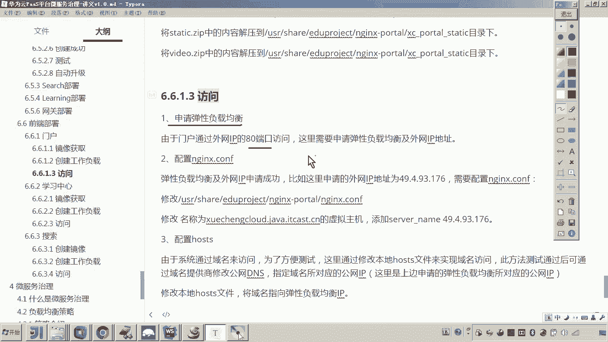

# 华为云PaaS微服务治理技术 - P122：14.学成在线项目部署-前端门户-配置及调试 - 开源之家 - BV1wm4y1M7m5

好，那么大家来看啊，现在的话咱们这个门户呢，大家来看一下，它应该是启动是失败的。为什么呢？因为呃我们在去配置的它的这个配置文件的时候，大家可以看到呃，我当时这个配置文件是不是配在了这里啊？对。

那这个配置文件呢就需要我们手动的给它上传啊，给它上传。包括我们说这个门户的代码。好，那这里边我们就需要登录到我们的呃云平台。

啊，就是云服务器上啊，199这台机器。然后呢，我们来访问看一下。那么在访问这里头的时候呢，我们来看到它是不是自动给我们创建了一个目录，叫做，对吧？然后在这个目录当中。

各位可以看到这三个是我映射的这个数据磁盘的这个目录呢，它已经自动创建成功了。而现在我们要将我给大家提供的一个什么呀？注意看啊，我们找到咱们这个学生在线前端啊。

在这个目录里面有一个叫然后在这啊有这几个文件啊，其中第一个那这就是我们说这个门户的配置文件。下边这个就是门户的这个工程代码啊，里边包括了一些的这个静态的样式，包括页面原型等等。

所以我们需要把这两个呢上传到我们的这个语服务器上边。😊。

好，那现在呢我们就来做这件事儿。好，然后先咱们先把它上传到咱们这个上一个目录吧。然后呢，咱们找到。

找到这个学生在线，还有这个前端门户。然后你把这个选择进去。好，然后呢，再接着呃，我们再来。

好。把这个也上传一下。好了，那么这个是80多兆啊，传的稍微有一些慢。好，那么咱们让它传着。那现在呢传的过程中啊，哎我们呢来调试一下它的这个来调试下他的这个什么呀，他这个门户的访问啊。好。

然后这个我们再浏览一下这个密钥文件啊。😊，好，选择这个。嗯，好，那现在呢我们来看一下呃，再回到这个里头。回到恩静克斯port。对吧？好，回到进去了之后呢，大家来看啊呃。

我我我先把我先把它这个N in的这个配置文件呢，我把它给更改了。😊，嗯，好，然后这里边呢我们就把它给删掉。嗯，然后呢我们把这个呃上一集目录的移过来。好，这个是不是就OK了，对吧？然后呢。

我们再进到这个里头，这个里边应该说是不是就是门户的这个代码了，是吧？而在这个里边呢，我们可以去新建一个呃index htL，目的只有一个，一会儿我我测一下这个门户能不能访问通。好。

这里面我们随便打一下吧。哎，叫hello word。😊，嗯。好，那现在呢我们是不是就创建好了吧，创建好了之后呢，大家来看嗯，那我现在就准备来准备访问了啊，准备访问之前呢，大家嗯看一下这个。😊。

这个我这个。NG的配置文件啊。然后咱们不用在这儿看吧，咱们可以怎么弄啊。咱们在这个因为这个文件是不是从我的这个本地的这个呃目录里面传到云服务器的。所以我们打开这个文件看吧，来看一下它俩内容是一样的啊。

😊。

在这个文件当中注意，你看这个虚拟主机，这个虚拟主机是不是就是我们说的这个门户的首页呀？好，那个门户的首页呃。😊，那稍后我们再配成域名啊，那刚开始我们可以用这个IP来访问嘛，但是这个IP地址得配成什么呢？

😊，这个IP地址得配成。呃，我们说的这个访问方式当中的这个呃，我们申请的这个负载均衡给我们带的这个公网IP。好，你把它改成他。好。那我现在是不是就改成它了吧，改成它了之后怎么办呢？改成它之后呢。

我们是不是就可以呃还得还得传一下。因为我现在改过了之后，有时候老师你可以通过这个linux改呀，那通过它改的话，肯定没有没有什么啊，没有我在外边改完，给它传上去，方便，对吧？所以呢我就把它干掉。

然后再传一下。😊。

你看这样是不非常快呀？然后传完了之后呢，各位现在呢我们就怎么弄啊，那我启动一下un键来试试啊，来删除。😊。

嗯。那这个时候呢他会先去看看一下啊，运行中啊，就就就成了。好，现在呢我们可以在这看一下日志啊，看看他有没有一些日志嗯。😊，啊，来注意再看实例。OK那现在呢我们是不是就可以来尝试访问一下试试了嗯。😊，哎。

大家可以看到这是不是就是我的门户啊？对啊，这个hello world是不是就我写进去的这个ind的ATTL。😊，好了，那你大家来看啊，那是因为我们申请了这个负载均衡。

然后呢带了一个外网IP这个时候他是不是才也在才可以用80端口啊？😊，所以如果你不用这个不申请这个负载均衡的方式的话，它是无法使用这个80端口的那所以我在访问的这个小节当中，我给大家说了。

要申请一个弹性的负载均衡。那门户啊访问通过外网IP的80端口来访问啊，将来我们挂域名是不是也是挂的这个呃这个这个这个IP的这个80端口啊？对，好，那现在呢我们发现他已经可以访问了。那可以访问的话。

那我们要做一件事了。你看他现在是不是也传完了，传完了之后呢，我们要怎么做呀？😊。

因为在这个在这个里边，哎，是不是就是我们说的这个。就是我们说的那个门户的这个代码了，是不是？😊，所以那怎么弄啊，我们就可以把它解压吧。可以吧。对，所以我们这么做啊，看好啊呃，我把。😊，这个门户的代码呢。

我把它拷到这个里头。嗯，然后呢把它移到这个里头之后呢，我在这儿解压，还不弄错了啊。嗯我把它XC。😊，嗯，我把它拷到这个XT下限这个下边。😊，因为我们知道这个目录是不是就是我们说门户的这个。

他的这个工程目录了。所以我们进去之后发现来看好啊，看好刚才我是不是建了一个你带HTML啊，现在我准备解压了。😊，嗯，这门户里边的代码还是有点多了啊。😊，这个源代码其实已经提供给大家了。

大家可以在本地布N来跑。好，现在是不是就解压完成。好，注意看我现在要刷了啊，刷新。😊。

各位看。这个门户是不是就成了？对，那么这个门户呢，我们就部署成功了，就部署成功了。有说老师怎么通过域名访问呢？呃，如果要想通过域名访问的话，呃，我们肯定是最正规的路径途径，是不是就是通过域名提供商。

我们改这个公网的DNS啊，然后也就是域名所对应的这个公网IP嘛。哎，但现在呢我们如果现在呃我我们去改的话，就是这个生效的时间也会很慢啊，我们我们就不改了。

我们就不改这个公网的DNS的这个域名所对应IP了，我们怎么弄呢？我们可以为了测试方便啊。我在我的讲义上说了，你可以修改你的本地host的文件。😊，那修改本地host的文件又是什么个原理呢？

就是本地的host的文件，你只要改了之后，那么你在输入这个域名访问的时候呢，他就会先看你本地的host的文件，这个域名所对应的IP哎，那么他找到了这个域名所对应IP呢，他就走这个IP地址了。懂我意思吧。

所以现在呢我要在本地配这个域名所对应的IP那这个IP应该配成哪个呢？肯定是配成我刚才申请的这个什么呀？叫做49。4。84。18。😊，懂我意思吧？所以这样的话，我们就把这个域名呢都配好了。正常的情况下。

你想呀，你有一个网站，你不可能说让别人配host的文件来访问你的网站吧。正常情况下肯定是别人直接输入域名，是不是就可以访问了？因为你一输入域名。

是不是就就走了这个公网的DNS那DNS是不是就可以根据域名找到IP啊？没错吧，哎，那通过域名提供商就可以改啊？现现在呢我们是测试，我们就可以直接在本地来配这个域名所对应的IP就走一个捷径。😊，嗯，好。

那现在呢我们配好了之后，那现在来吧，我们试试啊，看好。😊，那我那我在这儿是不是就可以改成域名了？😊，大家看到没问题吧。哎，可以。😊，这就是我们上边的这个门户的部署，嗯，就是门户的部署。好了。

那么这个门户呢我们就部署好了。呃，但是但是注意嗯还有几个东西也要往上传。呃，因为在门户当中啊呃门户的这个en in的定位啊啊我给他的定位呢呃它就相当于一个这个什么呀，我们说前端或者服务端的这个代理。

也就是说我们通过门户的这个Nin，大家可以看到啊呃它有很多的这个代理，它有很多的这个代理。😊，也就是你会发现我会把这个他需要他转发的这些前端，还有后端的这个呃服务。呃。

我们都通过门户的NG格式进行代理转发。对呃，所以门户这一块呢呃，将来我要部署这个学习中心的话，呃，我也会通过这个门户的en来来访问学习中心呃，也会通过门户的这个门户呃门户的这个en访问这个搜索的前端。

大家来看，我也会通过门户的这个en呢呃来访问这个视频，大家可以看到，对吧？😊，所以这里边呢呃我们要把这个视频也传到门户上边。因为现在是测试嘛。啊正常情况下呢，我当时呃大家可以看到啊。

原呃有学过学生在线的，我应该讲过啊，专门的这个我们将来要部署专门的视频服务器的。只是说现在测试的话，我就把视频呢放在门户当中啊，回头我们去呃访问呃门户里边的这个视频目录里边的视频就可以了。😊，呃。

另外还有一点就是说这个门户的嗯还有一个东西就是一些静态文件，静态资源。对，所以哎我们还需要做一件事儿，哎，做什么事儿呢？😊。

还需要把我刚才说的那个呃视频，哎，我们把它传上去。

哎，有说这视频在哪呢？也在这里头。对在我的这个学生在线目录当中，是不是有一个叫做video，看见吗？哎，你就在这传就行了，你别翻到500多道，慢慢传啊，我们课一边讲啊，然后一边传。好，然后呢继续。😊。

然后再继续传哪一个串这个静态资源。嗯，好，这个静态资源很快啊，那视频有点慢。好了，嗯，到这儿哎，我们就把这个门户的部署方式呢就讲完了。好。😊。

