# 华为云PaaS微服务治理技术 - P122：14.学成在线项目部署-前端门户-配置及调试 🚀

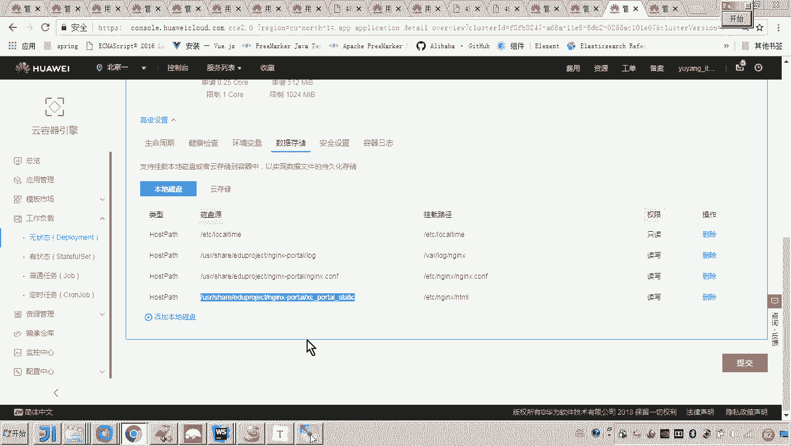

在本节课中，我们将学习如何配置和调试“学成在线”项目的前端门户。主要内容包括上传配置文件与代码、配置Nginx代理、通过负载均衡公网IP访问服务，以及通过修改本地hosts文件实现域名访问测试。

---

## 门户启动失败原因分析 🔍

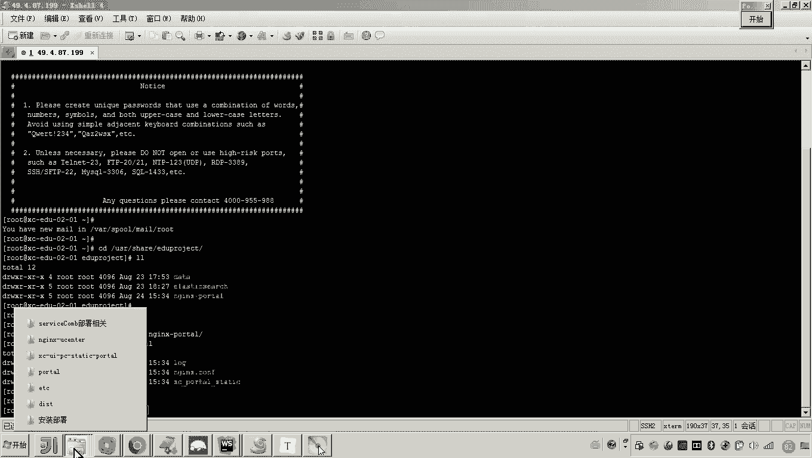

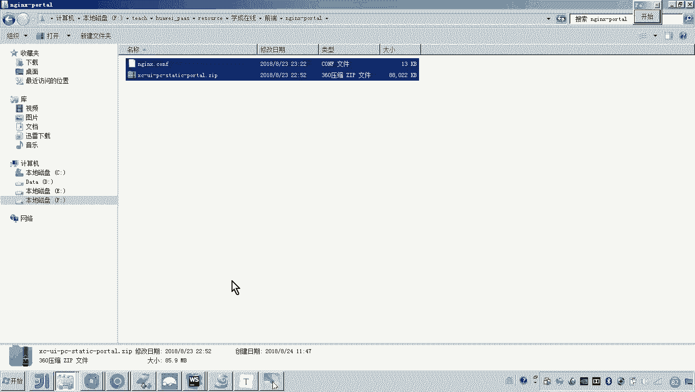

上一节我们介绍了项目的基本结构，本节中我们来看看门户启动失败的具体原因。门户启动失败是因为其配置文件尚未上传到服务器。

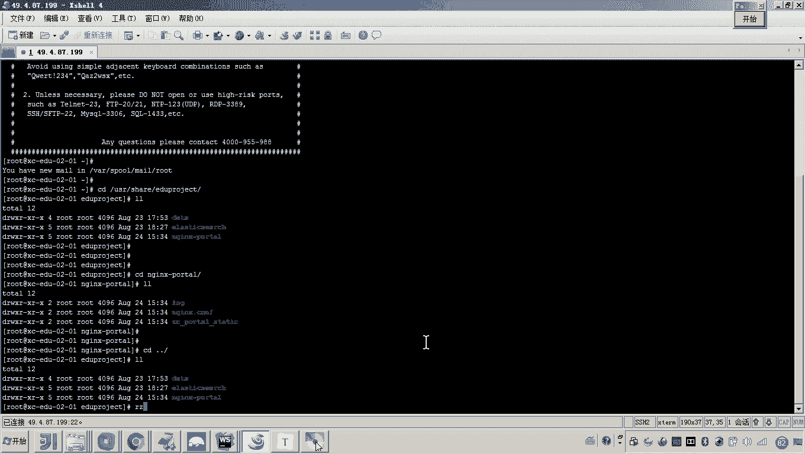

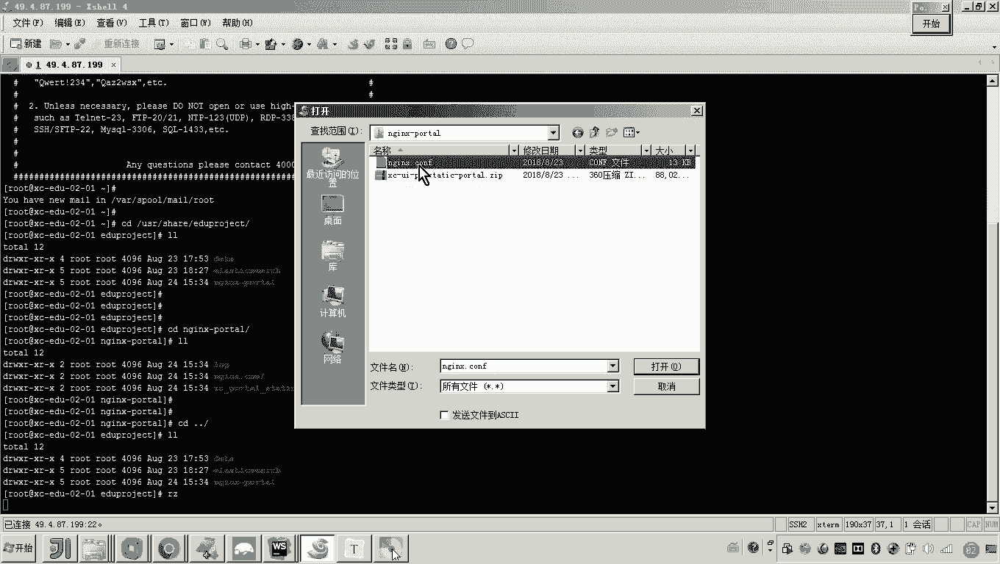

配置文件位于项目目录中，需要手动上传至云服务器。门户的工程代码，包括静态样式和页面原型等文件，同样需要上传。

## 登录云服务器并查看目录 📂

我们需要登录到指定的云服务器（例如IP为199的机器）进行操作。服务器上已自动创建了用于映射数据磁盘的目录。

以下是需要上传的关键文件列表：
*   `portal.conf`：门户的Nginx配置文件。
*   `xuecheng-portal.zip`：门户的工程代码压缩包。

## 上传配置文件与代码 ⬆️

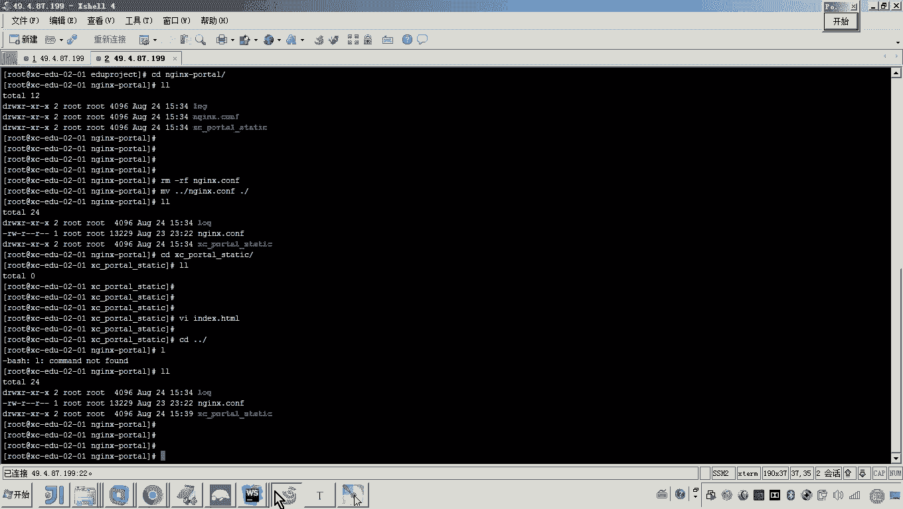

现在，我们将必要的文件上传到云服务器。

首先，将`portal.conf`配置文件上传至服务器的`/etc/nginx/conf.d/`目录或其上一级目录，以便后续使用。

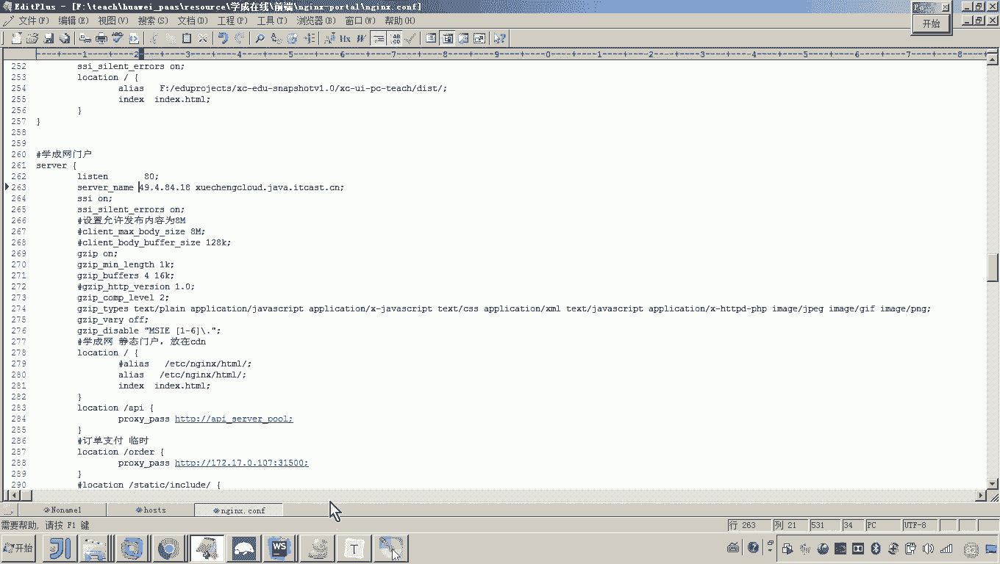

接着，上传`xuecheng-portal.zip`门户代码压缩包。由于文件较大（约80MB），上传过程可能需要一些时间。

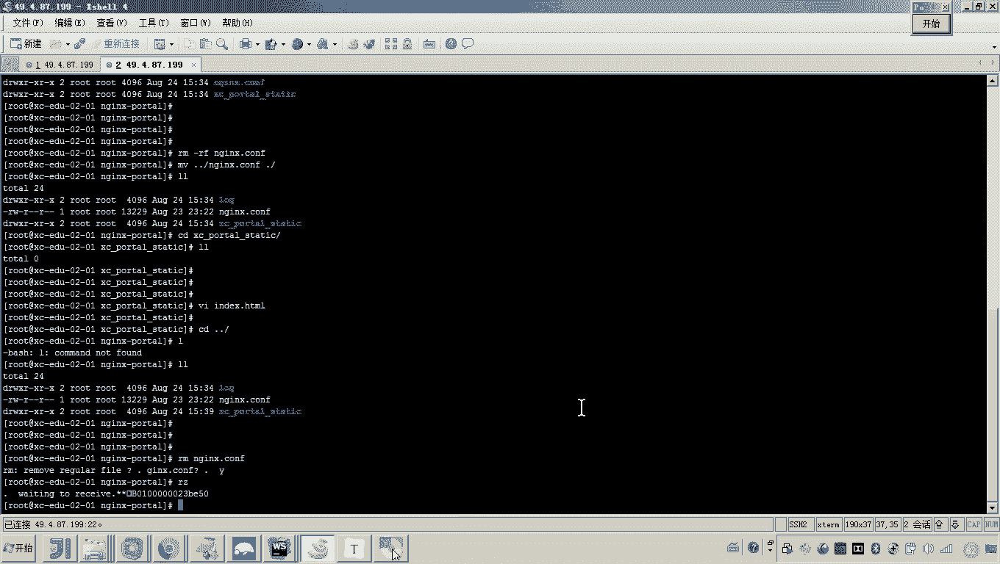

## 配置与测试Nginx访问 🌐

在上传文件的同时，我们可以先配置并测试Nginx的基本访问功能。

进入Nginx的配置目录，将旧的配置文件替换为刚刚上传的`portal.conf`。在该配置文件中，需要修改虚拟主机的监听地址。

将配置中`server_name`后的IP地址，修改为从华为云弹性负载均衡（ELB）服务申请到的公网IP地址。修改完成后，将更新后的配置文件重新上传至服务器。

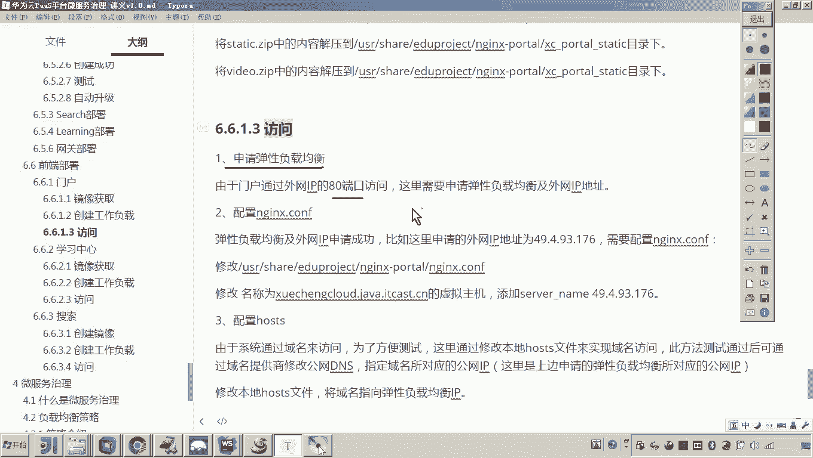

上传完成后，重启Nginx服务。通过查看服务日志，确认Nginx已成功运行。

此时，在浏览器中访问负载均衡的公网IP（例如`http://49.4.84.18`），如果能看到测试页面（如“Hello World”），则证明Nginx配置正确且80端口访问通畅。使用负载均衡是能够通过公网IP的80端口访问服务的前提。

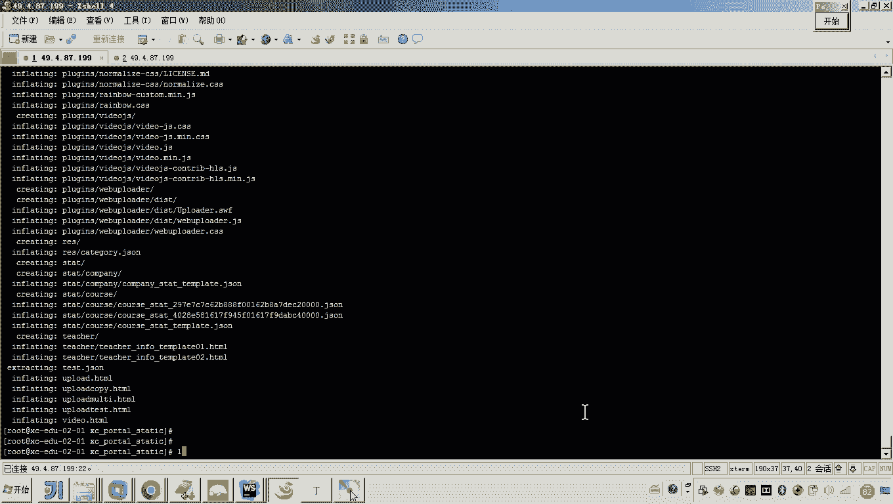

## 部署门户代码并验证 🏗️

门户代码压缩包上传完成后，即可进行部署。

将`xuecheng-portal.zip`文件移动到Nginx配置中指定的门户网站根目录（例如`/usr/share/nginx/html/xuecheng-portal`）。在该目录下解压压缩包。

解压完成后，刷新浏览器访问公网IP，此时应能看到“学成在线”门户网站的完整页面，这标志着门户前端部署成功。

## 通过本地Hosts文件配置域名访问 🌍

正常情况下，用户通过域名访问网站，由公网DNS解析域名到服务器IP。为了测试方便，我们可以通过修改本地计算机的hosts文件来模拟这一过程。

在本地hosts文件中添加一条记录，将项目规划的域名（例如`www.xuecheng.com`）指向负载均衡的公网IP地址（`49.4.84.18`）。

```
49.4.84.18 www.xuecheng.com
```

修改并保存hosts文件后，即可在浏览器中使用域名`www.xuecheng.com`访问门户网站。这只是本地测试的捷径，正式环境需要在域名服务商处配置DNS解析。

## 上传其他静态资源 🎬


门户的Nginx还被配置为其他前端服务和静态资源的代理。例如，学习中心、搜索前端、视频播放等请求都会通过门户的Nginx进行转发。

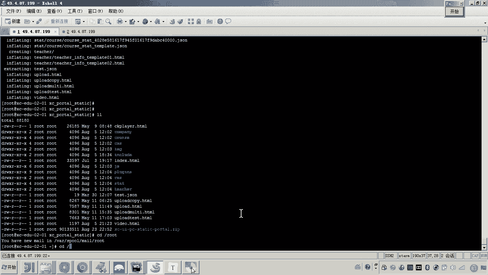

在测试阶段，我们可以将一些静态资源（如视频文件、图片等）直接上传到门户服务器的特定目录下。例如，将`video`目录上传到服务器，这样Nginx就可以直接代理访问这些静态资源，而无需部署单独的视频服务器。

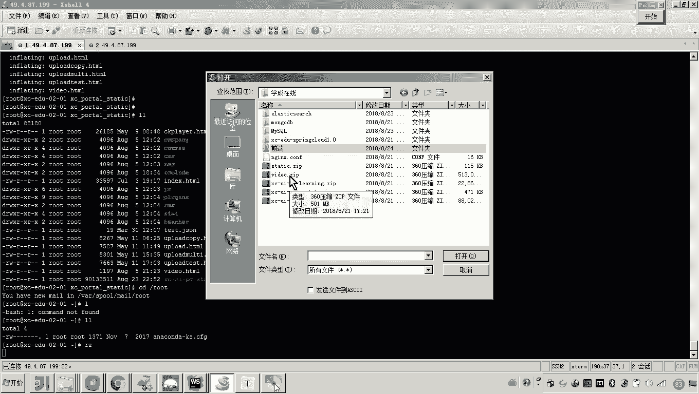

---

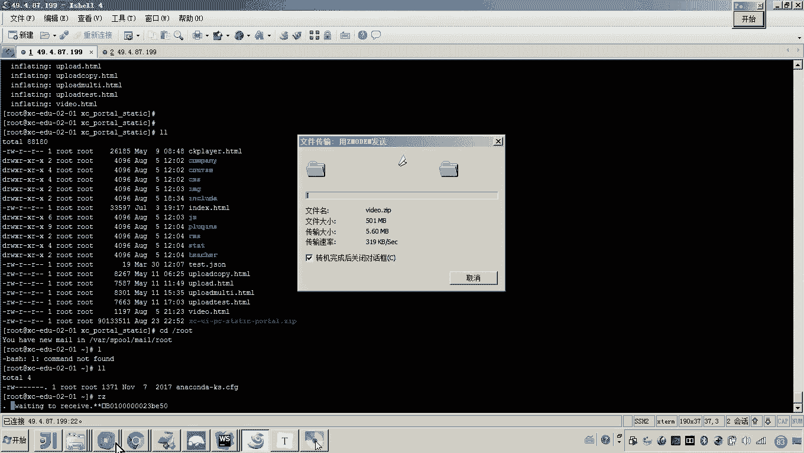

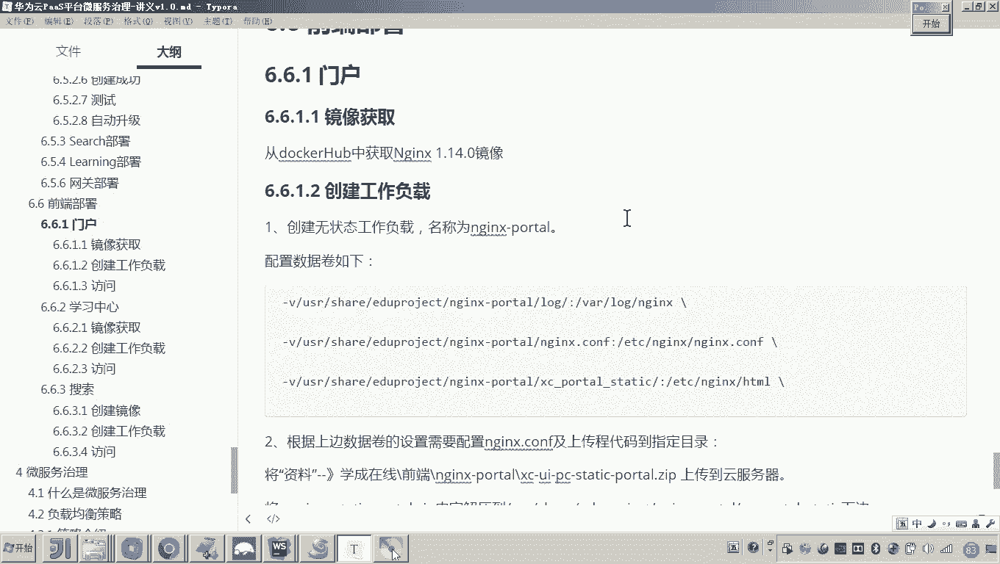

本节课中我们一起学习了“学成在线”前端门户的完整部署流程。我们分析了启动失败的原因，上传了配置文件和工程代码，配置了Nginx并成功通过公网IP访问服务。我们还通过解压代码包完成了门户部署，并学会了通过修改本地hosts文件用域名进行测试访问。最后，我们补充上传了视频等静态资源，为后续功能测试做好了准备。