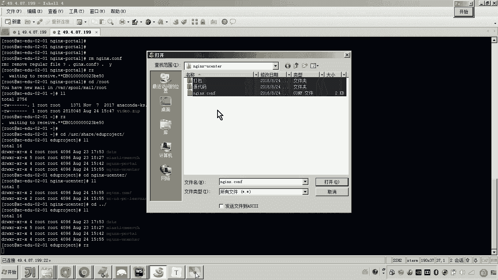
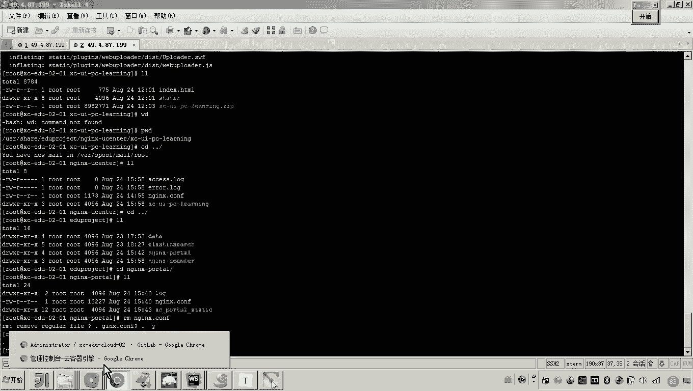

# 华为云PaaS微服务治理技术 - P123：01-学成在线项目部署-前端学习中心部署 - 开源之家 - BV1wm4y1M7m5

好，那接下来呢我们就来部署学习中心。好，那学习中心呢也是一个前端工程啊，那么对于前端嗯，我们说都基本上会用en啊。好，那么对于特殊的一会我要不搜索的时候呢，我会特殊说明啊。好了。

那现在呢我们来看这个学习中心呢，我们依然是用en镜像啊，这里边我就开始来创建这个工作负载了。好，那么我们进入啊这个工作负载的这个界面。好，然后呢，点击无状态创建。那这个学习中心呢。

我们给他起个名字叫做eng杠U centerer。啊，为什么叫uscenter呢？因为这个学习中心也是用户中心。那里边啊，因为我们说这个学生在线，包括好多类用户啊呃所有的用户呢都可以去学习啊。

我所以说我们说学习中心也是用户中心。然后在这里边呢，我们就叫做uscenter。好，然后我们继续。然后添加实力。好，这个呢仍然还是我们说的这个怎么样安尼斯。😊，嗯。

然后这个en呢跟刚才部署我们说的这个门户应该是一样的。好，然后他呢还是一好，这个呢还是1024。好，这样的话我们是不是前面就完成了。那接下来要做的是不是就是数据这个数据卷了。

那这个学习中心的这个数据卷的方式啊，和上边门户的方式还一样。所以啊我们依然是这么配置一下。😊，好，只是说在我映射到这个本地数主机的这个目录呢不太一样。好。

那这个学习中军我们学习中心会映射到这个en尼杠U centerer上。那当然挂载的容器的目录呢依然是原来的啊，大家可以看到是哇log。这是日志。呃，这是日志。好，然后我们继续。还有什么呢？

还有就是我这个配置文件。好，然后呢，最后一个。最后一个是什么呢？就是我们的工程目录。工程目录。好，那到这儿来说的话，咱们的这个三个呃三个磁盘映射呢，咱们就做好了。好，那接下来呢我们就下一步。😊，啊。

这个时候呢我们是不是要选择了？好，注意这里边也要注意了。那刚才我们选门户的时候，我们是不是选公网访问，对吧？嗯，而现在我们选学习中心的话，我们选择什么呢？😊，对，刚才其实我在部署门户时候已经说过了啊。

这个学习中心是通过门户的将来进行代理请求的。哎，所以说学习中心我们就不用选公网访问了。一会儿我们通过门户的来进行代理访问。所以这里边呢我们呃来输一个名字吧。呃叫做 centerer。

然后集群内部访问集于内部访问。好，然后它的这个学习中心，它的这个端口是什么呢？呃，大家可以看到啊，在这个学习中心这个学习中心的它的这个端口，我们打开学习中心的源代码嗯。😊，然后在这个源代码当中呢。呃。

我们我们找一下啊找一下。嗯，这里边应该有一个设置端口的地方，是不是13000呐？对，这是学习中心的这个源代码啊源代码。好，也就是说什么呀？当然你这个eng的这个端口啊，也可以用80嘛，对吧？

当然你也可以用，你可以自己定义啊。我只是和原来这个我在开发阶段的这个端口保持一致了。嗯，所以这个就是13000。好，访问端口呢还是1000。😊，好，然后下一步。好。

这样的话我们这个学习中心是不是就开始创建了？好，有了刚才的有了刚才的经验啊，我们都知道了。那这个你配置了那么多这个映射目录，映射配置文件，那你肯定要往上传嘛，对吧？就是我们需要配置一下。😊。

那说候老师那怎么传呢？看好啊。😊，我们先进入我们先进入这个学习中心的目录。你看这个这个只要你把这个实力一旦创建成功，它是不是就自动生成了，对吧？好，然后呢，在这个目录当中啊呃我们来做一件事儿。

哎，我们把。什么呀？我提供给大家的前端有一个叫us center。然后这里边有几个啊，一个是打包后的这个代码，一个是源代码，还有一个配置文件。😊。

然后呢，这个我要上传的就是打包后的这个z了。😊，呃，有人说这是啥意思？我大家讲一下啊，因为做过前端开发啊，因为这个宣传在线采用前后端分离啊，做过前端开发的这个同学都知道这个前端工程。

我们是不是使用node GS来进行开发的对吧？而我们说真正运行的时候呢？呃我们就可以怎么做，我们是使用web park然后呢我们就可以对这个工程呢进行一个打包。好，我们说打包怎么打包呢？

其实就执行一个NPMrun build，然后呢，它就可以去生成了一堆的静态文件。嗯，这个静态文件呢，就在这儿。所以你只要把这两个东西呢把它拷贝到我们的服务器上就可以了。

所以大家可以看到现在我网上拷贝的这个。😊。

这个zip包它里面就是就是大家看到的打包后的这两个静态的一个文件，一个是ind的HTML，一个是static。好，那现在呢我们就把它拷上去了嘛。哎拷上去了之后我们进去。

那你要怎么做呀？我肯定是要把这个N这个给他删除吧。对，然后呢把这个N尼的这个配置文件挪过来。对吧好，然后还要做什么事呢？😊，还要做什么事呢？我就是要把这个zip包呢哎给它解压。😊，好。

我们先进到这个里头。然后呢，我们把这个刚才我传的这个包给它拿过来，对吧？然后呢解压。😊，大家可以看到，现在在这个。在这个目录下，各位，这是不是就是我的工程目录。

在下边是不是有index和esthetic？😊，好，这些都齐了之后呢，弄好了之后，然后现在我们再回过来，你应该知道我要干啥了啊，在实例这里头我们要删除，重新启动一下。😊。

好，现在它是不是就运行起来了？嗯，那运行起来之后，那怎么访问呢？你这个访问方式大家看到了吗？他是不是通过这个怎么样？😊，内网访问嘛，通过内网访问，我们说了要走这个门户的enlink，是不是啊？

所以你要来看我们如何走门户的enlink呢。😊，好，那你得打开门户的恩尼不斯。😊，那这个是不是就是门户的enex？那我们来看啊我们来看，注意注意看，非常非常重要啊，就是。😊，大家看。

在这个门户上边是不是又建了一个虚拟主机，这个是不是叫user cloudva I点呢？那这个虚拟主机这个虚拟主机啊，你只要访问这个虚拟主机，它是不是会走这个路径根目录对吧？而这个根目录。

你看它是不是会请求到这个user server，那这个是我自己定义的啊，往上翻翻到这儿，大家可以看到它是不是会转发到这个地址。😊，哎，是不是就是1300的端口？所以各位这个是门户的N，只要你请求门户。

哎，门户你也知道门户是不是对外暴露的是80端口啊，只要你请求相应的哎域名，那么它就会走到对应的这个虚拟主机。😊，哎，然后呢，那这里边呢它就可以进行一个转发，哎，转转到哪了呢？就转到上边。

大家可以看到各没看到我这儿是不是就可以配置我们说的那个内网的，刚才我设置的学习中心的内网地址了。所以在这里你把它拿过去。😊，然后呢，把它配上去。你注意我现在修改的是不是门户的in。

因为我们学习中心就要通过门户的in去转发了，是不是？所以各位我把门户的in改过之后，我要怎么做？😊。

你是不是要进到门户这里头？然后把它传上去。

把原来的干掉。然后再传。

传哪个呀，那肯定是传门户嘛。看懂了吧？传完门户的en了，然后你再怎么弄回到门户回到门户。然后因为门户的en是不是改了，en配置文件改了之后，你要干嘛？重启一下。😊。

懂我的这个逻辑了吧。所以也就是说门户的这个en呢，因为我呢不想申请那么多的外网IP，就是不想申请那么多的弹性负载均衡。😊，哎。

所以呢我只要门户申请1个80端口带80端口的这个这个这个这个公网IP那我就让门户呢哎通过这个代理转发的方式呢，转到内网的各个服务了。😊，嗯，好，那现在呢就搞定了吧，搞定，那我那有说候老师咋访问呢？😡。

各位，我刚才是不是已经跟你说的很清楚了，你首先访问的话，还是要访问怎么呀？😡，肯定是访问门户了吧。对，门户门户门户的虚拟主机。刚才我是不是告诉大家有一个是不是叫XCUcloud，是不是他？😊，对不对？

所以你只要访问这个域名，刚才我们是不是配了ho这个host的文件，这个域名是不是又是走到了刚才我们这个弹性负载均衡的IP了？😊，对，所以各位我们访问这个地址。

我们这个地址这个地址就是我们这个学习中心的地址。好，那么我们来。啊，来贴进贴进去访问一下。

哎，大家看虽然现在你看不到这个视频，但是这的确是已经到了学习中心。

懂我说的意思了吧？哎，这的确是到了学习中心。对。好啊，那这个呢这个呢就是我们说的这个学习中心的部署啊，那学习中心部署成功之后呢，我们也是通过门户的in来代理访问啊，这一说现在你这个视频是不是看不见呀？

那视频看不见有多种原因呢？并且其中有一个直最直接的原因，各位，你也看到了，我这个视频是不是还在传呢，对不对？哎，一会儿呢我们再去等它传完，我们再一块调试。好，到这儿。

我们这个学习中心的这个前端工程呢就部署好了。😊。

那这里边需要大家呃注意的点是什么呢？就是对于学习中心的访问，我们就不再申请这个呃弹性负载均衡哎，以及这个带80的这个功网IP了。我们通过门户的来这个代理来请求这个学习中心。好。😊。

