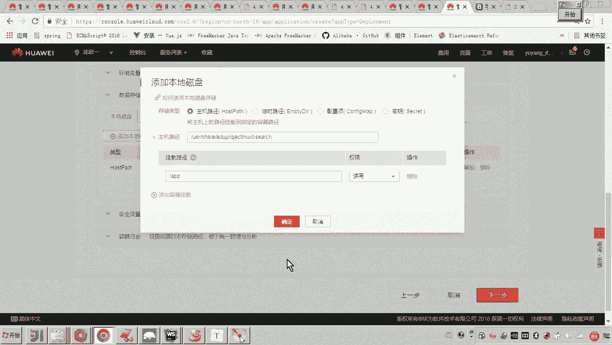
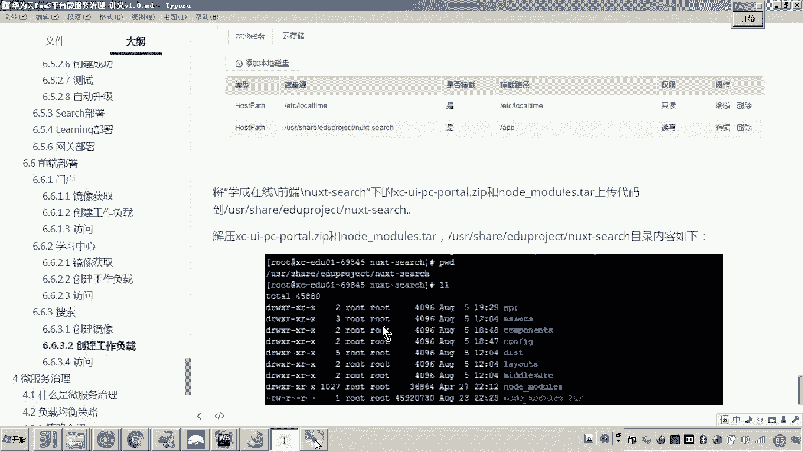
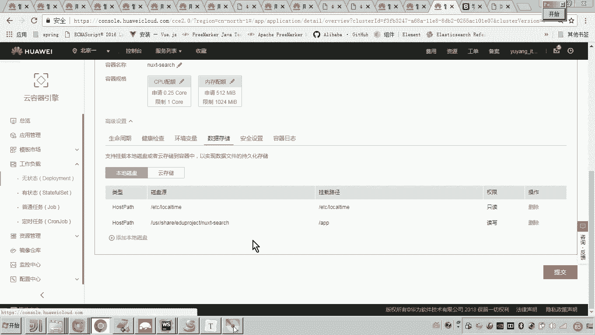
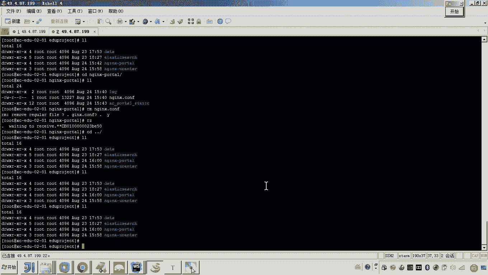
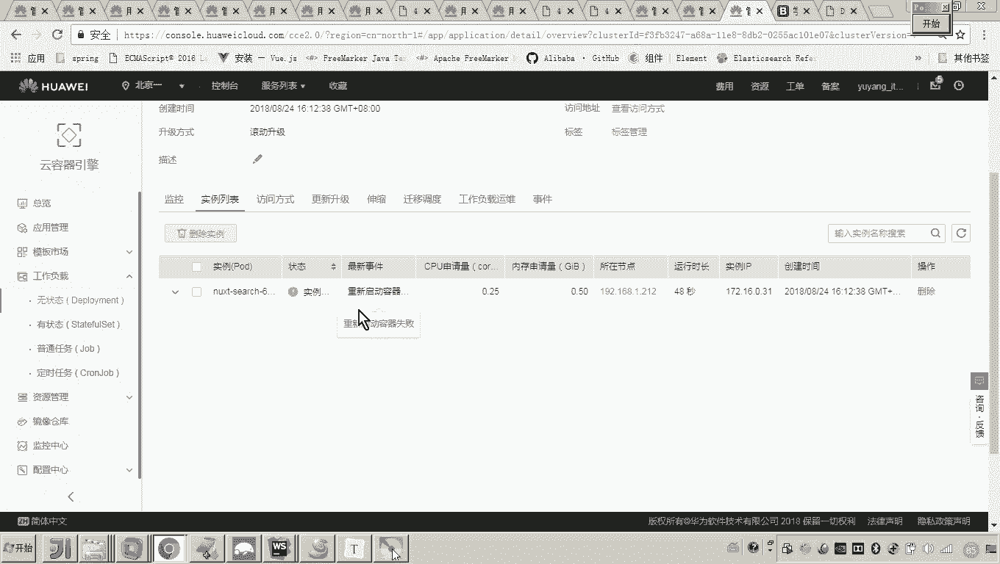
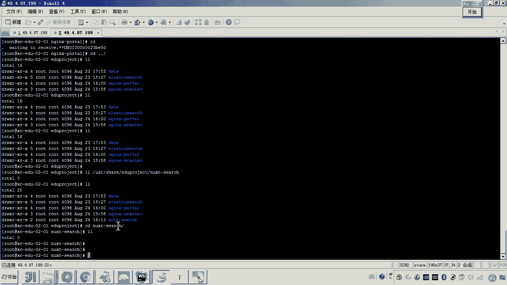
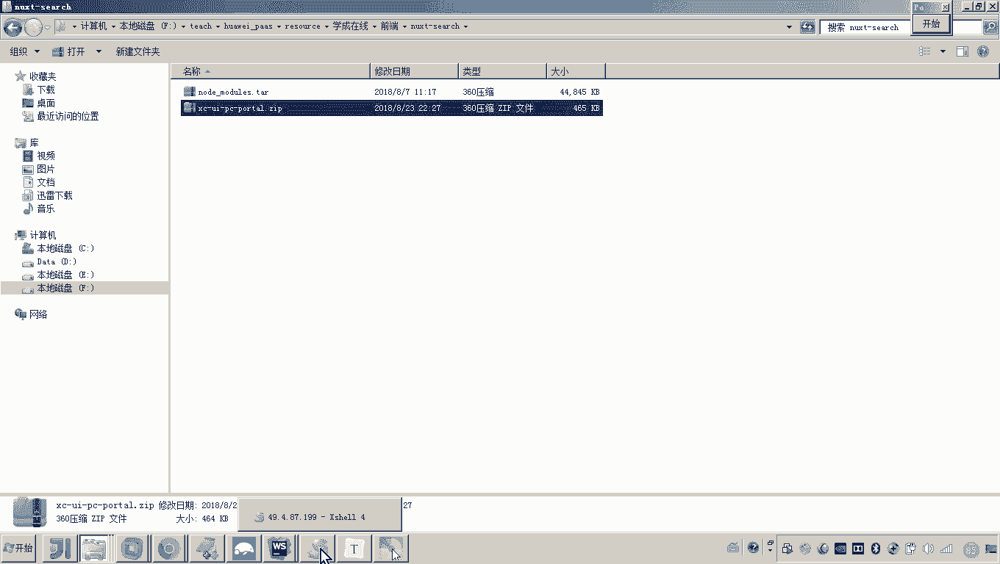
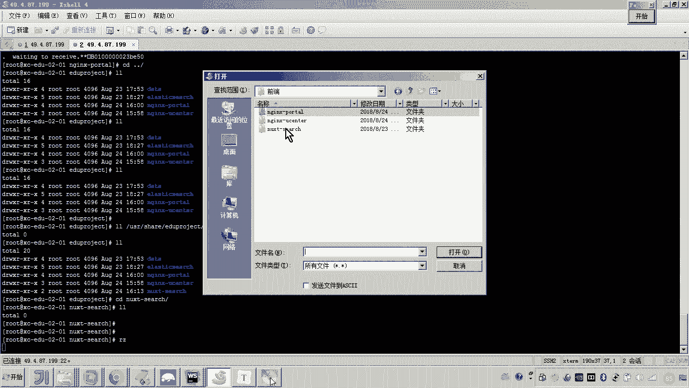
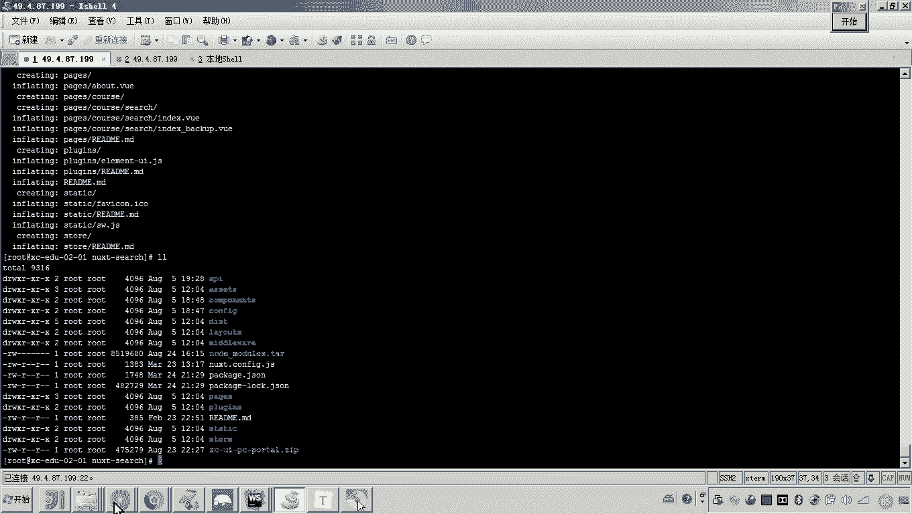
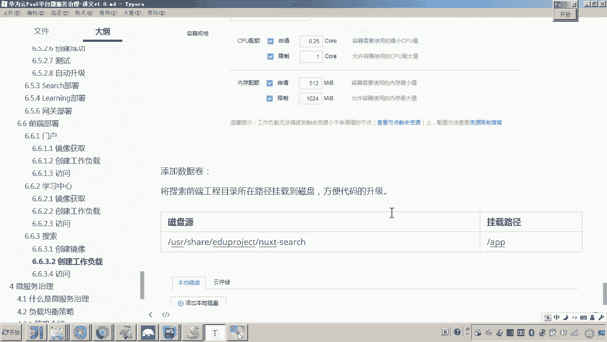

# 华为云PaaS微服务治理技术 - P124：02-学成在线项目部署-前端搜索-创建工作负载 - 开源之家 - BV1wm4y1M7m5

好，那下边呢我们最后一个前端工程就是搜索工程。呃，我们现在呢来部署一下。那搜索工程我们前面是不是部署了这个门户和学习中心啊，它用的镜像是不是都是en。但是搜索工程呢我要说一下嗯，它就不采用en来访问了。

所以说它的镜像呢呃大家可以看到啊，它的镜像是基于这个nodeGS的。😊，好，那我要解释一下这是什么意思啊？呃，应该说学过这个学生在线的同学应该知道啊呃，我们在做这个开发的时候，呃。

对于这个客户端的这个渲染和服务端的渲染都有需求。😊，那对于搜索这一块呢，对于搜索这一块呢呃我们是采用一个服务端的渲染框架，叫next。啊。

那这个n呢啊注意这个nex呢呃它就是一个呃与这个它又是viGS官方所推荐的一个呃服务端的一个渲染框架。对于服务端渲染框架。这个nt的一个一些学习呢大家可以参考这个官网的一些教程。

也可以去呃通过这个学生在线或者相关课程的这个学习来学习这个next它的开发方法。这里边我就不再详细说了。我要强调的就是这个nt的运行呢是依赖于nodeGS的。

所以啊这里边呢各位啊我们要把这个呃什么呀这个。😊，这个工程就是我们说的搜索工程。要把这个搜索工程呢要运行起来。各位就这些代码呢都是需要把它呃部署到这个服务器上。对。

所以这里边呢我们说这个镜像呢需要我们自己来构建。那这个镜像呢，其实就是基于note GS的一个一个景像。😊，构建方法呢呃我们编写docker file文件来构建镜像呢。在前面我们应该也有介绍过。

所以呃那整个过程呢，我就已经给你写好步骤，然后呢，你按照这个步骤呢去执行命令就可以了啊，我简单跟你说一下啊。😊，好，那么基于这个noteGS的这个9。4。0来构建这个什么这个这个镜像啊，这个镜像。

那么这个镜像这个镜像的这个工作目录呢呃叫做杠APP。😊，嗯，也就是说他的工程代码所在的目录。啊，回头呢我会在数主机建一个目录呢跟他绑定啊，跟他映射啊。将来呢我就把因为我为了方便这个代码的升级。

或者说和维护吧，我就把这个呃搜索工程的这个这个这个这个代码就将来要上传到我的数主机，然后呢呃与这个杠APP目录所对应的映射的那个数主机上的那个目录中。好，那大家来看后面这个镜像还有一些东西啊啊。

因为我们说最终要运行这个啊要运行这个next呃，这里边要执行呃，要执行几个这个命令啊。首先一个叫next build。😊，呃，其次呢我们要启动这个工程，就是NPMstar。

所以这里边呢我单独写了一个脚本，而这个脚本呢就是来启动我们说的这个呃我们的搜索的这个前端工程。所以这里边呢我们要把这个脚本呢要拷到我们的镜像中。那另外呢呃下一步呢就是修改腰部的这个权限的啊。

注意这是我们这个搜索前端的一个端口叫1万啊，这是1万端口啊，1万啊，其实和我这个前端开发的这个端口其实是一样的啊。这里边呢大家可以看到啊。😊，他其实这里边的你看是不是就是一个1万的端口啊。好。

那这个端口呢我们在这个镜像当中要指定好哎，在这个docker file文件当中要指定好。另外还有啊因为各位呃做过前端开发的同学都知道这个前端开发的这个像这个在运行啊，它是不是要依赖很多的GS包。

所以我们要从这个公网呢去下载。在它运行之前呢要去下载这些依赖的GS包那下载之后呢哎就把这个GS包下载到这个node models这里边的所以说这里面要注意啊，呃我们说那为了方便去下载呢。

你可以在镜像当中呢来指定哎来指定这个NPM的它这个所这个下载请求的这个依赖包的这个官方的这个这个公网的路径吧。那这个路径呢注意你看呢应该能看得懂哎，是淘宝的一个镜像，对吧？好。

那也就是说NPM会从这个网址呢去下载所依赖的那些GS包。😊，好，那么这些呢我就大概就介绍完了啊，这几个关键的点啊。好，那么在后边的话，那你就按照我说的先编写一个docker file文件。

然后再在这个docker file文件当前目录再编写一个这个启动脚本啊，然后呢就执行这个命令来构建这个镜像。😊，啊，执行这面令构建镜像。然后呢啊构建完了之后呢，你是不是要打一个tag。

然后呢把我们的组织的名称改对，然后呢再push到我们的云平台，对不对？所以现在其实云平台上已经有这个呃next searcharch这个工程的镜像了。😊，好，所以这个镜像创建啊镜像上传这块的这个工作呢。

我就不再去演示了。大家按照我这个讲义呢去自己做就可以了。好，那现在呢我们就开始来创建呃这个搜索工程的工作负载了。好，那这里边呢我们就准备来创建啊，怎么创建呢？好。

那我们首先呢得找到这个工作负载无状态的工作负载。然后点击。然后现在这里边呢我们要选择next啊，我就随便起个名啊，然后叫search。好，然后这里边呢来开启。😊，好，下一步。然后这里边呢。

我们就要选择选择什么呀，选择我之前传上去的这个对，就是这个。好，然后确定。好，然后呢这里边呢我们给指定一些资源。好，这个资源呢我们还可以采用这种方式啊，跟之前的这个。😊，前端功能保持一致就可以。好。

然后再接下来呢，我们要呃写一个这个数据磁盘啊，这个这个数据卷的映射呢呃其实刚才其实我应该介绍过了啊，就是在镜像当中你也看到了它的这个工作目录呢就是刚APP。

所以这里边呢我准备呃把我们数主机上的一个目录呢映射到它这个工作目录。哎，也是为了来看一下，也，是为了方便我对代码呢进行一些维护啊。😊，好，再来。这样我就不用每次的去。改了代码去。生成镜像了。好。

那么然后这个是不是就写好了，写好了之后呢，接下来我们是不是就可以怎么弄啊，就可以下一步。然后哎各位我再说一下，一添加服务到这儿，你是不是要想到，哎，将来我这个容器的实力通过什么来访问呢？

是通过Y网还是继群呢？😊。

啊，我应该跟大家说过了，前端的访问我们都统一通过门户的inex，这样的话我就不用再去申请那么多的这个负载均衡了哎，以及这个公网IP懂我的意思吧。所以这里边呢我们就。😊，啊，这个通过。内网访问啊。

这个是应该是1万。😊，对吧。好，这个也是好，然后确定。好，下一步好，创建。好，这样的话我们的这个是不是就开始创建了吧？但是注意啊应该大家都有经验了啊。现在这个刚才你也看到了。

我在哎我在这个这里是不是设计了他的数据卷，哎，他的映射的路径，是不是它，所以你肯定是需要哎怎么做呀？肯定是需要进去。😊。

这儿好，进到这个。诶。还没有还还没有吗？你看我刚才那个目录射到哪了？😊。

是不是在这儿的？这个目录是不是还没有给我建起来呢？嗯，看一下这个实力的。看一下这个实力，他是怎么它是怎么显示的。

重启失败是吧，他应该有了，来看一下。大家看到了吧？有，然后我们进去啊。哎，就是他就他哎，不是啊，这个我们进到这个next的 search。然后进来了之后，有人说老师你想干啥呀？😊。

因为这个就是我的工程目录，对不对？你是不是要把工程代码给它传上去？对？所以现在我要传什么工程代码呢？你注意听我刚才都说过了，传什么工程代码，这个前端工程和我们学习中心的前端工程不一样。

学习中心的前端工程是一个单页面的应用。将来你通过NPM build呢就可以把它打包成很多的静态资源，用来访问即可。而现在这个方式，这个呃服务端渲染的这个工程就是nex它呢需要依赖于nodeGS，对不对？

所以你需要把什么呀？把这些东西全传上。😡。

懂我的意思吗？所以各位。我们在哎给大家的这个学生在线前端这个目录当中，在这里。其实就已经给你准备好了。哎，我看你能看得懂吗？😡，这个是啥？做过前端开发的啊，就是就是学习过学生在线的。

应该上去就说到了这些是不是就这个上面这个目录，是不是就是我们说的这个依赖GS包的？😡，对你要是不传的话，它可以从公网这里下太慢嘛，所以你就可以传上去44兆啊，也很快。好了，那现在呢我们把第一个传上去。

第二个是什么？第二个就是我们这个这个这个什么这个搜索前端工程的源代码。😊，对，然后呢我们把它传上去。

啊，这个这个让他慢慢传了，然后呢再继续开一个端口。哎，这个不用再游了。😊，好，进来。啊，那这里边还继续让他传这个吧。你看这个就挺快嘛，是吧？哎，那传上去之后，你就可以解压了。😡。

看到这些是不是就是我们做的这些。😊，源代码了嗯源代码。好，那现在还差一个吧，你看就是这个这个这个依赖的这个GS包还正在传。😊，嗯，好，那现在呢我们发现呃到目前为止，其实嗯这个搜索工程啊。

这个工作负载我们已经创建成功了。😊。

对，那现在就是我们等着让他把工程目录传上去。一会呢，我们来调试一下啊，看他能不能去访问好。

