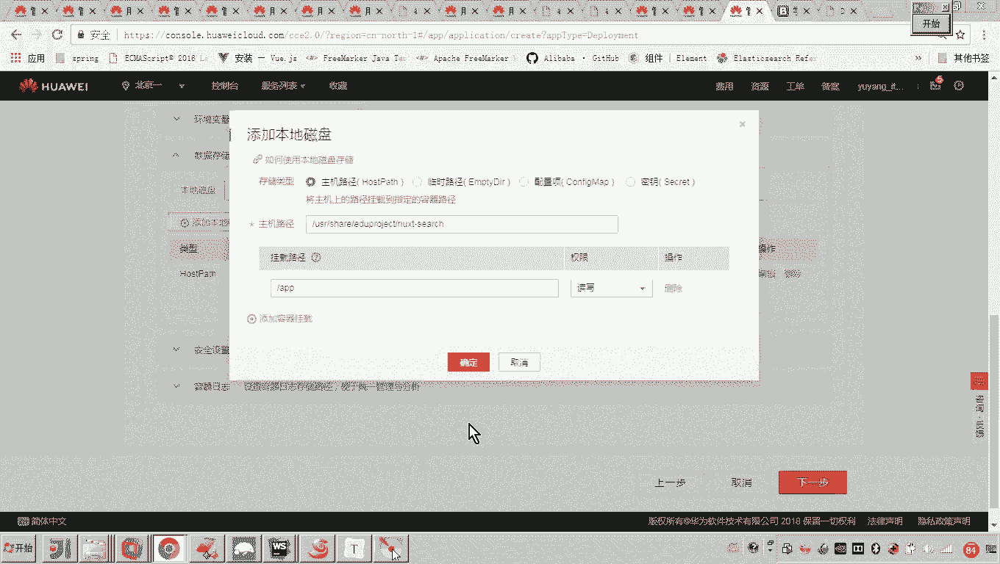
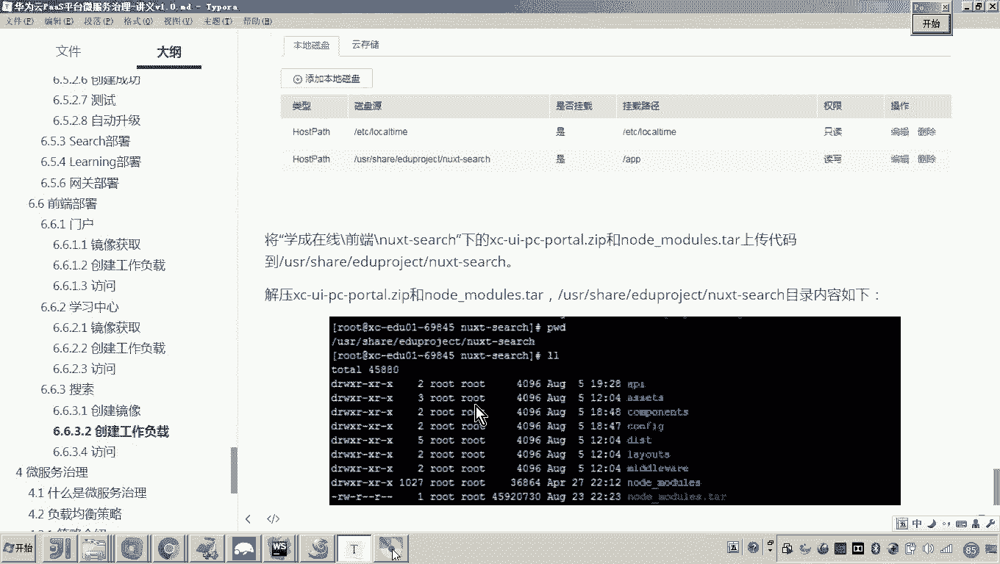
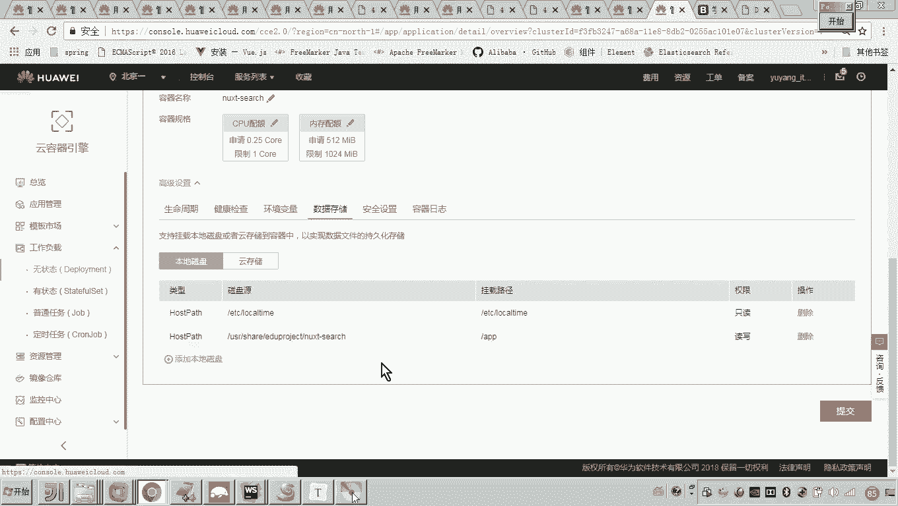
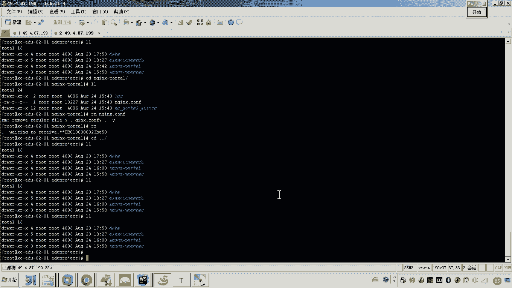
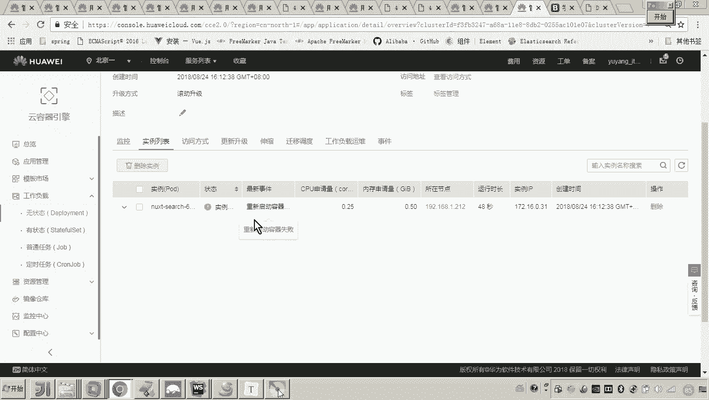
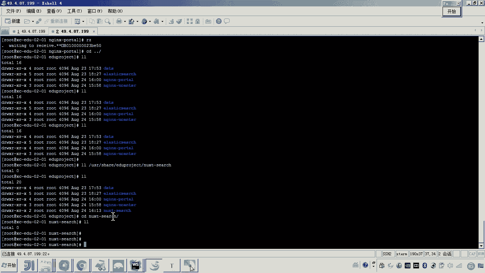
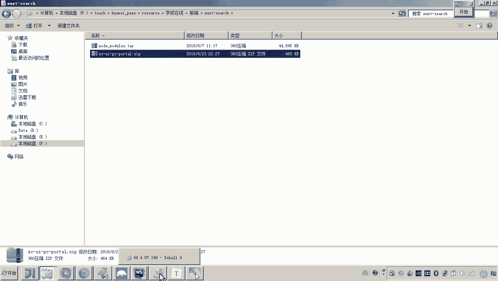
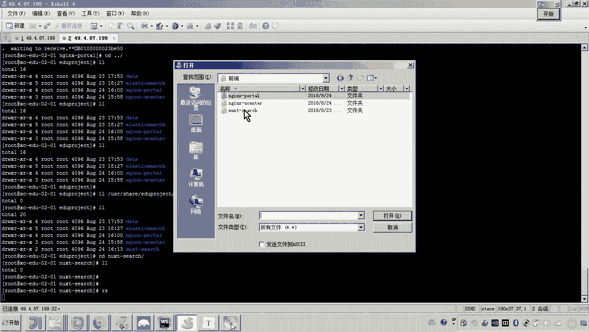
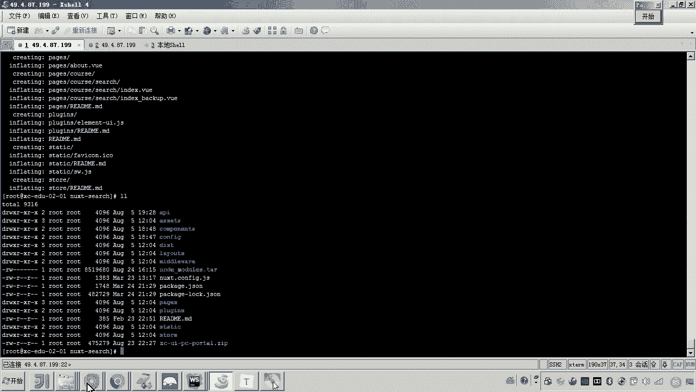
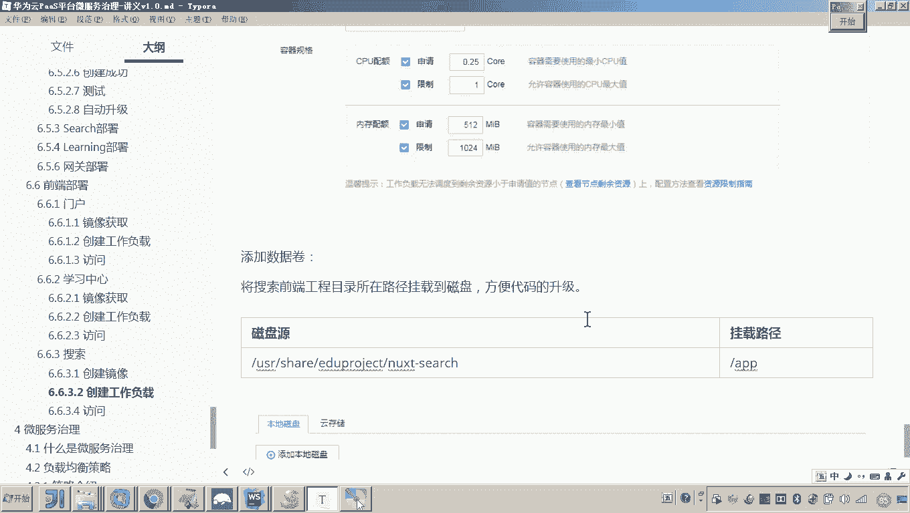

# 华为云PaaS微服务治理技术 - P124：02-学成在线项目部署-前端搜索-创建工作负载 🚀

在本节课中，我们将要学习如何部署学成在线项目的最后一个前端工程——搜索工程。与之前部署的门户和学习中心工程不同，搜索工程采用了服务端渲染技术，因此其部署方式也有所区别。我们将详细介绍如何基于Node.js构建镜像、创建工作负载，并将代码部署到服务器上。

---

## 搜索工程部署概述 📋

上一节我们介绍了门户和学习中心工程的部署，它们都使用了Nginx作为Web服务器。本节中我们来看看搜索工程的部署。搜索工程基于Next.js框架开发，这是一个服务端渲染框架，其运行依赖于Node.js环境。因此，我们需要构建一个包含Node.js环境的Docker镜像，并创建相应的工作负载来运行它。

## 构建Docker镜像 🐳

由于搜索工程使用Next.js框架，其运行环境需要Node.js。因此，我们需要编写Dockerfile文件来构建一个包含Node.js和项目代码的镜像。

以下是构建镜像的关键步骤：

1.  **基于Node.js 9.4.0版本构建镜像**：我们选择Node.js 9.4.0作为基础镜像。
2.  **设置工作目录**：在镜像中设置工作目录为 `/APP`，用于存放项目代码。
3.  **配置NPM镜像源**：为了加速依赖包的下载，我们将NPM的镜像源设置为淘宝镜像。
4.  **复制启动脚本**：我们编写了一个启动脚本，用于执行 `next build` 和启动服务，并将此脚本复制到镜像中。
5.  **指定端口**：搜索工程运行在 `10000` 端口，需要在Dockerfile中暴露此端口。

以下是Dockerfile的核心内容示例：

```dockerfile
FROM node:9.4.0
WORKDIR /APP
RUN npm config set registry https://registry.npm.taobao.org
COPY start.sh /APP/start.sh
RUN chmod +x /APP/start.sh
EXPOSE 10000
CMD ["/APP/start.sh"]
```

构建镜像的命令如下：

```bash
docker build -t next-search:latest .
```

镜像构建完成后，需要为其打上标签并推送到华为云镜像仓库，以便在云平台上使用。

## 创建工作负载 ⚙️

镜像准备就绪后，我们开始在华为云平台上创建搜索工程的工作负载。

以下是创建无状态工作负载的步骤：

1.  **进入工作负载管理**：在控制台找到“工作负载 > 无状态负载”，点击“创建”。
2.  **配置基本信息**：为工作负载命名，例如 `next-search`。
3.  **选择镜像**：在容器配置中，选择我们之前上传到云平台的 `next-search` 镜像。
4.  **配置资源**：为容器分配CPU和内存资源，可以参考其他前端工程的配置。
5.  **添加数据卷**：为了实现代码的便捷维护和升级，我们将宿主机的一个目录映射到容器的 `/APP` 工作目录。这样，更新代码时只需替换宿主机上的文件，无需重新构建镜像。
6.  **配置服务访问**：搜索工程将通过内网访问。我们创建一个Service，将容器端口 `10000` 暴露给集群内部。前端访问将统一通过门户工程的Nginx进行路由，因此无需额外配置公网IP或负载均衡。



完成以上配置后，点击“创建”即可启动工作负载。



## 上传工程代码 📂

工作负载创建后，容器会尝试启动。但由于我们配置了数据卷映射，需要将实际的工程代码上传到宿主机对应的目录中。



搜索工程是服务端渲染应用，需要上传完整的源代码和依赖包。



以下是需要上传的内容：



*   **`node_modules` 目录**：包含项目运行所需的所有Node.js依赖包。如果从公网下载速度较慢，可以直接上传已准备好的压缩包（约44MB）。
*   **项目源代码**：包含Next.js项目的所有源代码文件。

我们可以使用SCP或SFTP工具将这两个部分上传到宿主机映射的目录中。上传完成后，在宿主机上解压文件。

## 验证部署 ✅



代码上传完成后，容器内的 `/APP` 目录就拥有了完整的运行环境。容器会自动执行我们编写的启动脚本，构建Next.js应用并启动服务。

我们可以通过以下方式验证部署是否成功：





1.  在华为云控制台查看工作负载的状态，确认容器运行正常。
2.  通过集群内部的其他Pod（如门户Nginx）尝试访问搜索服务的 `10000` 端口，检查服务是否响应。

---



## 总结 🎯



本节课中我们一起学习了学成在线项目搜索前端的部署流程。我们了解到，由于搜索工程采用了Next.js服务端渲染框架，其部署方式与传统的静态前端工程不同。核心步骤包括：基于Node.js环境构建Docker镜像、在华为云平台创建无状态工作负载并配置数据卷映射、以及将完整的项目代码和依赖包上传到服务器。通过本教程，我们掌握了服务端渲染应用在云原生平台上的基本部署方法。