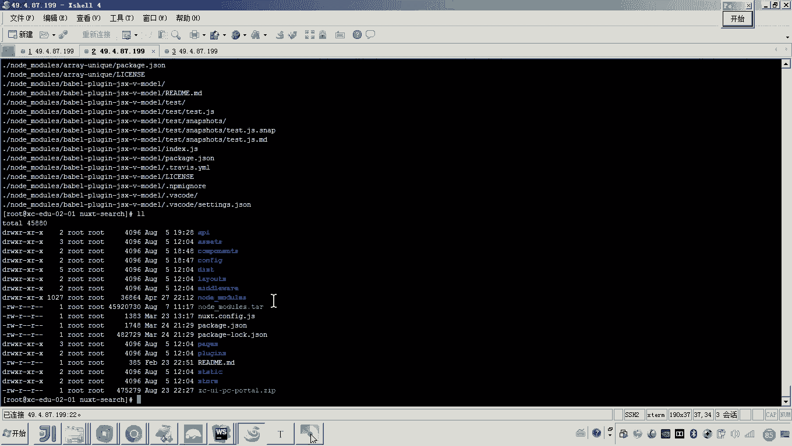

# 华为云PaaS微服务治理技术 - P125：03-学成在线项目部署-前端搜索-配置与调试 - 开源之家 - BV1wm4y1M7m5

好，那现在呢我们就来调试一下搜索工程。嗯，好，那么现在呢我们来看一下他呃传的文件呢传进去了没有？

好，那大家可以看到现在他这个踏包是不是已经传上去了，对吧？好，那么我们先来看一下这个踏包。😊。

我看原来他是怎么怎么好啊，好了，那现在呢怎么弄吧，我们解压一下吧。😊。

好，那现在我是不是就解压到这个目录了呀？好，那这样的话，我们是不是把这个搜索工程所有相关的东西都已经。😊。

工程是不是都已经搞定了？好，那接下来我要做什么事呢？😊。

各位。来回过来，现在我们是不是要在搜索工程，要要运行这个nex search了，对不对？而运行它。😊，怎么访问呢？是不是通过内网呀，那是不是也是通过门户的in来进行跳转来进行转发，是不是好。

那现在呢我们得找到吧，找到这个地找到这个位置啊，找到这个位置。好，找打开这个门户的in。😊，来往下翻。呃，翻到哪呢？这个搜索这个搜索访问，这个搜索没有具体的这个虚拟主机啊，没有具体域名。

他的访问其实就是通过呃一个具体的路径啊，往往后翻是不是在。😮，在这。在这是不是有一个叫杠course杠 search看懂了吗？对，然后这里边呢你也看到他是不是也会去请求这个炮。然后呢。

你看一下这个炮的地址是什么。😊，对，大家可以看到是不是一个内网的IP你把这个变成我们啊我们这个集群的这个内网的啊这个搜索前端工程的内网的IP看懂了吧？然后你把它改好之后来传到哪里。各位这个我是改的谁。

是不是就是门户的的配置文件，所以你要把它传到注意看啊，😊。

你要把它传到这儿。

懂我的意思吧？对，所以因为我们说这个搜索呢是通过门户的in来进行转发的，所以你要改了之后传到门户这边。好，传到这里边呢，我们是不是就可以怎么弄啊，启动谁呀？😊。

启动搜索啊。搜索也要启动哎，搜索也要启动，并且。门户也要启动。看好。找到门户。因为门户的刚才我改了嘛。😡，所以他肯定要启动。对。好，那现在呢我们就等着哎，让他启动起来。😊，怎么会应该很快啊啊。

那现在我们看搜索吧。😊，好，你看是不是就运行成功了，至少来说这儿是不是状态就显示正常。好，那现在我们那就访问访问瞧一瞧吧，嗯，点开看搜索怎么访问呢。😊，是不是通过这个门户的域名啊。

然后后边加一个杠course刚设序是不是就可以啊？其实这个访问呢我们可以点它点这个点这个一点，是不是就到了这个搜索了。😊，看到各位。这个页面是不是就有了？😊，那有时说老师这个页面有是有啊。

但是你这个数据没出来，是不是？😡，这个数据没出来，我们得我们得想想招了啊。

啊，包括刚才说的这个数据，这个数据是不是也没出来？😡，对不对？哎，所以所以各位我准备把这个数据这一块，因为数据是不是要调微服务了，对不对？所以我准备单独的哎，我们单独来讲哎。

这个前端现在我们怎么和微服务进行对接问题。到这儿为止，其实各位搜索的前端工程，我都已经部署成功了，包括学习中心的前端工程，包括门户的前端工程啊，单纯前端这一块哎，都已经没有问题，都可以正常运行。

因为这个也是前端工程的这个界面。😊。

包括这个界面啊，这就是我们说的这个搜索工程的界面。好，那么到这儿我们前端工程啊，我们告一段落，稍后我们会把这个前端和微服务做一个集成。

