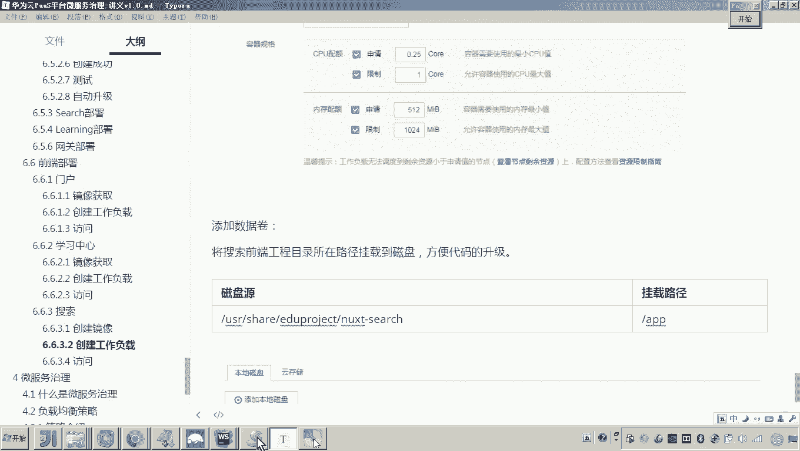
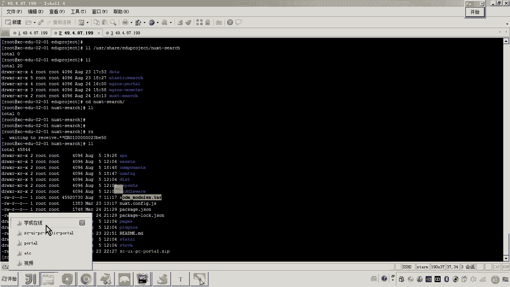
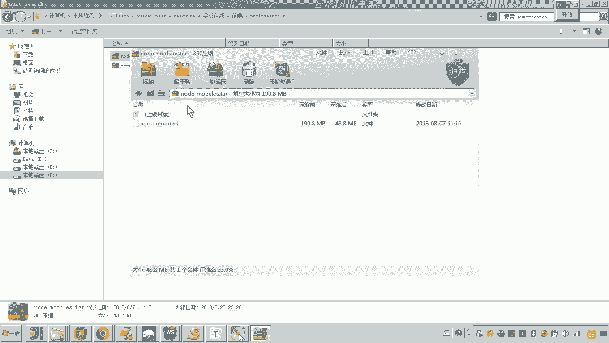
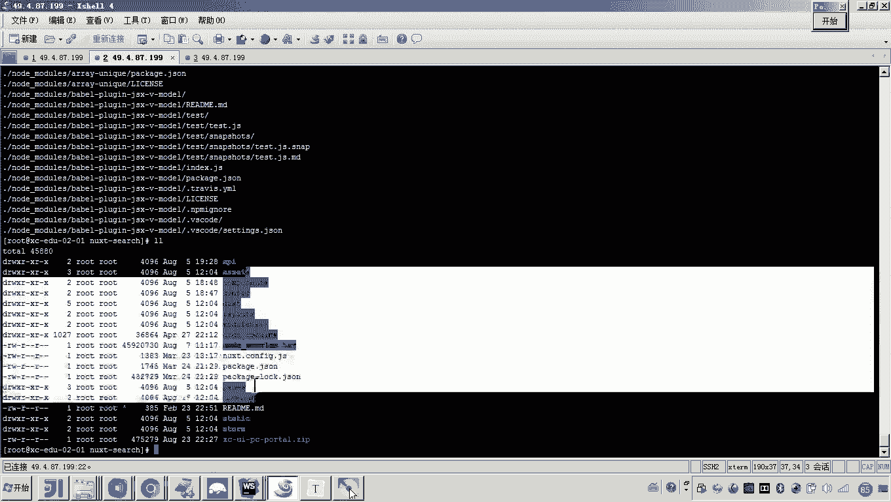
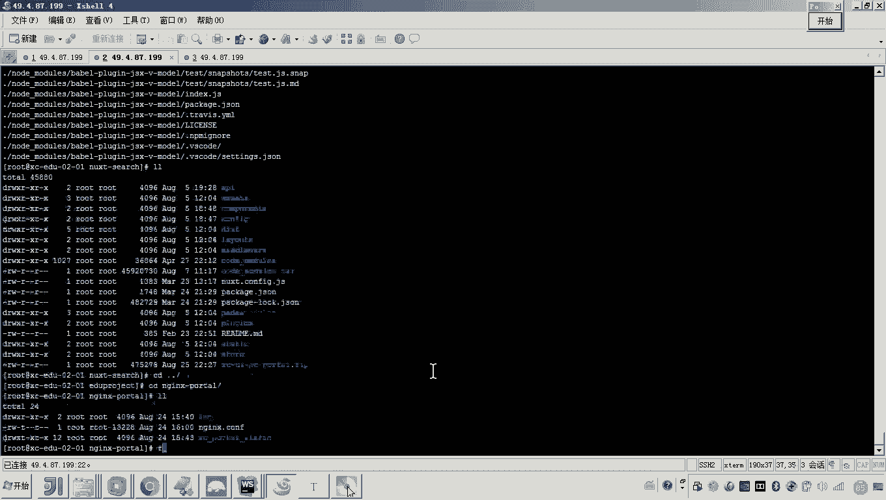
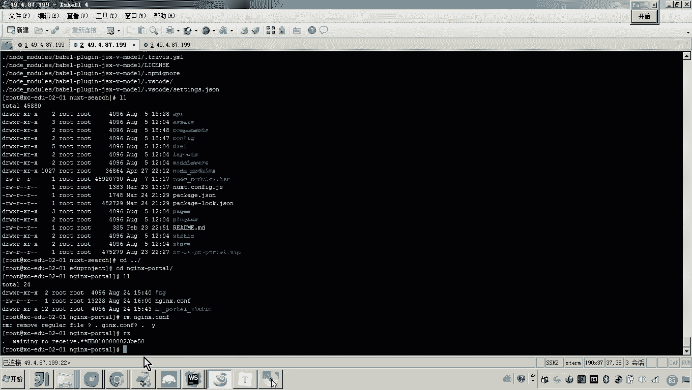
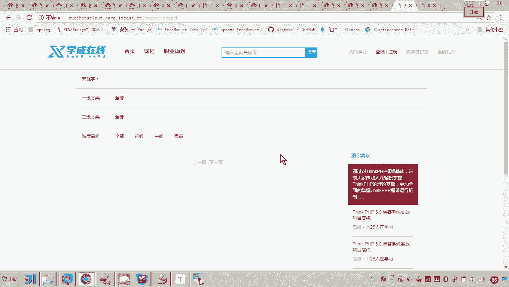
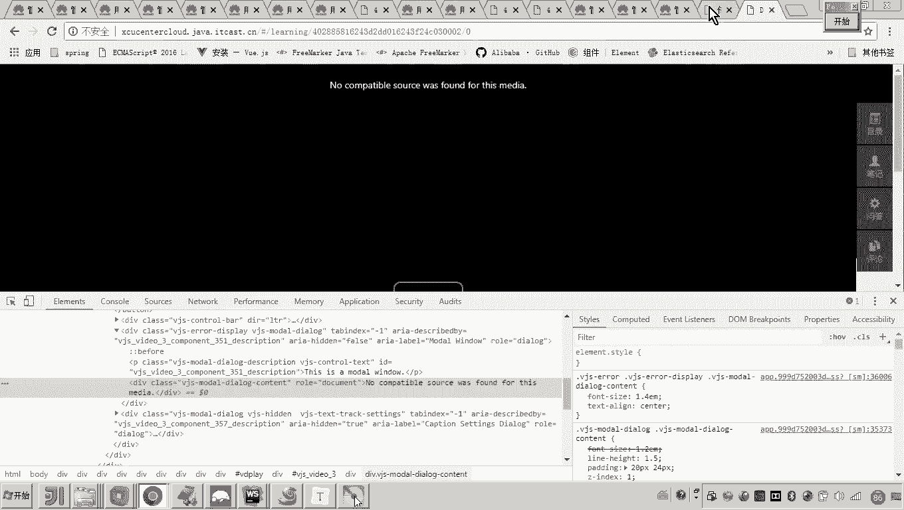
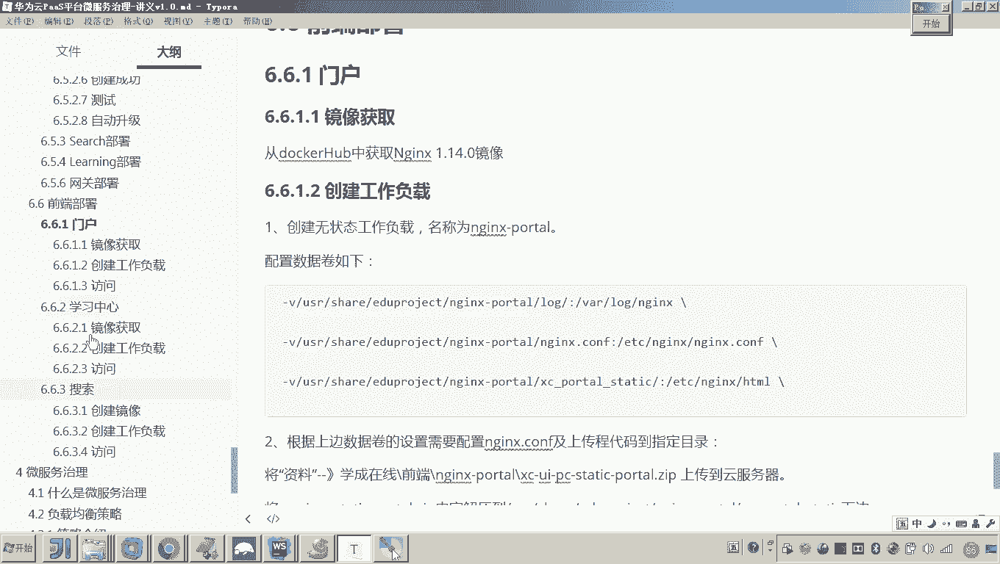

# 华为云PaaS微服务治理技术 - P125：03-学成在线项目部署-前端搜索-配置与调试 🚀

在本节课中，我们将学习如何配置与调试学成在线项目的搜索前端工程。我们将完成搜索工程文件的部署、Nginx配置的修改，并启动相关服务，确保前端界面能够正常访问。

---

## 检查与解压工程文件

上一节我们完成了文件上传，本节中我们来看看文件是否已成功上传至服务器。

以下是检查步骤：
1.  确认 `tar` 包已上传至目标目录。
2.  使用解压命令将工程文件释放到当前目录。

执行解压操作后，搜索工程的所有相关文件便已准备就绪。

---

## 配置Nginx反向代理

工程文件已就位，接下来我们需要配置访问路径。搜索工程通过门户网站的Nginx进行反向代理访问，而非独立的域名。

因此，我们需要修改门户Nginx的配置文件。具体需要定位到负责搜索路径转发的配置段。

以下是关键配置项：
*   **访问路径**：`/course/search`
*   **代理地址**：需要将其指向搜索前端工程所在服务器的内网IP地址。

修改完成后，必须将此配置文件重新上传至门户Nginx的配置目录中。

---

## 启动相关服务

配置修改完毕后，我们需要启动相关服务以使配置生效。

以下是需要启动的服务：
1.  **搜索前端工程**：确保其服务进程运行。
2.  **门户Nginx服务**：因为修改了其配置，需要重启以加载新的代理规则。

等待服务启动完成后，即可进行访问测试。

---

## 访问测试与结果验证

服务启动后，我们来验证搜索前端页面是否可以正常访问。

访问方式是通过门户域名加上配置的搜索路径。页面成功显示，表明前端工程部署和Nginx代理配置已成功。

目前页面数据显示不全，这是因为前端需要调用后端微服务接口获取数据。前端与微服务的集成调试，我们将在后续课程中单独详细讲解。

---

## 本节总结

本节课中我们一起学习了搜索前端工程的部署与调试全流程。我们检查并解压了工程文件，修改了Nginx的反向代理配置以正确转发搜索请求，随后启动了搜索工程和门户Nginx服务，并最终验证了前端页面的可访问性。至此，学成在线项目的前端工程（包括门户、学习中心、搜索）均已部署成功并可独立运行。