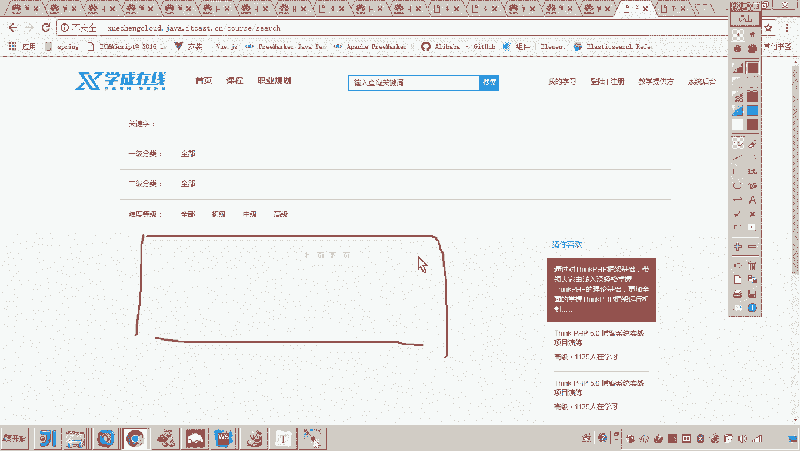
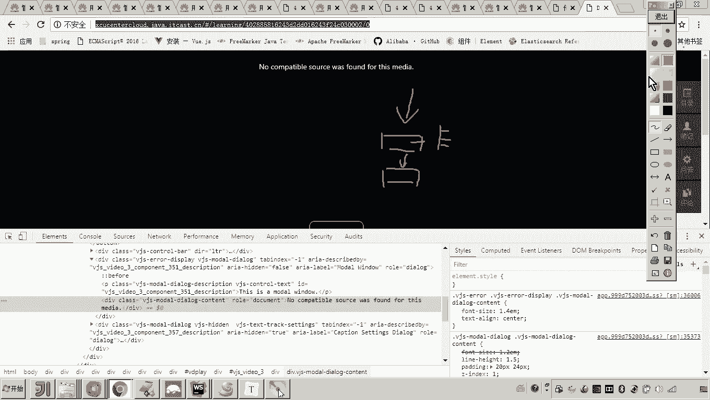
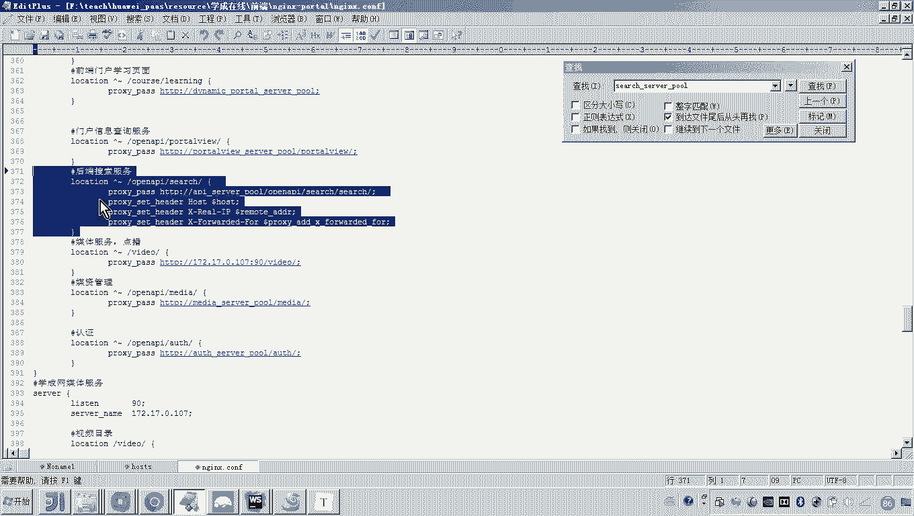
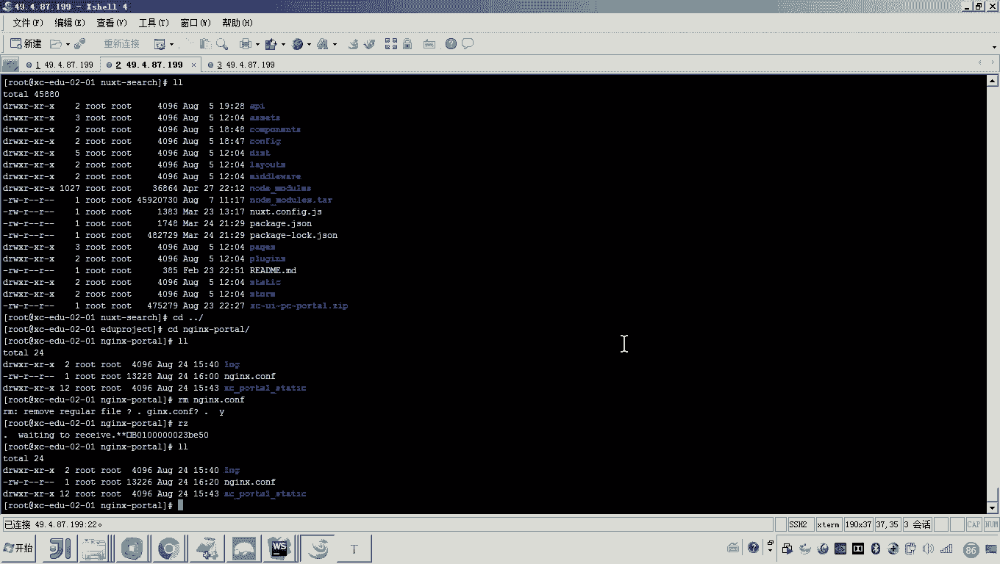
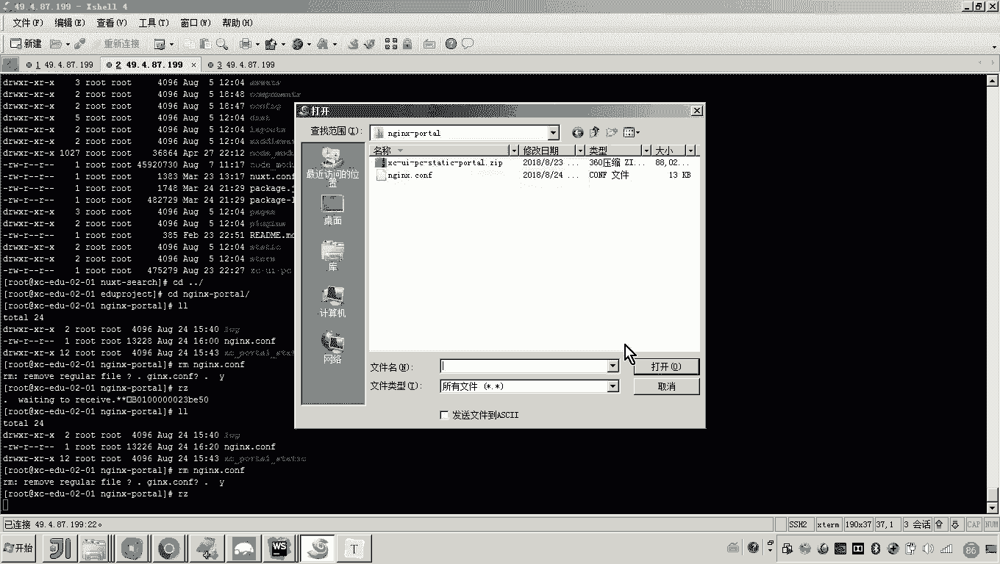
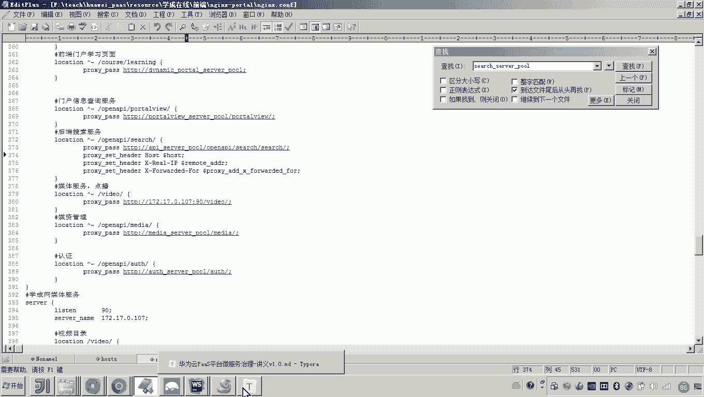

# 华为云PaaS微服务治理技术 - P126：04-学成在线项目部署-前端与微服务集成-集成搜索 - 开源之家 - BV1wm4y1M7m5

好，那现在我们先来集承哪个呀？啊，先集成哪个来，先集成搜索吧。好吧，因为为啥集成搜索呀？因为这个搜索比较单纯呀，因为这个搜索在这里它只会调用这个搜索服务是吧？搜索服务是请求以来是 take个事去，对吧？

所以这里面我们先集成它啊，然后呢，这个可能就不太单纯了，你知道为啥吗？因为这个界面它要先调用学习服务学习服务再调用谁呀？port头 you。😊。

还有印象那个业务流程吗？就是这个要取这个视频的地址啊，它是要通过先调用学习服务。学习服务对这个学生的学习资格校验完了之后呢，学习服务再请求这个这个这个谁呀，port头 you来取出视频地址。好。

所以我们先集成这个。😊。

好，那么先集成这个那。我们得思考一个问题啊，你这个前端是不是要去请求微服务呀？你请求微服务微服务行不行啊？微服务能能微服务现在能用啊？各位看一下，这这这这是微服务。😡，对不对？这是不是就是微服务啊哎。

刷新。😊，你看有问题了，看什吧，有问题了。😊，哎，又好了看看见吗？哎，又好了，你说老师刚才那是咋回事，在刚才是不是应该缓存啊啊，回头我们遇到问题再说啊，至少来说现在这个搜索这儿。😊，是不是已经可以正常？

那搜索服务既然正常，并且这个请求是不是通过网关来请求的？所以我觉得前端工程应该和网关。交互而网关把请求转发到微服务。其实这个我们在当时介绍这个学程在线的微服务架构的时候，我应该也讲过吧。哎。

也讲过了这个呃这个学程在线的他的这个呃微服务的这个结构。😊，还有印象吗嗯。好，所以说呢呃我们一会儿去部署的话，我们就采用这种方式，就是前端去请求到网关，然后网关来转发到微服。

而网关转发微服务的这一块东西都已经调通了。你现在要调的就是前端向网关进行交互。😊，哎，请求是这意思吧？好，所以我们再回到刚才的章节上来来。那现在我们进行的是不是就是搜索搜索这个服务和前端啊。

搜索前端和这个后端微服务进行一个集成啊？好，微服务OK啊，前端也OK。那现在我们就说那你这个请求从哪开始呀？😊，注意那这个时候我们得看一下，看好啊，我们找到啊找到这个门户的找到门户的这个。

有说老师为啥找门户的n呀？😡，因为门户的这个呃门户的这个N它是一个入口。他首先是不是会请求这个地址？到到哪里啊，到这个前端，各位，我说的没错吧，是不是到这儿哎。😡，然后呢，到这里之后，这里这里是哪里。

你往上找。😡，这里是不是就是我们说的那个搜索的前端工程啊，那你找到搜索前端工程的源代码，我们来瞅一眼看看吧。前端工程的源代码。哎，你找到这这个就是搜索界面。😡，对，那在这个搜索界面当中。😡，啊。

这些代码有时候老师都看不懂。没关系啊，我现在给你讲的是集成的方法，集成的方法和业务流程。你要注意，至于这些代码呢，你可以下去的去补。哎，你可以去参考哎，我之前讲学生在线的一些视频，但现在你要注意听。😊。

嗯，你看我怎么去给你继成啊。就说这个界面其实就是大家看到的这个文件啊，就是大家看到的这个界面，懂吧？而在这个界面当中。😡，我们需要来看。看什么呢？就是在这个界面当中啊，他就会去请求。请求啥。看这。

这个方法就是来请求搜索课程。懂吧？那时候老师这个方法在哪呢？😡，这个方法的话，我们需要去找一找了，看好啊，你找找啊，这里面是不是有一个变量啊，那这变量在哪呢？这变量是不是在API course下是吧？

API course找到了。😊，这不就是搜索课程吗？你看他搜索课程怎么搜的，他是不是请求这个路径啊，那这个前缀这个API的前缀是哪呢？点进去瞧一瞧。😡。

这个这个这个configuger configer在哪？configer在这儿是吧？configer在这儿，你找到哦，在这儿。😊，哎，哦，我知道了，原来他是请求他。😮，看见了吗？他显示这个。

那他请求这个地址哎，来请求这个搜索的这个数据。😡，那这个后边的地址呢？😡，一会儿就把人说迷了，说老师啥是后，啥是前，是不是你注意听看好啊，我现在是不是就找到了这个API是吧，找到这个API的方法。

这个方法，刚才你是不是也找到了，对不对？这个方法，这个方法是不是就是它前缀，刚才我是找到了？😊，各位这个地址连起来，是不是就是请求了这个地址？😡，看懂了吗？这是哪呀？这是不是我们的门户呀？😊。

对吧所以呀。😡，就是他请求搜索数据，要请求的是open APII search。😡，看懂了吗？对，就是他。好，原来如此，那我们来看看，那你得找门户，因为这个地址不就是请求门户的地址嘛，对不对？

那你找到门户吧，门户门户的这个呃虚拟主机当中有没有一个叫杠open APII杠4区的东西，你找开始找。😡，门户，这是门户吧？里面有没有一个叫杠open AI。😡，杠4去有吧，看见了吗？有吧哎。😡。

找到根了，就是这个地址其实就是请求后端搜索服务的。而这个请求后端搜索服务，这里边注意注意看他是谁。😡，他就是我们说的搜索的。往上翻就是搜索的内网，搜索哎，不应该是搜索。有人迷了，你说那应该是啥？

因为我说了所有请求微服务是不是都是通过网关？😡，懂不懂？所以啊你要先把网关配好，然后这里你要通过什么，通过这个往后往后翻啊，通过网关来请求微服务。😡，懂我意思吧？

所以这里头这里头一定记着这儿是网关的地址啊，这儿要请求网关的地址。好了，那现在注意咱们把思路捋一下。😡，就是说前端搜索要通过网关哦，这个前端搜索通过门户的ening来请求来请求网关。

这个门户的en在这儿对不对？就是通过这个地址，所以说这个地址应该改成网关。没错吧，网关好，那网关我们先把网关的地址拿到再说啊，网关的地址拿到再说，别着急。😡，呃。

网关在哪无状态的来找到我们的哎A service看好啊。他的访问方式，我们原来是不是只添了一个什么公网地址呀？所以现在你给我添一个内网，嗯，叫AGservice。😊，好，这这这这儿。

这网关的这个端口是啥呀？网关的端口。😡，是不是就是50201？你说你咋知道的？😡，我我看着这呗，公网的IP是不是访问的公网的这个这个这个这个映射的端口，是不是也会映射到网关的容器里头啊？对，好。😡。

确定来，我问你，这是不是就是网关的内部地址了，就是网关的内网地址。好，拿的这个内网地址配在哪里呀？😡，你说配料在的可以不可以可以呀，你可以这么做呀，但是我们可以这么玩嘛，你可以采用这种方式嘛。你看好啊。

我最上边应该配了一个网关，你注意看这是不是就是后台API呀，后台API呀，所以这里边呢你是不是就可以把它的地址给我改了？😊，看懂了吗？哎，那这样的话，所有请求网关的那个UL，我们都通过这个po。😡，嗯。

好。那你往后来再回到刚才的那个地方啊，我们现在要改了啊，注意注意看非常关键啊，然后到这儿。😊，这是不是就是门户eng来请求网关了，看懂了吗？请求网关了。那说请求网关的什么地址呢？但后边要加呀，别着急啊。

看好，这是咋这是咋咋请求的，是不是open API search。😊，看见了吗？对不对？open AR顺序，你看它还是俩色序的，对吧？仨俩那那那怎么弄？看好，你把这一堆给我复制过来。😊，诶，贴过来。

各位。这就OK了。那你请求后边各位，刚才你也看代码，他在后边是不是会请求一个s区 course，然后会请求一个list史。那你说他是不是就会轻而易举的就把这一堆东西放到后边了。

这正好是不是就拼拼到一块了。对，好了，这就是我们说的这个啊请求的方法。好，我把这个方法讲完了之后呢，基本上大家应该知道这个前端的这个搜索啊前端搜索是通过门户的这个en到这儿来请求网关的地址。😊，对不对？

哎，这个地址非常重要好，这个地址好，那现在呢我们就把这个门户只要启动一下，是不是应该就可以了。好，来吧，我们把这个门户的这个配置文件给它替换一下。😊。

好，这样吧我们把这个按键格给它删掉。然后再传。

OK传完了之后怎么弄啊，怎么弄告诉我。😊，啊，咋弄啊？那你修改了门户的这个案件可能，你不得起门户啊，对不对？好，来删除一下。确定。好。那大家来看啊，那就等着吧。😊，嗯，好了吧。

好了之后注意我现在要我现在要干活了啊。😊，那我现在是不是就可以这么弄啊，刷新吧？😊，出处触解果了吧，看见了吗？出了没？😡，这是不是就通了？对，好。

那以上是不是就是我们把这个搜索服务和啊搜索服务的前端和我们的这个微服务做了一个集成啊。其实我们这个集成的方法其实就是怎么做呀？就是通过门户的这个en门户的这个en啊，然后呢来请求网关。😊。

然后呢呃请求网关的这个地址，这个网网关的这个地址是不是就是搜索这个搜索服务的这个地址啊？好。😊。

