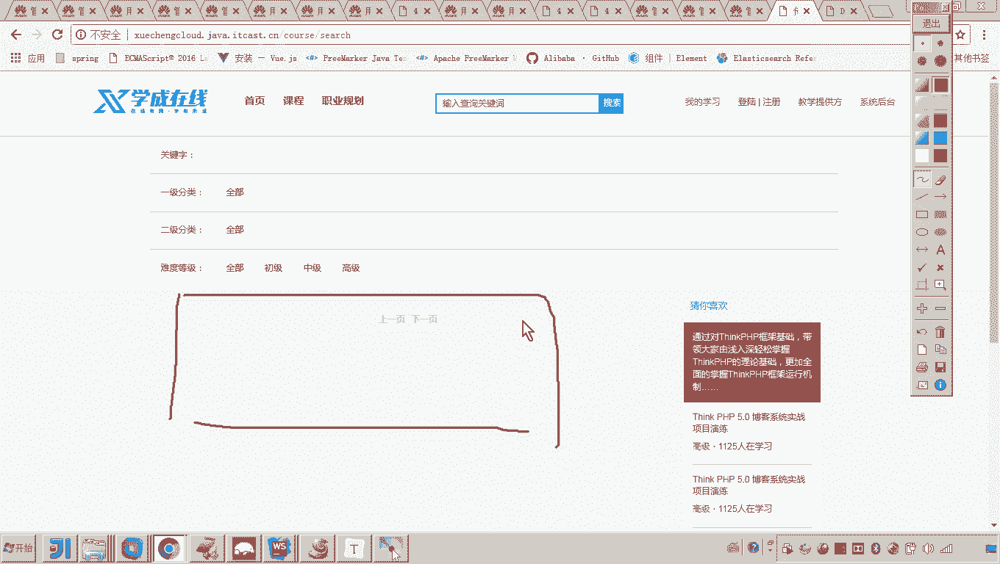
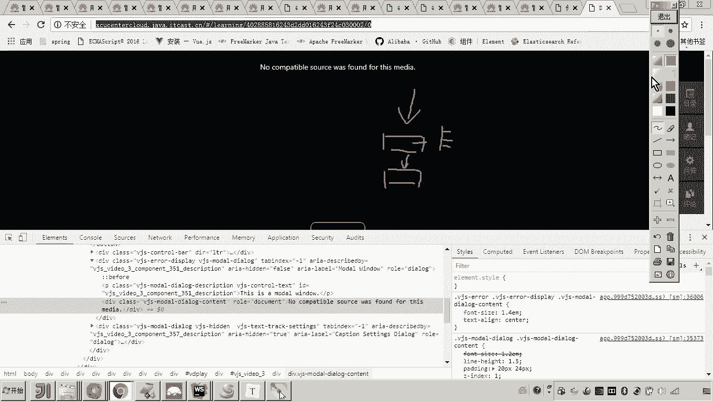
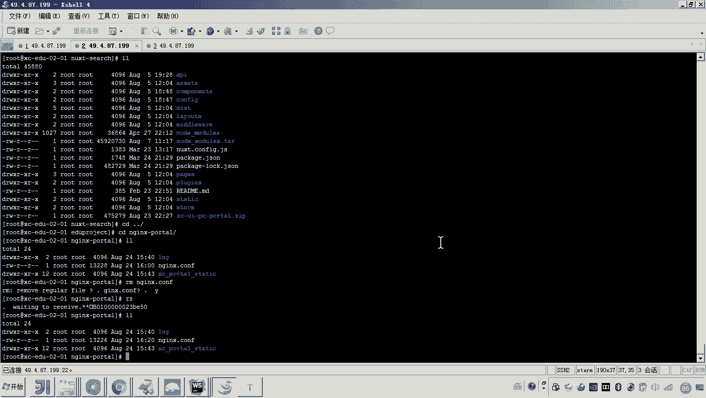
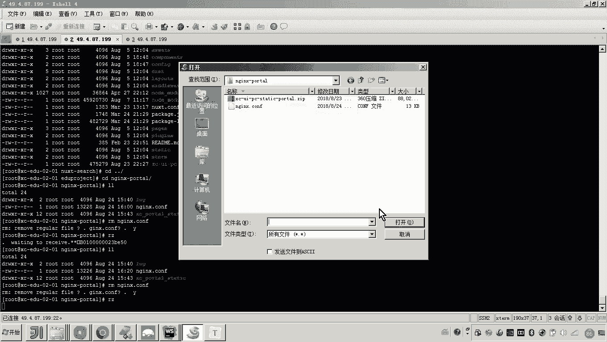

# 华为云PaaS微服务治理技术 - P126：04-学成在线项目部署-前端与微服务集成-集成搜索 🚀



## 概述
在本节课程中，我们将学习如何将学成在线项目的前端搜索功能与后端微服务进行集成。我们将重点关注前端如何通过网关访问搜索服务，并完成相关配置。

---



## 前端与微服务集成流程

上一节我们介绍了微服务的基本架构，本节中我们来看看如何将前端搜索界面与后端搜索微服务连接起来。

我们首先集成搜索功能。选择搜索功能开始集成，是因为它的调用链路相对单纯。搜索界面只会直接调用搜索服务，而搜索服务通过网关接收请求。

相比之下，其他功能（如学习界面）的调用链路更复杂。例如，学习界面需要先调用学习服务，学习服务校验用户资格后，再请求内容服务获取视频地址。因此，我们先从简单的搜索功能入手。

## 前端请求路径分析

现在，我们需要思考一个问题：前端如何请求微服务？微服务目前是正常运行的。观察微服务状态，可以看到搜索服务通过网关能够正常响应请求。

因此，前端工程应该与**网关**进行交互，由网关将请求转发到对应的微服务。这是学成在线微服务架构的标准通信模式。

所以，我们集成的核心工作是：配置前端，使其请求发送到网关，而非直接请求微服务。网关转发到微服务的部分已经调通。

## 定位前端搜索代码

要开始集成，我们需要找到前端发出搜索请求的起点。我们查看门户的Nginx配置，因为门户是主要入口。

在门户的Nginx配置中，请求会被转发到前端工程。我们找到搜索界面对应的前端源代码文件。

在这个搜索界面文件中，有一个用于“搜索课程”的方法。该方法会调用一个API接口。

以下是定位该API请求地址的关键代码逻辑：
```javascript
// 假设的API调用方法
searchCourses() {
  // 前缀来自config配置，路径是‘/openApi/search’
  const url = config.apiPrefix + '/search/course/list';
  // 发起请求...
}
```
通过查看配置文件，我们发现 `config.apiPrefix` 指向了门户的一个地址（例如 `http://portal-nginx/openApi`）。因此，完整的请求地址是 `http://portal-nginx/openApi/search/course/list`。

## 配置网关地址

目前，前端请求的地址指向了门户Nginx。但根据架构，所有对微服务的请求都应通过网关。

因此，我们需要修改配置，将请求目标从门户Nginx改为**网关的内网地址**。

首先，我们需要获取网关的内网访问地址和端口（例如 `http://gateway-service:50201`）。

然后，修改门户Nginx的配置文件，将处理 `/openApi/search` 路径的代理地址，从原来的搜索服务地址，改为我们刚刚获取的网关地址。

以下是配置修改的核心思路：
```
# 原配置（假设）
location /openApi/search {
    proxy_pass http://search-service-internal;
}

# 修改后配置
location /openApi/search {
    proxy_pass http://gateway-service:50201;
}
```
这样，所有发送到门户 `/openApi/search` 的请求，都会被转发到网关。网关会根据路由规则，将请求转发到真正的搜索微服务。

## 应用配置并测试

修改完门户Nginx的配置文件后，需要重启门户服务以使配置生效。






重启完成后，我们访问前端搜索界面，进行搜索操作。如果配置正确，前端发出的请求会经过门户Nginx，转发到网关，再由网关交给搜索微服务处理，最后搜索结果能正确显示在界面上。

至此，我们成功将前端搜索功能与后端微服务进行了集成。集成的方法是：**前端请求发送到门户Nginx的一个特定路径，由Nginx代理到网关，最终由网关路由到对应的微服务**。

---


## 总结
本节课中我们一起学习了学成在线项目前端与微服务集成的关键一步——集成搜索功能。我们分析了前端请求的代码路径，理解了通过网关进行服务调用的架构，并实践了修改Nginx配置将请求代理到网关的完整流程。这个方法为后续集成其他更复杂的服务打下了基础。