# 华为云PaaS微服务治理技术 - P127：05-学成在线项目部署-前端与微服务集成-集成学习中心 - 开源之家 - BV1wm4y1M7m5

好，那下边呢我们就把学习中心的前端和微服务做一个集成。啊，其实就是我们要解决这个界面，没有数据的问题。好好了，那这个界面没有数据，我们怎么做呢？呃，我们先解决视频的这个访问问题吧。那么这个视频呢。

注意啊，在实际的学生在线项目当中呢，是由单独要部署独立的这个媒体服务器啊，然后呢来作为这个视频访问。好，那现在呢我们是一个测试环境啊，我就通过这个什么呀啊门户的来访问我们的这个视频。

那这里边注意看我单单独建了一个哎单独建了一个叫做X video cloud这么一个域名啊，通过这个域名来访问我们的视频。😊。

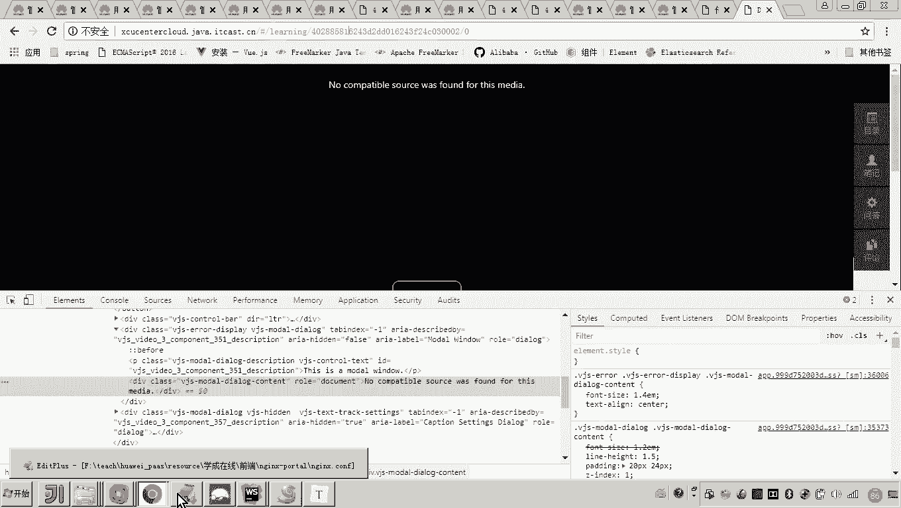

看到啊这里面是不是有一个叫杠video杠。😊，所以所以这里边呢呃我们就怎么办呀？我们是不是就可以通过这个路径来访问这个目录下的这个视频了？😊。

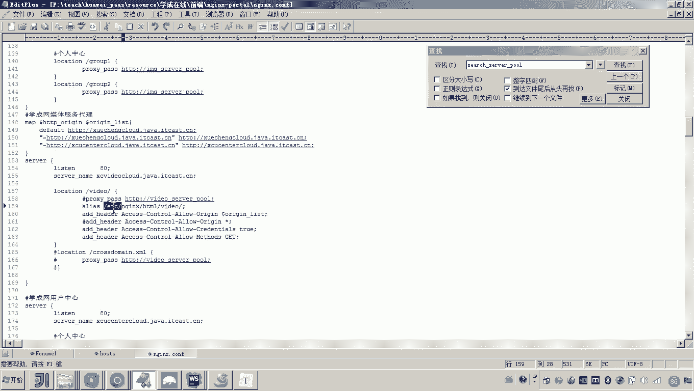

对吧所以现在呢呃我们刚才已经把这个视频呢就已经传到了我这个root下边。然后在这里边呢，刚才各位可以看到，这个是我刚才传的吧。然后这两个目录是就是解压后的目录啊，解压后的目录。

那现在呢呃我只要按照这里边的这个门户上面的要求。哎，我把这个video这个目录呢把它拷在这里是不是就可以了？对，好，那注意。😊。

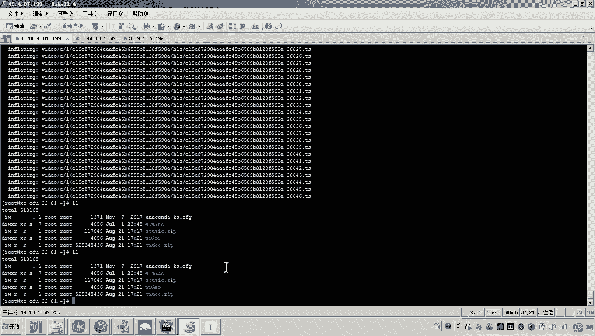

那有如说老师有这个目录嘛？注意啊，所以我要给你提醒这个配置文件是不是在我们说的这个docker容器里头啊，docker容器里边那个的这个目录啊就是就是这个名字，但是各位你还有印象吗？在门户当中。

我其实是在数主机上边，哎，我映射了一个目录，就是这个叫做X，它其实就相当于对应的这个目录。因为这个目录是在容器当中的一个目录，懂我意思吧？这个配置文件将来肯定要放在容器的嘛，是不是啊？好。

那现在呢我们来看那这里边我们就在这。😊。

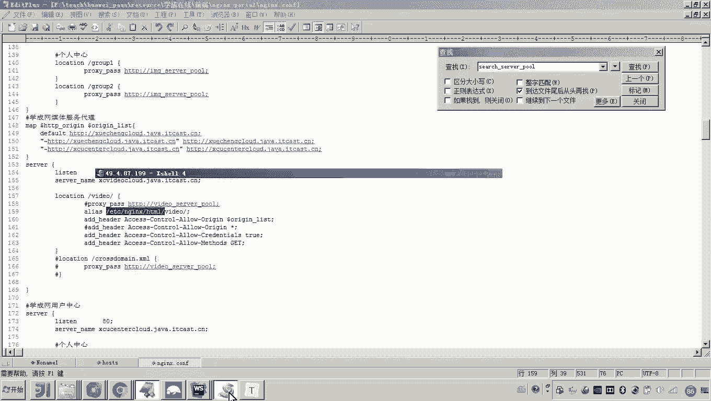

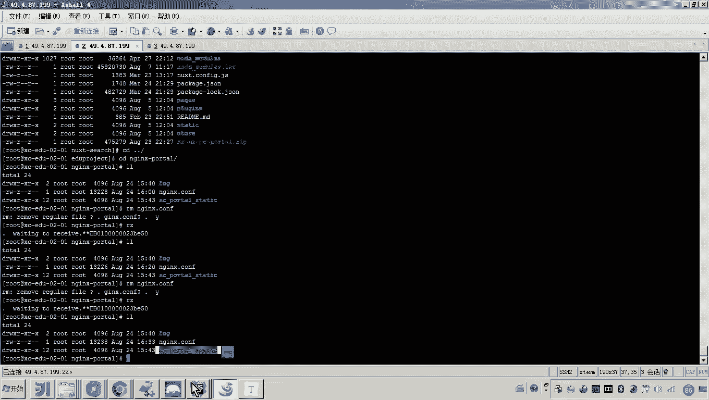

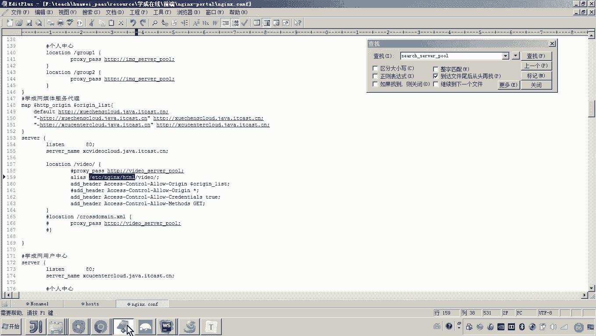

嗯，我们把刚才哎我在root下解压的那个目录，然后你把它给我拷到这儿。是不是可以了？对，然后你再把刚才嗯这里面有几个点啊，看好啊。😊，呃，这里边有有有。各位看一下，因为你不光考视频啊。

因为刚才我不是考了两个目录嘛，你看是不是？然后在这个tistic下边，你看好。😊，可他是不是有这有有这些呀？没错吧，哎，所以啊所以你你还需要把这些东西也拷过去啊，那这些东西呢我们考一下吧。嗯。

这里边其实我们主要用的是这个呃cateree和这个cos这两个目录啊，其他我们暂时没用到。😊，所以这里面呢我先把原来的这个嗯course。把它删掉。然后再把谁呀？哦，static没有。好。

那现在我就准备开始移了啊。😊，好，一个叫做什么呀？叫做cose。过来，然后再来。还有一个叫做category。过来。好，现在这样的话。

我是不是把这个呃我刚才上传上去的这个tatic下边的东西和这个video。😊。

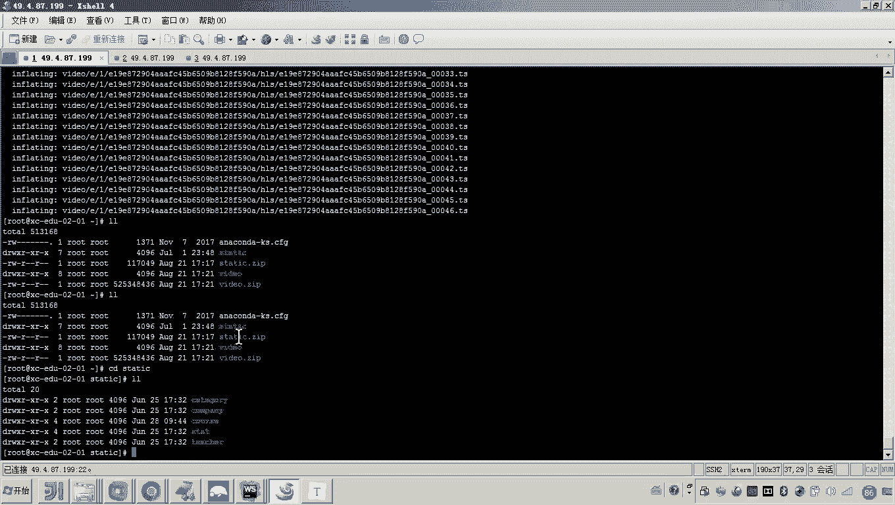

下边的东西都拷到了我的门户的这个主目录了。对，然后呢，这个视频的访问呢，刚才我也解释清楚了，视频访问是不是通过这个域名访问啊，因为现在这个目录下是不是已经有东西了？😊。

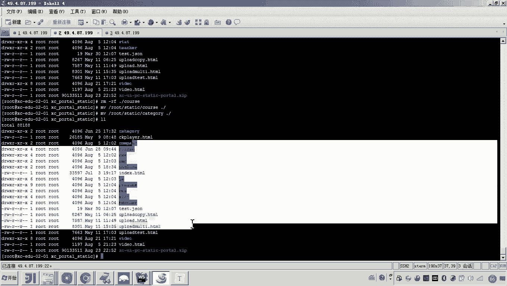

那这个tistic的访问通过谁访问？😡，s这个访问是通过这个门户的这个什么这个域名，你往下找，你可以找到的。你看下边应该是有的，有有你看这是不是有一个叫sed category，你看是不是在这个目录下。

另外还有一个还有一个就刚才我是不是还考了一个叫coursese。😊，嗯，在这。看见吗？他他将来访问的方式是叫cos杠DQ，然后呢访问到这个里头的这个目录了。你看这个目录是不是我刚才考的，看懂了吗？好。

那现在呢刚才我呃上传到云服务器上的一个tatic和这个video，这两个目录呢呃都已经啊放到各自相应的位置了。😊。

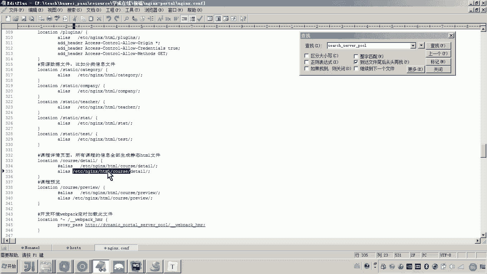

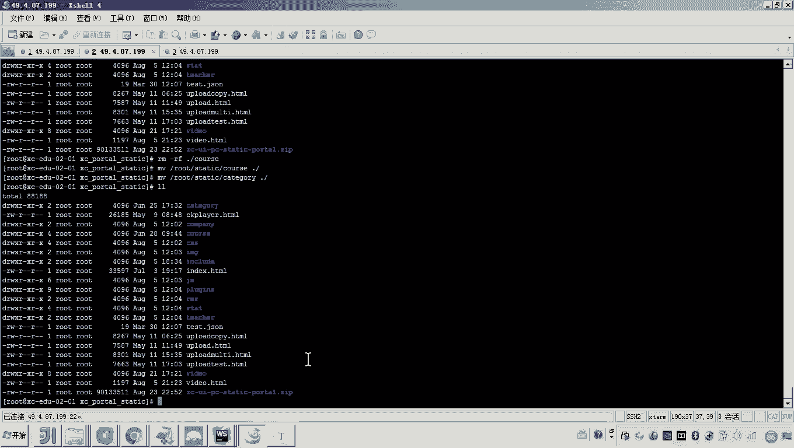

然后接下来我们再来回过来回到哪里呀，回到这儿。

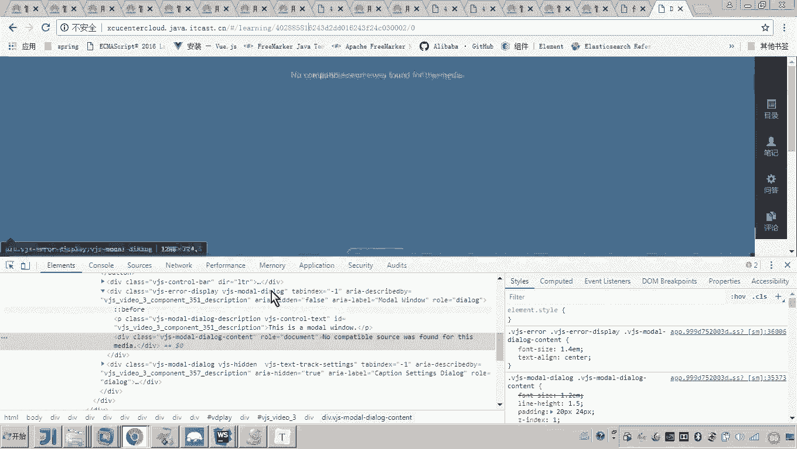

那么这个要请求，首先要请求的是右侧的这个目录啊，这个是来源于微服务的啊。呃，所以说这一这里注意看啊，我们先刷新一下啊，先刷新一下呃，这里边他肯定会报错啊嗯。😊。

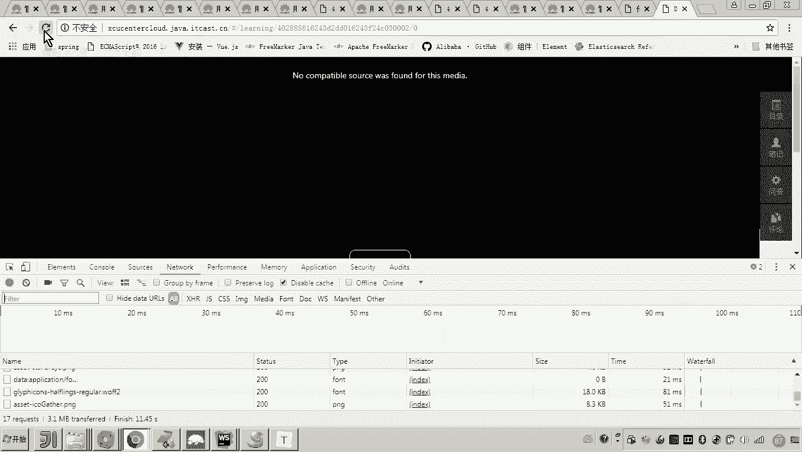

他肯定是拿不到数据的，对不对啊，肯定拿不到数据。你看这里边他要请求这个地址。😊，你看他是不没拿到数据啊，那这个地址在哪呢？这个地址你就把这个把它改改对就行了。这是请求的哪里呀？😡。

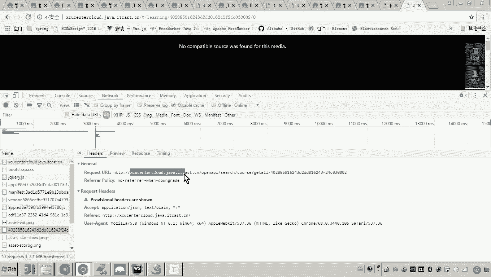

啊，us centerer是不是用户中心啊，还是用门户的en啊，看好啊，找到。😊，好，那现在就找他刚才那地址是哪里？

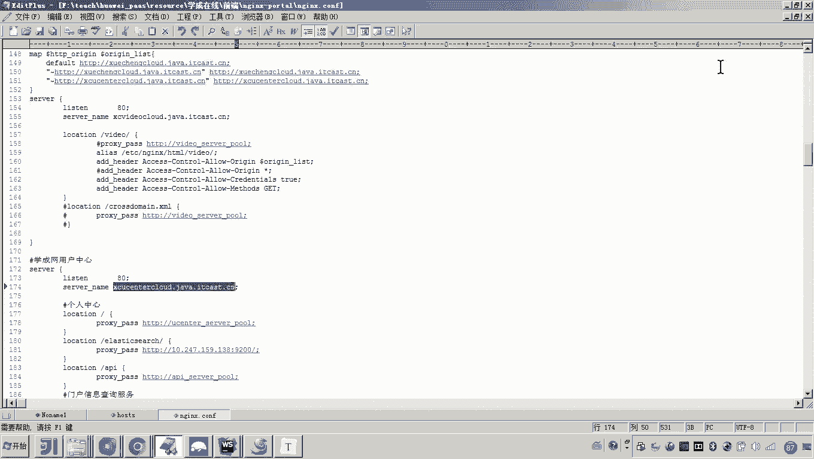

是不叫open API二选？😊。

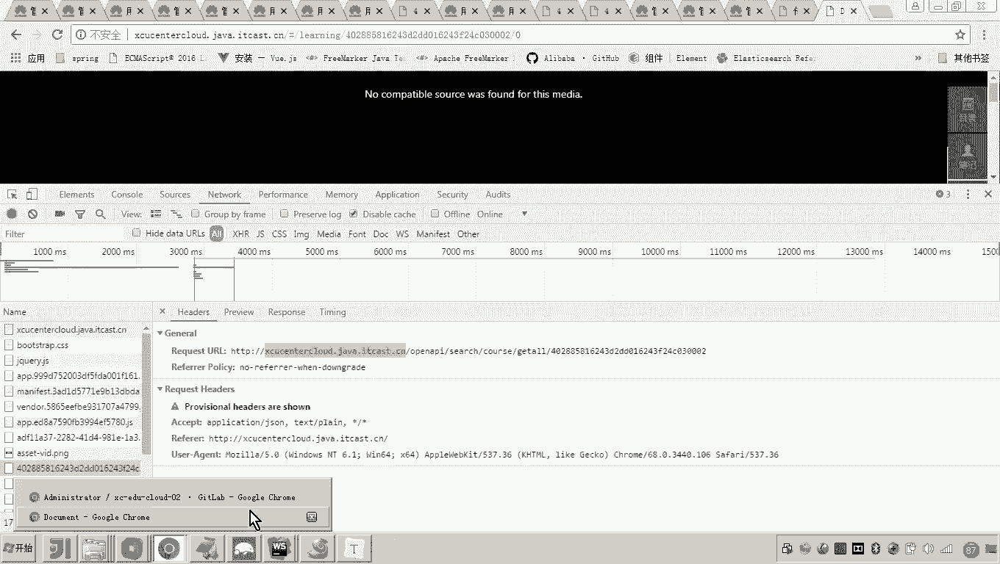

open APIR search我们找到。是不是在这儿？对，哎，刚才我们去整合搜索前端和网关之间的交互，我们是不是完成了？那这个跟那个一样吧。😊，那只要把这个地址改了是不是就行了？没错，咋改？😡。

你看原来你是咋做的，你现在就咋做。好，原来咋做，原来是改了这个地址吧，看见了吗？这个地址是不是网关的地址啊？好，你把它拿过来，然后在我们的学习中心这个虚拟主机下，我们要把这个都是替换了。😊，看好提完。

看懂了吗？哎，好呃，那这个搜索这个就拿到了，拿到了之后呢。😮，拿到了之后，他还要请求学习服务，就是他我们一并把它改了啊，听听他学习服务哎，这学习服务网关是怎么请求的？😊，还有port view。😡。

这都是咋请求的？😡，哎，好了，那现在呢我们回到网关的代码，注意注意看啊，网关的代码在哪呢？在这儿来看吧，你这个路由是咋配的。😊，搜索是吧open APII5可以走这个吧。

open APIport view是不是也可以走它呀？好啦，那现在来吧，我们先啊先先配这个port view吧，port view怎么弄？网关的地址切到这儿，看到了啦，然后后边open API。😊。

这没问题吧，哎，没问题。然后后边再看，因为这个因为这个是我们说的这个路由的前缀，看见了吗？它还不是具体的UIL。所以哎具体的UIL当中一定还要包括一个叫port view因为port view的接口。

它UIL统一的是是不是都以port view前缀啊。哎，所以这一个是路由的前缀，这个是UIL的前缀，你都把它放到这。其实这个效这个情况和我们刚才配的这个取这个情况是不是一样。😊，好，还有一个就是这个。

😡，结过这个学习对吧？要请求学习。那这个请求呢？😊，怎怎么做，学习服务怎么做？😊，学习服务这个路由，你会发现这两个是不是就不能走了，走默认是不是就可以。对，走默认咋走？😡，也是你把它改成这个。

然后后边跟API，然后后边跟什么？😡，微服务的名字。没错吧，哎，好，这就OK了，这是不是就是走的默认的那个路由啊？哎，有人说老师前面这个portto view和顺序能走默认路由吗？当然可以啊。

就说这个路由你走这个默认路由可以，你走这个什么UL路由也可以，两个，你任选一个吧。嗯，好，我就改好了。😡，大家可以看，应该没有问题吧。好了，那现在怎么弄啊？😊，怎么弄啊？我改完了门户的安尼克斯怎么弄？

😡，那你肯定是要把它传上去吧，传上去之后重启门户。嗯，来吧。我们进到我们的这个云服务器。

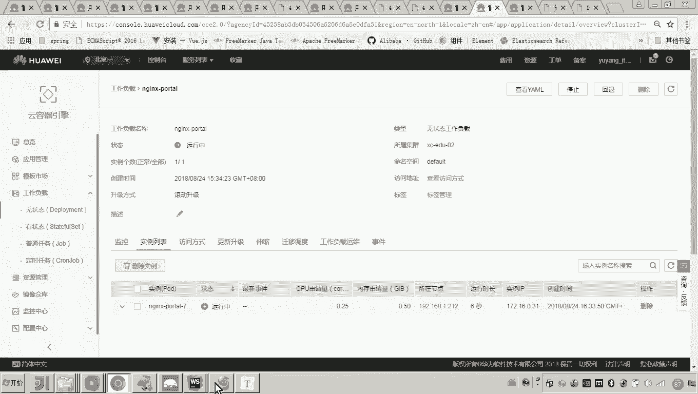

然后。再回来。

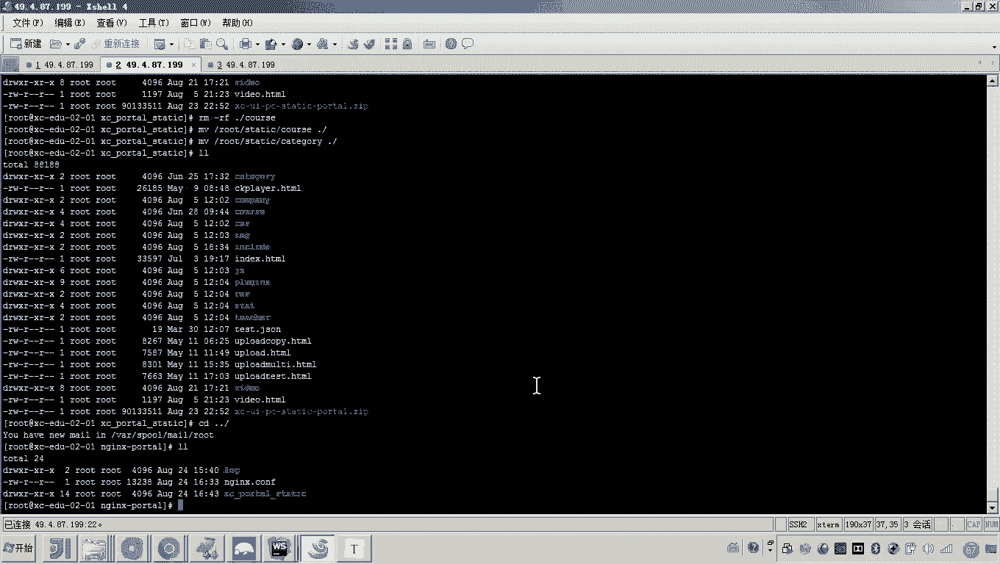

我是不是把原来的给干掉了？😊，来来传吧。

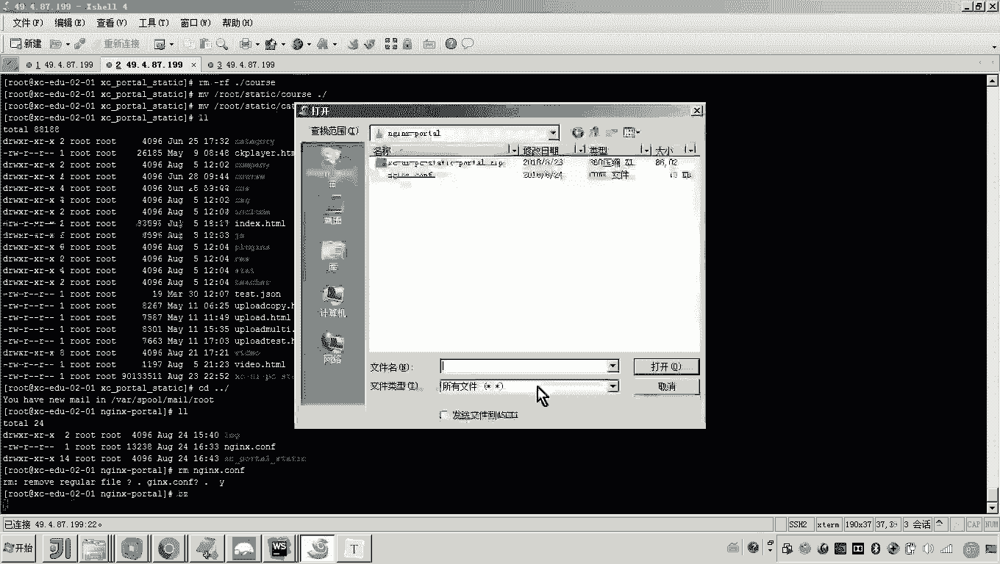

传上了吧，传上之后怎么做重启。😡，好，点开portto。然后再点开实例。删除。确定。嗯，大家来看。现在他是不是就该重启实力了？这个来。等一会儿啊，不着急。好，是不是就成功了？成功了之后。

各位我们是不是就可以回过来了，回到这儿了吧，咋弄刷新吧？好看好。😊，各位。成了。这是不是就是我们说的微服务呃，前端来集成微服务的过程？看懂了吗？

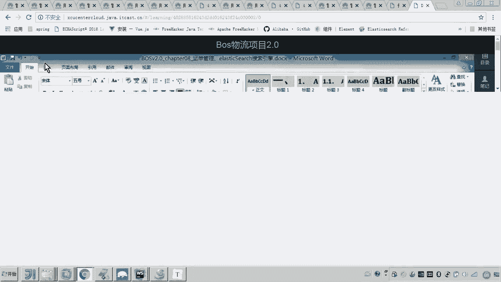

对，来，我们来看那他这个目录数据是不是也获取到了。而现在我们再去点它，各位这个数据是不是就拿到了。对，这就是我们说的这个哎这个这个什么这个前端整合微服务的过程。好了，那现在这个就已经完成了。

那我们从这儿是不是也可以直接来点击的呀。😊。

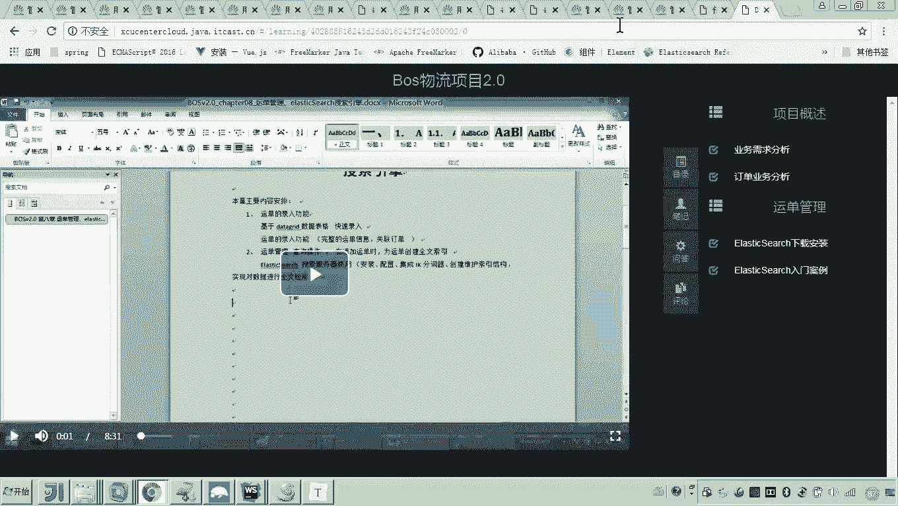

来点击这个不是物流，马上学习。各位。看好，那到这儿为止，我们的前端工程和微服务的整合就做完了。那其实到这儿为止啊，我们的这个整个项目这一块哎，整个项目这个部署这一块基本上也完工了。

那现在各位我们走的请求的就是云平台的里边的这个服务所拿到的这个数据。啊，这个图片我当时是不是解释过了，因为这里边用到了fass的DF一个分布式文件系统。所以这里边我们暂时没有部署。嗯，有兴的同学呢。

我们你可以尝试部署一下。好，然后点击，然后马上学习。好，这个过程是不是就完工了？😊。

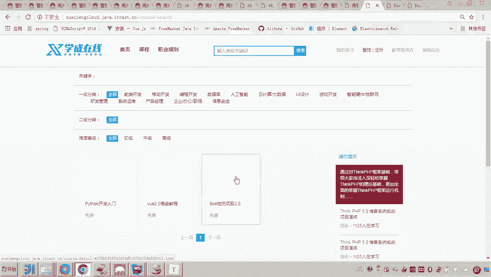

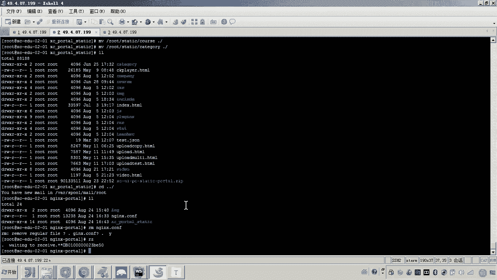

好，那么稍后呢我会对这个过程呢做一个总结。好。