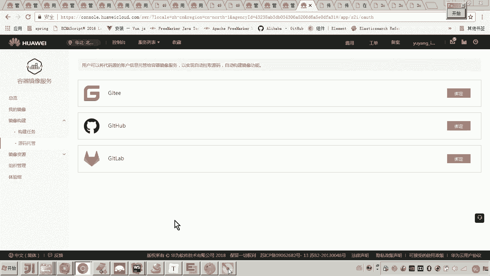
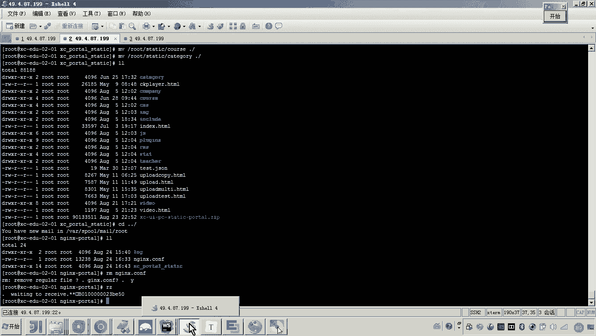
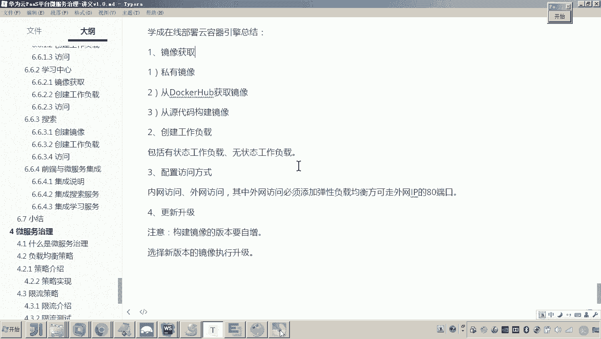

# 华为云PaaS微服务治理技术 - P128：06-学成在线项目部署-总结 - 开源之家 - BV1wm4y1M7m5

好，那么到这儿为止呢，咱们学生在线整个呃这个在线学习的业务流程所涉及到的所有服务呢，包括前端啊微服务，还有数据层。那么都部署到了这个云平台。好，那现在呢我们做一个简单的总结。好。

那首先呢我们先针对最后一部分前端和微服务的集成做一个总结。好，那么这个集成啊，注意啊，因为我们在部署的时候是前端分别部署啊，微服务分别部署啊，前端跑通了，微服务跑通了。那么他们之间要进行集成的话。

怎么做呢？哎，刚才我们啊应该在部署之前呢，我们应该说过这个这个图形呢就是展示了我们说这个前端到微服务访问的一个流程。首先前端是通过啊门户的。😊，然后呢，ern尼呢来通过网关来访问到这个各个的微服务。

好了，那现在我们知道了这样一个流程的话，我们就知道。那如果嗯我们要前端访问微服务的话，那么各位我们是不是需要在N克斯哎做一个代理转发啊，把这个请求转发到网关是不是就可以了？对。

所以这个过程我们是怎么做的呢？我们首先。😊，因为这个N要转发到网关，其实这个过程走的是内网，对吧？所以现在第一步我们要做一件事儿，就是要添加网关的内网访问方式。那这个网关的内网访问方式怎么添加呢？

那各位啊这里边我们添加服务啊，选择什么哎，选择集群内网访问，这里边它就帮给我们自动生成了这么1个IP看见了吗？这个端口是我们自己指定的。😊，那这样的话这就是一个内网的这个地址啊，这个地址。

然后呢有了这个内网的地址呢，现在我们只需要在哪里啊？门户的当中，我们把这个网关的呃这个地址呢，我们就可以配置上去。这样的话我们就可以在门户当中啊所有的请求呢所有的请求微服务的这个请求地址呢。

我们都让他走这个那这个地址是不是就是网关的地址啊？然后呢，只要前端一访问杠op杠他是不是就可以走这个请求网关了？嗯好，大概是这样一个流程啊。好，那么刚才呢我们其实已经完成了这个集成搜索啊集成学习服务。

😊，好了，那么以上呢就是我们说的个前端和微服务的这个集成方法，一定记着这个图。嗯，好，那最后呢我们简单总结一下这个过程啊，那么在整个呃微服务引就是容器引擎CCE的部署过程当中，首先第一步呢。

我们一定是先要确定我们这个镜像的获取，对吧？那我们整个呃整个的这个获取的这个方式呢，我们应该用了前两种。😊，第三种呢呃我们并没有用云平台来来来来测试啊啊，一会儿我稍微介绍一下这个私有镜像呢。

我们通常是哎微服务的构建呢，我们会把它构建成这个私有镜像，然后呢把它传到云平台哎，然后呢这个包括其他的像这些呀me啊等这些呃这个公共的普遍使用的这些服务呢，在这个docker hub当中呢都有。

所以我们针对这一类这个镜像呢，我们都去哎cker hub去获取镜像就可以了。然后通过源代码构建呢。😊，其实这里呢大家可以打开这个呃容器这个云容器引擎啊，在这个镜像仓库当中，大家可以看一下啊。

那在这个里边呢大家可以看到有一个叫做什么呀叫做镜像的构建构建的话，这里边是不是有一个叫源码托管呢？所以其实各位我们当初创建自自己的私有镜像的时候。

老师是不是把这个源代码呢提交到我们局域网的一个私有的这个get上面，对吧？就是这个ge的一个仓库是吧？

现在呢其实通过云平台呢哎你也可以把这个你的代码呢直接托管到公网对然后这个云平台呢和这个公网的ge仓库呢做一个呃连接，然后它就可以云平台可以自动从这个公网的这个get仓库上边。

你比如说我把我的代码放在了你看它这里边默认是不是也支持这个然后你放在上边那个云平台就可以自动的从这个里边去把这个代码呢得到啊得到代码之后呢来构建镜像，其实这个过程呢就就是我。😊。

我刚才在局域网哎，我在局域网手动啊通过脚本来做的这个过程。好，这个大家了解一下。好，那么我们继续来看啊，这个镜像只要我们搞定了，那现在我们就可以创建工作负载了。那工作负载的概念是什么呢？

其实工作负载我们学到这儿应该知道工作负载对应的是不是就是一个什么哎，一个呃这个具体对应一个或多个容器实例，对不对啊，那有人说老师这个不理解。哎，那你可以看一下吗？这里边各位啊，我们来看一下。😊。

那这里面这是不是就是我们的工作负载嘛？哎，这个工作负载，我问你他是不是就对应了我们的一个微服务啊？😊，对不对？而这个微服务它是不是有一个或多个实例？那这一个实例是不是就对应我的一个刀cker容器？

没错吧，所以这个工作负载其实一个工作负载就是可以运行的啊一个微服务。而这个微服务注意，而这个微服务哎，你就可以认为它是由多个一个或多个实例而提供的这么一个服务嗯。😊，好。

那这个工作负载分为有状态和无状态。那么我们部署的学生在线钢材这些服务的话，我们知道mycycl和这个猫godB是不是都是有状态的，包括ES。😊，哎，包括electasticastic search。

对吧？那无状态的像这些un呀，这个微服务啊，它在运行过程当中哎对无需来记录数据的变化。哎，对数据进行持久化的。所以我们把这些都叫做无状态。😊，好，那这两个我们去创建这个工作负载的时候要注意。

最后一个就是你的工作负载创建完成之后，你是不是要访问他呀？所以你要在这个访问方式当中要注意哎，我们学习的有几种访问方式啊，哎，一个是内网访问，一个是公网访问。但是公网访问这一块我们遇到了一个情况。哎。

公网访问我们是不是门户的公网访问我们是要走80端口啊。走80端口的话，你就需要单独的去添加一个弹性负载均衡。然后呢他哎可以哎外网IP呢挂80端口。哎，否则的话，那你要是走公网访问的话。

各位我们之前也添加过这个公网访问，你会发现它这个端口其实是有限制的这个端口是只能是从什么呀？3万到32767。嗯好，这个就是我们说的这个访问方式。那还有什么呢？还有就是这个更新升级。

其实我们再去创建的我们再去构建的时候也也遇到了，对不对？所以这里边呢我再记录一下，就是更新升级更新升级这里面一定要注意，就是说我们再去构建。😊，我们这个镜像。啊，首先更构建要注意几个方式，要注意几点啊。

就是构建镜像。他的版本要自证。一定要记着。哎，然后呢呃你把镜像构建完了之后呢，这个版本是不是就自增了，然后在这里在这里选择最新的版本，然后去升级。😊，懂吧？啊，然后呢，你选择哎最新的哎选择不是最新的。

反正是一定要是比旧的要新的，选择新的版本，选择新版本的镜像。😊，然后呢，执行升级。那这个过程其实是自动的啊自动的。好，那么这个伸缩这块呃，其实我们之前也讲过呃，我在这个快速体验当中是不是讲过呀。

可以设置很多的伸缩策略嗯。😊，好，然后呢还有什么呢？还有就是这个呃迁移调度啊，还有这个工作负载运维啊，大家都去了解一下。呃，那个工作负载运维也是经常遇到的。哎，就是什么意思呀？

我是不是在运行的时候可以去查看他的日志啊。哎，好，那么以上呢就是我们说的这个学生在线部署云容器引擎的啊非常核心重要的几个步骤。那我呢就总结完毕。好。😊。

