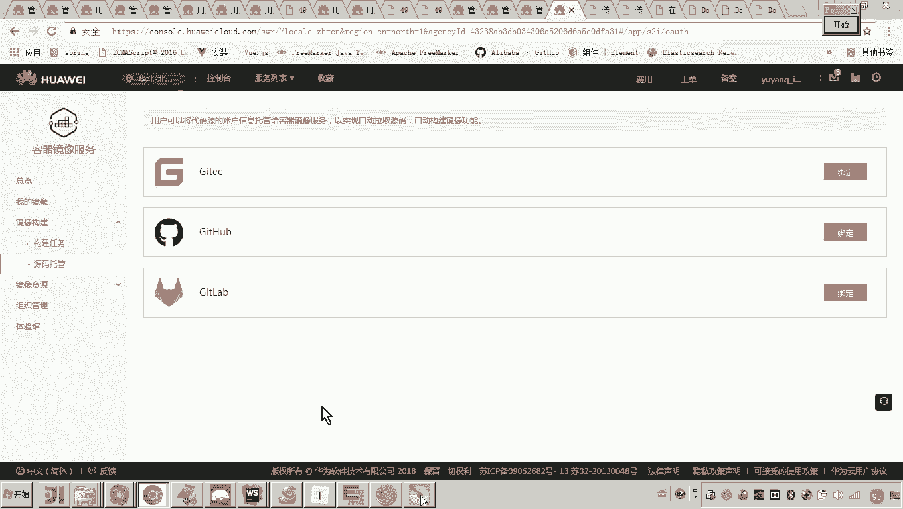
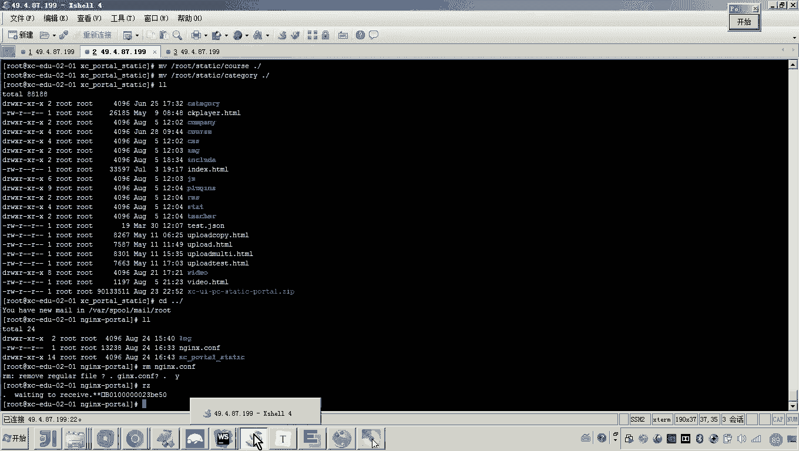
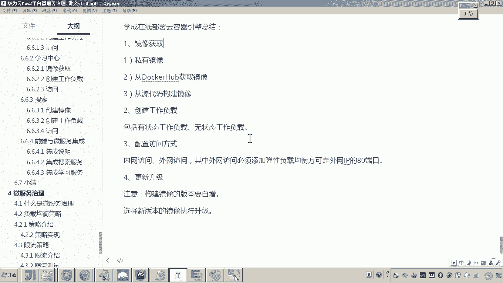

# 华为云PaaS微服务治理技术 - P128：06-学成在线项目部署-总结 📚

在本节课中，我们将对“学成在线”项目在华为云容器引擎（CCE）上的完整部署流程进行总结。我们将回顾从镜像获取、工作负载创建到服务访问集成的核心步骤，并梳理其中的关键概念与注意事项。

---

## 前端与微服务集成总结 🔗

上一节我们介绍了各个服务的独立部署，本节中我们来看看如何将前端与后端微服务进行集成。

前端访问微服务的流程遵循以下路径：用户请求首先到达**门户网站的Nginx**，然后Nginx将请求**代理转发**到**API网关**，最后由网关路由到具体的微服务。

为了实现这个流程，我们需要进行以下关键配置：

1.  **为网关添加内网访问方式**：在CCE中为网关服务创建“集群内网访问”类型的Service。系统会自动分配一个内网IP和端口，此地址将用于前端Nginx的代理配置。
2.  **配置Nginx代理规则**：在门户网站对应的Nginx配置中，将所有指向后端API的请求（例如 `/api/` 路径）的代理目标设置为上一步获得的网关内网地址。

通过以上步骤，前端发出的请求便能通过Nginx正确转发至网关，进而访问到所有微服务。

---

## 云容器引擎（CCE）部署核心流程总结 🚀

下面，我们来系统性地总结在CCE上部署应用的核心步骤与概念。

### 1. 镜像获取 📦

部署的第一步是准备容器镜像。我们主要使用了以下两种方式：
*   **从公共仓库拉取**：对于MySQL、MongoDB、Nginx等通用中间件，直接从Docker Hub等公共镜像仓库获取。
*   **私有镜像构建与上传**：对于我们自己开发的微服务，需要在本地或通过CI/CD流水线构建为Docker镜像，然后推送到华为云容器镜像服务（SWR）的私有仓库中。

此外，CCE也支持**源代码直接构建**。开发者可以将代码托管在GitHub、Gitee等平台，CCE能够与其对接，自动拉取代码、执行Dockerfile并构建镜像，简化了持续集成流程。

### 2. 创建工作负载 ⚙️

镜像是静态的模板，**工作负载（Deployment/StatefulSet）** 则是运行中的服务实体。

*   **核心概念**：一个工作负载对应一个微服务（或中间件）应用。它管理着一个或多个相同的**容器实例（Pod）**，确保应用以期望的副本数运行。
    *   **代码示例**：一个名为 `user-service` 的Deployment。
*   **类型区分**：
    *   **无状态工作负载（Deployment）**：适用于无需持久化存储运行时状态的服务，如我们业务中的各个微服务。
    *   **有状态工作负载（StatefulSet）**：适用于需要稳定网络标识、持久化存储或有序部署/扩展的应用，如MySQL、MongoDB、Elasticsearch等数据库。

### 3. 配置访问方式 🌐

工作负载创建后，需要配置访问入口。

*   **内网访问（ClusterIP）**：为服务分配一个集群内可访问的IP和端口，用于微服务间的内部通信，如前文提到的网关内网地址。
*   **公网访问（LoadBalancer）**：为服务绑定一个弹性公网IP（EIP），使其能从互联网访问。
    *   **注意**：CCE直接创建公网访问时，端口范围通常限制在30000-32767。若需使用80、443等标准端口，需要先创建**弹性负载均衡（ELB）** 实例，再将服务与ELB关联。

### 4. 应用更新与运维 🔄

*   **更新升级**：当微服务发布新版本时，需要更新工作负载使用的镜像。
    *   **关键原则**：构建新镜像时，**务必递增镜像标签（Tag）版本号**（如从 `v1.0.0` 升级到 `v1.0.1`）。
    *   **操作流程**：在工作负载管理页面，选择新版本的镜像，执行“升级”或“滚动更新”即可。CCE会逐步用新实例替换旧实例，确保服务不中断。
*   **弹性伸缩**：可以根据CPU/内存使用率等指标，配置自动伸缩策略（HPA），让实例数量随负载动态调整。
*   **运维监控**：CCE提供了丰富的运维功能，如查看容器实时日志、监控资源使用情况、进入容器终端等，便于日常的问题排查与状态检查。

---

## 总结 📝

本节课中我们一起学习了“学成在线”项目在华为云CCE上的完整部署总结。我们回顾了前端与微服务集成的代理转发原理，并系统梳理了CCE部署的四大核心环节：**镜像获取**、**工作负载创建**、**访问方式配置**以及**更新与运维**。理解这些步骤和概念，是掌握在云原生平台上部署和管理微服务应用的基础。