# 华为云PaaS微服务治理技术 - P129：07-微服务治理-微服务治理介绍 - 开源之家 - BV1wm4y1M7m5

好，那么接下来呢我们来学习微服务治理这一块的知识。首先呢我们介绍一下微服务治理啊，什么是微服务治理呢？呃，应该说这个词呢，大家在学习微服务的呃，学习某一个微服务框架的时候呢，总会听说。

但在实际开发过程当中，关于微服务治理这一块的东西呢，应该说接触不是很多。😊，好了，那其实各位现在呢我要强调一下的是微服务啊，在开发阶段，你可能体会不出这个治理的重要性。而真正的我们说他要去上线之后，哎。

我们要去维护这个数量非常多的微服务呢，这个时候呃就出现很多的问题了。那比如说举个例子，哎，说现在呢我们说这个高峰期到来啊，高峰期到来之后呢，我们说那如何呢？哎然后我们去调整我们的这个负载均衡的策略呢？

对，那可能有同学说我们可以去通过配置文件呀，和通过通什么方式，对吧？嗯，还有就是说呃我们说这个微服务的数量很多，然后这个性能呢快撑不住了。那我们是不是可以去降低一些微服务的处理能力。

也就是说有时候你不能光提高是吧？有时候也可以去适当的降低某些微服务的这个处理能力。所以这些都属于微服务治理的这个范畴。😊，那微服务治理呢通过我们啊这个呃业界对微服务开发啊。

微服务治理这一块的经验呢总结出了很多微服务治理的策略。啊，比如说像熔断、熔错、限流降级等。那这些都是啊都是微服务治理的策略。好了。😊，那么我们用云平台如何治理微服务呢？或者说我们不用云平台怎么治理。

用云平台治理有什么好处呢？好，那我来说一下。在学习这个servicecom框架开发的时候呢啊应该大家了解过，哎，通过这个servicecom框架呢，它提供了很多这种微服务治理的策略。哎。

但是但是它是怎么实现的？大家回忆一下它是不是通过在配置文件当中配置这些策略。😊，没错吧，哎，比如说现在要限流，那你要配置一下什么呀？配置一下，哎，我允许这个每秒的这个事务数。哎，如果大于这个事务数呢。

哎，我准备哎不让我这个微服务对外提供服务这个能力，那这些参数啊，哎每秒的事务数啊，这些参数都要进行配置，对吧？还有负载均衡，比如说我现在想配置一些这个负载均衡的策略，那怎么配呢？那你负载均衡。

那你是采用轮询呀，还是说这种呃随机的方式呀等等呀，它有很多负载均衡的算法，对吧？那你都需要配，那这种配置的方式，是不是人工在配置文件当中配呀。😊，对。那么各位如果采用云平台来配的话。

那它就不是不用再配置文件配很多与应这个微服务运行相关的参数了。那它是怎么做的呢？哎，它的做法就比较高级了啊。就是说如果采用啊云平台来管理我们的这个微服务呀。

那就其实只需要在配置文件当中配置非常少量的必要的这些通用性的配置即可。什么叫少量的必要的通用型的配置呢？哎，也就是说这些配置啊不会因为随着运行啊，随着运行的这个改变啊，随着这个我根据不同的业务场景呢。

哎或者根据这个不同的这个呃我们说这个业务的需求啊，哎我们去调整这个运行参数，而它这个运行参数，哎，我这个奖义上写的叫治理参数，这些微服务治理的运行的参数啊，它是通过云平台图形化界面来配置。😊。

那有如说老师，那你是通过图形化界面，也就是说呀通过我们说的这个云平台来配。那它配好了之后呢。😡。

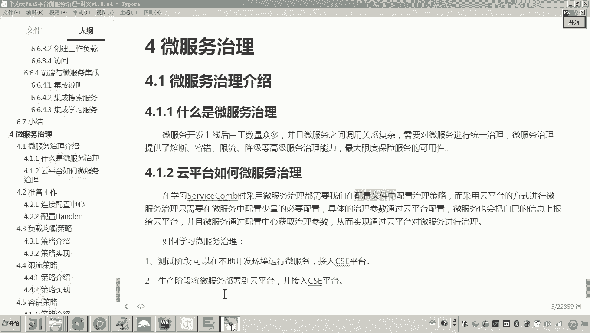

它配好了之后，各位这就是配置很多的这个微服务的这个治理的策略。那配好配置配好了之后，他怎么办？对微服务他得知道这些云平台配置的这些参数值。那微服务他怎么知道呢？

因为你也知道微服务是不是在刀cker容器里面运行啊，它如何得到这些治理的参数值呢，对微服务会把哎它会从这个服务配置中心来获取这些参数。😊。

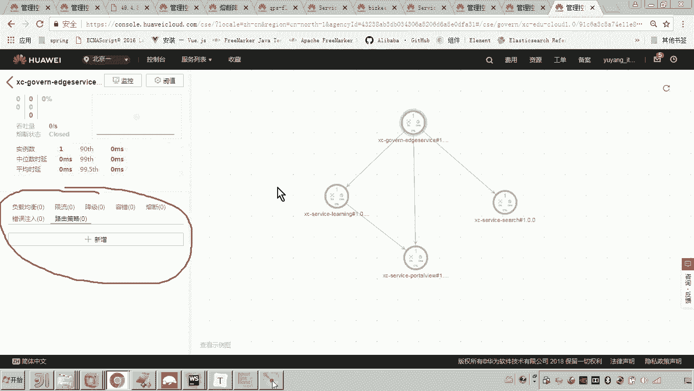

嗯。那么同时呢微服务也会把自己的这些运行的指标也会上报到云平台。那有人说老师呃他获取这个呃配置这这中心的参数，他为啥还要把自己的这个运行指标上报过去呢？你注意通过云平台。

我们是不是可以监控微服务的这个运行状态呀，对不对？那比如说你举个例子啊，比如说哎我说这个微服务它的运行的内存。哎，当达到了哎当达到了。😊，这个呃整个容器内存的哎百分之多少的时候。

我要对这个微服务进行治理。那你说这个微服务运行的它的性能的这些指标，它是不是也要报给云平台呀？对，所以就是方便云平台对它进行干嘛监控是吧？所以好，那么这里边呢注意我要说一下。

刚才我说的是不用采哎不采用云平台的时候，我们是在配置文件当中来配这些治理的参数，哎，这些什么呀？这些运行时根据运行需要所需要配的参数，非常麻烦，对吧？而如果采用云平台进行治理呢？你就会发现哎。

我们只需要通过云平台的图形化界面进行配置。哎，并且云平台呢可以干嘛呀？哎可以非常好的哎来监控来监控这些运行的这个指标。嗯，那其实我们在前边是不是已经把这个学程在线已经部署到了我们的这个呃呃这个。😊。

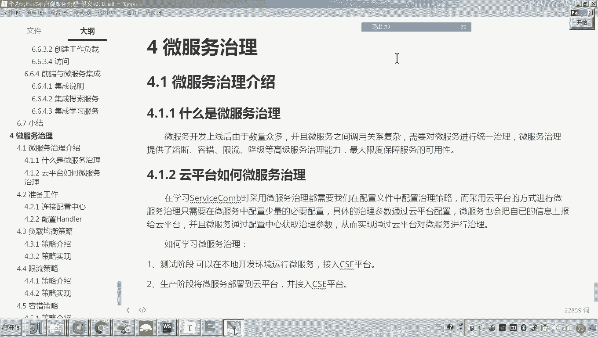

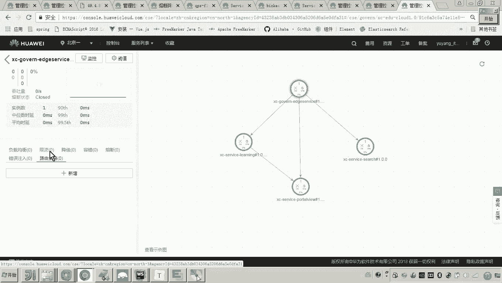

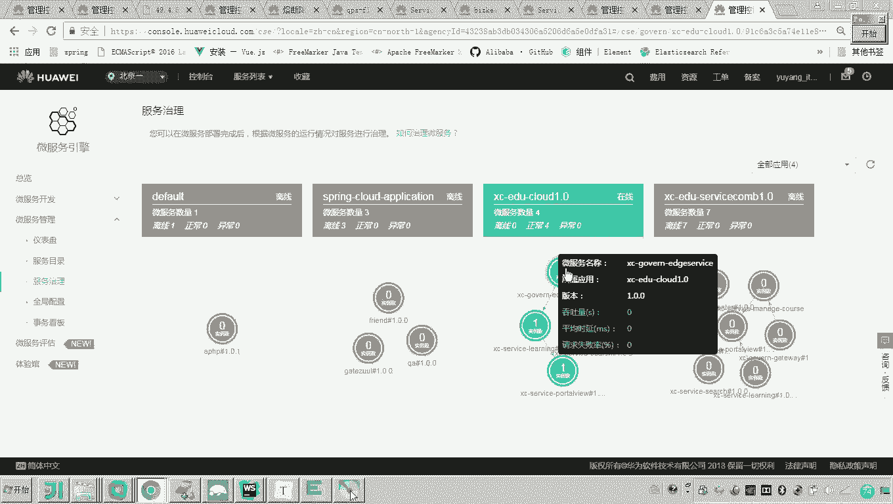

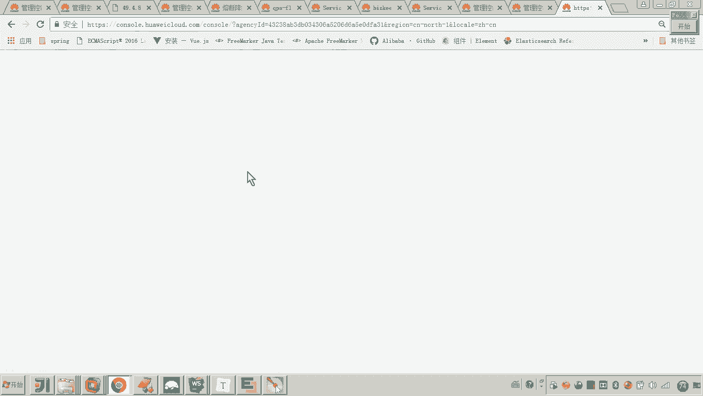

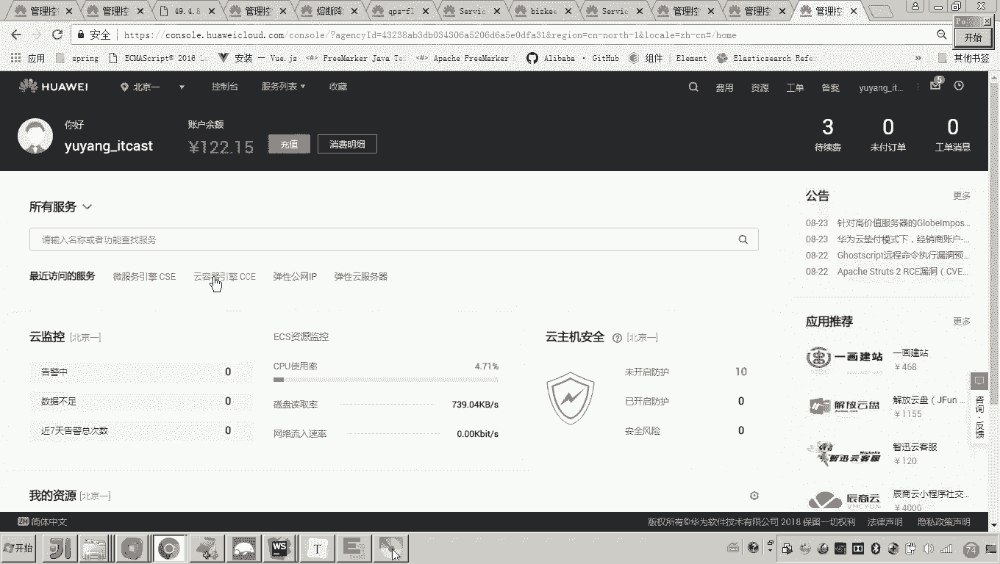

云容器引擎啊，所以其实你可以看一下啊，你可以看一下，现在现在我们可以看到啊，现在我们的这个集群，哎，你可以看一下呃，其实它有很多的指标啊，都可以采集过来，嗯，都可以采集过来。对，呃。

所以说现在我们说如果采用云平台啊来治理我们的微服务呢？那么你看大家可以看到这是不是都是它的这个指标啊，虽然这里边你会发现呃，这个这个它没有没有没有一些状态，对吧？

但是因为我现在我这个呃我这个云我这个系统是不是没有运行啊，对吧？对你你稍微刷一下，它就应该都有值了。😊。

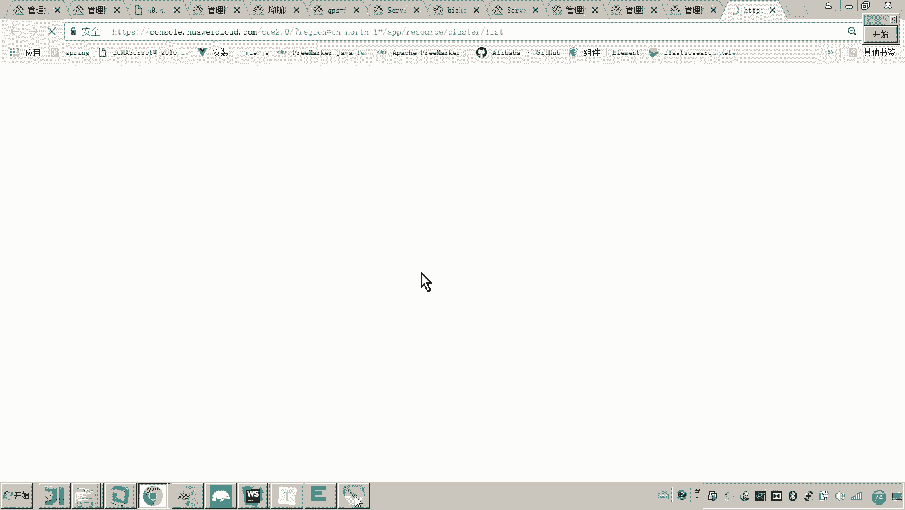

对他这个是刷新的啊，你看。他是不是有反应了？看见了吗？所以说各位通过云平台来治理我们的这个微服务啊，就可以非常方便高效的来监控我们的微服务，并且呢来配置我们微服务的治理的策略和参数啊。

那么这个对于我们的这个什么微服务的呃运维呢呃降低我们运维的成本呢是非常有帮助的。😊。

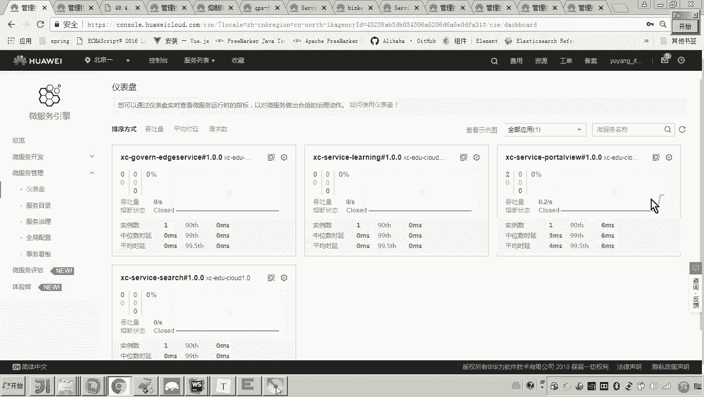

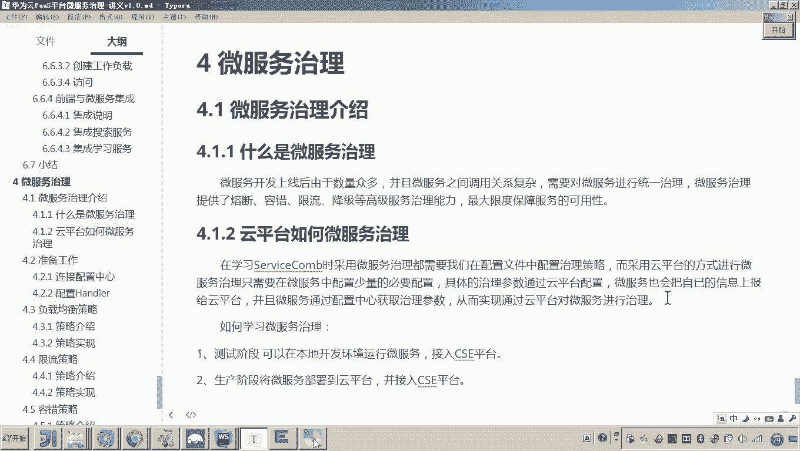

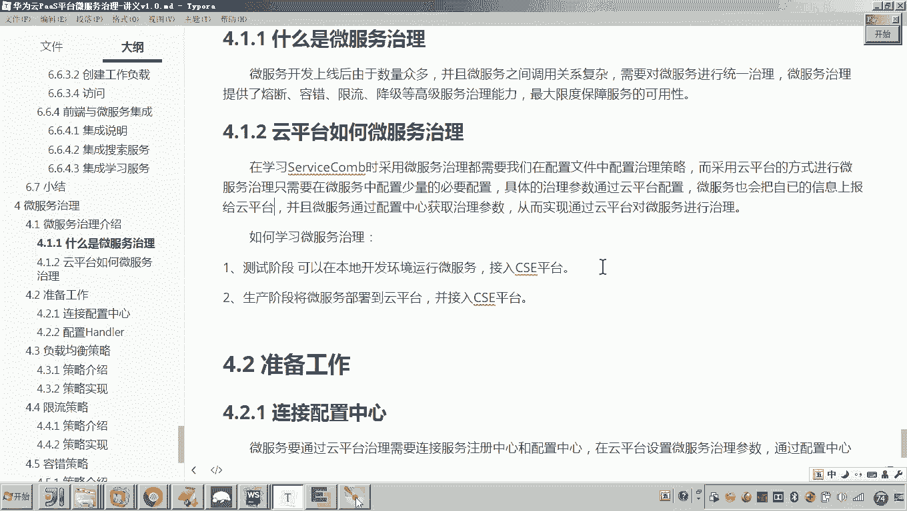

那么在本章节，我们如何去学习这个微服务治理呢？因为我刚才说了，通过云平台来配置参数。呃，那么我们怎么怎么做呢？怎么我在云平台来配置完参数，我怎么看效果呢？关键是对不对？好了，我要说一下，呃。

其实大家知道我们当初把这个学程在线接入微服务引擎的时候，那么各位我们是不是都是通过本地运行本地的这个工程。然后呢，把本地工程注册到公网的这个云平台呀。😊。

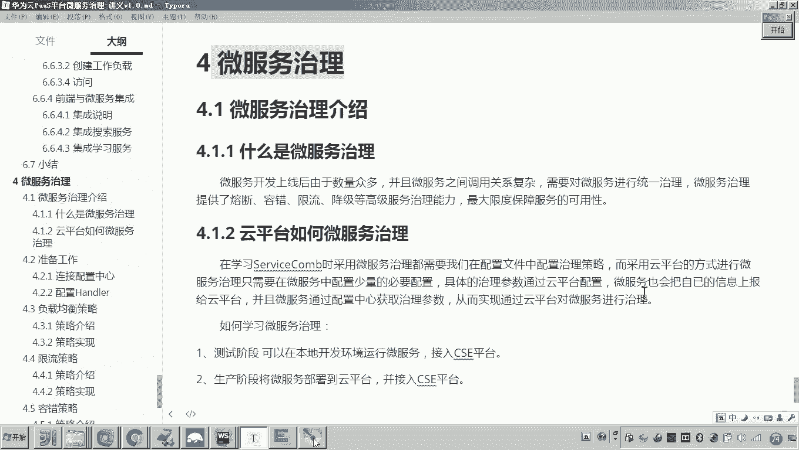

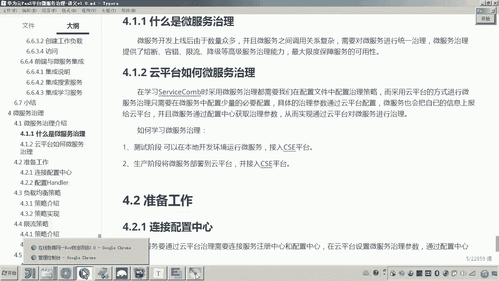

那其实我们完全也可以采用同样的方法，什么意思呀？就是我们在测试阶段呀，你可以在本地开发环境来运行微服务。然后呢啊然后接入CSE平台。😊。

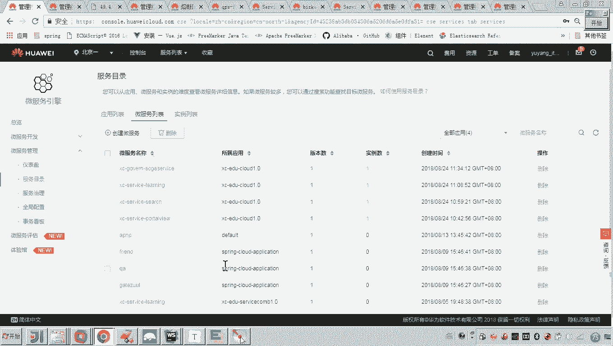

然后呢，在云平台来配置哎微服务的这些治理的参数。这样我们说由于你的微服务是不是连上了这个配置中心啊，那它就可以把这个配置的这个治理参数呢拿到。然后呢从而就生效了。

这样的话我们来观察这个微服务治理的什么效果。哎，大概是这样一个方式。😊，啊，测试阶段，也就是说你不用说我现在呃配一个参数呀，或者说改一个微服务的这个代码呀，你就马上呢把这个把这个东西部署到这个云平台上。

嗯，不用那我们就在测试阶段，在本地的这个开发环境呢，我们来运行微服务就行了啊，但是你需要注需要注册到这个云平台这个CID平台，是不是？并且在云平台来配置微服务这里的参数。😊，好了。

那么生产阶段呢到生产阶段，那就不用想了，肯定是需要就像我们前边是不是把学生在线所有的服务都部署到了CSE样。对，所以这生产阶段呢也就是呃云这个微服务在云平台运行。

同时我们在云平台来配置它的微服务治理参数。嗯，大概我们说是这样的一个学习流程。😊。

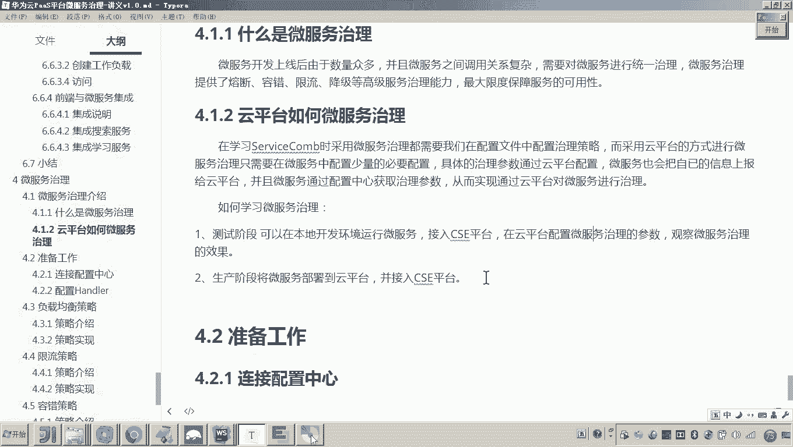

好了，那以上呢就是我介绍了什么是微服务治理。😊，啊，然后呢以及我们呃这个云平台如何来进行微服务的治理，我们是如何操作的。好，那么这个介绍呢我们先介绍到这里。

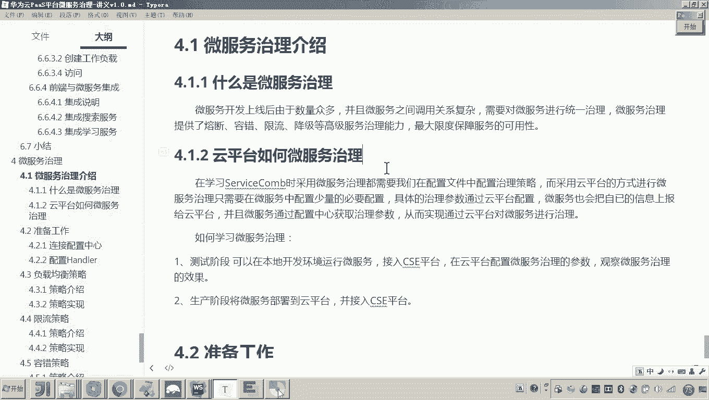