# 华为云PaaS微服务治理技术：P129：07-微服务治理-微服务治理介绍 🚀

在本节课中，我们将要学习微服务治理的基本概念，了解其重要性，并对比传统配置方式与使用云平台进行治理的优势和操作流程。

## 什么是微服务治理？🤔

上一节我们介绍了课程的整体安排，本节中我们来看看什么是微服务治理。微服务治理是微服务架构中的一个重要概念。在学习微服务框架时，总会听到这个词。在实际开发过程中，关于微服务治理的内容接触可能不多。

在开发阶段，可能体会不出治理的重要性。当微服务真正上线之后，需要维护数量非常多的微服务时，就会出现很多问题。

以下是几个具体的例子：
*   **负载均衡调整**：例如高峰期到来时，如何调整负载均衡的策略。
*   **性能调控**：当微服务数量很多，性能快撑不住时，可能需要适当降低某些微服务的处理能力。

这些都属于微服务治理的范畴。业界根据微服务开发与治理的经验，总结出了许多微服务治理的策略。

以下是常见的微服务治理策略：
*   熔断
*   容错
*   限流
*   降级

## 云平台如何治理微服务？☁️

上一节我们介绍了微服务治理的基本概念，本节中我们来看看如何使用云平台进行治理。使用ServiceComb框架开发时，它提供了很多微服务治理策略。它是通过在配置文件中配置这些策略实现的。

例如，配置限流策略需要设置每秒允许的事务数（TPS）阈值。
```yaml
# 示例：配置限流规则
rateLimiting:
  limit: 100 # 每秒最多处理100个请求
```
例如，配置负载均衡策略需要选择算法（如轮询或随机）。
```yaml
# 示例：配置负载均衡策略
loadbalance:
  strategy: RoundRobin # 使用轮询算法
```
这种配置方式需要人工在配置文件中进行修改。如果采用云平台来管理微服务，则无需在配置文件中配置大量与运行时相关的参数。

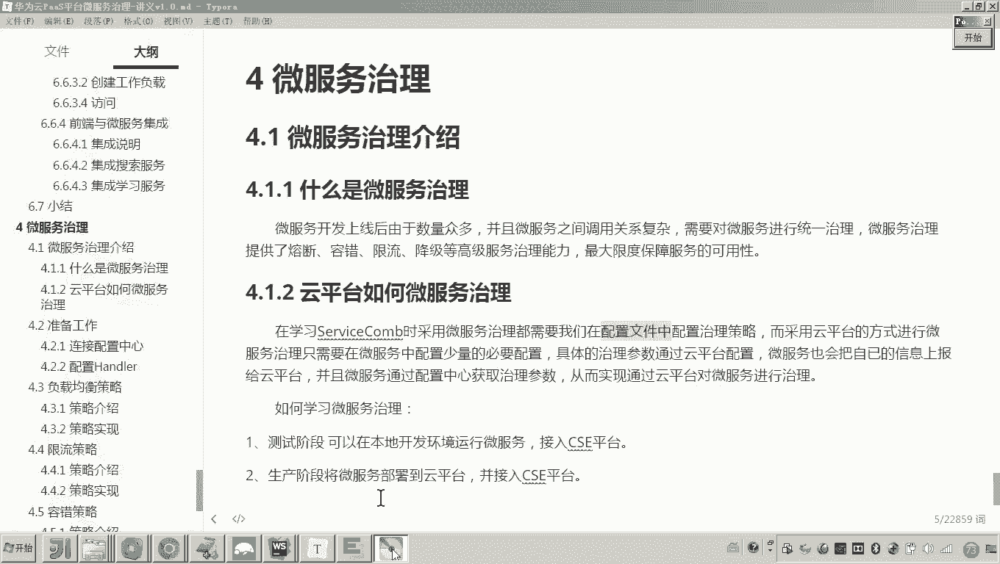

云平台的做法更高级。采用云平台管理微服务，只需要在配置文件中配置非常少量的、必要的通用性配置即可。这些通用配置不会因为不同的业务场景或需求而频繁改变。那些需要根据运行情况调整的微服务治理参数，则通过云平台的图形化界面来配置。


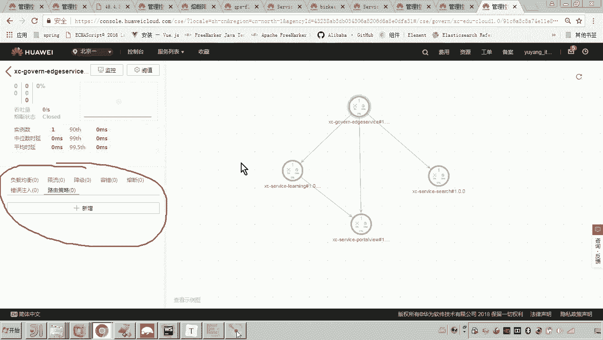

配置完成后，微服务需要知道这些参数值。微服务在Docker容器中运行，它通过从服务配置中心获取这些参数。


同时，微服务也会将自己的运行指标上报到云平台。这样做的目的是方便云平台监控微服务的运行状态。例如，监控微服务运行的内存使用率，当达到容器内存的特定百分比时触发治理动作。因此，微服务需要上报性能指标以供云平台监控。

总结来说，不采用云平台时，治理参数在配置文件中手动配置，比较麻烦。采用云平台治理时，可以通过图形化界面配置，并且云平台可以很好地监控运行指标。

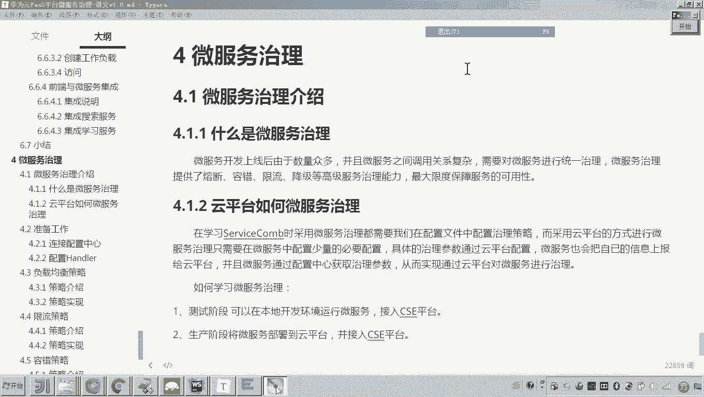
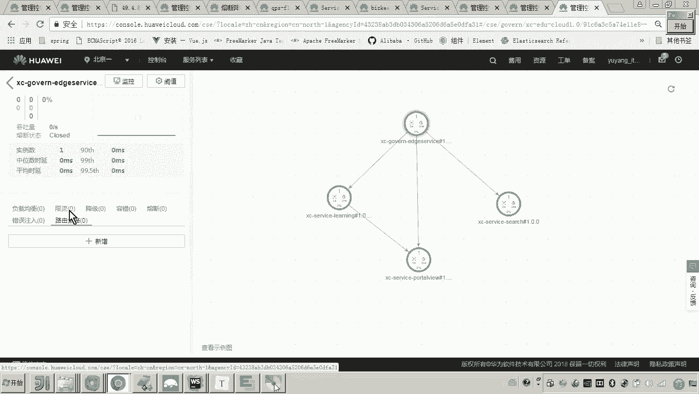
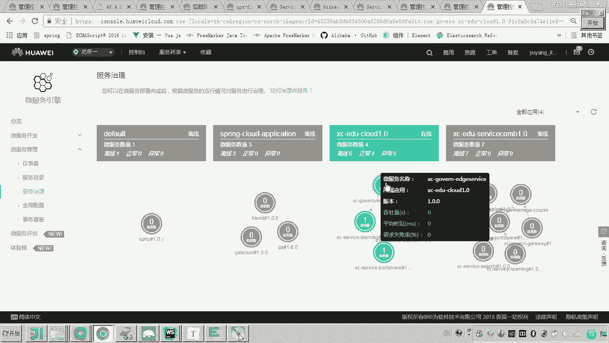
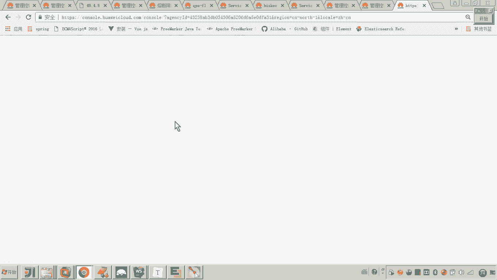
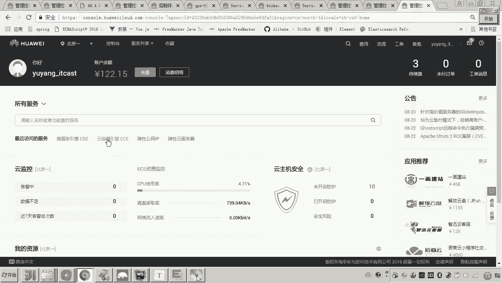


之前我们已经将“学成在线”项目部署到了云容器引擎。可以查看集群，它采集了很多指标。


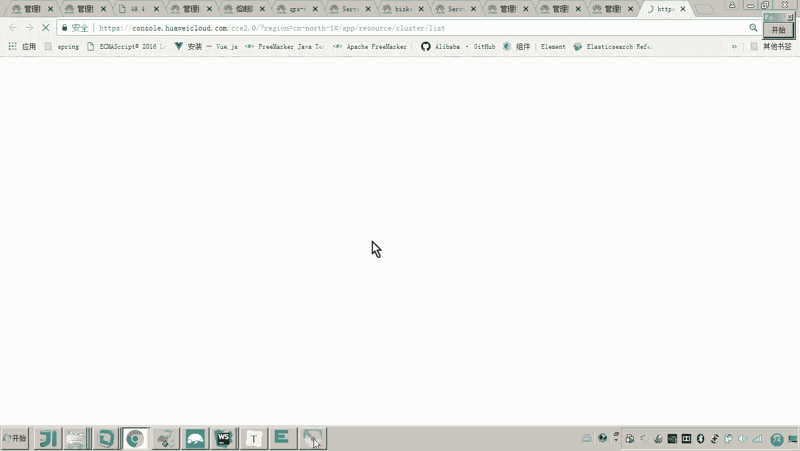

虽然当前系统未运行，部分指标无状态，但刷新后会有数据显示。通过云平台治理微服务，可以非常方便、高效地监控微服务，并配置治理策略和参数。这对于微服务运维和降低运维成本非常有帮助。

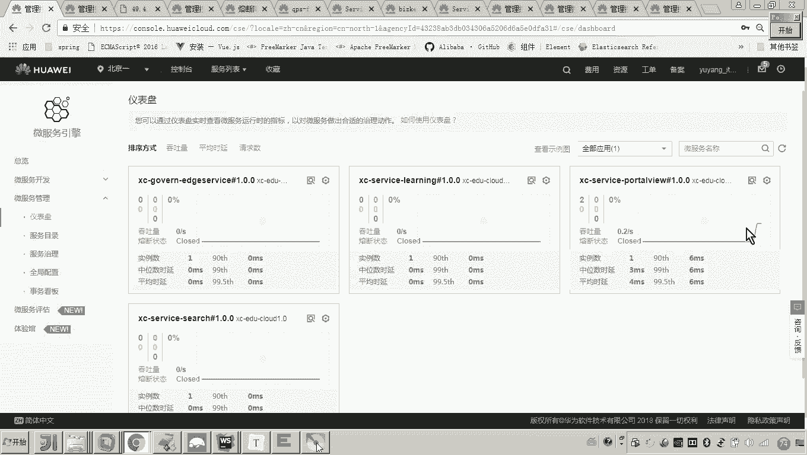
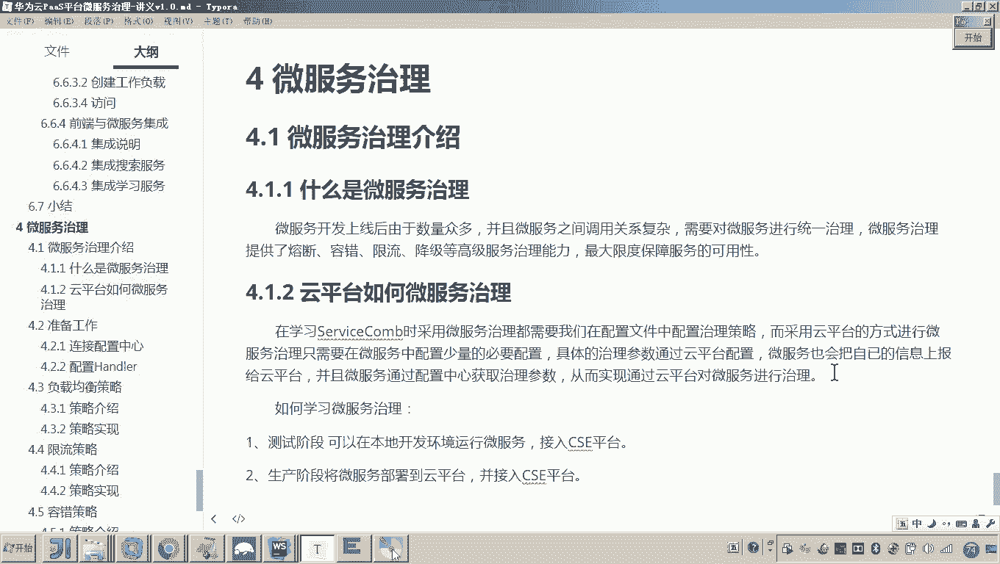
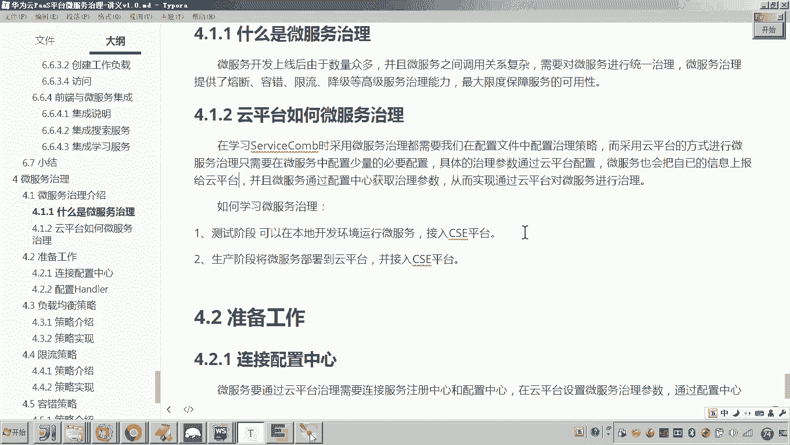


## 如何学习微服务治理？📚

上一节我们了解了云平台治理的优势，本节中我们来看看具体如何学习和操作。通过云平台配置参数后，如何查看效果是关键。


之前我们将“学成在线”接入微服务引擎时，是通过本地运行工程，然后将其注册到公网的云平台。

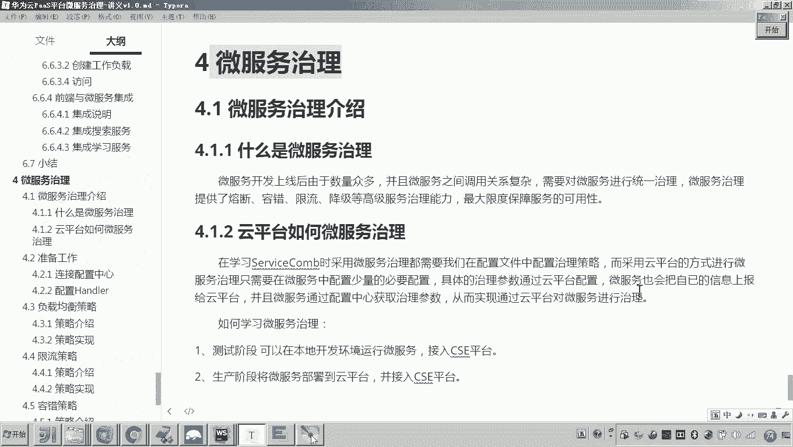
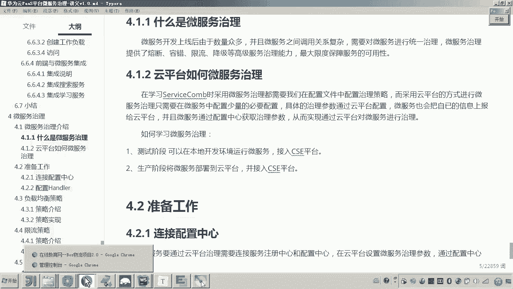


测试阶段可以采用同样的方法。在本地开发环境运行微服务，然后接入CSE平台。


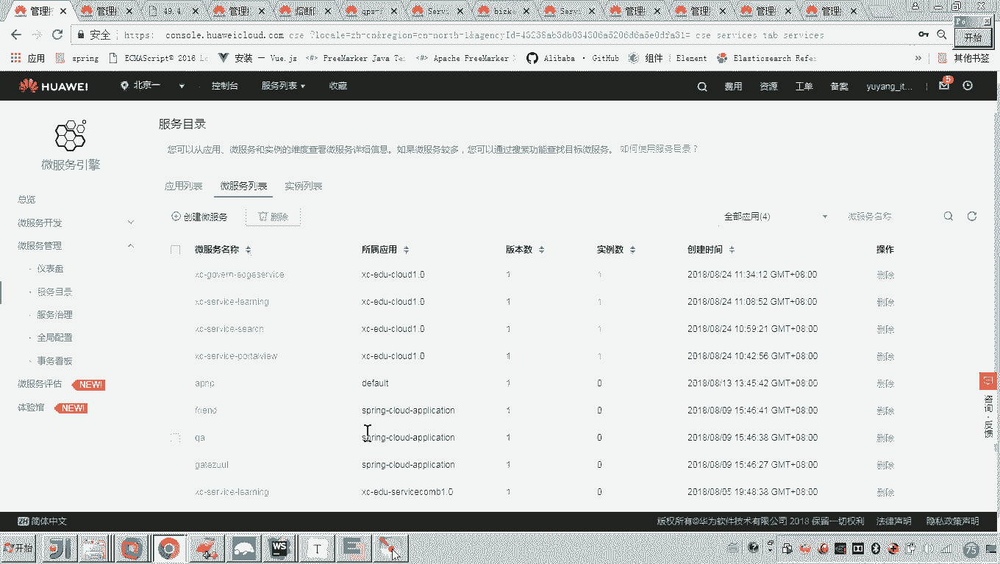


接着，在云平台配置微服务的治理参数。由于微服务连接了配置中心，它就能获取到这些配置参数并使其生效。这样就可以观察微服务治理的效果。在测试阶段，无需每次修改参数或代码就立即部署到云平台，只需在本地运行并注册到CSE平台即可。

生产阶段则不同。就像之前将“学成在线”所有服务部署到CSE一样，生产阶段微服务在云平台运行，同时在云平台配置其治理参数。

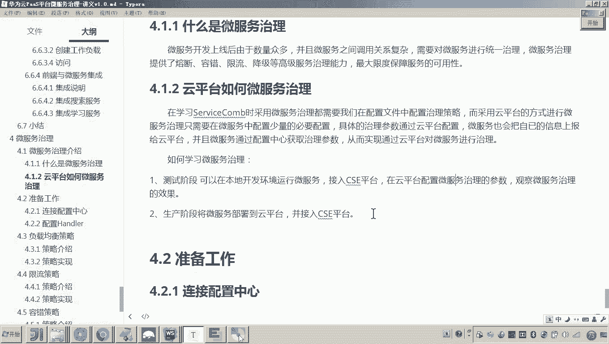

## 总结 📝


本节课中我们一起学习了微服务治理的核心内容。我们首先介绍了微服务治理的定义及其重要性，它主要解决微服务上线后大规模运维时产生的负载、性能等问题。然后，我们对比了传统配置文件方式与使用云平台进行治理的区别，云平台通过图形化界面和配置中心实现了更灵活、高效的参数管理和服务监控。最后，我们明确了学习路径：测试阶段可在本地环境接入云平台进行配置和验证，生产阶段则直接在云平台进行部署和治理。

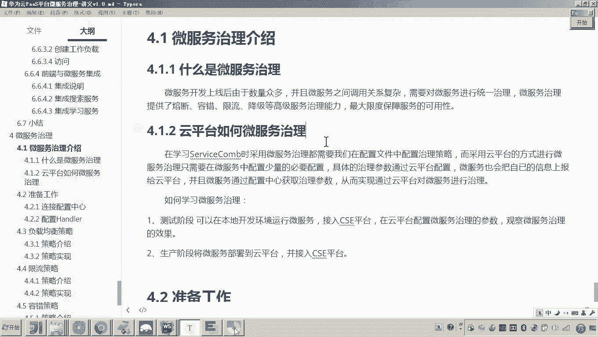

