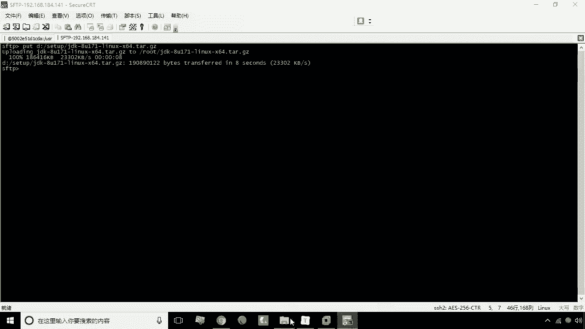

# 华为云PaaS微服务治理技术 - P12：12.tomcat部署 - 开源之家 - BV1wm4y1M7m5

好，接下来呢我们来学习使用docker，来部署一个tom cat的环境，首先第一步我们要去拉取tom cat镜像，我们在这里使用的是tom cat，然后标签是七杠GRE7啊，这个七杠GRE7。

也就是说啊，是这个他七代表他们开的本身的版本，GREE7代表的是这里安装的GRE的版本啊，是七的这个版本好，我们这一步呢是可以省略的，因为我给大家提供的这个镜像中。

其实已经包括这个镜像了，大家也不需要啊另行下载了，那我们现在可以直接去根据这个镜像来，创建容器就可以了，杠DI啊，然后呢杠杠name等于等于什么呢，这个my tom cat。

比如说起名叫my tom cat，那接下来呢我们再加杠P杠P是意思是什么，端口映射，我们可以用9000来映射它本身的8080端口，杠V杠V代表的是目录挂载对吧，哎我们说为了更方便的部署他们开的应用。

这里我们可以挂载一个目录，比如说这叫web a p p s，这个web a p s我给它放到local目录下啊，本地的local目录下，如果这个目录不存在，它会自动创建的呃。

接下来冒号后面的部分就是你的这个呃。

就是容器内的tomcat路径啊，那么容器内的他们开的路径呢是在这啊，usr local他们cat下的yy abs啊。

是这个目录US2local tomcat下的a web app，这是我们说的一个目录挂载，然后紧接着我们在写这个啊这个镜像的名称，他们cat冒号七杠七杠GRE7J二E七好。

现在呢我们已经把这个容器就创建成功了，我们来看一下，现在呢这个容器已经是运行状态啊。

那么运行状态之后，咱们现在呢可以，可以打开这个，九天我们来看一下到底能不能访问啊，192168。2，184。141，大家会发现我们并没有看到那个他们开的，欢迎页面是吧。

那这是为什么呢，是因为我们在这里用了一个目录挂载，那么目录挂载之后呢，这时候你本地的这个这个文件夹是顺新创建的，是没有任何的内容的，而原来是有一个root对吧，那么这个root已经被清空了。

所以说这个时候呢你就看不到任何页面了，那么现在呢可以为这个tomcat，部署一个web应用就可以了，就部署一个外部应用，那么部署哪一个呢，我们在这里可以把这个CAS给它补上去啊。

这个时候我们来找一下嗯，我给大家提供一个cs点Y啊，这是这个耶鲁大学开源的一个单点登录的，这么一个程序啊，我们现在可以把它补上去啊。

put上传上去啊，D盘的set up下的cs点哇，好上传上去之后，那接下来咱们看一下啊，嗯看一下现在这个腕已经传上去了，那接下来我们要怎么办呢，把它转移转移一下啊，转移到哪里呢。

usr local下的web a a p p s好。

那么转移到之后，那接下来咱们再次测试，这里写C。

这时候仍然是没有显示出来是吧，那么看一下问题出在哪啊，呃现在呢我们进的这个木下usr local下载web app，咱们这时候会发现这个cs是已经解压的对吧啊。

已经解压的，那么咱们现在再次的来看一下，再刷，诶这回好了啊，刚才是没有没有完全的解压完成啊，所以说呢这个是没有显出来啊，现在呢已经能看到这个cs的这么一个啊，主界面了啊，这么一个登录界面好。

这就是关于tom cat的一个部署啊，那么在这个环节，我们主要学习的就是就是什么呢，就是呃端口映射，第二个呢就是我们的目录挂载，那这两个呢实际的这种容器创建过程中呢。

