# 华为云PaaS微服务治理技术 - P12：12.tomcat部署

## 概述
在本节课中，我们将学习如何使用Docker来部署一个Tomcat环境。我们将通过拉取镜像、创建容器、配置端口映射和目录挂载，并最终部署一个Web应用来演示完整的流程。

---

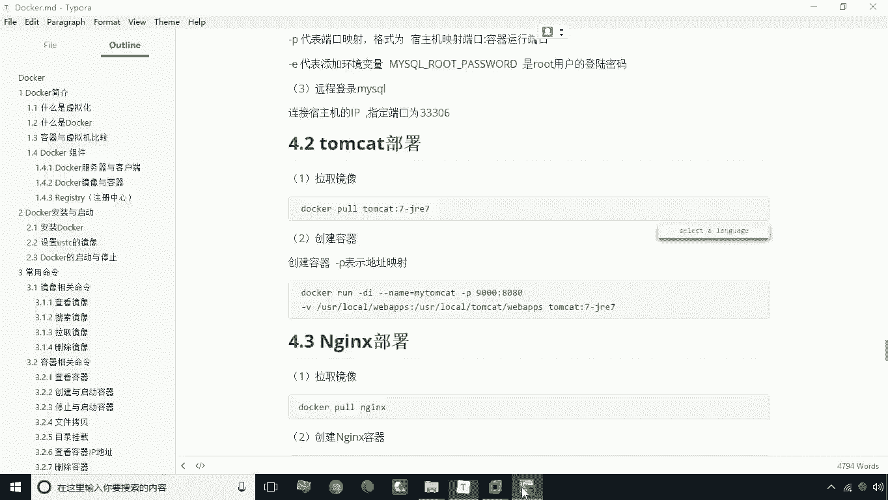

## 拉取Tomcat镜像
首先，我们需要拉取一个Tomcat镜像。我们将使用标签为 `tomcat:7-jre7` 的镜像。这个标签中，“7”代表Tomcat的版本，“jre7”代表其内置的Java运行环境版本。

**命令如下：**
```bash
docker pull tomcat:7-jre7
```

> **注意**：如果您使用的实验环境已预置此镜像，可以跳过此步骤。

---

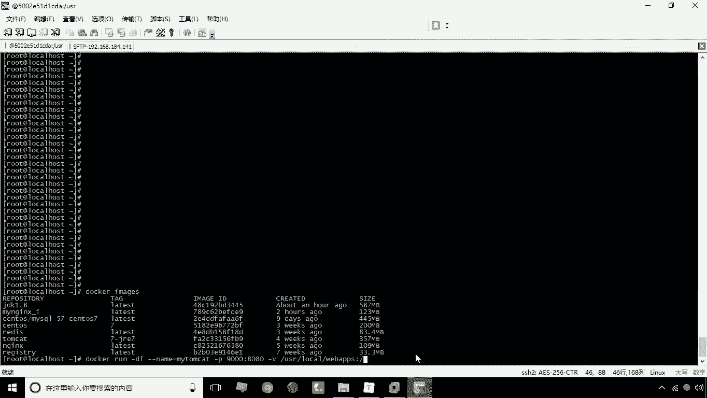

## 创建并运行Tomcat容器
上一节我们介绍了如何拉取镜像，本节中我们来看看如何基于该镜像创建并运行一个容器。

以下是创建容器的命令及其参数解释：

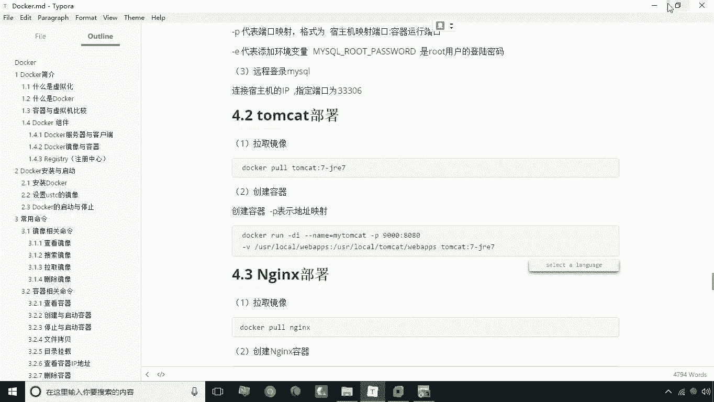

```bash
docker run -d --name=my_tomcat -p 9000:8080 -v /usr/local/webapps:/usr/local/tomcat/webapps tomcat:7-jre7
```

*   **`-d`**：以后台（守护进程）模式运行容器。
*   **`--name=my_tomcat`**：为容器指定一个名称，这里是“my_tomcat”。
*   **`-p 9000:8080`**：进行端口映射。将宿主机的9000端口映射到容器内部的8080端口（Tomcat默认端口）。
*   **`-v /usr/local/webapps:/usr/local/tomcat/webapps`**：进行目录挂载。将宿主机的 `/usr/local/webapps` 目录挂载到容器内的 `/usr/local/tomcat/webapps` 目录。如果宿主机目录不存在，Docker会自动创建。

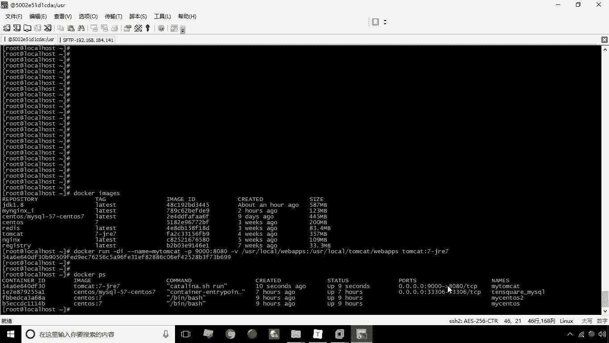

执行命令后，容器即创建并运行。您可以使用 `docker ps` 命令查看运行状态。

---


## 访问Tomcat并发现问题
容器运行后，理论上我们可以通过宿主机的IP和映射的端口（例如 `http://192.168.2.184:9000`）访问Tomcat。

然而，访问后可能看不到Tomcat的默认欢迎页面。这是因为我们使用了目录挂载。挂载时，如果宿主机目录为空，它会覆盖容器内原有的 `webapps` 目录内容，导致默认的应用（如 `ROOT`）被清空。

---

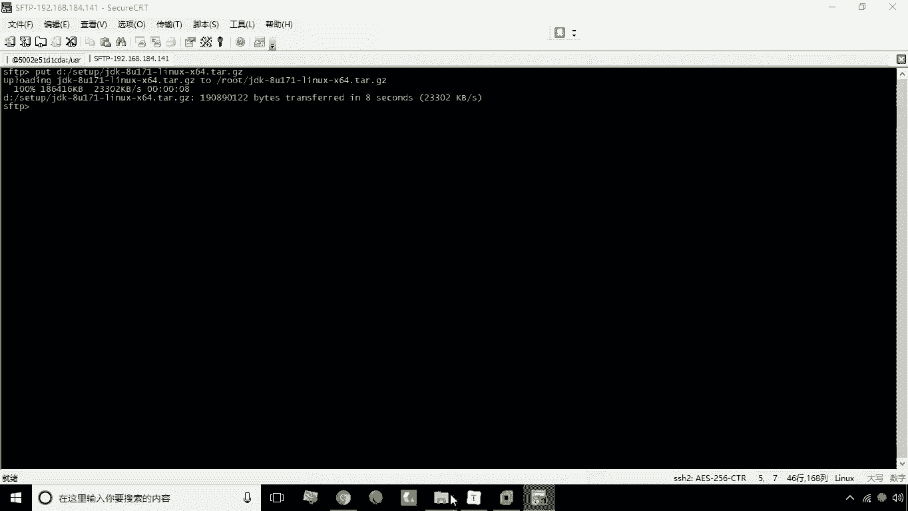

## 部署Web应用
既然默认页面因目录挂载而消失，我们现在需要手动部署一个Web应用到挂载目录中。

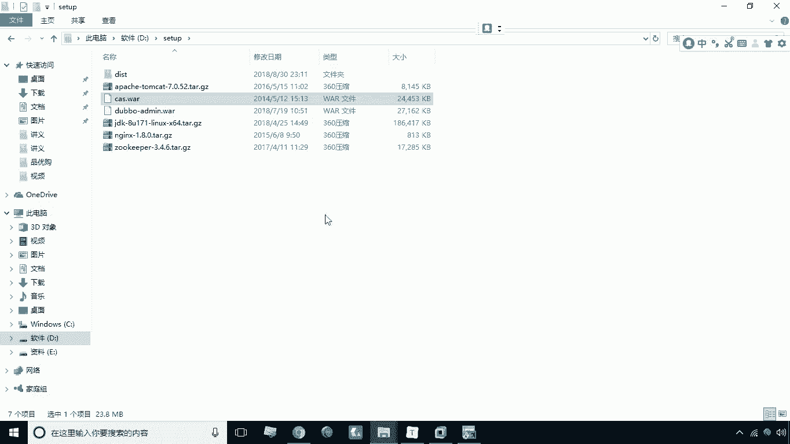

我们将部署一个名为 `cas.war` 的Web应用（这是一个耶鲁大学开源的单点登录程序）。

部署步骤如下：
1.  将 `cas.war` 文件上传到宿主机。
2.  将 `cas.war` 文件移动或复制到我们挂载的目录 `/usr/local/webapps` 中。

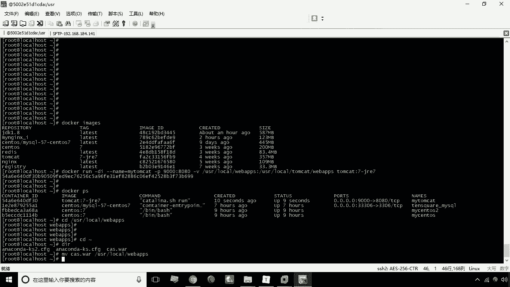

**操作命令示例：**
```bash
# 假设cas.war已上传至当前目录，将其移动到挂载目录
mv cas.war /usr/local/webapps/
```

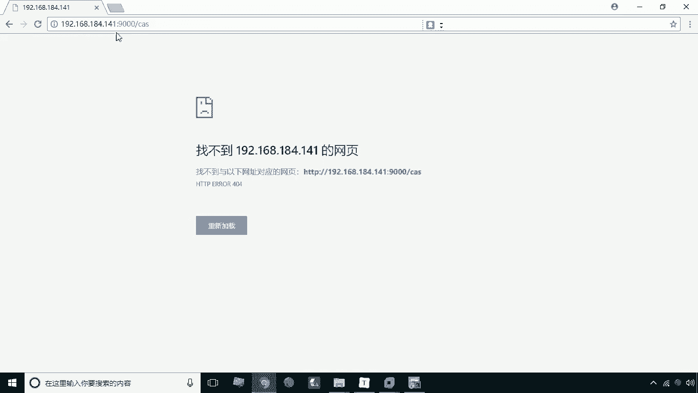

Tomcat会自动解压 `webapps` 目录下的 `.war` 文件。解压完成后，再次访问 `http://<宿主机IP>:9000/cas`，即可看到该应用的登录界面。

> **提示**：如果访问时未立即显示，可能是Tomcat正在后台解压文件，请稍等片刻再刷新页面。

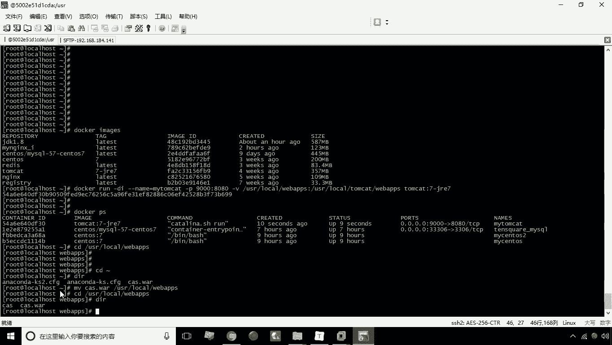

---

## 核心概念总结
本节课中我们一起学习了使用Docker部署Tomcat的关键步骤和两个核心概念：

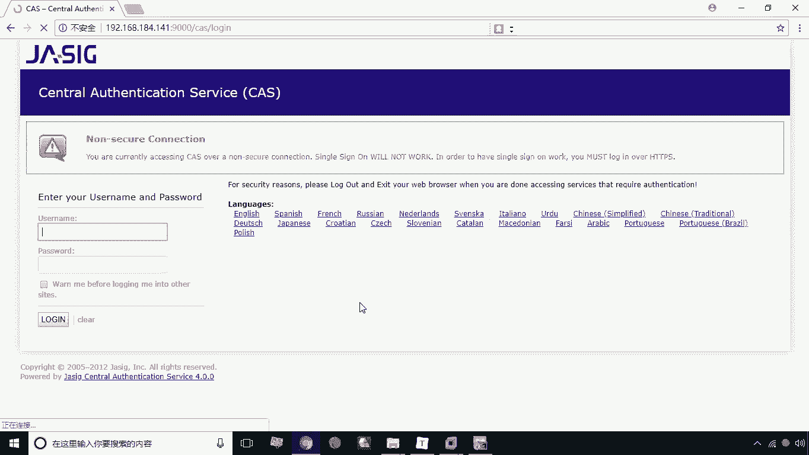

1.  **端口映射 (`-p`)**
    *   **公式**：`-p <宿主机端口>:<容器内端口>`
    *   功能：将容器内部的服务端口暴露给宿主机，从而可以从外部网络访问。

2.  **目录挂载 (`-v`)**
    *   **公式**：`-v <宿主机目录路径>:<容器内目录路径>`
    *   功能：将宿主机的目录与容器内的目录关联起来，实现数据持久化和方便的文件管理（如直接部署应用）。

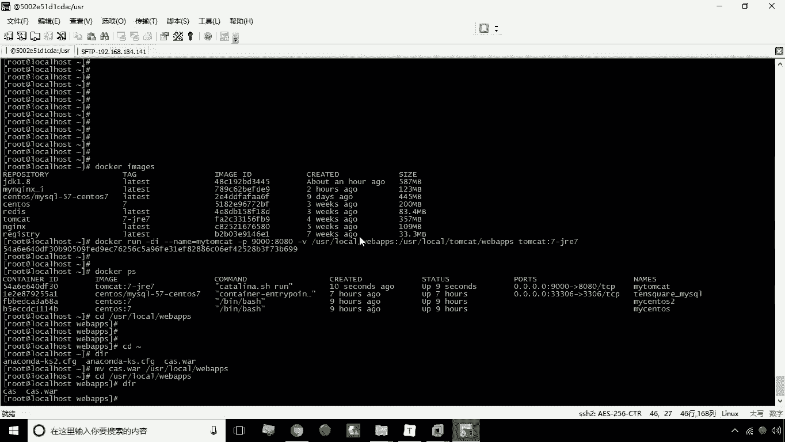

通过结合使用这两个功能，我们能够灵活地配置和管理容器化的Tomcat服务。